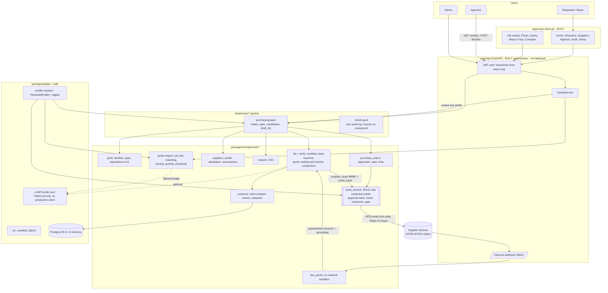
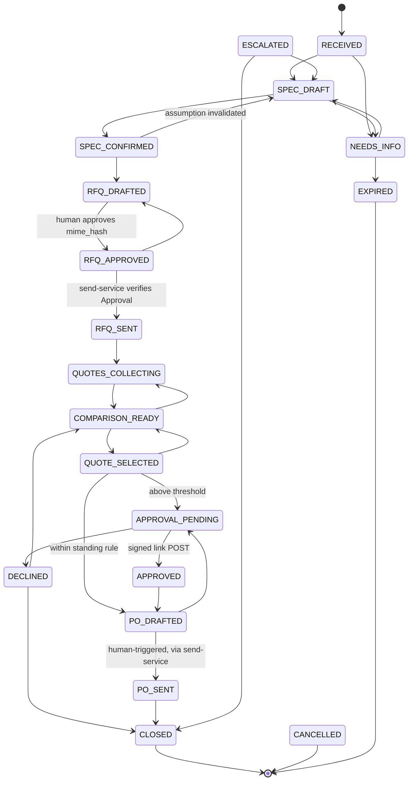

# MASTER: buy-side RFQ platform and product idea (single navigable source)

As of **2026-10-06**; sections 1 to 6 were re-checked against the code on **2026-10-09** (commit `691aa58`), while sections 7 to 10 (research digest, decisions, roadmap, index) are as of 2026-10-06 and were not re-checked. Branch `claude/agentic-commerce-research-gjjwnk`. This file summarises and links; it does not replace the source documents. Where this file and a source disagree, the source wins, and section 8.3 lists the disagreements found between sources. Where a document and the code disagree, the code wins. The built system is described in [`technical/`](technical/README.md) (engineers) and [`user-guide/`](user-guide/README.md) (people who use it). Links are relative to `docs/`.

**Product-market fit is unproven.** No buyer or supplier has been interviewed (`product/06-platform-buyside-rfq-lean-canvas.md`, `uk/01-uk-pmf-lean-canvas.md`). **All seed, demo, price and job-kit data is synthetic/illustrative**, not licensed cross-reference data. Nothing here is legal, tax or financial advice. Every number carries its source in brackets; numbers marked *(est.)* or *(assumption)* are judgement, not measurement.

---

## 1. Purpose and status

### 1.1 What this document is for

One place to answer: what the product is, which rules can never bend, how the platform is layered, what is built, what the research found, what was decided, and what to do next. Source of truth for product behaviour remains [`product/04-product-spec.md`](product/04-product-spec.md) (v0.2). Architecture decisions live in [`architecture/adr/`](architecture/adr/). Agent conventions live in [`../CLAUDE.md`](../CLAUDE.md).

### 1.2 Status legend (used throughout)

| Tag | Meaning |
|---|---|
| **BUILT** | Code in the repo with tests. Sections 1 to 6 were checked against the code on 2026-10-09; test counts and results are in [`technical/09-testing-and-evals.md`](technical/09-testing-and-evals.md) |
| **PARTIAL** | Built with documented gaps ([`architecture/known-gaps.md`](architecture/known-gaps.md)) |
| **WIP** | In progress on 2026-10-06 (uncommitted, or committed but not wired into the product) |
| **PROPOSED** | Design doc or ADR with status "proposed"; no implementing code |
| **RESEARCH** | Desk research only |
| **HYPOTHESIS** | Business assumption to be tested by Phase 0 tests |

### 1.3 Status at a glance

| Area | Status | Evidence |
|---|---|---|
| Hard rules R1-R12 enforced in code (send-service, approvals, hash-chained events, tenancy) | BUILT. In-memory by default, PostgreSQL-backed when `DATABASE_URL` is set; `ENV=production` is still refused until six listed items (H2) are closed | [`technical/06-security-and-trust.md`](technical/06-security-and-trust.md); [`architecture/known-gaps.md`](architecture/known-gaps.md) H2, L5; [`product/review/code-security-review.md`](product/review/code-security-review.md) |
| Purchasing pack (MRO: bearings, V-belts) API + workflow | BUILT | [`architecture/api-contract.md`](architecture/api-contract.md); `employees/purchasing/` |
| Buy-side RFQ MVP (UK): supplier profiles, assumption ledger, setup/go-live, evidence export, Next.js workspace | BUILT / PARTIAL | [`mvp/README.md`](mvp/README.md); test counts and results as of 2026-10-09 in [`technical/09-testing-and-evals.md`](technical/09-testing-and-evals.md) |
| Deployment profiles (us, uk, uk-scotland, uk-ni) | BUILT | ADR-011, [`architecture/configurability.md`](architecture/configurability.md), `../profiles/` |
| Refurb pack (mandate, parser, compare, audit; demo) | BUILT (no UI, no persistence) | [`refurb/README.md`](refurb/README.md) |
| Job-kit library v0.2 (job type → scope → module → line; resolver; UI export JSON) | BUILT as data and resolver. The API runs the resolver inside `POST /v1/quotes` and in `POST /v1/kits/resolve`, which no screen calls; the web wizard resolves kits in the browser with a TypeScript port; unreviewed synthetic seed | [`architecture/job-kits.md`](architecture/job-kits.md), `../profiles/data/job_kits/uk/`, `../packages/components/job_kits/` |
| Job-kit wizard UI in `apps/web` | PARTIAL | the `/kits` wizard is built (Job, Questions, Measure, Review, Summary, with a config tab); regulated-work gates and RFQ packets are not (section 5.3). [`mvp/kits-ui.md`](mvp/kits-ui.md), `../apps/web/app/kits/` |
| Composable workflows, capability contracts, industry packs, composition linter | PROPOSED | ADR-012, [`architecture/composability.md`](architecture/composability.md) |
| Platform services (logging redaction, onboarding workflow, kill-switch registry) | PARTIAL. Built: per-tenant kill switch (`POST /v1/admin/kill-switch`), setup readiness and recorded go-live, audit-log redaction. Not built: operational-log redaction (`get_logger()`), the onboarding workflow | [`architecture/platform-services-and-buyside-rfq.md`](architecture/platform-services-and-buyside-rfq.md) |
| Intent-driven quoting (intent → scope → BOM → gates → RFQ packets) | PARTIAL. The kit → matching → pricing → draft-quote pipeline is built and served by the API, and RFQ *drafts* per supplier go through the normal approval flow. Intent parsing, regulated-work gates (G1-G6) and RFQ packets are PROPOSED | [`product/05-intent-driven-quotes-proposal.md`](product/05-intent-driven-quotes-proposal.md) |
| Quote engine: matching, pricing, price books, quoting, ways to buy, price-file upload | BUILT and served by the API for the `uk` profile on synthetic data; PARTIAL: no real price source, and the API starts only with `DEPLOYMENT_PROFILE=uk` | [`technical/05-quote-engine.md`](technical/05-quote-engine.md); [`architecture/quoting.md`](architecture/quoting.md) |
| Verification layer (number checks, plausibility, second reading compared with the first) | BUILT and wired into quote reading; no language model is called in the shipped code | [`architecture/verification.md`](architecture/verification.md); `../packages/components/verify/` |
| Review telemetry (content-free review events, seeded drills, pooled summaries) | BUILT: routes, Postgres store, web hook | [`technical/04-api-reference.md`](technical/04-api-reference.md); `../packages/components/telemetry/` |
| User and technical documentation | BUILT (this change) | [`user-guide/`](user-guide/README.md), [`technical/`](technical/README.md) |
| AI Employees stack (Supabase, Render, LangGraph, Next.js) | PROPOSED in ADR-010, partly used in code | ADR-010, [`architecture/ai-employees-stack-map.md`](architecture/ai-employees-stack-map.md) |
| Market, legal, channel, data-source and template research | RESEARCH | section 7 |
| Demand, frequency, willingness to pay, supplier reply rate | HYPOTHESIS (untested) | Phase 0 tests T1-T9, U1-U6 ([`uk/01-uk-pmf-lean-canvas.md`](uk/01-uk-pmf-lean-canvas.md) §7) |

---

## 2. The idea in one page

**Problem** [HYPOTHESIS]. Small and mid-size buyers get prices by phone and email from several suppliers. Three pains: (1) chasing quotes across suppliers; (2) quotes that are not comparable (VAT basis, units, exclusions, delivery, credit terms); (3) the wrong item or a missed regulated step ([`product/06-platform-buyside-rfq-lean-canvas.md`](product/06-platform-buyside-rfq-lean-canvas.md) box 1). The best-evidenced UK pain is parts delay: 83% of 199 UK manufacturers report maintenance delays from unavailable parts, but only about one in five "regularly", in a vendor-commissioned survey; frequency is unmeasured ([`uk/00-uk-market-gaps.md`](uk/00-uk-market-gaps.md) §1.4, claim UK-VOC-01, status P).

**Positioning** (spec §1): *identify the part (or the job), then get it quoted, fast, with sources shown, a human always in control.*

**Users and roles.**

| Who | Role in the product | Source |
|---|---|---|
| Requester | Submits a request (often a technician); may be the buyer | spec §2 |
| Buyer | Reviews spec, approves each RFQ send, selects a quote; primary user | spec §2; API role `buyer` |
| Approver | Approves POs above threshold through a signed link; must differ from requester above threshold (R11) | spec §2 merges it with Admin; API has "authenticated approver" on `/approval-links/{token}/decide` |
| Admin | Settings, suppliers, attestation, caps, kill switch, go-live | spec §2; API role `admin` |
| Supplier | **Counterparty, not a user.** Receives RFQs by email, replies; content is untrusted (R6); can opt out ("stop") | spec §4a; [`architecture/api-contract-mvp.md`](architecture/api-contract-mvp.md) §1 |
| Operator (our staff) | Not a user: just-in-time, per-case, logged; cannot approve or send (R10) | spec §2 |

**Job to be done.** "When I need a part or a job's materials, help me get comparable quotes from my own suppliers on a stated basis, and let me approve before anything is sent" ([`product/06-platform-buyside-rfq-lean-canvas.md`](product/06-platform-buyside-rfq-lean-canvas.md) box 3).

**MVP scope: buy-side RFQ, UK** [BUILT/PARTIAL] ([`mvp/README.md`](mvp/README.md)). Web-form intake with at most two clarifying questions; assumption ledger the buyer confirms; supplier CSV import, profile and admin attestation before first send; exact-message preview and hash-bound approval per message; send only through the send-service; reply matching, grounded extraction, quarantine; like-for-like comparison with flags; approval link; PO draft (CSV); hash-chained audit with offline-verifiable export. UK profile adds VAT-basis handling, working-day lead times, GOV.UK bank holidays and a company-details block on every RFQ.

**Intent and job-kit extension** [PARTIAL: the kit wizard (it resolves kits in the browser), the `POST /v1/kits/resolve` route (no screen calls it), the quote engine and per-supplier request drafts are built; the outcome-to-scope intent step, regulated-work gates and RFQ packets are PROPOSED]. Start from an outcome ("Victorian terrace, mid-size full bathroom refurb, on a budget") or a job type (bathroom: full, cloakroom, WC only, wet room), ask a few questions, pre-fill a kit of generic spec lines from defaults, let the buyer review, check completeness and regulated-work gates, then feed the normal RFQ flow ([`product/05-intent-driven-quotes-proposal.md`](product/05-intent-driven-quotes-proposal.md), [`../research/intent/06-job-templates-and-kits.md`](../research/intent/06-job-templates-and-kits.md)).

**Channels.** Email first: inbound alias plus outbound send-service; no mailbox OAuth at R0/R1 (ADR-008). Estimated 65-80% of UK supplier RFQ and quote traffic is email *(est., judgement in [`../research/channels/01-channel-usage-estimates.md`](../research/channels/01-channel-usage-estimates.md))*. WhatsApp is optional and later: most plausible for small-trade suppliers and internal approvals (same file), but [`../research/mvp/03-uk-integrations-requirements.md`](../research/mvp/03-uk-integrations-requirements.md) §1.7 keeps it out of the MVP (opt-in, templates, 24 h windows; manual paste of WhatsApp text into a reply is the interim path). Phone/SMS: generated scripts and manual quote logging (spec F21, F22), not an SMS integration.

**Out of scope** (spec §1, proposal 05 §2, MVP README): autonomous ordering; payments; scraping or fetching third-party links or sites; mailbox OAuth (R0/R1); marketplace or supplier fees; CMMS/ERP replacement; voice agents; native mobile apps; distributor discovery beyond the buyer's suppliers; harvesting contacts from trade registers; compliance advice (gates block and warn only); public-sector buyers ([`uk/01-uk-pmf-lean-canvas.md`](uk/01-uk-pmf-lean-canvas.md) §2, segment C).

---

## 3. Hard rules and working rules

### 3.1 Hard rules R1-R12 (quoted from spec §4; never weaken, never make configurable)

Rule text is quoted from [`product/04-product-spec.md`](product/04-product-spec.md) §4; enforcement is summarised. If a ticket seems to need weakening one, stop and report (CLAUDE.md).

| # | Rule (quoted) | Enforcement point (summary) |
|---|---|---|
| R1 | "No outbound email and no PO without a recorded human authorisation." | Send-service is the sole mail-credential holder; accepts only `Approval{hash(full MIME), approver, nonce, kind}`; planner has no import path to transport; follow-ups default off (ADR-003); a follow-up would be built at run time from the stored original with no new Approval, but no schedule is passed today ([row 33](architecture/known-gaps.md#found-while-writing-the-documentation-2026-10-09)) |
| R2 | "No auto-substitution across tiers." | PO line part number = approved Tier-A candidate or a `SubstitutionApproval` |
| R3 | "No claim without provenance." | Typed `Attribute{value, unit, source_enum, source_ref, confidence}`; templated explanations; numeric-claim linter; `model_inference` never satisfies a critical attribute |
| R4 | "Ask rather than guess; bounded questions" | Deterministic required-attribute table; after ≤2 questions unresolved ⇒ `ESCALATED` |
| R5 | "Authenticity is tri-state (`verified` / `vendor_claimed` / `unknown`); unknown ≠ authorised; no authenticity warranty" | Enum with source; meant to be shown only when not verified (the API returns it, but no screen shows it: [row 36](architecture/known-gaps.md#found-while-writing-the-documentation-2026-10-09)) |
| R6 | "Vendor content is untrusted input" | Quarantined, tool-less extractor with schema-only output; verbatim grounding check; inert rendering (ADR-004) |
| R7 | "No fetching or scraping of third-party links or sites" | No link-fetch capability; no-network parse sandbox with AV; CSV escapes `= + - @` |
| R8 | "AI disclosure and authority limits on every RFQ" | Send-service appends a non-removable footer before hashing; sent in the buyer's name, Reply-To buyer |
| R9 | "Money handled safely" | `Decimal`, explicit UoM/currency, per-order and daily aggregate caps in code |
| R10 | "Tenant isolation and consented sharing" | RLS, tenant-scoped repositories, capability tokens; consented structured fields only in shared datasets; JIT operator access, no approve/send (per-tenant keys and operator access are design, not built: [rows 37 and 38](architecture/known-gaps.md#found-while-writing-the-documentation-2026-10-09)) |
| R11 | "Approval links are non-forgeable" | GET renders only; POST with session; token bound to approver + quote-version hash + action; single use; approver ≠ requester above threshold |
| R12 | "Vendor identity" | SPF/DKIM/DMARC alignment to a registered vendor domain (fail ⇒ quarantine); remit-to changes by admin with callback; signed per-RFQ reply token |

Vendor etiquette (spec §4a): RFQs carry account number, part number, quantity, ship-to, need-by, human contact; at most 2 recipients in down-now mode and 4 otherwise (also `comms.*` in [`../profiles/base.yaml`](../profiles/base.yaml)); a won/lost note within 24 hours; **no vendor performance scores shown to customers or other vendors**.

Configuration is meant to localise or tighten these, not to weaken them, and the profile schema rejects some weakening values (footer must contain "AI assistant", "cannot accept terms" and `{buyer}`; `tiers.enabled` must contain A and can hold only A and B; `unlock_c_after_confirmed` ≥ 50; follow-ups default off; `require_licensed_sources_in_production` stays true; unknown keys rejected) ([`architecture/configurability.md`](architecture/configurability.md) §3). The schema is not complete. A tenant may override `approvals.threshold` and the `caps.*` limits with no upper bound ([row 28](architecture/known-gaps.md#found-while-writing-the-documentation-2026-10-09)); the footer check looks for three phrases, not the whole sentence ([row 31](architecture/known-gaps.md#found-while-writing-the-documentation-2026-10-09)); and `unlock_c_after_confirmed` and `require_licensed_sources_in_production` are read by no runtime code, while the production source guard is never engaged ([row 23](architecture/known-gaps.md#found-while-writing-the-documentation-2026-10-09)). The proposed composition linter C1-C9 extends this to composed workflows (§4.1 below).

### 3.2 Working rules (CLAUDE.md, summarised)

- `packages/components/core/domain.py` and `ports.py` are frozen; changes go to [`architecture/CONTRACT_CHANGES.md`](architecture/CONTRACT_CHANGES.md).
- Never hard-code currency, tax, language, legal wording, retention or thresholds; read them from the resolved profile.
- Tests run offline and deterministically (no network, no real LLM, no real email). Write the failing test first. Own only the files your ticket names.
- Report what you ran and the result, including failures; do not claim tests pass unless you ran them.
- Seed data is synthetic and labelled as such. No marketing claims in code or docs.
- Packs never import each other; components never import packs.

> **Numbering warning.** CLAUDE.md lists seven hard rules numbered 1-7 that compress spec R1-R12 differently (CLAUDE rule 4 = untrusted vendor content = spec R6/R7; rule 5 = money = spec R9; rule 6 = events; rule 7 = tenancy = spec R10). Several docs write "R4", "R5" with CLAUDE numbering. **Always cite spec numbering (R1-R12).** See section 8.3, item C1.

---

## 4. Platform architecture

### 4.1 Layers

From [`architecture/composability.md`](architecture/composability.md) §2 and [`architecture/platform-services-and-buyside-rfq.md`](architecture/platform-services-and-buyside-rfq.md) §1.

| Layer | Contains | Changes | Status |
|---|---|---|---|
| 0 Kernel | R1-R12: send-service, approvals, hash-chained events via the workflow module, tenant isolation, profile resolver, `LLMProvider`. Not pluggable, not configurable | Rarely; ADR per change | BUILT |
| 1 Capabilities | Versioned typed contracts (Protocols + Pydantic) in `packages/aiplat`: `IntentParser`, `PartIdentifier`, `EquivalenceResolver`, `ScopePlanner`, `QuantityTakeoff`, `TierOptimiser`, `GateEvaluator`, `MandateCheck`, `RfqPacketBuilder`, `CounterpartyVerifier`, `FraudScreen`, `QuoteExtractor`, `QuoteComparator` | Rarely; versioned | PROPOSED |
| 2 Modules | Implementations with a `module.yaml` (provides, requires, effects, LLM role/tools, pack extension points, evals, data sources) | Often | PROPOSED (today: plain components under `packages/components/*`) |
| 3 Workflow templates | Declarative step graph naming capabilities (e.g. `quote_to_award@1`), compiled to LangGraph; no expressions in the DSL | Occasionally | PROPOSED |
| 4 Industry packs | Data: taxonomy, work packages, gates, questions, attributes, prompts, synthetic seed, evals (e.g. `mro-bearings`, `bathroom-refurb`) | Per vertical | PROPOSED (job-kit library is the first data-only pack-like asset, BUILT and called by the API) |
| 5 Profile and tenant | Jurisdiction profile (`profiles/<id>.yaml`) and tenant overrides within a whitelist | Per market / customer | BUILT |
| Platform services | Trust, Operate, Onboard, Model, Build, Data (section 4.8) | Platform team | PARTIAL / PROPOSED |
| Infrastructure | Supabase (Postgres, Auth, Vault, Storage), Render web + worker, Procrastinate, Langfuse, Sentry | Platform | PARTIAL: Supabase-style JWT authentication (the default `AUTH_MODE`), PostgreSQL with RLS and a Procrastinate worker (not deployed) exist; Langfuse, Sentry, Vault and Storage are not in the code (ADR-010 is still proposed) |

A deployment = template + pack + profile + tenant, resolved into an immutable `ResolvedComposition` with a digest recorded on every event (PROPOSED). Today each event records `profile = <id>@<digest12>` (BUILT). Composition linter (PROPOSED): C1 every send path passes an Approval and the SendService port; C2 tool-using steps never consume vendor data; C3 untrusted data passes grounding before critical fields; C4 money is Decimal with currency/UoM; C5 tenant-scoped repositories only; C6 capabilities bound and version-compatible; C7 pack data validates and has no reserved key; C8 every data source has a licence record; C9 eval suite and frozen gold set before production. Runtime repeats C1-C3.

Levels of effort per new industry: 0 tenant config, 1 data-only pack, 2 pack + one module, 3 new capability (needs ADR). Target: most are level 1; measure new lines of Python per pack (composability §5; savings unmeasured).

### 4.2 Component diagram

The picture shows the built system. The computed import graph is in [`architecture/current-modules.md`](architecture/current-modules.md) and [`technical/01-system-overview.md`](technical/01-system-overview.md).

Review telemetry (`components/telemetry`) is served by the API's telemetry routes and stored through `aidb`; it is left out of the picture.

The planner (pack graph) has no import path to the transport; a static scan enforces it, but both run in one process today (known-gaps L5).

### 4.3 Repo layout

From CLAUDE.md and the stack map ([`architecture/ai-employees-stack-map.md`](architecture/ai-employees-stack-map.md)).

| Path | Holds |
|---|---|
| `packages/aiplat` | `manifest.py`, `ctx.py`, `tool.py`, `profile.py` (deployment profiles) |
| `packages/aidb` | SQLAlchemy models, RLS, repositories, Alembic migrations |
| `packages/components/core` | **Frozen** `domain.py`, `ports.py`; `fakes.py`, `store.py` |
| `packages/components/{parts,rfq,purchase_orders,send_service,evidence,doc_parse,imports,suppliers,verify,job_kits,matching,pricing,quoting,pricebook,telemetry}` | Shared components (sixteen with `core`) |
| `apps/api`, `apps/worker`, `apps/web` | FastAPI, Procrastinate-style worker, Next.js 15 / React 19 web app (+ single-file demo build in `apps/web/demo/`) |
| `employees/purchasing`, `employees/refurb` | Packs (`employee.yaml`, graph/service, tools) |
| `profiles/` | `base`, `us`, `uk`, `uk-scotland`, `uk-ni`, `_template`; `data/` (bank holidays, job kits, matching ontology, pricebook, quoting price files) |
| `evals/`, `tests/`, `scripts/` | Eval harness (Wilson gate), tests incl. `tests/profiles` conformance, demo and audit-verify scripts |

Commands: `make setup`, `make test`, `make lint`, `make typecheck`, `make eval`, `make check` (lint, test, eval; not typecheck), `make demo-api`.

### 4.4 Stack

| Layer | Choice | Status / source |
|---|---|---|
| Language/API | Python 3.11+, FastAPI, Pydantic v2 | ADR-001 (accepted) |
| UI | Next.js + React (CopilotKit planned) replaces HTMX | ADR-010 (proposed) but Next.js is what is built ([`mvp/ui-notes.md`](mvp/ui-notes.md)) |
| Agents | LangGraph for agent state only; hash-chained events stay the system of record | ADR-002, ADR-010 |
| Extraction | Quarantined extractor outside the LangGraph tool graph | ADR-004 |
| Data | Postgres with RLS (Supabase), Vault for secrets, Storage for raw mail | ADR-007, ADR-010 |
| Jobs | Procrastinate on Postgres; Render worker | ADR-010 |
| LLM | `LLMProvider` interface; Anthropic in production by pinned snapshot; `FakeLLM` in CI | ADR-005 |
| Observability | Langfuse + Sentry with redaction (or self-hosted Langfuse) | stack map S6; platform-services §3 |
| Email | Transactional provider with inbound parse for the alias domain (SES London or Postmark Pro suggested) | ADR-008; [`../research/mvp/03-uk-integrations-requirements.md`](../research/mvp/03-uk-integrations-requirements.md) §10 |

Open stack items (ADR-010): parsing sandbox egress on Render (S4), Langfuse data handling (S6), inbound email provider (S8), worker tenant context without a user JWT (S2).

### 4.5 Deployment profiles

ADR-011, [`architecture/configurability.md`](architecture/configurability.md). Resolution order: platform defaults → [`../profiles/base.yaml`](../profiles/base.yaml) → profile chain → tenant overrides, into an immutable `ResolvedProfile` with SHA-256 digest and per-key provenance. Configurable: locale, money, tax, lead time, legal (footer, notices, business identity), retention, approvals and caps, comms limits, tiers, parts, billing, UI copy, features. Tenants may override only a whitelist (thresholds, caps, vendor counts, shorter raw-email retention, UI copy, feature flags).

| Profile | Key values | Source |
|---|---|---|
| `base` | Retention 90 days raw email, 7 years PO and audit; approval threshold "500"; max 4 vendors, 2 in down-now; tiers A, B; families deep-groove ball bearing and V-belt; 10 free requests | [`../profiles/base.yaml`](../profiles/base.yaml) |
| `uk` | GBP; VAT 20% (`tax.standard_rate "0.20"`); ex-VAT display default; unknown basis → human; RFQ asks for VAT basis; working-day lead times; GOV.UK bank holidays 2026-2028; company-details block required; PO and audit retention 6 years (VAT records rule, UK-CTL-05) | [`../profiles/uk.yaml`](../profiles/uk.yaml); [`uk/02-uk-profile-rationale.md`](uk/02-uk-profile-rationale.md) |
| `uk-scotland`, `uk-ni` | Extend `uk`; legal text unreviewed | [`uk/04-counsel-and-adviser-checklist.md`](uk/04-counsel-and-adviser-checklist.md) A12 |
| `us` | USD; sales tax ex-tax; calendar-day lead times | [`../profiles/us.yaml`](../profiles/us.yaml) |

New market: [`templates/new-deployment-checklist.md`](templates/new-deployment-checklist.md) and [`templates/research-kit.md`](templates/research-kit.md); `pytest tests/profiles` runs conformance over every profile.

### 4.6 Data model highlights

- **Spec entities** (spec §6.1): `Tenant`, `User`, `Vendor`, `VendorContact`, `Request{criticality, need_by, site, work_order_ref}`, `Attribute`, `PartFamily`, `Candidate{tier A-D, basis, basis_source, basis_date, evidence}`, `RFQ`, `RFQMessage`, `Quote{fields, source_snippets, version, uom, currency}`, `Comparison`, `Approval`, `StandingRule`, `PurchaseOrderDraft`, `Event`, `GoldenItem`, `Correction`, `ConsentRecord`.
- **Tiers** (spec §3): A same part (same maker + MPN or same-maker supersession); B documented equivalent with named source and date; C rule-matched candidate, hidden until ≥50 buyer-confirmed matches and the eval gate pass; D needs engineering review, never offered.
- **Events** (ADR-002): `hash = HMAC-SHA256(AUDIT_CHAIN_KEY, prev_hash + canonical_json(envelope))`, where the envelope covers id, tenant, request, timestamp, actor, type, payload and the PII digests; per-tenant chains; PII is committed by keyed digest so redaction keeps the chain verifiable. The key is implemented (`AUDIT_CHAIN_KEY`); there is no key version in the chain ([`technical/08-deployment-and-operations.md`](technical/08-deployment-and-operations.md#keys-and-rotation)).
- **Request state machine**: 19 states in frozen `domain.py`; transitions only through `components/rfq/workflow/machine.py` (section 5.1).
- **Tax on quotes** (CONTRACT_CHANGES 2026-10-02): `unit_price_quoted`, `tax_basis` (`ex_tax|inc_tax|unknown`), `tax_rate`; `unit_price_each` is ex-tax once the basis is known.
- **MVP records outside frozen files** (CONTRACT_CHANGES 2026-10-06): supplier profile, attestation, suppression and `Assumption{statement, source: user_said|default_template|model_inference|public_source, confidence, status, critical, gate}` in `components/suppliers`.
- **Job-kit assumptions**: every kit default is source `default_template`, never `model_inference` ([`../profiles/data/job_kits/README.md`](../profiles/data/job_kits/README.md)).
- **Pending contract proposals**: `EventStorePort`, typed `Correction`/`ConsentRecord`, `peek_token`, typed `Selection` ([`architecture/CONTRACT_CHANGES.md`](architecture/CONTRACT_CHANGES.md)).

### 4.7 API contract summary

[`architecture/api-contract.md`](architecture/api-contract.md) (v1) and [`architecture/api-contract-mvp.md`](architecture/api-contract-mvp.md) (MVP addendum). The table covers all 50 operations; the reference with roles, bodies and answers, written by hand from the code and `apps/api/openapi.json` (no script generates it), is [`technical/04-api-reference.md`](technical/04-api-reference.md). Invariants: tenant and user only from the verified JWT; no tenant/user ids in body or query; cross-tenant ids return 404; GET never changes state; idempotency keys on writes; vendor text inert; no endpoint sends except through the send-service with a valid Approval.

| Group | Endpoints (roles) |
|---|---|
| Requests | `POST/GET /v1/requests`, `GET /v1/requests/{id}`, `POST .../answers` (keyed by attribute; `open_question_details`) (requester+) |
| Assumptions | `GET .../assumptions`, `POST .../assumptions/{aid}/confirm|invalidate` (requester+); `prepare` is 409 while a critical assumption is open |
| RFQs | `POST .../rfqs/prepare` (buyer+, nothing sent; 409 for unverified, suppressed or individual-subscriber vendors, missing company details), `GET .../rfqs/prepared` (reload-safe exact bytes), `POST /v1/rfqs/{id}/approve-send` with `mime_hash` |
| Quotes | `POST .../quotes/inbound` (buyer-entered, flagged), `POST /v1/inbound/quotes` (HMAC webhook), `GET .../comparison`, `POST .../select-quote` |
| Approval links | `GET /v1/approval-links/{token}` (side-effect free), `POST .../decide` (authenticated approver, single use) |
| PO | `POST .../po-draft` (R2, caps), `GET .../po-draft.csv` (formula-escaped); no PDF yet |
| Vendors | `GET/POST/PATCH /v1/vendors`, `PUT .../profile`, `POST .../attest` (admin), `POST /v1/vendors/import` (CSV, per-row report), `suppress`/`unsuppress` |
| Admin | `POST /v1/admin/kill-switch`, `GET /v1/setup`, `POST /v1/setup/go-live` (recorded, not enforced), `GET /v1/audit`, `GET /v1/audit/export` + `scripts/verify_audit_export.py` |
| Profile | `GET /v1/profile` (formats money, dates, lead times in the UI; any signed-in user) |
| Service | `GET /healthz` (no authentication; does not check the database) |
| Imports | `POST /v1/imports/csv` (buyer; validates and counts rows only, nothing is stored) |
| Job kits | `POST /v1/kits/resolve` (requester+; nothing stored; no screen calls it), `GET /v1/kit-templates` (requester+), `PUT/DELETE /v1/kit-templates/{id}` (buyer+; at most 30 per tenant, the 31st is `409`) |
| Quotes | `POST /v1/quotes` (buyer+; stores a snapshot), `GET /v1/quotes/{id}` (requester+), `GET /v1/quotes/{id}/options` (requester+), `POST /v1/quotes/{id}/decisions` (buyer+; a person's choice of product for a waiting line) |
| Price books and files | `GET /v1/price-books` (requester+), `POST/GET /v1/price-files` (buyer+ to upload, requester+ to list; `.csv` or `.xlsx`, at most 900,000 bytes) |
| Request drafts | `POST/GET /v1/quotes/{id}/rfq-drafts` (buyer+; prepares unsent text messages per supplier or per item, sends nothing) |
| Telemetry | `POST /v1/telemetry/events` (requester+), `POST /v1/telemetry/drills` and `GET /v1/telemetry/summary` (admin) |

### 4.8 Security, logging and onboarding platform services

From [`architecture/platform-services-and-buyside-rfq.md`](architecture/platform-services-and-buyside-rfq.md) (PROPOSED unless marked).

- **Trust.** JWT with pinned algorithms (BUILT); RLS and tenant-scoped repos (BUILT); send-service sole secret reader (BUILT); hash-chained evidence (BUILT). Gaps: approver step-up credential (passkeys suggested by mvp/03), JIT operator flow, per-tenant keys, egress allowlist, external anchoring of the audit head, purge jobs per table.
- **Logging vs audit.** Two systems: the audit log is typed, hash-chained, redacted, retained per `audit_years`; operational logs are structured JSON through one `get_logger()` with a field allowlist, never containing email bodies, vendor text, prices, secrets or tokens; same redaction before Langfuse/Sentry; a hostile-string fixture must not appear in captured logs.
- **Onboarding as a workflow** (`tenant_onboarding@1`): create tenant and admin → choose profile and pack → business identity values → alias + SPF/DKIM/DMARC → approvers, thresholds, caps → import vendors and record data-source licences → dry run with `FakeLLM` → record terms/DPA acceptance as events → go-live gate (linter green, checklist, kill switch confirmed, second person). Today: `/v1/setup` readiness checklist and recorded go-live only (BUILT, PARTIAL).
- **Threats and controls**: injection via vendor mail (R6/R7), unapproved send (R1 + linter C1), cross-tenant leak (R10), operator misuse, bank-detail fraud (quarantine + callback, R12), log leakage, module supply chain, runaway model cost (per-tenant budgets, new).
- **Must close before production** (known-gaps): H2 per-process state (spent approvals, tokens, caps, kill switch, follow-up plans); L5 transport isolation by convention only; sender facts not tenant-scoped (multi-tenant blocker).

---

## 5. Product flows

### 5.1 RFQ lifecycle (state machine)

Transitions from `packages/components/rfq/workflow/machine.py`; every non-terminal, non-escalated state can also go to `ESCALATED` (it needs a reason). Human-only targets: `APPROVED` and `DECLINED`; `RFQ_APPROVED` also accepts a standing pre-authorisation (actor `system` with a `rule_id`, R1). Send states (`RFQ_SENT`, `PO_SENT`) need a verified send reference.

(Edges omitted for readability: `CANCELLED` is reachable from every state except `PO_SENT` and the three end states; `EXPIRED` is also reachable from `RFQ_DRAFTED`, `RFQ_APPROVED`, `RFQ_SENT`, `QUOTES_COLLECTING`, `COMPARISON_READY` and `APPROVAL_PENDING`, as well as `NEEDS_INFO`. The complete diagram, written by hand from the transition table `_BASE` in `machine.py` (no script generates it), is in [`technical/02-request-lifecycle.md`](technical/02-request-lifecycle.md). The send-service accepts purchase-order messages, but no API route or workflow step triggers `PO_SENT` yet; only tests do.)

### 5.2 Steps in words

1. **Intake.** Web form today (forwarded-email intake not built, FR-IN-1). Sender allow-list; quantity and need-by come from the two form boxes, and when a box is empty a regex parser reads a simple `qty N`, `N pcs` or `xN` quantity and a `need by <weekday or date>` phrase from the text (MVP README; [known gaps](architecture/known-gaps.md), MVP web UI).
2. **Identify / spec.** Family schema and required-attribute table; at most two clarifying questions (R4), then `ESCALATED`. Assumption rows are created for rule defaults and model inferences; critical ones block `prepare` until confirmed.
3. **Suppliers.** Buyer's own vendors only; CSV import with per-row report; admin attestation required before first send; suppression and "stop" replies honoured; sends to individual subscribers (sole traders) refused unless a deployment setting allows it, pending counsel (UK PECR question).
4. **Prepare and approve.** `prepare` builds the exact MIME including company details and the AI footer and returns `mime_hash`; the approver sees those exact bytes and clicks once per message; no "approve all", no optimistic UI ([`mvp/ui-notes.md`](mvp/ui-notes.md)).
5. **Send.** Send-service checks hash, expiry, single-use nonce or standing-rule limits, tenant, recipient domain, opt-out, caps, kill switch, identity lines and character rules, then delivers once and appends an event.
6. **Replies.** Reply token + DMARC alignment; failures quarantined. Quarantined extractor, grounding check (ungrounded fields blank and flagged), Decimal normalisation with UoM, currency and VAT basis; offered part classified A-D; authenticity tri-state.
7. **Compare.** Landed cost, lead time vs need-by (working days in UK), tier, flags; never ranks B/C/D over a qualifying A without a stated reason; unknown VAT basis or assumed currency forces human approval; proposal 05 adds a "scope gap" row instead of ranking quotes with different regulated coverage.
8. **Approve purchase.** Signed link: GET renders, POST decides; approver ≠ requester above threshold (value threshold not wired to the UI yet).
9. **PO.** Draft from the approved quote only; R2 and caps enforced; CSV export; PDF, accounting sync and PO sending not built.
10. **Learn.** Buyer edits become dev-set corrections; sealed set separate (ADR-009).

### 5.3 Job-kit wizard flow [PARTIAL: wizard built in `apps/web`; gates and RFQ packets not built]

Combined from [`../research/intent/06-job-templates-and-kits.md`](../research/intent/06-job-templates-and-kits.md), [`../reports/UK%20refurbishment%20top%20picks%20by%20option.md`](../reports/UK%20refurbishment%20top%20picks%20by%20option.md) and the v0.2 library (`max_upfront_questions: 3`).

The built wizard has five steps: **Job, Questions, Measure, Review, Summary** (`apps/web/lib/kits/state.ts`). The list below is the design this section combined; where it differs from the five steps the differences are marked.

1. **Pick job type and scope** (bathroom: full, cloakroom, WC only, wet room).
2. **Answer at most three upfront questions** (scope lists questions with `ask: upfront|on_review` and a `priority`).
3. **Measure**: room width, length, tiled height (and room height, partition length when relevant); derived values (floor m², wall tiled m², boards) are formulas shown to the user.
4. **Review defaults**: every line pre-ticked, each one include / not needed / already have; `on_review` questions and line options (tagged `budget`, `most_used`, `premium`) shown here; optional extras off by default and offered once.
5. **Completeness and rules check**: dependency rules (`requires`/`excludes`) and empty groups flagged before anything is prepared (built). Regulated-work gates (G1-G6, proposal 05 §6) that block a firm price are **PROPOSED**: no gate code exists.
6. **Assumption ledger**: every untouched default is recorded as `default_template`.
7. **RFQ**: the design groups generic spec lines by supplier type into RFQ packets. What is built is different: `POST /v1/quotes/{id}/rfq-drafts` prepares unsent text drafts per supplier (or per item) for the lines that have no firm price; each is approved one by one through the normal approve-and-send flow. There is no packet concept in the code.

---

## 6. Job-kit system

### 6.1 Template hierarchy [BUILT as data; unreviewed]

Design: [`architecture/job-kits.md`](architecture/job-kits.md). `job_type → scope → module → line` (22 modules and 139 unique lines serve four UK bathroom scopes, per that doc), plus shared measurements, derived values, a question bank, parameters and lookup tables. Files under [`../profiles/data/job_kits/uk/`](../profiles/data/job_kits/uk/): `library.yaml` (job types, measurements, derived formulas, `max_upfront_questions: 3`), `questions.yaml` (23 questions defined once), `scopes/bathroom_{full,cloakroom,wc_only,wet_room}.yaml`, 22 `modules/*.yaml` (strip-out, first-fix plumbing, WC, basin, bath, shower, enclosure, tiling, waterproofing, ventilation, electrics, heating, flooring, decorating, adaptations, consumables and others), `parameters.yaml`, and generated `export/*.json` validated by [`../profiles/data/job_kits/export.schema.json`](../profiles/data/job_kits/export.schema.json) (format `job-kit-ui/2`, which is additive over `job-kit-ui/1`). Resolver: `packages/components/job_kits/` (pure, deterministic, Decimal, AST-whitelisted formulas, never `eval`). All files carry `status: needs_tradesperson_review` and a "synthetic/illustrative" label.

### 6.2 Question budget

- At most three upfront questions per scope (library value; export schema `maxItems: 3`); everything else on review. A question's `priority` is its impact (number of lines whose inclusion or lookup row depends on it); tests fail if an `on_review` question outranks an upfront one ([`architecture/job-kits.md`](architecture/job-kits.md)). The evidence for "ask few, default the rest" comes from the top-picks report, which found that about a third of its default rows are rule outputs (tanking, primer, adhesive class, backer system, traps, extract rate, shower circuit, TMV), so those are derived, not asked. In the shipped library 19 of the 139 module lines carry `forced_by` ([`architecture/job-kits.md`](architecture/job-kits.md)).
- Report's recommended three per scope: full bathroom = layout, hot-water system, finish level; cloakroom = basin fit, openable window, finish level; WC only = WC type, outlet alignment, pan height; wet room = floor construction, adaptation, hot-water system. **The data now asks nearly the same questions** (checked 2026-10-09): full bathroom asks `shower_location`, `hot_water_system`, `finish_level`; cloakroom `basin_mount`, `openable_window`, `finish_level`; WC only `wc_type`, `pan_alignment`, `wc_height`; wet room `floor_construction`, `adaptation`, `hot_water_system`. The one difference is that the full-bathroom scope asks where the shower goes rather than the layout (section 8.3, C8).
- "Don't know" on hot water routes to an electric shower and LP-or-universal taps and raises an electrician flag (report).

### 6.3 Options with budget / most_used / premium tags

- Code accepts option tags `budget`, `most_used`, `premium` (`OPTION_TAGS` in `packages/components/job_kits/model.py`); 15 of the 22 module files carry `options`, and the tags are populated (`budget`, `most_used` or `premium` on 100 options; 4 options have an empty list): options exist where sources named alternatives. The evidence grade and reason for each default are in the data (`evidence_grade`, `why_default`).
- The report's consolidated table gives budget / most_used / premium per parameter with dated price observations (inc VAT, 2026-10-06) and an evidence grade A-D (A rule/standard, B merchant review counts, C single retailer statement, D forum/old data). Two key shares date from 2007 (shower type 46/38/16 electric/mixer/pumped; 78% of installers preferring copper) [report].
- Where budget is not compliant (no compliant budget tanking; MR plasterboard not acceptable as a shower substrate where NHBC applies), hide it rather than show it as cheaper [report].
- Wording: the report recommends user-facing words "budget / standard / premium" so wizard levels are never confused with part Tiers A-D used by R2.
- `buyer_segment` (retail/trade vs social landlord) is a candidate switch because a Welsh social-landlord spec (pillar taps, steel or 1700x750 bath, SELV fan, TMV3 at 43°C) differs from retail defaults [report; Sell2Wales source].

### 6.4 Defaulting ethics

Defaults move choices: meta-analysis d ≈ 0.68 across 58 studies (Jachimowicz et al. 2019); a pre-selected option is about 27% more likely to be chosen (CMA 2022); UK government research found pre-selection made buyers 60-70% more likely to pick the pricier option [all via the top-picks report]. Rules adopted from that: default to the evidenced most-used **compliant** option, never premium; no decoys or compromise-effect framing; never label a default "popular" unless the evidence grade supports it (a misleading claim under the CMA framing, and the repo forbids marketing claims); show quantity formulas; keep "not needed" one tap away; wizard defaults are `default_template` assumptions that cannot satisfy a critical attribute (R3) and must be confirmed by the user or a quote.

### 6.5 Provenance and licensing policy

From [`../profiles/data/job_kits/README.md`](../profiles/data/job_kits/README.md) and [`../reports/UK%20refurbishment%20job%20templates%20data.md`](../reports/UK%20refurbishment%20job%20templates%20data.md).

- Every line has ≥1 provenance entry `{source_title, url, licence, evidence_quality}`; every URL must appear in the research notes (test-enforced).
- Line wording in our own words; no verbatim copying of copyrighted lists; brands only in `example_note` as "e.g.".
- Uniclass 2015 codes and titles stored verbatim with attribution "Uniclass 2015 © NBS, CC BY-ND 4.0", Pr/Ss v1.43 (July 2026); own sub-types in a separate namespace. Whether serving codes beside our attributes is an adapted work is an open legal question.
- ETIM 10.1 under ODC-By 1.0 with attribution; bSDD as the free resolver.
- Excluded and test-rejected: M3NHF Schedule of Rates, SFG20, BIMobject, ECLASS, Spon's, BCIS; RICS NRM2 not used.
- Licence values: `OGL-3.0`, `OGL-3.0-unconfirmed`, `CC-BY-ND-4.0`, `ODC-BY-1.0`, `manufacturer-doc-facts-only`, `unknown-copyright-facts-only`, `all-rights-reserved-facts-only`.
- Review gate: a named owner and a UK tradesperson must review every line before customer use.

### 6.6 Parameters in profiles

Market constants (waste factors, extract rates, adhesive coverage, screw spacing, TMV temperatures, shower circuit lookups) are named parameters in `profiles/data/job_kits/uk/parameters.yaml`, each with value, unit and provenance; formulas may not contain market literals. New market: copy the folder and replace `parameters.yaml`, then follow the deployment checklist. VAT stays in the deployment profile. The API loads `profiles/data/job_kits/<resolved profile id>`, so the folder name must equal the profile id; there is no separate profile key for it, and the API does not start with a profile that has no folder ([`technical/07-configuration.md`](technical/07-configuration.md#the-profile-id-also-selects-data)). Note: Approved Document F values are the 2021 edition; a 2026 edition exists, so parameters need an edition field (report).

### 6.7 Config-driven UI [BUILT in `apps/web`]

`scripts/export_job_kits.py` writes one `job-kit-ui/2` JSON per scope (questions, upfront list, review defaults, measurements, derived formulas, modules, rules). The `apps/web` wizard (`/kits`, with a config tab beside it) renders from that JSON so new scopes need no UI code; the generated copies are kept in step with `npm run sync-kits`, and a parity test compares the browser's quantities with the Python resolver's. The research's own test of value: 5 real users, does the kit make them miss fewer items than free text ([`../research/intent/06-job-templates-and-kits.md`](../research/intent/06-job-templates-and-kits.md), next steps).

---

## 7. Research digest

Each subsection: key findings, then the full file. Evidence tags in the sources: `[opened]`, `[snippet]`, `[memory]`; UK round-2 claims carry V/P/S/X/U/A status in [`uk/03-claims-ledger.md`](uk/03-claims-ledger.md).

### 7.1 Market and competitors

- Round 1: protocols (UCP, ACP, AP2, Visa TAP, Mastercard Agent Pay, x402) are consumer-shaped and do not cover B2B RFQ, approvals or POs; funding flows to enterprise procurement agents; the under-served buyer is the small/mid operator buying non-catalogue parts ([`00-market-gaps.md`](00-market-gaps.md)).
- Five ideas compared; recommended path: lead with Idea 1 narrowed to one part family, Idea 4 as internal moat, a minimal slice of Idea 5 ([`ideas/README.md`](ideas/README.md)).
- Red team: VC "WATCH"; buyer "maybe at 2-6 buys/month, no at $600/mo"; security "fix before R0/R1"; reframed to identify-then-quote, per-request pricing, Phase 0 kill tests ([`product/03-red-team-vc-review.md`](product/03-red-team-vc-review.md)).
- UK: reachable pool about 33,000 enterprises with 10-249 staff (ONS-26 33,075; UK-POP-01, V); no defensible TAM (best anchor about £14bn MRO distribution, a competitor estimate quoted by the CMA; UK-SPD-01, P); per-request ARR ceiling £0.7-5.6m at 1-5% adoption and £12-20 per request (UK-SPD-07, A) ([`uk/00-uk-market-gaps.md`](uk/00-uk-market-gaps.md)).
- No UK AI RFQ agent for 10-249-staff maintenance buyers found (absence in two thin sweeps); nearest: Prolo (£4.2m seed, construction materials), Joblogic (7,000+ UK businesses), Fiix (emails RFQs), Trade Parts Finder and Mandel AI not followed up; BuyMaterials to add (UK-CMP-*; [`../research/mvp/01-uk-buyer-requirements.md`](../research/mvp/01-uk-buyer-requirements.md) §7).
- Intent-to-quote: UK marketplaces turn intent into a lead, not a scope; BOM-from-description exists only for contractors; no product found with an assumption ledger, budget-ceiling optimisation or regulated-scope gating (medium strength) ([`../research/intent/01-market.md`](../research/intent/01-market.md)).
- Files: [`../research/raw/`](../research/raw/), [`../research/pmf/`](../research/pmf/), [`../research/uk/03-uk-competitors.md`](../research/uk/03-uk-competitors.md), [`../research/uk2/05-competitors-uk.md`](../research/uk2/05-competitors-uk.md).

### 7.2 Academic methods

- LLMs alone plan poorly under constraints (TravelPlanner 0.6% for GPT-4; NATURAL PLAN below 5% at 10 cities) and under-clarify (CLAMBER) [abstracts, via [`../research/intent/02-academic.md`](../research/intent/02-academic.md)].
- Supported pattern: LLM proposes, deterministic critics check (LLM-Modulo, a position paper); arithmetic in code; question choice by expected information gain; solver for tiers (OptiMUS-style); conformal ranges only after quote history exists.
- Equivalence: no conformal method specific to entity matching found; public benchmarks have label noise (WDC Products about 4%, κ 0.91) ([`../research/modules/deep/04b-modules-4-6.md`](../research/modules/deep/04b-modules-4-6.md)).
- Injection defence literature (CaMeL, spotlighting, StruQ, SecAlign) and LLM-authored rules at 70.96% recall argue against auto-generated hard rules ([`../research/modules/deep/05a-modules-1-3.md`](../research/modules/deep/05a-modules-1-3.md), [`05b`](../research/modules/deep/05b-modules-4-6.md)).
- Template methods: estimating software uses assemblies; knowledge-based configuration (feature model + constraints) fits job kits ([`../reports/UK%20refurbishment%20job%20templates%20data.md`](../reports/UK%20refurbishment%20job%20templates%20data.md)).

### 7.3 UK buyer requirements

- No buyer interviewed; ranked MVP requirements: (1) human approval and logging, (2) like-for-like comparison normalising VAT, delivery, validity, units, (3) send to own suppliers with account number, legal entity, postcode, need-by, (4) price-changing questions only plus assumption ledger, (5) supplier master data ([`../research/mvp/01-uk-buyer-requirements.md`](../research/mvp/01-uk-buyer-requirements.md) §6).
- UK trade pricing usually ex-VAT but not always; a VAT-silent price's legal basis is unsettled (UK-CTL-04); delivery thresholds £40-£75 typical; cut-offs 12:00-21:00 (UK-ACC-03) ([`uk/01-uk-pmf-lean-canvas.md`](uk/01-uk-pmf-lean-canvas.md) §3).
- Stated willingness to pay is low: 12% of UK SMBs would pay £44-87/month for AI saving five hours a week (UK-FND-07).
- Files: [`../research/uk/05-uk-voice-of-customer.md`](../research/uk/05-uk-voice-of-customer.md), [`../research/uk2/09-voice-of-customer-and-ai-adoption.md`](../research/uk2/09-voice-of-customer-and-ai-adoption.md).

### 7.4 Legal and security

- PECR marketing rules do not apply to corporate subscribers; sole traders and partnerships are individual subscribers; no source says whether a one-to-one RFQ is "marketing" → counsel blocker before sends to sole traders ([`../research/mvp/02-uk-legal-security-requirements.md`](../research/mvp/02-uk-legal-security-requirements.md) §3).
- Company particulars (name, number, registered office, part of UK) on business letters and order forms; whether an RFQ email is a "business letter" is unconfirmed, so the UK profile prints all four (UK-CTL-01; [`../research/uk2/verify/V6-contract-vat-disclosure-law.md`](../research/uk2/verify/V6-contract-vat-disclosure-law.md)).
- DUAA 2025 staged commencement (5 Feb and 19 Jun 2026); ICO AI guidance under review; ADM guidance draft ([`../research/mvp/02-uk-legal-security-requirements.md`](../research/mvp/02-uk-legal-security-requirements.md) §1).
- Data licensing: no commercial TDM exception in the UK; manufacturer cross-reference tools found with no reuse licence; ISO copyright notice reportedly bars AI use (snippet) ([`../research/uk2/11-parts-standards-data-licensing.md`](../research/uk2/11-parts-standards-data-licensing.md), [`../research/modules/deep/04a-modules-1-3.md`](../research/modules/deep/04a-modules-1-3.md)).
- Counsel checklist P1 items: business-identity block, footer and apparent authority, battle of the forms, liability cap, GDPR roles, international transfers ([`uk/04-counsel-and-adviser-checklist.md`](uk/04-counsel-and-adviser-checklist.md)).
- Security reviews: [`product/review/security-legal-ml-review.md`](product/review/security-legal-ml-review.md), [`product/review/code-security-review.md`](product/review/code-security-review.md) (no critical finding; R1 held; H1 follow-up runner tenant scoping, H2 process-local state).

### 7.5 Integrations

- Day one: inbound alias, outbound send-service, CSV/XLSX imports, PO CSV+PDF export, approver email link + WebAuthn passkey ([`../research/mvp/03-uk-integrations-requirements.md`](../research/mvp/03-uk-integrations-requirements.md) §10).
- Avoid mailbox OAuth (Gmail read scopes Restricted, annual CASA; [`../research/modules/deep/01b-modules-4-7.md`](../research/modules/deep/01b-modules-4-7.md) corrections).
- Xero first for accounting push, but certification, a tiered fee from 2 March 2026 and a ban on using API data for AI training; CMMS/FSM APIs gated to higher plans; Peppol/cXML later.
- Supplier verification: Companies House (free key, 600 requests per 5 minutes), HMRC VAT v2, UK Sanctions List; Safe Browsing and VirusTotal public API barred for commercial use ([`../research/modules/deep/05b-modules-4-6.md`](../research/modules/deep/05b-modules-4-6.md)).
- No agent protocol covers B2B RFQ → PO; Peppol BIS v3 has orders but no RFQ profile; reserve budget at request time ([`../research/modules/deep/05a-modules-1-3.md`](../research/modules/deep/05a-modules-1-3.md)).

### 7.6 Channels

- Evidence is US-weighted vendor surveys; e.g. 57% of B2B buyers want quotes by email [Digital Commerce 360/Forrester]; 54% of UK businesses use a messaging app with customers, mostly B2C [Esendex/PwC]. No UK split for MRO or trades RFQ channels was found ([`../research/channels/01-channel-usage-estimates.md`](../research/channels/01-channel-usage-estimates.md)).
- Estimate table *(judgement)*: email 65-80% of RFQs and quotes; WhatsApp/SMS 3-10%; approvals split across email, ERP and chat. Next step: ask 10 buyers and 10 suppliers about their last three RFQs.

### 7.7 Job templates data sources

- No licence-clean, quantified UK kit dataset exists; author our own library from open vocabulary (Uniclass, ETIM via bSDD), OGL documents (Decent Homes, Approved Documents F, M, P), public council and housing-association specs (facts only), manufacturer guides (facts only), and OGL DBT price indices for drift ([`../reports/UK%20refurbishment%20job%20templates%20data.md`](../reports/UK%20refurbishment%20job%20templates%20data.md)).
- Quantities come from datasheet constants and geometry; sources conflict and must be recorded, not averaged.
- Price sources: only customer price lists, received quotes and trade accounts are a lawful base without a licence; ONS/DBT indices for adjustment; BCIS and Spon's need licences; do not scrape merchants (robots and terms forbid) ([`../research/intent/04-uk-price-sources.md`](../research/intent/04-uk-price-sources.md)).
- Domain: work packages WP0-WP12, Victorian risks, gates ([`../research/intent/03-domain-uk-bathroom.md`](../research/intent/03-domain-uk-bathroom.md)); London example ranges disagree (five uplift ranges from 10-20% to 25-40%; plumber day rates 180-480) and are shown side by side, never averaged ([`../research/intent/05-london-example-and-reach.md`](../research/intent/05-london-example-and-reach.md)).
- Raw notes: `../research_notes/` (skimmed only; the two reports above are the citable summaries).

### 7.8 Top picks

- Defaults table per parameter with budget / most_used / premium and evidence grades; about a third of rows are rule outputs; three questions per scope; defaults ethics as in 6.4 ([`../reports/UK%20refurbishment%20top%20picks%20by%20option.md`](../reports/UK%20refurbishment%20top%20picks%20by%20option.md)).
- Recorded conflicts: NHBC 9.2/06 start date (1 July 2024 vs 1 January 2025), plasterboard screw centres, electric shower kW (8.5 "most popular" vs Wickes range weighted to 9.5), pan connector rigid vs flexible, bath and tap defaults by buyer segment.
- Work that would raise evidence grades: bestseller and review-count captures at three merchants; primary read of NHBC 9.2/06; two or three more social-landlord specs.

### 7.9 Module-level research (ideas 1, 4, 5)

- Idea 1 modules 1-7: intake, identification, tiers, vendor RFQ, reply ingestion, normalisation, approval ([`../research/modules/01-mro-purchasing-agent.md`](../research/modules/01-mro-purchasing-agent.md), deep: [`01a`](../research/modules/deep/01a-modules-1-3.md), [`01b`](../research/modules/deep/01b-modules-4-7.md)).
- Idea 4 equivalence graph: ingestion and licensing, extraction, entity resolution, classification, provenance store, HITL gates; Nexar API forbids storing beyond 24 h; Kuzu archived; Argilla in maintenance ([`../research/modules/04-equivalence-graph.md`](../research/modules/04-equivalence-graph.md), [`04a`](../research/modules/deep/04a-modules-1-3.md), [`04b`](../research/modules/deep/04b-modules-4-6.md)).
- Idea 5 mandate layer: hash-bound expiring mandate, policy engine with atomic reservation, canonical JSON + UBL/Peppol exports, counterparty verification, signed approvals, fraud defence ([`../research/modules/05-mandate-rfq-layer.md`](../research/modules/05-mandate-rfq-layer.md), [`05a`](../research/modules/deep/05a-modules-1-3.md), [`05b`](../research/modules/deep/05b-modules-4-6.md)).

---

## 8. Decisions log, open questions and known gaps

### 8.1 Decisions log

| # | Decision | Rationale | Source | Status |
|---|---|---|---|---|
| D1 | Reframe to "identify the part, then get it quoted" | Red team: identification is the real pain | [`product/03-red-team-vc-review.md`](product/03-red-team-vc-review.md) | Accepted (spec v0.2) |
| D2 | Hard rules enforced in code, not prompts | Prompt rules unenforceable | spec §4; arch README §6 | Accepted, BUILT |
| D3 | Python/FastAPI/Pydantic | One language, eval tooling | ADR-001 | Accepted (UI part superseded by D11) |
| D4 | Hash-chained append-only events + explicit state machine | Tamper-evident audit, liability | ADR-002 | Accepted, BUILT |
| D5 | Send-service is the only sender; Approval bound to MIME hash | "Send on approval" is not an OAuth property | ADR-003 | Accepted, BUILT (process isolation PARTIAL) |
| D6 | Quarantined extractor + verbatim grounding | Indirect prompt injection | ADR-004 | Accepted, BUILT |
| D7 | LLM behind interface; FakeLLM in CI; pinned snapshots | Offline deterministic CI | ADR-005 | Accepted, BUILT |
| D8 | Rules-first equivalence; tiers A-D "matches per source" | Liability and measured safety | ADR-006 | Accepted, BUILT for two families |
| D9 | Tenant-scoped repos then Postgres RLS | Isolation in depth | ADR-007 | Accepted, BUILT |
| D10 | Alias email, no mailbox OAuth at R0/R1 | IT friction, Gmail restricted scopes | ADR-008 | Accepted |
| D11 | Adopt AI Employees stack (Next.js replaces HTMX) | One platform for all use cases | ADR-010 | **Proposed** (but Next.js already built; C3) |
| D12 | Deployment profiles; R1-R12 have no config keys | Many markets without forks | ADR-011 | Accepted, BUILT |
| D13 | Composable workflows, capability contracts, industry packs | Many industries as data | ADR-012 | Proposed |
| D14 | Eval gate: Wilson 95% upper bound ≤2%, ≥189 Tier A/B items, any false Tier A blocks | ≥150 could never pass | spec §8; ADR-009 (amended 2026-10-03) | Accepted |
| D15 | Per-completed-request pricing ($15-25 US; £12-20 UK) or flat tier, one unit per account in tests | Frequency unmeasured | spec §9; UK canvas §5 | HYPOTHESIS |
| D16 | UK first; manufacturers 50-249 staff, then building services/FM; public sector out | Verified business counts, procurement regime | [`uk/01-uk-pmf-lean-canvas.md`](uk/01-uk-pmf-lean-canvas.md) | HYPOTHESIS |
| D17 | Unknown VAT basis → human; RFQ asks basis; no default asserted | Legal position unsettled (UK-CTL-04) | [`../profiles/uk.yaml`](../profiles/uk.yaml) | BUILT |
| D18 | Company-details block on every UK RFQ | Companies Act/SI 2015/17 scope unclear; err on inclusion | UK profile; known-gaps | BUILT, counsel to confirm |
| D19 | Supplier attestation before first send; sole-trader sends off by default | PECR individual subscribers | api-contract-mvp §1 | BUILT |
| D20 | Intent planner: LLM proposes, deterministic critics; gates fail closed, block and warn only | Planning research; no compliance advice | proposal 05 §1, §6, §10 | Proposed |
| D21 | Price base = customer price lists and received quotes only; no scraping | Terms and robots | proposal 05 §11 | Accepted as design rule |
| D22 | Job kits are data, `default_template` assumptions, tradesperson-reviewed, licence-clean | Template quality is the product | job_kits README; [`architecture/job-kits.md`](architecture/job-kits.md) | BUILT (data, resolver); review pending |
| D23 | Defaults = most-used compliant option, never premium; ≤3 upfront questions | Defaults ethics; question budget | top-picks report | BUILT in the loader and data (one default per option set and never premium are loader rules; at most three upfront questions per scope); tradesperson review pending |
| D24 | Email first; WhatsApp later and optional | Channel estimates; WhatsApp rules | channels research; mvp/03 | Accepted for MVP |
| D25 | Go-live recorded, not enforced, in MVP | Scope | api-contract-mvp §3 | PARTIAL |

### 8.2 Open questions

From spec §11, proposal 05 §13, platform-services §8, UK canvas §8, known-gaps:

1. Which part families have cross-references we may lawfully use (blocks Tier B; U5)?
2. Real non-catalogue volume per buyer and per size band (T1)?
3. Do suppliers reply to disclosed AI-prepared RFQs from an alias with the company block (T2, T9, U6)?
4. Liability cap and E&O/PI with affirmative AI wording (T6)?
5. Can we beat a general LLM and Aron-class tools on ≥20 real requests (T3)?
6. Standalone, CMMS/FSM add-on, or acquisition target (Joblogic as partner or acquirer)?
7. Is a one-to-one RFQ to a sole trader "direct marketing" under PECR?
8. Onboarding: build here or reuse the platform Onboarding component? Where are logs/traces stored; self-host Langfuse?
9. Service levels, recovery targets, data residency per profile; transfer decision for non-UK model processing.
10. Order of intent planner (P4) vs equivalence service (P5).
11. Do buyers want a kit wizard at all, and does it reduce missed items (5-user test)?
12. Does `buyer_segment` (retail vs social landlord) really split the defaults?

Known gaps: see [`architecture/known-gaps.md`](architecture/known-gaps.md) (H2 per-process state, L5 transport isolation, sender facts not tenant-scoped, go-live not enforced, no second-person confirmation, audit export truncation, no PDF PO, no forwarded-email intake, no WCAG audit, `mypy` not a CI gate).

### 8.3 Contradictions between docs (flagged)

| # | Contradiction | Where | Suggested resolution |
|---|---|---|---|
| C1 | Hard-rule numbering: spec R1-R12 vs CLAUDE.md rules 1-7. CLAUDE.md also says "Hard rules R1-R12 have no config keys" while listing seven. Several docs cite CLAUDE numbers with an R prefix: proposal 05 §7 (R4 untrusted, R5 Decimal, R6 events, R7 tenancy), [`../research/intent/02-academic.md`](../research/intent/02-academic.md), [`../research/intent/04-uk-price-sources.md`](../research/intent/04-uk-price-sources.md), [`../research/mvp/03-uk-integrations-requirements.md`](../research/mvp/03-uk-integrations-requirements.md), [`../research/intent/06-job-templates-and-kits.md`](../research/intent/06-job-templates-and-kits.md) ("R5" money), `job_kits/resolver.py` docstring and [`architecture/job-kits.md`](architecture/job-kits.md) ("R5" for money), and platform-services §7 ("R4" for prompt injection) | listed files | Cite spec numbering everywhere; add a mapping line to CLAUDE.md |
| C2 | [`architecture/README.md`](architecture/README.md) v0.2 says "design only, no product code merged, build paused", HTMX UI, `src/purchasing_agent/` layout; the repo has `apps/`, `packages/`, `employees/`, a Next.js app and an MVP reported with 2,913 tests | arch README §0, §4, §16 vs [`mvp/README.md`](mvp/README.md) | Partly resolved 2026-10-09: the README now carries a status banner and a table of where the code differs; the HTMX and `src/` text stays as history |
| C3 | ADR-010 is "proposed", ADR-001 (HTMX) still "accepted", yet the built UI is Next.js and auth is Supabase-style JWT | ADR-001, ADR-010, [`mvp/ui-notes.md`](mvp/ui-notes.md) | Accept ADR-010 or record the deviation |
| C4 | The MVP is built against a "Buy-side RFQ MVP product spec (UK)" with FR ids (29 FRs) that is **not in the repo**; CLAUDE.md names spec 04 v0.2 (MRO identification) as source of truth, and proposal 05 says it is not an amendment to spec 04 | [`architecture/api-contract-mvp.md`](architecture/api-contract-mvp.md), [`mvp/README.md`](mvp/README.md) | Commit the MVP spec or fold its FRs into spec 04 v0.3 |
| C5 | Roles: spec has three (Requester, Buyer, Admin/Approver); the API has `requester`, `buyer`, `admin` plus an "authenticated approver" that is not a role; the brief for this file lists buyer, approver, admin, supplier (supplier is a counterparty) | spec §2, api-contract | Define approver as a capability bound to the link, not a role, in spec v0.3 |
| C6 | WhatsApp: channel research says optional for small trades and approvals; mvp/03 says keep it out; refurb README says replies are read from "WhatsApp wording"; product/02 lists SMS/WhatsApp as P1 F16 | channels, mvp/03, refurb README, product/02 | Treat as later and optional; pasted text only for now |
| C7 | *Resolved while this file was written.* The job-kit README listed v0.1 files (`bathroom_full.yaml`, `wc_replacement.yaml`, ...) that the v0.2 restructure deleted; commit `000c6bc` updated the README (scope `wc_replacement` is now `bathroom_wc_only`). Older docs (e.g. research 06) still use v0.1 names | job_kits README, research 06 | None for the README; read research 06 as v0.1 design |
| C8 | *Largely resolved (checked 2026-10-09).* The top-picks report recommends layout / hot-water system / finish level (and adaptation for wet rooms); the scopes now ask `shower_location`, `hot_water_system`, `finish_level` (full), `basin_mount`, `openable_window`, `finish_level` (cloakroom), `wc_type`, `pan_alignment`, `wc_height` (WC only) and `floor_construction`, `adaptation`, `hot_water_system` (wet room). The remaining difference is `shower_location` for the full bathroom in place of layout | report vs `scopes/*.yaml` | Decide whether to ask layout instead |
| C9 | Option tags: code uses `budget / most_used / premium`; the report advises user-facing "budget / standard / premium"; the tags in the data are now populated (checked 2026-10-09) | `job_kits/model.py`, modules, report | Keep tag ids, use "standard" as the label |
| C10 | Report says market values belong in `profiles/uk.yaml`; kit parameters live in `profiles/data/job_kits/uk/parameters.yaml`, and the API now loads the folder named by the resolved profile id (wired; it fails to start if the folder is missing), but there is still no profile key for the kit market, so kit parameters are not covered by the profile digest | report, job_kits README, [`architecture/job-kits.md`](architecture/job-kits.md) | Add a profile key for the kit market and record the library version on events |
| C11 | `VAT_RATE = Decimal("0.20")` still hard-coded in `employees/refurb/model.py`, against the CLAUDE.md config rule (flagged by proposal 05 and research 03, not yet fixed) | refurb pack | Move to profile (platform-services P4) |
| C12 | `parts.standards: ["ISO 15"]` is enabled in `base`/`uk`, while ISO's copyright notice reportedly bars AI use (snippet) and BSI/ISO permission (U5) is not in hand; the production licence guard is the safeguard | base.yaml, uk2/11, modules/deep/04a | Keep guard; record licence status per standard |
| C13 | [`next-stage-playbook.md`](next-stage-playbook.md) uses v0.1 gates (≥70% auto-spec, ≤4 h, WTP ≥$500/mo, $200-500 pilot fee) that spec v0.2 replaced with per-request pricing and statistical gates; it is not marked superseded | playbook vs spec §8-9 | Add a superseded note |
| C14 | Stack-map sample manifest uses `per_order_max_usd`, a currency in a key name, against "never hard-code currency" (illustrative only) | [`architecture/ai-employees-stack-map.md`](architecture/ai-employees-stack-map.md) §3 | Use profile currency |
| C15 | `comms.down_now_max_vendors` can be set to 3-4 by profile, but the send-service down-now limit is the constant 2, so prepared RFQs can be refused at send | known-gaps (self-reported) | Map it in `SendService.from_profile` |
| C16 | Composability says "no code implements it yet" while platform-services names packs `mro-bearings` and `bathroom-refurb` on `quote_to_award@1` as the use case; neither pack exists | composability §0, platform-services §1 | Mark both as PROPOSED in platform-services |

---

## 9. Roadmap

Grouped by the evidence each step needs. Nothing is dated: sizing is not estimated (platform-services §6).

### Now (evidence first, small builds)

| Step | Evidence needed / exit | Source |
|---|---|---|
| 10 buyer interviews and 10 supplier interviews: last three RFQs, channels, VAT basis frequency, approvers | Replace channel estimates; fill empty rows in mvp/01 §3 | channels research; mvp/01 §7 |
| T1 frequency audit (≥15 UK buyers, ≥8 at 50-249 staff) | ≥8 of 15 show ≥10 non-catalogue buys/month; kill if median <4 | UK canvas §7 |
| T9 deliverability and T2 supplier reply (≥100 RFQs, ≥5 sites) | ≥95% inbox; ≥70% reply in one working day | UK canvas §7 |
| Counsel session on P1 items (A1-A6) and PECR sole-trader question | Written answers | [`uk/04-counsel-and-adviser-checklist.md`](uk/04-counsel-and-adviser-checklist.md) |
| P0 platform hardening: `get_logger()` redaction, kill-switch registry, cross-tenant tests | Hostile-string log test passes; kill-switch flip is an audit event | platform-services §6 |
| Close H2 and sender-facts gaps before any multi-tenant or multi-process run | DB-backed approvals, caps, kill switch, follow-ups | known-gaps |
| Tradesperson review of one scope (C8 and C9 are largely resolved in the data) | Named reviewer signs `review.*` | job_kits README |
| Doc hygiene: C1 numbering, C2/C3 status, C4 commit the MVP spec | Docs agree | section 8.3 |

### Next (after Phase 0 signals)

| Step | Evidence needed / exit | Source |
|---|---|---|
| Job-kit wizard in `apps/web`: built from `job-kit-ui/2`; what remains is the 5-user test | 5-user test: fewer missed items than free text | research 06 |
| P1 contracts and composition (capability Protocols, `module.yaml`, linter C1-C4) | Hostile composition refused; golden flow offline | ADR-012; platform-services §6 |
| P2 `quote_to_award@1` reproducing the purchasing flow; `mro-bearings` pack; onboarding v0 | Same results as existing e2e tests | platform-services §6 |
| T5 willingness to pay (one price unit per account) | ≥3 of 5 sign a paid pilot | UK canvas §7 |
| T8 approver burden, U1 VAT-basis accuracy, U4 trade-account onboarding | Median ≤3 min; every unstated basis reaches a human; ≥60% answer with account number | UK canvas §7 |
| Forwarded-email intake, PO PDF, approver passkey | MVP gaps closed | mvp/README; mvp/03 §10 |

### Later (only with evidence)

| Step | Evidence needed / exit | Source |
|---|---|---|
| P3 Idea 5 modules: hash-bound mandate, atomic reservation, supplier verification state machine | Concurrency test holds the cap | platform-services §6 |
| P4 intent planner and `bathroom-refurb` pack; move VAT to profile | Gates fail closed; second pack at level 1 | proposal 05 §9 |
| P5 equivalence service (Idea 4) with licence registry and API/MCP | Tier A precision gate on frozen set; written licences (U5) | platform-services §6 |
| P6 pilot readiness: runbooks, restore test, counsel and insurance | P1 counsel items closed; T6 written cover | platform-services §6 |
| Xero push, Companies House/HMRC checks, SSO, WhatsApp | Requested by paying pilots | mvp/03 §10 |
| R3 earned autonomy for Tier-A repeat items under caps | Sustained evidence and a separate risk review | spec §10 |

---

## 10. Document index

One line per document. Screenshots in `mvp/screenshots/` and raw notes in `../research_notes/` are not listed individually.

### docs/

| File | Purpose |
|---|---|
| [`MASTER.md`](MASTER.md) | This file: combined navigable summary |
| [`README.md`](README.md) | Documentation hub: where to start for users, engineers, reviewers and researchers |
| [`user-guide/README.md`](user-guide/README.md) | User guide: what the app does and does not do, with screenshots |
| [`user-guide/01-getting-started.md`](user-guide/01-getting-started.md) | The screen, roles, shortcuts, dark mode and phones, a first request |
| [`user-guide/02-requests.md`](user-guide/02-requests.md) | A request from first words to order draft, and what each status means |
| [`user-guide/03-quote-a-job.md`](user-guide/03-quote-a-job.md) | Job, Prices, Quote, Compare (ways to buy) and Ask suppliers |
| [`user-guide/04-suppliers-setup-activity.md`](user-guide/04-suppliers-setup-activity.md) | Suppliers, Setup and the Activity log |
| [`user-guide/05-safety-rules.md`](user-guide/05-safety-rules.md) | What the app will not do, where AI is used, and the review events it records |
| [`user-guide/06-glossary.md`](user-guide/06-glossary.md) | The words the app uses |
| [`user-guide/07-troubleshooting.md`](user-guide/07-troubleshooting.md) | Refusals, messages, things that look like bugs, and known rough edges |
| [`technical/README.md`](technical/README.md) | Technical guide: reading order, the system in five lines, defects found while writing it |
| [`technical/01-system-overview.md`](technical/01-system-overview.md) | Context, containers, layers, computed import graph, runtime modes, repository layout |
| [`technical/02-request-lifecycle.md`](technical/02-request-lifecycle.md) | State machine, what moves it, sequence diagrams, audit events |
| [`technical/03-data-model.md`](technical/03-data-model.md) | Tables, row-level security, the audit log in the database, migrations |
| [`technical/04-api-reference.md`](technical/04-api-reference.md) | All 50 operations, authentication, errors, idempotency, limits |
| [`technical/05-quote-engine.md`](technical/05-quote-engine.md) | Job kits, matching, pricing, ways to buy, price books and files |
| [`technical/06-security-and-trust.md`](technical/06-security-and-trust.md) | Trust boundaries, where each hard rule is enforced, where a model can be used |
| [`technical/07-configuration.md`](technical/07-configuration.md) | Profiles, deployment settings, environment variables |
| [`technical/08-deployment-and-operations.md`](technical/08-deployment-and-operations.md) | Ways to run it, compose, free-tier VM, database operations, keys |
| [`technical/09-testing-and-evals.md`](technical/09-testing-and-evals.md) | Commands, test areas, evaluations and what they cannot show |
| [`technical/10-extending.md`](technical/10-extending.md) | Recipes for routes, transitions, tables, families, markets, modules, screens, tools |
| [`technical/11-diagram-index.md`](technical/11-diagram-index.md) | Every diagram, including the 32 activity diagrams |
| [`00-market-gaps.md`](00-market-gaps.md) | Round-1 agentic commerce market gap synthesis (2026-10-02) |
| [`next-stage-playbook.md`](next-stage-playbook.md) | Agentic development plan for Idea 1 (v0.1 gates; see C13) |
| [`product/01-pmf-lean-canvas.md`](product/01-pmf-lean-canvas.md) | US PMF hypothesis and lean canvas (v0.2 update header) |
| [`product/02-top-features.md`](product/02-top-features.md) | Feature prioritisation F1-F22 (superseded by spec v0.2) |
| [`product/03-red-team-vc-review.md`](product/03-red-team-vc-review.md) | Red-team findings, decisions, Phase 0 tests T1-T7 |
| [`product/04-product-spec.md`](product/04-product-spec.md) | **Source of truth** PRD v0.2: tiers, R1-R12, features, eval, metrics |
| [`product/05-intent-driven-quotes-proposal.md`](product/05-intent-driven-quotes-proposal.md) | Proposal: intent → scope → BOM → gates → RFQ packets |
| [`product/06-platform-buyside-rfq-lean-canvas.md`](product/06-platform-buyside-rfq-lean-canvas.md) | Lean canvas for buy-side RFQ on the platform |
| [`product/07-product-matching-engine-spec-v2.md`](product/07-product-matching-engine-spec-v2.md) | Product Matching Engine Spec v2 |
| [`product/08-data-sourcing-and-integration-strategy.md`](product/08-data-sourcing-and-integration-strategy.md) | Data sourcing and integration strategy: initial, growth, after growth |
| [`product/09-decisions-2026-10-07.md`](product/09-decisions-2026-10-07.md) | Decisions taken on the owner's instruction "do best choices" (2026-10-07) |
| [`product/10-roadmap-to-functional-app.md`](product/10-roadmap-to-functional-app.md) | Next stages to a fully functional app (2026-10-07) |
| [`product/11-gap-coverage-vs-consolidated-research.md`](product/11-gap-coverage-vs-consolidated-research.md) | Gap coverage against the consolidated founder research |
| [`product/12-next-version-improvement-triage.md`](product/12-next-version-improvement-triage.md) | Next-version improvement triage: ten candidates |
| [`product/review/buyer-and-vendor-review.md`](product/review/buyer-and-vendor-review.md) | Role-play buyer and distributor review |
| [`product/review/code-security-review.md`](product/review/code-security-review.md) | Independent code and security review of the build |
| [`product/review/security-legal-ml-review.md`](product/review/security-legal-ml-review.md) | Security/legal/ML red team of spec v0.1 |
| [`product/review/vc-partner-review.md`](product/review/vc-partner-review.md) | Role-play VC partner review |
| [`architecture/README.md`](architecture/README.md) | Architecture design v0.2, with a status banner and a table of where the code differs (see C2) |
| [`architecture/current-modules.md`](architecture/current-modules.md) | The modules as built: computed import graph, line counts, who uses whom |
| [`architecture/activity-diagrams.md`](architecture/activity-diagrams.md) | One activity diagram per module and per optimization, AI steps marked |
| [`architecture/adr/001-python-fastapi-htmx.md`](architecture/adr/001-python-fastapi-htmx.md) | ADR-001 Python, FastAPI, HTMX |
| [`architecture/adr/002-event-log-and-state-machine.md`](architecture/adr/002-event-log-and-state-machine.md) | ADR-002 hash-chained events and state machine |
| [`architecture/adr/003-send-service-isolation.md`](architecture/adr/003-send-service-isolation.md) | ADR-003 send-service as sole sender |
| [`architecture/adr/004-quarantined-extractor-and-grounding.md`](architecture/adr/004-quarantined-extractor-and-grounding.md) | ADR-004 quarantined extractor and grounding |
| [`architecture/adr/005-llm-provider-interface-and-pinning.md`](architecture/adr/005-llm-provider-interface-and-pinning.md) | ADR-005 LLM interface, FakeLLM, pinning |
| [`architecture/adr/006-rules-first-equivalence.md`](architecture/adr/006-rules-first-equivalence.md) | ADR-006 rules-first equivalence, tiers A-D |
| [`architecture/adr/007-tenant-isolation.md`](architecture/adr/007-tenant-isolation.md) | ADR-007 tenant isolation |
| [`architecture/adr/008-alias-email-no-mailbox-oauth.md`](architecture/adr/008-alias-email-no-mailbox-oauth.md) | ADR-008 alias email, no mailbox OAuth |
| [`architecture/adr/009-evaluation-strategy.md`](architecture/adr/009-evaluation-strategy.md) | ADR-009 dev/sealed sets, Wilson gate |
| [`architecture/adr/010-adopt-ai-employees-stack.md`](architecture/adr/010-adopt-ai-employees-stack.md) | ADR-010 adopt AI Employees stack (proposed) |
| [`architecture/adr/011-deployment-profiles.md`](architecture/adr/011-deployment-profiles.md) | ADR-011 deployment profiles |
| [`architecture/adr/012-composable-workflows-and-industry-packs.md`](architecture/adr/012-composable-workflows-and-industry-packs.md) | ADR-012 composable workflows and packs (proposed) |
| [`architecture/ai-employees-stack-map.md`](architecture/ai-employees-stack-map.md) | Use cases U1-U24 mapped to the AI Employees stack; conflicts S1-S11 |
| [`architecture/use-case-stack-map.md`](architecture/use-case-stack-map.md) | Earlier stack map (superseded) |
| [`architecture/api-contract.md`](architecture/api-contract.md) | API contract v1 for the purchasing pack |
| [`architecture/api-contract-mvp.md`](architecture/api-contract-mvp.md) | MVP addendum: suppliers, assumptions, setup, export, UI contract |
| [`architecture/composability.md`](architecture/composability.md) | Layers, capabilities, modules, templates, packs, linter |
| [`architecture/configurability.md`](architecture/configurability.md) | Profile design, invariants, business identity, digests |
| [`architecture/platform-services-and-buyside-rfq.md`](architecture/platform-services-and-buyside-rfq.md) | Platform services, logging vs audit, onboarding, build plan P0-P6 |
| [`architecture/known-gaps.md`](architecture/known-gaps.md) | Documented limits of the current build |
| [`architecture/job-kits.md`](architecture/job-kits.md) | Job-kit template library and resolver design |
| [`architecture/quoting.md`](architecture/quoting.md) | Quote for products: kits, matching, pricing, draft quote |
| [`architecture/matching-engine.md`](architecture/matching-engine.md) | Product matching engine |
| [`architecture/pricing-engine.md`](architecture/pricing-engine.md) | Offer and best-price engine |
| [`architecture/pricebook.md`](architecture/pricebook.md) | Price book: which merchants a tenant can rely on, and what is missing |
| [`architecture/quote-options.md`](architecture/quote-options.md) | Quote options: ranked, explained alternatives for the same job |
| [`architecture/quote-to-rfq.md`](architecture/quote-to-rfq.md) | Quote to RFQ: a saved quote's supplier messages through the approval flow |
| [`architecture/verification.md`](architecture/verification.md) | Verification layer |
| [`architecture/price-data-sources.md`](architecture/price-data-sources.md) | Price data sources: final list and activity diagram per method |
| [`architecture/adr/013-contracted-price-source-ingestion-and-r7.md`](architecture/adr/013-contracted-price-source-ingestion-and-r7.md) | ADR-013 contracted price-and-catalogue sources and R7 (proposed) |
| [`architecture/stage1-contract.md`](architecture/stage1-contract.md) | Stage 1 contract the quote-pipeline work packages were built against |
| [`architecture/CONTRACT_CHANGES.md`](architecture/CONTRACT_CHANGES.md) | Proposed changes to frozen contracts (one applied: the tax-basis fields) |
| [`mvp/README.md`](mvp/README.md) | MVP: how to run, FR coverage, gaps |
| [`mvp/ui-notes.md`](mvp/ui-notes.md) | Web workspace UI decisions and limits |
| [`mvp/kits-ui.md`](mvp/kits-ui.md) | Job-kit wizard (web): config-driven UI |
| [`mvp/quote-ui.md`](mvp/quote-ui.md) | Price books and Quote (web) |
| [`mvp/ux-audit/04-redesign-brief.md`](mvp/ux-audit/04-redesign-brief.md) | UX audit (jargon, cognitive load, contrast) and redesign brief; results in [`07-redesign-results.md`](mvp/ux-audit/07-redesign-results.md) |
| [`refurb/README.md`](refurb/README.md) | Refurb RFQ pack summary |
| [`templates/new-deployment-checklist.md`](templates/new-deployment-checklist.md) | Checklist for a new market/vertical/customer |
| [`templates/research-kit.md`](templates/research-kit.md) | Six localised research passes |
| [`uk/README.md`](uk/README.md) | Reading order for UK docs |
| [`uk/00-uk-market-gaps.md`](uk/00-uk-market-gaps.md) | UK market gap analysis v2 with claim ids |
| [`uk/01-uk-pmf-lean-canvas.md`](uk/01-uk-pmf-lean-canvas.md) | UK PMF hypothesis, pricing arithmetic, tests T1-T9, U1-U6 |
| [`uk/02-uk-profile-rationale.md`](uk/02-uk-profile-rationale.md) | Source for each non-default `uk.yaml` value |
| [`uk/03-claims-ledger.md`](uk/03-claims-ledger.md) | Every decision-relevant UK claim with status |
| [`uk/04-counsel-and-adviser-checklist.md`](uk/04-counsel-and-adviser-checklist.md) | Questions for solicitor, accountant, IP solicitor, broker |
| [`ideas/README.md`](ideas/README.md) | Round-2 comparison of five ideas and recommended path |
| [`ideas/01-mro-purchasing-agent.md`](ideas/01-mro-purchasing-agent.md) | Idea 1 deep dive: MRO purchasing agent |
| [`ideas/02-mep-contractor-purchasing-agent.md`](ideas/02-mep-contractor-purchasing-agent.md) | Idea 2: MEP contractor agent |
| [`ideas/03-electronics-sourcing-agent.md`](ideas/03-electronics-sourcing-agent.md) | Idea 3: electronics sourcing agent |
| [`ideas/04-equivalence-graph-agent-ready-catalog.md`](ideas/04-equivalence-graph-agent-ready-catalog.md) | Idea 4: equivalence graph |
| [`ideas/05-b2b-mandate-rfq-layer.md`](ideas/05-b2b-mandate-rfq-layer.md) | Idea 5: B2B mandate/RFQ layer |
| [`ideas/parts/01-mro-A-market.md`](ideas/parts/01-mro-A-market.md) | Idea 1 part A: market, workflow, customer |
| [`ideas/parts/01-mro-B-competition-access.md`](ideas/parts/01-mro-B-competition-access.md) | Idea 1 part B: competition, supplier access |
| [`ideas/parts/01-mro-C-product-gtm.md`](ideas/parts/01-mro-C-product-gtm.md) | Idea 1 part C: product, pricing, GTM |
| [`ideas/parts/01-mro-D-risks-validation.md`](ideas/parts/01-mro-D-risks-validation.md) | Idea 1 part D: risks, legal, validation |
| [`ideas/parts/02-mep-A-market.md`](ideas/parts/02-mep-A-market.md) | Idea 2 part A: market |
| [`ideas/parts/02-mep-B-competition-access.md`](ideas/parts/02-mep-B-competition-access.md) | Idea 2 part B: competition, supply-house access |
| [`ideas/parts/02-mep-C-product-gtm.md`](ideas/parts/02-mep-C-product-gtm.md) | Idea 2 part C: product, spec matching, GTM |
| [`ideas/parts/02-mep-D-risks-validation.md`](ideas/parts/02-mep-D-risks-validation.md) | Idea 2 part D: risks, validation |
| [`ideas/parts/03-electronics-A-market.md`](ideas/parts/03-electronics-A-market.md) | Idea 3 part A: market |
| [`ideas/parts/03-electronics-B-competition-access.md`](ideas/parts/03-electronics-B-competition-access.md) | Idea 3 part B: competition, data/API access |
| [`ideas/parts/03-electronics-C-product-gtm.md`](ideas/parts/03-electronics-C-product-gtm.md) | Idea 3 part C: product, substitution, GTM |
| [`ideas/parts/03-electronics-D-risks-validation.md`](ideas/parts/03-electronics-D-risks-validation.md) | Idea 3 part D: risks, verdict |
| [`ideas/parts/04-equivalence-A-demand-market.md`](ideas/parts/04-equivalence-A-demand-market.md) | Idea 4 part A: demand, market size |
| [`ideas/parts/04-equivalence-B-data-tech.md`](ideas/parts/04-equivalence-B-data-tech.md) | Idea 4 part B: data sourcing, technical approach |
| [`ideas/parts/04-equivalence-C-competition-verdict.md`](ideas/parts/04-equivalence-C-competition-verdict.md) | Idea 4 part C: competition, verdict |
| [`ideas/parts/04-equivalence-D-model-liability.md`](ideas/parts/04-equivalence-D-model-liability.md) | Idea 4 part D: business model, liability |
| [`ideas/parts/05-b2b-layer-A-problem-payer.md`](ideas/parts/05-b2b-layer-A-problem-payer.md) | Idea 5 part A: problem, payer |
| [`ideas/parts/05-b2b-layer-B-standards.md`](ideas/parts/05-b2b-layer-B-standards.md) | Idea 5 part B: standards coverage |
| [`ideas/parts/05-b2b-layer-C-legal.md`](ideas/parts/05-b2b-layer-C-legal.md) | Idea 5 part C: legal, delegated authority |
| [`ideas/parts/05-b2b-layer-D-competition-verdict.md`](ideas/parts/05-b2b-layer-D-competition-verdict.md) | Idea 5 part D: competition, MVP, verdict |

### research/

| File | Purpose |
|---|---|
| [`../research/raw/01-protocols-infra.md`](../research/raw/01-protocols-infra.md) | Round 1: agentic commerce protocols, payments, infra |
| [`../research/raw/02-b2b-procurement-ai.md`](../research/raw/02-b2b-procurement-ai.md) | Round 1: B2B procurement AI landscape |
| [`../research/raw/03-mro-maintenance.md`](../research/raw/03-mro-maintenance.md) | Round 1: MRO/maintenance purchasing |
| [`../research/raw/04-vertical-candidates.md`](../research/raw/04-vertical-candidates.md) | Round 1: vertical candidates |
| [`../research/raw/05-consumer-merchant-side.md`](../research/raw/05-consumer-merchant-side.md) | Round 1: consumer/SMB/merchant side |
| [`../research/raw/06-tech-and-venture.md`](../research/raw/06-tech-and-venture.md) | Round 1: tech enablers and venture signals |
| [`../research/raw/07-voice-of-customer.md`](../research/raw/07-voice-of-customer.md) | Round 1: voice of customer |
| [`../research/raw/08-competitor-teardown.md`](../research/raw/08-competitor-teardown.md) | Round 1: competitor teardown |
| [`../research/raw/09-business-model.md`](../research/raw/09-business-model.md) | Round 1: business model |
| [`../research/raw/10-adjacent-whitespace.md`](../research/raw/10-adjacent-whitespace.md) | Round 1: adjacent whitespace |
| [`../research/pmf/01-trends-why-now.md`](../research/pmf/01-trends-why-now.md) | PMF: trends and why now |
| [`../research/pmf/02-competitor-feature-matrix.md`](../research/pmf/02-competitor-feature-matrix.md) | PMF: verified competitor feature matrix |
| [`../research/pmf/03-customers-jtbd-alternatives.md`](../research/pmf/03-customers-jtbd-alternatives.md) | PMF: customers, JTBD, alternatives |
| [`../research/pmf/04-vc-lens-comps.md`](../research/pmf/04-vc-lens-comps.md) | PMF: VC lens, comps, red flags |
| [`../research/pmf/05-failure-analogies.md`](../research/pmf/05-failure-analogies.md) | PMF: failure analogies |
| [`../research/uk/01-uk-market-size.md`](../research/uk/01-uk-market-size.md) | UK round 1: market sizing (superseded by uk2) |
| [`../research/uk/02-uk-suppliers.md`](../research/uk/02-uk-suppliers.md) | UK round 1: suppliers and digital access |
| [`../research/uk/03-uk-competitors.md`](../research/uk/03-uk-competitors.md) | UK round 1: competitors |
| [`../research/uk/04-uk-legal.md`](../research/uk/04-uk-legal.md) | UK round 1: legal mapping |
| [`../research/uk/05-uk-voice-of-customer.md`](../research/uk/05-uk-voice-of-customer.md) | UK round 1: voice of customer |
| [`../research/uk/06-uk-trends-funding-gtm.md`](../research/uk/06-uk-trends-funding-gtm.md) | UK round 1: trends, funding, GTM |
| [`../research/uk2/README.md`](../research/uk2/README.md) | UK round 2 index |
| [`../research/uk2/01-business-population.md`](../research/uk2/01-business-population.md) | Business population, reachable buyers |
| [`../research/uk2/02-spend-and-market-size.md`](../research/uk2/02-spend-and-market-size.md) | Spend and market size |
| [`../research/uk2/03-supplier-corporate-facts.md`](../research/uk2/03-supplier-corporate-facts.md) | Supplier corporate facts |
| [`../research/uk2/04-supplier-access-and-terms.md`](../research/uk2/04-supplier-access-and-terms.md) | Supplier access, terms, trade norms |
| [`../research/uk2/05-competitors-uk.md`](../research/uk2/05-competitors-uk.md) | Competitor verification |
| [`../research/uk2/06-law-data-protection-ecomms.md`](../research/uk2/06-law-data-protection-ecomms.md) | PECR, DUAA, AI disclosure, ICO fee |
| [`../research/uk2/07-law-contract-agency-vat.md`](../research/uk2/07-law-contract-agency-vat.md) | Contract, agency, trading disclosure, VAT |
| [`../research/uk2/08a-ukca-ce-product-safety.md`](../research/uk2/08a-ukca-ce-product-safety.md) | UKCA, CE, product safety |
| [`../research/uk2/08b-ip-enforcement-and-insurance.md`](../research/uk2/08b-ip-enforcement-and-insurance.md) | IP enforcement, counterfeit, AI insurance |
| [`../research/uk2/09-voice-of-customer-and-ai-adoption.md`](../research/uk2/09-voice-of-customer-and-ai-adoption.md) | Voice of customer, AI adoption statistics |
| [`../research/uk2/10-trends-funding-gtm.md`](../research/uk2/10-trends-funding-gtm.md) | Trends, funding, GTM |
| [`../research/uk2/11-parts-standards-data-licensing.md`](../research/uk2/11-parts-standards-data-licensing.md) | Part families, Tier B standards, licensing |
| [`../research/uk2/verify/V1a-pecr-duaa.md`](../research/uk2/verify/V1a-pecr-duaa.md) | Verification: PECR and DUAA |
| [`../research/uk2/verify/V1b-transfers-fees-disclosure.md`](../research/uk2/verify/V1b-transfers-fees-disclosure.md) | Verification: transfers, fees, disclosure, retention |
| [`../research/uk2/verify/V2-productsafety-ip-insurance.md`](../research/uk2/verify/V2-productsafety-ip-insurance.md) | Verification: product safety, IP, insurance |
| [`../research/uk2/verify/V3-parts-standards-licensing.md`](../research/uk2/verify/V3-parts-standards-licensing.md) | Verification: standards and licensing |
| [`../research/uk2/verify/V4a-business-counts.md`](../research/uk2/verify/V4a-business-counts.md) | Verification: business counts recomputed |
| [`../research/uk2/verify/V4b-spend-company-facts.md`](../research/uk2/verify/V4b-spend-company-facts.md) | Verification: spend and company facts |
| [`../research/uk2/verify/V5-competitors.md`](../research/uk2/verify/V5-competitors.md) | Verification: competitors |
| [`../research/uk2/verify/V6-contract-vat-disclosure-law.md`](../research/uk2/verify/V6-contract-vat-disclosure-law.md) | Verification: contract, VAT, disclosure law |
| [`../research/uk2/verify/V7-voice-of-customer.md`](../research/uk2/verify/V7-voice-of-customer.md) | Verification: voice of customer |
| [`../research/uk2/verify/V8-trends-funding-gtm.md`](../research/uk2/verify/V8-trends-funding-gtm.md) | Verification: trends, funding, GTM |
| [`../research/uk2/verify/V9-supplier-terms.md`](../research/uk2/verify/V9-supplier-terms.md) | Verification: supplier terms and accounts |
| [`../research/uk2/verify/V10-supplier-corporate-facts.md`](../research/uk2/verify/V10-supplier-corporate-facts.md) | Verification: supplier corporate facts |
| [`../research/modules/01-mro-purchasing-agent.md`](../research/modules/01-mro-purchasing-agent.md) | Idea 1 modules 1-7, first pass |
| [`../research/modules/04-equivalence-graph.md`](../research/modules/04-equivalence-graph.md) | Idea 4 modules 1-6, first pass |
| [`../research/modules/05-mandate-rfq-layer.md`](../research/modules/05-mandate-rfq-layer.md) | Idea 5 modules 1-6, first pass |
| [`../research/modules/deep/01a-modules-1-3.md`](../research/modules/deep/01a-modules-1-3.md) | Deep: intake, identification, tiers |
| [`../research/modules/deep/01b-modules-4-7.md`](../research/modules/deep/01b-modules-4-7.md) | Deep: vendor RFQ, replies, normalisation, approval |
| [`../research/modules/deep/04a-modules-1-3.md`](../research/modules/deep/04a-modules-1-3.md) | Deep: ingestion/licensing, extraction, entity resolution |
| [`../research/modules/deep/04b-modules-4-6.md`](../research/modules/deep/04b-modules-4-6.md) | Deep: classification, provenance store, HITL gates |
| [`../research/modules/deep/05a-modules-1-3.md`](../research/modules/deep/05a-modules-1-3.md) | Deep: mandate, policy engine, RFQ/PO schema |
| [`../research/modules/deep/05b-modules-4-6.md`](../research/modules/deep/05b-modules-4-6.md) | Deep: identity, signed evidence, fraud/injection |
| [`../research/intent/01-market.md`](../research/intent/01-market.md) | Intent-to-quote market scan |
| [`../research/intent/02-academic.md`](../research/intent/02-academic.md) | Academic methods: clarification, planning, cost, assumptions |
| [`../research/intent/03-domain-uk-bathroom.md`](../research/intent/03-domain-uk-bathroom.md) | UK bathroom domain: work packages, gates, ledger fields |
| [`../research/intent/04-uk-price-sources.md`](../research/intent/04-uk-price-sources.md) | UK price and product data sources with verdicts |
| [`../research/intent/05-london-example-and-reach.md`](../research/intent/05-london-example-and-reach.md) | London worked example, counterparty reach, VAT |
| [`../research/intent/06-job-templates-and-kits.md`](../research/intent/06-job-templates-and-kits.md) | Job-type kit idea, design and wizard flow |
| [`../research/mvp/01-uk-buyer-requirements.md`](../research/mvp/01-uk-buyer-requirements.md) | UK buyer requirements, ranked |
| [`../research/mvp/02-uk-legal-security-requirements.md`](../research/mvp/02-uk-legal-security-requirements.md) | UK legal, security, compliance requirements |
| [`../research/mvp/03-uk-integrations-requirements.md`](../research/mvp/03-uk-integrations-requirements.md) | UK integrations: email, accounting, CMMS, identity |
| [`../research/channels/01-channel-usage-estimates.md`](../research/channels/01-channel-usage-estimates.md) | Channel usage evidence and estimates |

### reports/ and data

| File | Purpose |
|---|---|
| [`../reports/UK%20refurbishment%20job%20templates%20data.md`](../reports/UK%20refurbishment%20job%20templates%20data.md) | Open vs locked sources for kits; how to build the library |
| [`../reports/UK%20refurbishment%20top%20picks%20by%20option.md`](../reports/UK%20refurbishment%20top%20picks%20by%20option.md) | Budget / most_used / premium defaults, rules, three questions per scope |
| [`../profiles/data/job_kits/README.md`](../profiles/data/job_kits/README.md) | Job-kit schema, licensing policy, limits |
| `../research_notes/` | Raw notes behind the two reports (15 files; skim only, cite the reports) |
