# Activity diagrams: every module, every optimization, and where AI is used

Status: 2026-10-08, read from the code at commit `9de0777`. The diagrams describe what the code does today. They are not a plan, and they say nothing about accuracy on real data: every dataset and gold set in this repository is synthetic.

Each diagram is a UML-style activity diagram drawn in Mermaid: a small dot starts it, a ringed dot ends it, a diamond is a decision, a grey bar is a fork or join (steps that run side by side). Colour says who or what acts.

## How to read the colours

```mermaid

flowchart LR
classDef human fill:#ffe9b3,stroke:#8a5a00,color:#2a1c00,stroke-width:1.5px
classDef rule fill:#eef0f2,stroke:#6b7280,color:#111827,stroke-width:1.5px
classDef ai fill:#e9e3ff,stroke:#5b3fc4,color:#1e1050,stroke-width:2.5px,stroke-dasharray:6 4
classDef opt fill:#d8f3e4,stroke:#1b7a4a,color:#0b2e1b,stroke-width:1.5px
classDef gate fill:#fde3e1,stroke:#b02b2b,color:#3a0d0d,stroke-width:1.5px
classDef data fill:#dbeafe,stroke:#1d4ed8,color:#0b1f4d,stroke-width:1.5px
classDef bar fill:#6b7280,stroke:#374151,color:#ffffff
classDef fin fill:#6b7280,stroke:#ffffff,color:#ffffff,stroke-width:3px
s((" ")):::bar --> h["Person decides"]:::human
h --> r["Deterministic code"]:::rule
r --> a["AI model step<br/>dashed outline: optional, off by default"]:::ai
a --> o["Optimization algorithm"]:::opt
o --> g["Hard-rule check or refusal"]:::gate
g --> d["Data store or event"]:::data
d --> q{"Decision"}:::rule
q --> e(((" "))):::fin

```

A dashed purple outline always means a model step, and every model step in this code base is optional.

## What the model does here, in short

- **Four places can call a model**, all through one port, `LLMProvider.complete_json(system, user, schema)`: the quote extractor, the match judge, the ontology builder and the RFQ intro sentence (table below).
- **None of the four is switched on in the shipped API or demo.** The quote service builds its matching engine without a model, `build_in_memory_service` defaults to `use_llm_extractor=False` and the app passes no model, and the planner graph is run only by tests. The repository has no production `LLMProvider`: only `FakeLLM` (tests) and a stand-in used by the matching eval. The service itself makes no model call.
- **Wherever a model is used, code re-checks it.** The model sees inert text inside a data fence, has no tools, answers in a fixed schema, and its output only matters after grounding, attribute checks or an allow-list. A person approves every send and every order (R1).

| Model step | Where | What it is asked | What it can never do | What re-checks it | Status in the shipped code |
|---|---|---|---|---|---|
| Quote extractor | `rfq/quotes/extractors.py` `LLMQuoteExtractor` | Copy up to 12 named fields word for word from the vendor text, or null | Calculate, convert, normalise, infer, follow instructions in the text, call tools | Inert text in, schema out, defensive parse, word-for-word grounding, normalisation, a second regex reading compared field by field, verification flags; a person selects and approves | Off. The regex reader runs unless `use_llm_extractor` is true and a model is passed; the API passes none. |
| Match judge | `matching/judge.py` `MatchJudge` | Order up to `judge_top_k` candidates that already pass every check; called twice, second time reversed | Approve alone, turn a review into an accept, introduce a SKU id, supply a confidence the code reads | Unknown ids discarded, two orderings must agree, deterministic checks re-run on the top pick, the gate decides | Off. The engine is built without a model everywhere it is wired (`quote_service`, scripts); the gate sends marginal lines to review. |
| Ontology builder | `matching/ontology_builder.py` `OntologyBuilder` | Propose product types, attribute templates, synonyms and noise words from catalogue titles | Change the ontology, set a status, supply provenance, introduce a classification code | Same validator as seed data, unverified codes dropped, only pending proposals returned, a person applies them | Not wired. No call site outside tests. |
| RFQ intro sentence | `employees/purchasing/graph.py` `_intro` | Write one polite sentence from part numbers and quantity | Add links, prices or any other content | Letters, digits and a few marks only, 200 characters at most, else a default sentence; a person reads the exact text; hash-bound approval | Off. Only the planner graph calls it, and only tests run the graph; the service uses a fixed template. |

Also possible but not built: a hosted embedding model behind the `Embedder` protocol. The embedder in the code is a deterministic feature-hashing one that captures lexical overlap only (`matching/embedding.py`).

## 1. Overview

### 1.1 Part request to a sent message

**No AI on this half. The message text is a fixed template.**

The first half of the purchasing pack's path. A person starts it and a person approves the exact text before anything leaves.

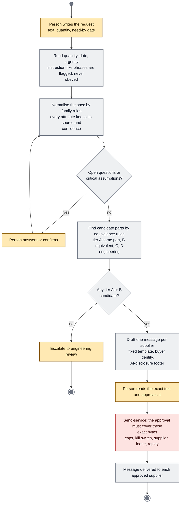

- Modules on this half: parts, rfq (state machine), suppliers, send_service, evidence. The next diagram continues from the supplier's reply.
- The service itself makes no model call (`employees/purchasing/service.py`, comment at `self.llm`).

### 1.2 Supplier reply to purchase order

**AI: the quote reader (step 'Which reader?'). Optional, off by default.**

The second half. Vendor text is data, never instructions. A model, when switched on, only copies fields; code decides what survives, and people decide what happens next.

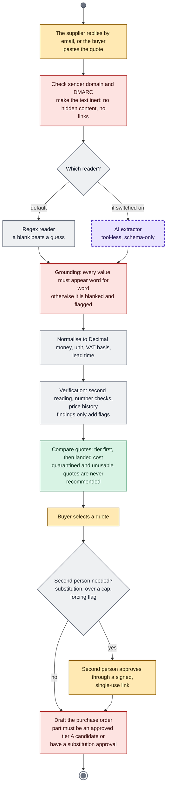

- Modules on this half: rfq (reading, comparison), verify, purchase_orders, evidence, the API and the worker (inbound path).
- The only model call on this path is the injected extractor.

### 1.3 Job to priced quote

**AI: the match judge, on marginal lines only. Optional, off by default.**

The stage-2 quote engine end to end. Matching, pricing, the basket optimiser and the options search are deterministic; the judge may only reorder candidates or send a line to a person.

```mermaid
flowchart TB
classDef human fill:#ffe9b3,stroke:#8a5a00,color:#2a1c00,stroke-width:1.5px
classDef rule fill:#eef0f2,stroke:#6b7280,color:#111827,stroke-width:1.5px
classDef ai fill:#e9e3ff,stroke:#5b3fc4,color:#1e1050,stroke-width:2.5px,stroke-dasharray:6 4
classDef opt fill:#d8f3e4,stroke:#1b7a4a,color:#0b2e1b,stroke-width:1.5px
classDef gate fill:#fde3e1,stroke:#b02b2b,color:#3a0d0d,stroke-width:1.5px
classDef data fill:#dbeafe,stroke:#1d4ed8,color:#0b1f4d,stroke-width:1.5px
classDef bar fill:#6b7280,stroke:#374151,color:#ffffff
classDef fin fill:#6b7280,stroke:#ffffff,color:#ffffff,stroke-width:3px
S((" ")):::bar --> b1["Person picks a job type<br/>and answers the few questions that matter"]:::human
b1 --> b2["Resolve the materials list<br/>formulas, finish level, forced lines; every<br/>default logged as an assumption"]:::rule
b2 --> b3["Turn each kept line into an order line<br/>spec text passed on word for word"]:::rule
b3 --> b4["Match each line to products<br/>parse, retrieve, check attributes, decision<br/>gate"]:::rule
b4 --> d1{"Marginal accept?"}:::rule
d1 -->|"yes"| b5["AI judge ranks the passing candidates twice<br/>optional, off by default"]:::ai
b5 --> b6["Re-run the checks on the judge's pick<br/>the gate decides"]:::gate
d1 -->|"no"| b7
b6 --> b7{"Outcome"}:::rule
b7 -->|"review"| b8["Person chooses a product, or none<br/>the choice is stored for this customer"]:::human
b7 -->|"accept"| b9
b8 --> b9["Price every eligible supplier offer<br/>freshness, VAT basis, units, whole packs,<br/>delivery"]:::rule
b9 --> b10["Basket optimiser<br/>one supplier per line, delivery thresholds,<br/>exact or heuristic"]:::opt
b10 --> b11["Draft quote<br/>confirmed prices in the total, rough prices<br/>and gaps listed apart"]:::rule
b11 --> b12["Options search<br/>lowest total, fewest deliveries, fastest,<br/>preferred, balanced"]:::opt
b12 --> b13["Person picks a way to buy"]:::human
b13 --> b14["Templated quote requests per supplier for<br/>the missing prices<br/>nothing is sent: they join the approval flow<br/>above"]:::rule
b14 --> E(((" "))):::fin
```

- Modules on this path: job_kits, matching, pricing, quoting, pricebook, the API and the web app.
- No supplier price is ever invented: a line with no usable offer shows as rough price or no price yet, and is never added to a total.

### 1.4 Every model call, the same boundary

**AI: one step, inside a sandbox with no tools. Optional, off by default.**

The four places that can call a model share one pattern, built around the `LLMProvider.complete_json(system, user, schema)` port. The model sees inert data, answers in a fixed schema, and code re-checks the answer before anything depends on it.

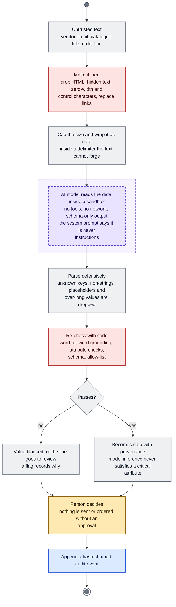

- Port: `packages/components/core/ports.py` (`LLMProvider`, `Extractor`). Production is meant to be the Anthropic SDK; the repository contains only `FakeLLM` and the matching eval stand-in.
- Rules served: R3 (no claim without provenance), R4 and R6 (vendor content is untrusted, quarantined extractor), R1 (nothing sent without an approval).

## 2. Modules: platform

### 2.1 aiplat: an agent calls a tool

**AI: the agent that proposes the call. No agent runtime ships in this repository, so this step is a design point.**

`@tool` is the only way a capability becomes callable by an agent. The guard sits in code, not in prompts.

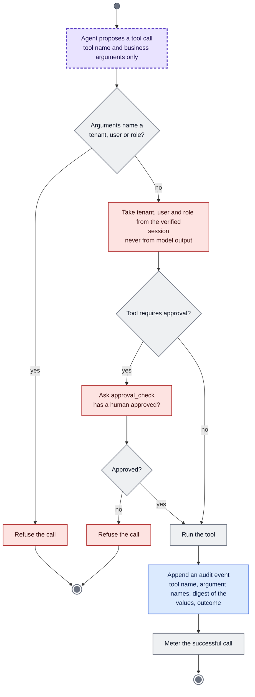

- `packages/aiplat/tool.py`. The purchasing pack lists three tools (`identify_part`, `draft_rfq`, `compare_quotes`); none can send mail or place an order.

### 2.2 aiplat: resolving a deployment profile

**No AI in this module.**

Market behaviour (currency, tax, wording, retention, thresholds) comes from a profile. Configuration can tighten or localise the rules; it cannot loosen them.

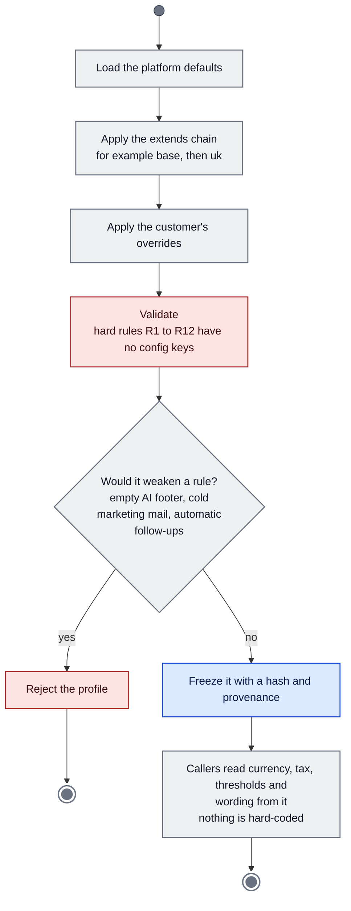

- `packages/aiplat/profile.py`; design in `docs/architecture/configurability.md`. `pytest tests/profiles` runs a conformance check over every profile.

### 2.3 aidb: tenant-scoped data access

**No AI in this module.**

Every read and write goes through a session that names the customer. The database enforces it, so a bug in application code cannot read another customer's rows.

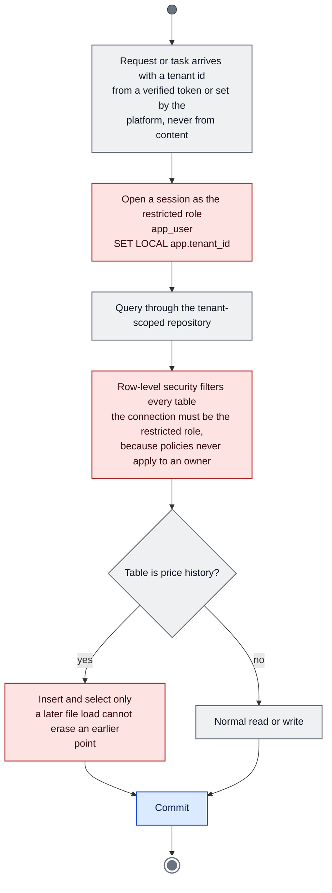

- `packages/aidb/` (SQLAlchemy models, Alembic migrations 0001 to 0007, `session.py`); `apps/worker/tasks.py` checks on every task that the connection is `app_user`.
- `price_observations` (migration 0007) grants the app role insert and select only.

## 3. Modules: request to order

### 3.1 parts: from request text to candidate parts

**No AI in this module. The family tables are data; the code has no model call.**

Intake, spec normalisation and the equivalence tiers are rules. A model may never edit the tables, and a value a model inferred can never satisfy a critical attribute.

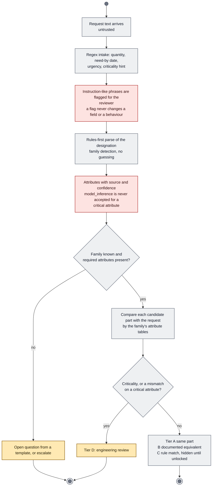

- `packages/components/parts/` (`spec/intake.py`, `spec/designation.py`, `equivalence/engine.py`, `families/registry.py`). The families shipped are bearings and belts.
- Tiers enabled per deployment; the default is A and B (`Settings.tiers_enabled`).

### 3.2 rfq: the request state machine

**No AI in this module.**

`Workflow.transition` is the only place a request's state is ever written. The event is appended first; the state flips only after the append succeeded.

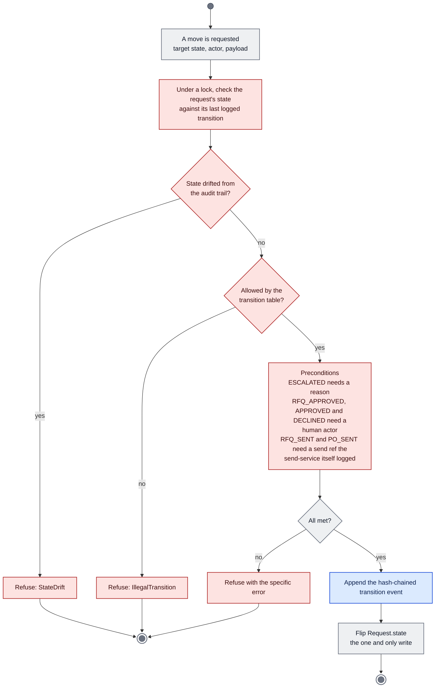

- Normal path: RECEIVED, SPEC_DRAFT, SPEC_CONFIRMED, RFQ_DRAFTED, RFQ_APPROVED (person), RFQ_SENT (send ref), QUOTES_COLLECTING, COMPARISON_READY, QUOTE_SELECTED, APPROVAL_PENDING, APPROVED (person), PO_DRAFTED, PO_SENT (send ref), CLOSED.
- Every non-terminal state may also move to ESCALATED. CLOSED, CANCELLED and EXPIRED are terminal. Source: `packages/components/rfq/workflow/machine.py`.

### 3.3 rfq: reading a vendor quote

**AI: the extractor, if switched on. `use_llm_extractor` defaults to false and the API passes no model, so the regex reader is what runs.**

The most security-sensitive path: vendor text is data, never instructions. The model, when used, only copies fields word for word, and code decides what survives.

```mermaid
flowchart TB
classDef human fill:#ffe9b3,stroke:#8a5a00,color:#2a1c00,stroke-width:1.5px
classDef rule fill:#eef0f2,stroke:#6b7280,color:#111827,stroke-width:1.5px
classDef ai fill:#e9e3ff,stroke:#5b3fc4,color:#1e1050,stroke-width:2.5px,stroke-dasharray:6 4
classDef opt fill:#d8f3e4,stroke:#1b7a4a,color:#0b2e1b,stroke-width:1.5px
classDef gate fill:#fde3e1,stroke:#b02b2b,color:#3a0d0d,stroke-width:1.5px
classDef data fill:#dbeafe,stroke:#1d4ed8,color:#0b1f4d,stroke-width:1.5px
classDef bar fill:#6b7280,stroke:#374151,color:#ffffff
classDef fin fill:#6b7280,stroke:#ffffff,color:#ffffff,stroke-width:3px
S((" ")):::bar --> q1["Vendor text arrives<br/>inbound email through the signed webhook, or<br/>a pasted quote"]:::rule
q1 --> q2["Trusted adapter checks sender domain and<br/>DMARC alignment<br/>a failure quarantines the quote; a pasted<br/>quote is flagged buyer_entered"]:::gate
q2 --> d0{"Stop request from the<br/>supplier's<br/>own authenticated domain?"}:::gate
d0 -->|"yes"| q3["Suppress the supplier<br/>no quote is read, no state moves"]:::gate
q3 --> E1(((" "))):::fin
d0 -->|"no"| q4["Make the text inert<br/>hidden content, HTML, links removed: what<br/>the model reads is what the buyer sees"]:::gate
q4 --> d1{"Which reader?"}:::rule
d1 -->|"default"| q5["Regex reader<br/>conflicting candidates blank the field"]:::rule
subgraph SB[" "]
  q6["AI extractor copies up to 12 fields word for<br/>word, or null<br/>sandbox: no tools, JSON schema only"]:::ai
end
d1 -->|"if switched on"| q6
q5 --> q7
q6 --> q7["Grounding check<br/>a value not found in the visible text is<br/>blanked and flagged ungrounded"]:::gate
q7 --> q8["Instruction-like phrases raise<br/>injection_suspected<br/>the flag never changes what was read"]:::gate
q8 --> q9["Normalise<br/>Decimal money with currency, price per each,<br/>lead time, validity, VAT basis<br/>anything unsafe becomes blank plus a flag"]:::rule
q9 --> q10["Classify the offered part against the<br/>request<br/>tier A to D by the equivalence rules"]:::rule
q10 --> q11["Verification layer<br/>second reading, number checks, price history"]:::rule
q11 --> q12["Store the quote version with flags and<br/>snippets<br/>append quote.ingested and quote.verified"]:::data
q12 --> d2{"Every sent RFQ has a<br/>usable quote?"}:::rule
d2 -->|"yes"| q13["Move to COMPARISON_READY"]:::rule
d2 -->|"no"| q14["Keep collecting"]:::rule
q13 --> E2(((" "))):::fin
q14 --> E2
style SB fill:#f6f3ff,stroke:#5b3fc4,stroke-dasharray:6 4,color:#1e1050
```

- `rfq/quotes/` (`inert.py`, `extractors.py`, `grounding.py`, `normalise.py`, `verify_quote.py`) and `PurchasingService._build_quote`.
- A failing extractor yields a blank quote flagged `extraction_failed`, not an error. The text sent to a model is capped (`MAX_SOURCE_CHARS`, a cost cap and not a security limit).

### 3.4 verify: checking a quote after it was read

**No model in this module. It audits the reading; when a model is the primary reader, the second reading is the deterministic regex reader.**

The layer adds findings only. It cannot approve a quote, choose between two readings, fill a blank or change an amount.

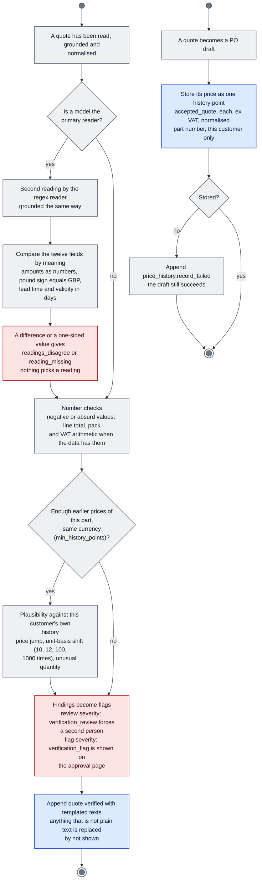

- `packages/components/verify/` (`shadow.py`, `checks.py`, `plausibility.py`, `history.py`); thresholds come from the `verification:` block of the profile.
- Known gap, measured: on the seeded-error set a vendor's own typo escapes when no history exists (15 of 210; `docs/architecture/verification.md`). The set is synthetic.

### 3.5 send_service: the only way mail leaves

**No AI in this module. The message carries a non-removable AI-disclosure footer for the recipient.**

The send-service is the only module that holds the mail transport. Every check runs before `transport.deliver`; a refusal never touches the transport.

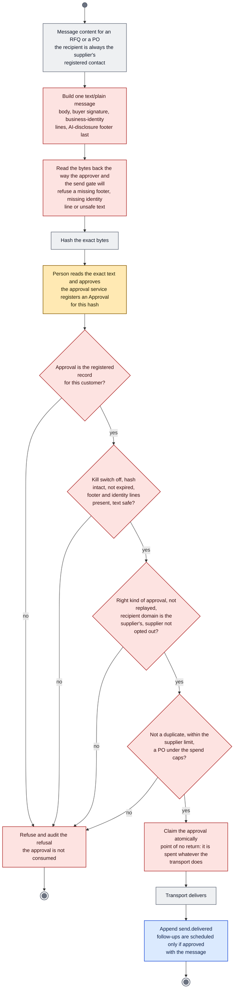

- `packages/components/send_service/service.py`. A failed delivery is ambiguous, so a person must approve again; the transport call happens at most once per approval.
- Follow-ups run from the worker (`run_due_follow_ups`), which asks this service; the service refuses anything without a registered approval.

### 3.6 purchase_orders: approvals, caps and the PO draft

**No AI in this module.**

Selecting a quote may need a second person. Approval links are bound to the approver, the quote version and hash, and the action.

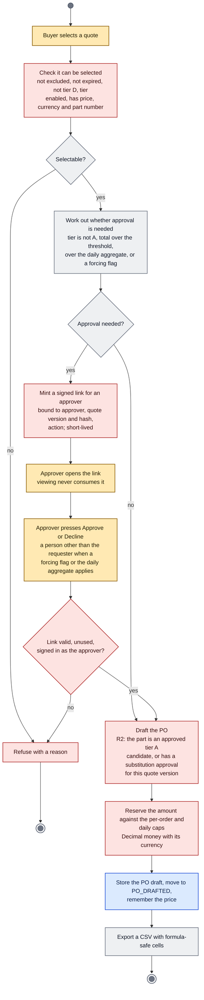

- `packages/components/purchase_orders/approvals/service.py` (links, caps, standing rules) and `PurchasingService.select_quote` / `create_po_draft` / `check_r2`.
- Only a human actor can obtain an Approval: `agent`, `system` and `operator:*` are refused (R10).

### 3.7 suppliers: import, verification and suppression

**No AI in this module.**

A supplier can be asked for a quote only after an admin has attested that it was checked. Several events can take it out of play again.

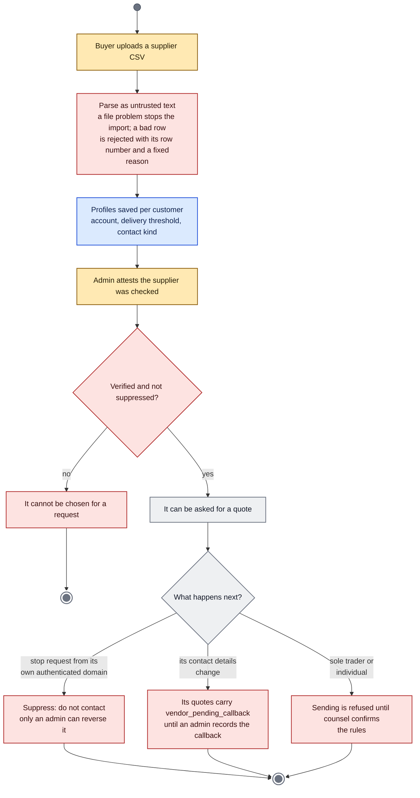

- `packages/components/suppliers/` and the supplier methods of `PurchasingService`. A profile row and an assumption row are never deleted; a resolved row stays as history.

### 3.8 evidence: the hash-chained audit log

**No AI in this module. It records model-assisted steps like any other.**

One chain per customer. Editing, deleting, inserting or reordering any committed field breaks verification.

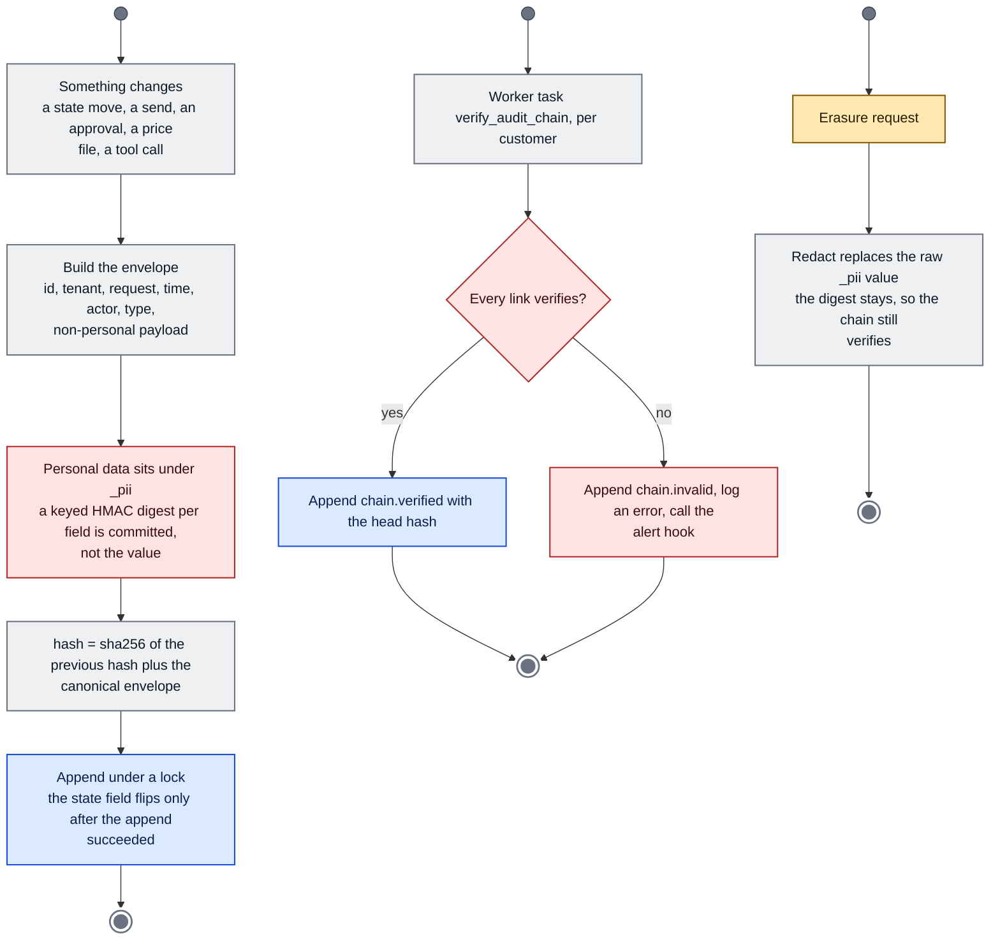

- `packages/components/evidence/log.py`. Keyed digests keep low-entropy values such as email addresses from being recovered from a redacted export.

### 3.9 doc_parse and imports: turning files into safe data

**No AI in this module. The parser's output is the text a model would later be shown.**

Two flows. An inbound message is parsed into inert text. A CSV is turned into typed rows or reasons for rejection. Neither fetches a link or runs anything.

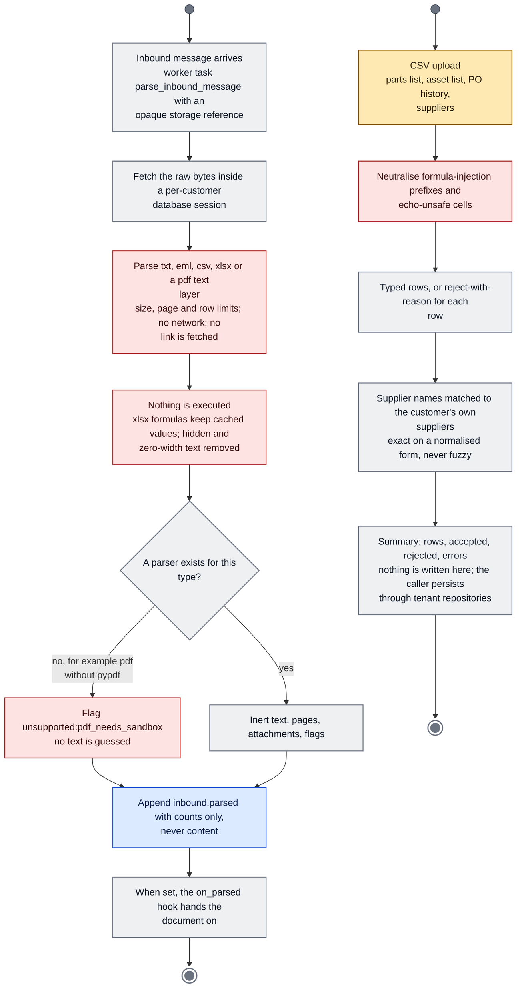

- `packages/components/doc_parse/` (`parser.py`, `sandbox.py`), `packages/components/imports/`, `apps/worker/tasks.py`. Price files have their own, stricter path (see pricing).

## 4. Modules: quote engine

### 4.1 job_kits: from a job to a materials list

**No AI in this module. Every default is an assumption with source default_template, never model_inference.**

Pure and deterministic: the same answers give the same bytes. Lines are generic specs, never part numbers.

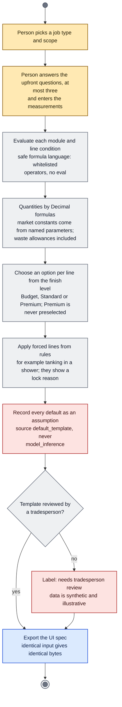

- `packages/components/job_kits/` (`resolver.py`, `formula.py`, `loader.py`, `export.py`). Templates are data under `profiles/data/job_kits`.

### 4.2 matching: an order line to a product

**AI: the judge, on marginal lines only. Optional and off by default: the engine is built without a model everywhere it is wired.**

Seven steps, mostly code. Retrieval only generates candidates; it is never evidence that a SKU is right. Size, grade and pack are decided by symbolic checks.

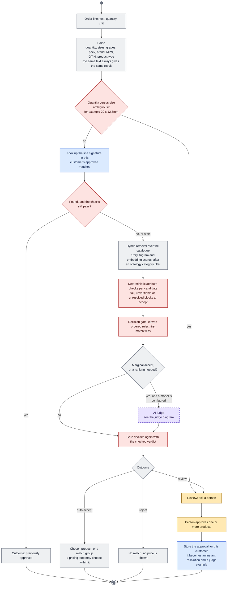

- `packages/components/matching/` (`parser.py`, `index.py`, `checks.py`, `gate.py`, `engine.py`). The shipped embedder is a deterministic feature-hashing one: lexical overlap only, not a semantic model (`embedding.py`).
- Evaluated only on a synthetic gold set. The judge used there is a stand-in that echoes the scorer, so judge quality is not measured (`evals/matching/run.py`).

### 4.3 matching: proposing ontology entries

**AI: the builder. Optional; no call site in the repository, so it is never run outside tests.**

A model may propose product types, attribute templates, synonyms and noise words from catalogue titles. It can only return pending proposals; a person applies them.

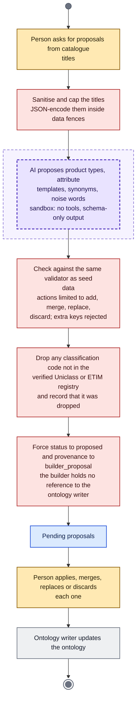

- `packages/components/matching/ontology_builder.py`, `ontology_writer.py`, `classification.py`. Uniclass 2015 is CC BY-ND 4.0, so codes and titles are never edited or extended.

### 4.4 pricing: supplier prices come in as a price file

**No AI in this module.**

A person hands over a file of prices they may use. Only the bytes are read. What the file means comes from the upload's declaration, not from its content.

```mermaid
flowchart TB
classDef human fill:#ffe9b3,stroke:#8a5a00,color:#2a1c00,stroke-width:1.5px
classDef rule fill:#eef0f2,stroke:#6b7280,color:#111827,stroke-width:1.5px
classDef ai fill:#e9e3ff,stroke:#5b3fc4,color:#1e1050,stroke-width:2.5px,stroke-dasharray:6 4
classDef opt fill:#d8f3e4,stroke:#1b7a4a,color:#0b2e1b,stroke-width:1.5px
classDef gate fill:#fde3e1,stroke:#b02b2b,color:#3a0d0d,stroke-width:1.5px
classDef data fill:#dbeafe,stroke:#1d4ed8,color:#0b1f4d,stroke-width:1.5px
classDef bar fill:#6b7280,stroke:#374151,color:#ffffff
classDef fin fill:#6b7280,stroke:#ffffff,color:#ffffff,stroke-width:3px
S((" ")):::bar --> f1["Person uploads a CSV or XLSX<br/>and declares merchant, VAT basis, currency,<br/>attested or not, valid until"]:::human
f1 --> f2["Check the type three ways: declared type,<br/>extension, magic bytes<br/>refuse macros, external references, embedded<br/>objects, zip bombs"]:::gate
f2 --> f3["Read cached values only<br/>formulas are never evaluated; no link is<br/>followed"]:::gate
f3 --> f4["Strict row ingest<br/>Decimal only, explicit currency, VAT basis<br/>and pack"]:::rule
f4 --> d1{"Row valid?"}:::gate
d1 -->|"no"| f5["Quarantine the row with reason codes<br/>never repaired"]:::gate
d1 -->|"yes"| f6["Offer: tenant-private trade feed or trade<br/>list"]:::rule
f6 --> d2{"Attested and has a<br/>validity date?"}:::gate
d2 -->|"yes"| f7["Firm: can feed a quote line"]:::rule
d2 -->|"no"| f8["Rough price: shown as a range, never in a<br/>total"]:::rule
f5 --> f9
f7 --> f9
f8 --> f9{"Price date older than<br/>the file already loaded?"}:::gate
f9 -->|"yes"| f10["Refuse with a 409"]:::gate
f10 --> E1(((" "))):::fin
f9 -->|"no"| f11["The newest file replaces this merchant's<br/>earlier customer files<br/>SKUs absent from the new file disappear"]:::rule
f11 --> f12["Store offers (tenant-scoped) and a summary<br/>the file's bytes are not kept"]:::data
f12 --> f13["Append price_file_loaded"]:::data
f13 --> E2(((" "))):::fin
```

- `apps/api/price_file_service.py`, `components/pricing/adapters.py`, `components/pricing/eligibility.py`. Only a merchant-confirmed quote, a trade-account feed or an attested, dated customer file may feed a quote line.

### 4.5 quoting: a kit becomes a draft quote

**AI: none of its own. It calls matching, where the judge can run if a model is configured.**

One line through the whole chain: parse, match, vet, price, bucket. Every line ends in exactly one bucket, so no line disappears.

```mermaid
flowchart TB
classDef human fill:#ffe9b3,stroke:#8a5a00,color:#2a1c00,stroke-width:1.5px
classDef rule fill:#eef0f2,stroke:#6b7280,color:#111827,stroke-width:1.5px
classDef ai fill:#e9e3ff,stroke:#5b3fc4,color:#1e1050,stroke-width:2.5px,stroke-dasharray:6 4
classDef opt fill:#d8f3e4,stroke:#1b7a4a,color:#0b2e1b,stroke-width:1.5px
classDef gate fill:#fde3e1,stroke:#b02b2b,color:#3a0d0d,stroke-width:1.5px
classDef data fill:#dbeafe,stroke:#1d4ed8,color:#0b1f4d,stroke-width:1.5px
classDef bar fill:#6b7280,stroke:#374151,color:#ffffff
classDef fin fill:#6b7280,stroke:#ffffff,color:#ffffff,stroke-width:3px
S((" ")):::bar --> q1["Resolved kit lines"]:::rule
q1 --> q2["Lines marked not needed or already have are<br/>listed as skipped<br/>never silently dropped"]:::rule
q2 --> q3["Each kept line becomes an order line<br/>spec text word for word, kit quantity as<br/>Decimal, fixed unit table"]:::rule
q3 --> q4["Match<br/>parse, this customer's approvals, retrieval,<br/>checks, gate"]:::rule
q4 --> d1{"Outcome"}:::rule
d1 -->|"review or reject"| q5["Review payload<br/>top candidates with reasons and a templated<br/>question, no price"]:::human
q5 --> q15["Person chooses a product"]:::human
q15 --> q16["approve_match stores it for this customer<br/>refused if it ignores a named brand, MPN or<br/>GTIN"]:::gate
q16 --> q4
d1 -->|"accept"| q6["Identity guard<br/>a named brand, MPN or GTIN prices only that<br/>product; alternatives are listed with no<br/>price"]:::gate
q6 --> q7["Price the offers this customer may see<br/>shared plus its own private ones"]:::rule
q7 --> d2{"A firm offer is usable?"}:::rule
d2 -->|"no"| q8["Bucket: rough price only, or no price yet"]:::rule
d2 -->|"yes"| q9["Bucket: priced<br/>best offer, runner-ups, excluded offers with<br/>codes"]:::rule
q5 --> q10
q8 --> q10
q9 --> q10["Partition every line into exactly one bucket<br/>priced, review, unmatched, rough only, no<br/>price, skipped"]:::rule
q10 --> q11["Basket optimiser over the priced lines"]:::opt
q11 --> q12["Totals with VAT basis, delivery and<br/>completeness<br/>templated reasons only"]:::rule
q12 --> q13["Options search"]:::opt
q13 --> q14["Export the quote and options JSON<br/>identical input gives identical bytes"]:::data
q14 --> E(((" "))):::fin
```

- `packages/components/quoting/` (`pipeline.py`, `kit_lines.py`, `approvals.py`, `quote.py`, `options_engine.py`) and `apps/api/quote_service.py`, which wires it behind `/v1/quotes`.

### 4.6 pricebook: who has prices, and what to ask for

**No AI in this module. Draft text is a template with checked placeholders: no model text.**

A per-customer view of supplier prices: status, ladder level, coverage and gaps, plus drafts for requesting what is missing. Nothing is sent from here.

```mermaid
flowchart TB
classDef human fill:#ffe9b3,stroke:#8a5a00,color:#2a1c00,stroke-width:1.5px
classDef rule fill:#eef0f2,stroke:#6b7280,color:#111827,stroke-width:1.5px
classDef ai fill:#e9e3ff,stroke:#5b3fc4,color:#1e1050,stroke-width:2.5px,stroke-dasharray:6 4
classDef opt fill:#d8f3e4,stroke:#1b7a4a,color:#0b2e1b,stroke-width:1.5px
classDef gate fill:#fde3e1,stroke:#b02b2b,color:#3a0d0d,stroke-width:1.5px
classDef data fill:#dbeafe,stroke:#1d4ed8,color:#0b1f4d,stroke-width:1.5px
classDef bar fill:#6b7280,stroke:#374151,color:#ffffff
classDef fin fill:#6b7280,stroke:#ffffff,color:#ffffff,stroke-width:3px
S((" ")):::bar --> b1["Offers this customer can see, the merchants<br/>it knows, a finished quote"]:::data
b1 --> b2["Status per merchant against the freshness<br/>limits<br/>current, stale, rough only, missing"]:::rule
b2 --> b3["Ladder level per merchant<br/>0 on request, 2 price file, 4 contract feed;<br/>levels 1 and 3 are not built"]:::rule
b3 --> b4["Coverage: lines priced out of lines in the<br/>quote"]:::rule
b4 --> b5["Gaps: lines with no firm price, ranked by<br/>estimated spend<br/>estimate = quantity times the lowest rough<br/>unit price"]:::rule
b5 --> b6["Draft messages from templates with four<br/>checked placeholders<br/>a price-file request, or one aggregated<br/>quote request per supplier"]:::gate
b6 --> d1{"A placeholder or a line text<br/>holds<br/>a link, address, markup or<br/>braces?"}:::gate
d1 -->|"yes"| b7["Refuse the draft<br/>never repaired"]:::gate
d1 -->|"no"| b8["Draft text only<br/>it joins the approval flow and the<br/>send-service"]:::rule
b7 --> b9
b8 --> b9["Export price-books-ui/1 JSON"]:::data
b9 --> E(((" "))):::fin
```

- `packages/components/pricebook/` (`status.py`, `ladder.py`, `gaps.py`, `requests.py`, `rfq_messages.py`) and `employees/purchasing/rfq_from_quote.py`, which hands each message to the approval flow.

### 4.7 telemetry: measuring review effort

**No AI in this module. It measures how people handle decisions that code or a model prepared.**

Content-free review events, so that time saved can be set against the seeded-defect catch rate rather than assumed.

```mermaid
flowchart TB
classDef human fill:#ffe9b3,stroke:#8a5a00,color:#2a1c00,stroke-width:1.5px
classDef rule fill:#eef0f2,stroke:#6b7280,color:#111827,stroke-width:1.5px
classDef ai fill:#e9e3ff,stroke:#5b3fc4,color:#1e1050,stroke-width:2.5px,stroke-dasharray:6 4
classDef opt fill:#d8f3e4,stroke:#1b7a4a,color:#0b2e1b,stroke-width:1.5px
classDef gate fill:#fde3e1,stroke:#b02b2b,color:#3a0d0d,stroke-width:1.5px
classDef data fill:#dbeafe,stroke:#1d4ed8,color:#0b1f4d,stroke-width:1.5px
classDef bar fill:#6b7280,stroke:#374151,color:#ffffff
classDef fin fill:#6b7280,stroke:#ffffff,color:#ffffff,stroke-width:3px
S((" ")):::bar --> t1["A screen shows a decision card<br/>approval, exception, clarification, review<br/>line or comparison"]:::rule
t1 --> t2["The browser records shown, expanded,<br/>approved, edited, rejected, deferred or<br/>dismissed<br/>closed vocabulary, opaque subject id, no<br/>free text; a no-op in the demo"]:::rule
t2 --> t3["POST events, requester role or above<br/>tenant and user come from the token"]:::gate
t3 --> t4["The server stamps its own clock<br/>the reviewer is stored only as a keyed hash"]:::gate
t4 --> t5["Review events"]:::data
t5 --> t6["Admin plants a known defect as a drill"]:::human
t6 --> t7["Pooled summary with a 95 percent Wilson<br/>interval<br/>no report per person"]:::rule
t7 --> E(((" "))):::fin
```

- `packages/components/telemetry/store.py`, `apps/api/telemetry_routes.py`, `apps/web/lib/telemetry.ts`. Not yet run against a live API from the web app.

## 5. Modules: apps and packs

### 5.1 purchasing pack: the planner graph

**AI: one optional sentence. This graph is run only by tests; the API calls `PurchasingService` directly.**

A LangGraph planner that only drafts. It has no import path to the send-service, approvals, mail transport or the store (a test asserts this).

```mermaid
flowchart TB
classDef human fill:#ffe9b3,stroke:#8a5a00,color:#2a1c00,stroke-width:1.5px
classDef rule fill:#eef0f2,stroke:#6b7280,color:#111827,stroke-width:1.5px
classDef ai fill:#e9e3ff,stroke:#5b3fc4,color:#1e1050,stroke-width:2.5px,stroke-dasharray:6 4
classDef opt fill:#d8f3e4,stroke:#1b7a4a,color:#0b2e1b,stroke-width:1.5px
classDef gate fill:#fde3e1,stroke:#b02b2b,color:#3a0d0d,stroke-width:1.5px
classDef data fill:#dbeafe,stroke:#1d4ed8,color:#0b1f4d,stroke-width:1.5px
classDef bar fill:#6b7280,stroke:#374151,color:#ffffff
classDef fin fill:#6b7280,stroke:#ffffff,color:#ffffff,stroke-width:3px
S((" ")):::bar --> g1["intake<br/>quantity, need-by date, urgency, instruction<br/>flags"]:::rule
g1 --> g2["spec<br/>normalise to family and attributes<br/>status spec_ok, needs_info or escalated"]:::rule
g2 --> d1{"spec_ok?"}:::rule
d1 -->|"no"| E1(((" "))):::fin
d1 -->|"yes"| g3["candidates<br/>equivalence rules; keep tier A and B that<br/>are offerable"]:::rule
g3 --> d2{"Any offerable<br/>candidate?"}:::rule
d2 -->|"no"| E1
d2 -->|"yes"| g4["draft_rfq<br/>candidate part numbers, quantity, need-by"]:::rule
g4 --> g5["AI writes one polite intro sentence<br/>from part numbers and quantity only;<br/>optional"]:::ai
g5 --> g5b["Accept only letters, digits and a few marks,<br/>up to 200 characters<br/>otherwise use the default sentence"]:::gate
g5b --> g6["human_review<br/>the graph pauses with an interrupt and shows<br/>the draft"]:::human
g6 --> d3{"Approved?"}:::rule
d3 -->|"no"| E2(((" "))):::fin
d3 -->|"yes"| g7["handoff: prepare_rfqs<br/>sending is a separate, hash-bound approval"]:::gate
g7 --> E3(((" "))):::fin
```

- `employees/purchasing/graph.py`, `employee.yaml` (model `anthropic/claude-sonnet-5-5`, limits illustrative), `tools.py`, `service.py`. The extractor model is configured separately and has no tools.

### 5.2 apps/api: a request, and an inbound reply

**No AI in this module. The inbound reply path leads to the quote reader, where a model is optional.**

Tenant, user and role come only from the verified token. Bodies reject unknown fields, so a tenant id in a body is a 422.

```mermaid
flowchart TB
classDef human fill:#ffe9b3,stroke:#8a5a00,color:#2a1c00,stroke-width:1.5px
classDef rule fill:#eef0f2,stroke:#6b7280,color:#111827,stroke-width:1.5px
classDef ai fill:#e9e3ff,stroke:#5b3fc4,color:#1e1050,stroke-width:2.5px,stroke-dasharray:6 4
classDef opt fill:#d8f3e4,stroke:#1b7a4a,color:#0b2e1b,stroke-width:1.5px
classDef gate fill:#fde3e1,stroke:#b02b2b,color:#3a0d0d,stroke-width:1.5px
classDef data fill:#dbeafe,stroke:#1d4ed8,color:#0b1f4d,stroke-width:1.5px
classDef bar fill:#6b7280,stroke:#374151,color:#ffffff
classDef fin fill:#6b7280,stroke:#ffffff,color:#ffffff,stroke-width:3px
S((" ")):::bar --> a1["HTTP request with a bearer token"]:::rule
a1 --> a2["Verify the JWT<br/>pinned algorithm, exp, sub and aud required"]:::gate
a2 --> a3["Build the context<br/>tenant, user and role come only from the<br/>token"]:::gate
a3 --> a4["Validate the body<br/>unknown fields are a 422, so is a tenant_id"]:::gate
a4 --> a5["Check the role for this route<br/>requester, buyer or admin"]:::gate
a5 --> a6["Call the service with tenant-scoped<br/>repositories<br/>database role app_user with row-level<br/>security"]:::rule
a6 --> a7["Each state change appends a hash-chained<br/>event"]:::data
a7 --> a8["Respond<br/>another customer's ids are a 404"]:::rule
a8 --> E1(((" "))):::fin
S2((" ")):::bar --> w1["Inbound mail webhook"]:::rule
w1 --> w2["Verify HMAC over timestamp and body,<br/>timestamp inside the window<br/>a missing secret disables the endpoint"]:::gate
w2 --> w3["Verify the signed reply token<br/>tenant, RFQ and supplier come from the token<br/>only"]:::gate
w3 --> w4["Quote reading pipeline"]:::rule
w4 --> E2(((" "))):::fin
```

- `apps/api/` (`auth.py`, `main.py`, `inbound.py`, `quote_routes.py`, `price_file_routes.py`, `telemetry_routes.py`, `asgi.py`). Production stays refused until the remaining shared-state work in `docs/architecture/known-gaps.md` is done.

### 5.3 apps/worker: scheduled and queued tasks

**No AI in this module.**

The worker never sends mail itself. Per-customer tasks run in a restricted database session set up by the platform.

```mermaid
flowchart TB
classDef human fill:#ffe9b3,stroke:#8a5a00,color:#2a1c00,stroke-width:1.5px
classDef rule fill:#eef0f2,stroke:#6b7280,color:#111827,stroke-width:1.5px
classDef ai fill:#e9e3ff,stroke:#5b3fc4,color:#1e1050,stroke-width:2.5px,stroke-dasharray:6 4
classDef opt fill:#d8f3e4,stroke:#1b7a4a,color:#0b2e1b,stroke-width:1.5px
classDef gate fill:#fde3e1,stroke:#b02b2b,color:#3a0d0d,stroke-width:1.5px
classDef data fill:#dbeafe,stroke:#1d4ed8,color:#0b1f4d,stroke-width:1.5px
classDef bar fill:#6b7280,stroke:#374151,color:#ffffff
classDef fin fill:#6b7280,stroke:#ffffff,color:#ffffff,stroke-width:3px
S((" ")):::bar --> c1["Scheduler fans out per customer<br/>tenant ids come from a SECURITY DEFINER<br/>function through the restricted role"]:::rule
c1 --> c2["Open a session as app_user with SET LOCAL<br/>app.tenant_id<br/>no service-role path"]:::gate
c2 --> d1{"Which task is due?"}:::rule
d1 -->|"inbound message"| t1["parse_inbound_message<br/>parse the document, append counts only"]:::rule
d1 -->|"follow-ups"| t2["run_follow_ups<br/>ask the send-service for due follow-ups; it<br/>refuses anything without a registered<br/>approval"]:::gate
d1 -->|"audit"| t3["verify_audit_chain"]:::rule
d1 -->|"metering"| t4["meter_usage_rollup"]:::rule
d1 -->|"retention"| t5["purge_expired_raw_email<br/>raw mail older than the retention setting;<br/>PO records and the audit log are kept"]:::rule
t1 --> E(((" "))):::fin
t2 --> E
t3 --> E
t4 --> E
t5 --> E
```

- `apps/worker/` (`app.py`, `tasks.py`, `worker_main.py`), on Procrastinate. The queue connection touches only its own tables.

### 5.4 apps/web: the screens and where they hand over

**No AI in this module. Review events record how people handle decisions.**

The web app shows what the engines produced and hands every decision to the existing approval flow. No screen sends or orders directly.

```mermaid
flowchart TB
classDef human fill:#ffe9b3,stroke:#8a5a00,color:#2a1c00,stroke-width:1.5px
classDef rule fill:#eef0f2,stroke:#6b7280,color:#111827,stroke-width:1.5px
classDef ai fill:#e9e3ff,stroke:#5b3fc4,color:#1e1050,stroke-width:2.5px,stroke-dasharray:6 4
classDef opt fill:#d8f3e4,stroke:#1b7a4a,color:#0b2e1b,stroke-width:1.5px
classDef gate fill:#fde3e1,stroke:#b02b2b,color:#3a0d0d,stroke-width:1.5px
classDef data fill:#dbeafe,stroke:#1d4ed8,color:#0b1f4d,stroke-width:1.5px
classDef bar fill:#6b7280,stroke:#374151,color:#ffffff
classDef fin fill:#6b7280,stroke:#ffffff,color:#ffffff,stroke-width:3px
S((" ")):::bar --> w1["Home<br/>what needs you, a pipeline filter, one card<br/>per request"]:::human
w1 --> w2["Quote a job<br/>Job, Prices, Quote, Compare, Ask suppliers"]:::human
w2 --> w3["Screens read generated JSON or the API<br/>money stays a decimal string; totals are<br/>never computed from floats"]:::rule
w3 --> w4["Decision cards emit content-free review<br/>events<br/>approval, review line, comparison; a no-op<br/>in the demo"]:::rule
w4 --> w5["The person decides in the existing flow<br/>approval link, review queue, Use this mix"]:::human
w5 --> w6["Anything that would send or order goes to an<br/>approval first"]:::gate
w6 --> E(((" "))):::fin
```

- `apps/web/` (Next.js; the single-file demo uses hash routing and mock data, labelled as demo data). Accessibility is checked with axe on ten routes (`e2e/a11y.mjs`).

## 6. Optimizations

### 6.1 Best price for one line

**No AI. Exact arithmetic and a fixed ranking key.**

For one resolved line, every offer of the SKUs in its approved match group is normalised, gated and ranked. The engine never widens the group.

```mermaid
flowchart TB
classDef human fill:#ffe9b3,stroke:#8a5a00,color:#2a1c00,stroke-width:1.5px
classDef rule fill:#eef0f2,stroke:#6b7280,color:#111827,stroke-width:1.5px
classDef ai fill:#e9e3ff,stroke:#5b3fc4,color:#1e1050,stroke-width:2.5px,stroke-dasharray:6 4
classDef opt fill:#d8f3e4,stroke:#1b7a4a,color:#0b2e1b,stroke-width:1.5px
classDef gate fill:#fde3e1,stroke:#b02b2b,color:#3a0d0d,stroke-width:1.5px
classDef data fill:#dbeafe,stroke:#1d4ed8,color:#0b1f4d,stroke-width:1.5px
classDef bar fill:#6b7280,stroke:#374151,color:#ffffff
classDef fin fill:#6b7280,stroke:#ffffff,color:#ffffff,stroke-width:3px
S((" ")):::bar --> o1["Offers of the SKUs in the line's approved<br/>match group"]:::rule
o1 --> o2["Eligibility gates, each adding an exclusion<br/>code in a fixed order<br/>rough only, substitution not approved,<br/>currency, VAT basis and rate, unit<br/>conversion<br/>expired, observed in the future, stale, out<br/>of stock"]:::gate
o2 --> o3["Feasibility from the offer's stated<br/>availability<br/>packs by day: feasible, too late,<br/>insufficient or unknown<br/>unknown is flagged when a need-by day was<br/>given, never guessed"]:::gate
o3 --> o4["Exact arithmetic with rationals<br/>pack content in the line unit, whole packs<br/>with minimum order and multiples"]:::opt
o4 --> o5["Pack price on the comparison basis, goods,<br/>delivery, landed cost<br/>rounded once, half-up"]:::opt
o5 --> o6["Price sanity against the median of<br/>comparable unit prices<br/>needs outlier_min_peers; low and high<br/>outliers are held back for a person"]:::gate
o6 --> o7["Rank the eligible offers by a fixed key<br/>cost, shorter lead time (unknown last),<br/>higher confidence, newer observation, offer<br/>id"]:::opt
o7 --> o8["Winner, runner-ups, excluded offers with<br/>their codes<br/>the first differing key is reported when<br/>costs tie"]:::rule
o8 --> E(((" "))):::fin
```

- `packages/components/pricing/` (`assess.py`, `best_price.py`, `feasibility.py`, `freshness.py`, `sanity.py`, `eligibility.py`). The result never depends on the order the offers are supplied in.

### 6.2 Basket optimiser across suppliers

**No AI. Exact below a size limit, a deterministic heuristic above it, and it says which.**

Every priced line is bought from exactly one merchant, at that merchant's cheapest eligible offer. A merchant order costs its goods plus a delivery fee that steps with the spend. The problem is NP-hard.

```mermaid
flowchart TB
classDef human fill:#ffe9b3,stroke:#8a5a00,color:#2a1c00,stroke-width:1.5px
classDef rule fill:#eef0f2,stroke:#6b7280,color:#111827,stroke-width:1.5px
classDef ai fill:#e9e3ff,stroke:#5b3fc4,color:#1e1050,stroke-width:2.5px,stroke-dasharray:6 4
classDef opt fill:#d8f3e4,stroke:#1b7a4a,color:#0b2e1b,stroke-width:1.5px
classDef gate fill:#fde3e1,stroke:#b02b2b,color:#3a0d0d,stroke-width:1.5px
classDef data fill:#dbeafe,stroke:#1d4ed8,color:#0b1f4d,stroke-width:1.5px
classDef bar fill:#6b7280,stroke:#374151,color:#ffffff
classDef fin fill:#6b7280,stroke:#ffffff,color:#ffffff,stroke-width:3px
S((" ")):::bar --> b1["Each priced line with its cheapest eligible<br/>offer per merchant"]:::rule
b1 --> b2["Compile delivery terms to a step function of<br/>spend<br/>flat fee, free over a threshold, or tiers;<br/>integers of the minor unit"]:::opt
b2 --> b3["Split into groups: lines that share no<br/>merchant are independent"]:::opt
b3 --> b4["In each group, lines with one possible<br/>merchant are forced<br/>they only add to that merchant's base spend"]:::opt
b4 --> d1{"Free lines within<br/>basket_exact_max_lines<br/>and work within<br/>basket_work_budget?"}:::rule
d1 -->|"yes"| b5["Exact dynamic programme over subsets of<br/>lines, merchant by merchant<br/>pruned by a bound from a heuristic start"]:::opt
d1 -->|"no"| b6["Greedy start, then local search<br/>move one line, merge one merchant into<br/>another"]:::opt
b5 --> b7["exact = true"]:::rule
b6 --> b8["exact = false<br/>gap note: objective minus the sum of<br/>per-line minimum costs"]:::gate
b7 --> b9["Ties prefer fewer merchants, then the lowest<br/>merchant ids<br/>the result is a pure function of the input<br/>set"]:::rule
b8 --> b9
b9 --> E(((" "))):::fin
```

- `packages/components/pricing/basket.py`. Production is meant to use a MILP (assignment, merchant used, threshold met) with this dynamic programme as the test oracle (`docs/architecture/pricing-engine.md`).
- Limits are configuration (`PricingConfig`), not code constants.

### 6.3 Options search: ways to buy

**No AI. Every option is the same exact optimiser run on a restricted copy of the lines; explanations are templated.**

Option a is the optimiser itself. The others restrict which offers or merchants it may use, then re-evaluate with the full delivery schedules. They are built one after another, and nothing here recommends an option: the order is fixed.

```mermaid
flowchart TB
classDef human fill:#ffe9b3,stroke:#8a5a00,color:#2a1c00,stroke-width:1.5px
classDef rule fill:#eef0f2,stroke:#6b7280,color:#111827,stroke-width:1.5px
classDef ai fill:#e9e3ff,stroke:#5b3fc4,color:#1e1050,stroke-width:2.5px,stroke-dasharray:6 4
classDef opt fill:#d8f3e4,stroke:#1b7a4a,color:#0b2e1b,stroke-width:1.5px
classDef gate fill:#fde3e1,stroke:#b02b2b,color:#3a0d0d,stroke-width:1.5px
classDef data fill:#dbeafe,stroke:#1d4ed8,color:#0b1f4d,stroke-width:1.5px
classDef bar fill:#6b7280,stroke:#374151,color:#ffffff
classDef fin fill:#6b7280,stroke:#ffffff,color:#ffffff,stroke-width:3px
S((" ")):::bar --> o0["Keep only offers that can arrive by the<br/>buyer's required-by date<br/>when one is given; lines left with no offer<br/>are listed as excluded"]:::gate
o0 --> d0{"Any firm line left?"}:::rule
d0 -->|"no"| n0["No options<br/>the reason is stated"]:::rule
n0 --> E1(((" "))):::fin
d0 -->|"yes"| o2["Lowest total<br/>the basket optimiser over every offer"]:::opt
o2 --> o3["Check: re-evaluating the basket with full<br/>delivery schedules<br/>must reproduce the optimiser's totals,<br/>otherwise an error is raised"]:::gate
o3 --> r1["Fewest deliveries<br/>for 1, 2, 3 merchants try subsets that cover<br/>every line<br/>first size whose restricted optimum is<br/>within the tolerance"]:::opt
r1 --> r2["Fastest<br/>for each lead-time level allow offers up to<br/>that many days<br/>first level within the fast tolerance; no<br/>stated lead time counts as slowest"]:::opt
r2 --> d1{"Preferred suppliers listed?"}:::rule
d1 -->|"yes"| r3["Preferred suppliers<br/>subsets of preferred merchants within<br/>tolerance, then move one line at a time to a<br/>preferred merchant while the total stays<br/>within tolerance"]:::opt
d1 -->|"no"| r3b["No preferred option<br/>the reason is shown"]:::rule
r3 --> r4
r3b --> r4["One supplier<br/>the merchant that covers most lines; the<br/>rest at their optimum"]:::opt
r4 --> d2{"Did the buyer give a<br/>reference?<br/>budget, required-by date,<br/>delivery cap"}:::rule
d2 -->|"yes"| r5["Balanced<br/>lowest score over every basket seen, against<br/>the fixed references<br/>weights are unsourced placeholders; the<br/>score never depends on the other options"]:::opt
d2 -->|"no"| r6["No balanced option<br/>the reason is shown; no reference is<br/>invented"]:::rule
r5 --> p1
r6 --> p1["Collapse identical baskets under one name:<br/>same as<br/>mark options that another option beats on<br/>total, lead time and deliveries"]:::rule
p1 --> p1b["Keep at most max_options in a fixed priority<br/>the ones dropped are listed as not shown"]:::rule
p1b --> p2{"Solver-call or merchant cap<br/>reached?"}:::gate
p2 -->|"yes"| p3["Flag the search incomplete<br/>a better option of that kind may exist"]:::gate
p2 -->|"no"| p4
p3 --> p4["Person picks a way to buy<br/>nothing is ordered or sent"]:::human
p4 --> E2(((" "))):::fin
```

- `packages/components/quoting/` (`options.py`, `options_engine.py`, `options_score.py`, `options_config.py`). Kinds: cheapest, fewest deliveries, fastest, preferred, single supplier, balanced.
- The balanced weights (50, 25, 15, 10) are placeholders, not evidence of what buyers value (`WEIGHTS_STATUS = unsourced_placeholder`).

### 6.4 Comparing replies to a quote request

**No AI. The comparison reads the quotes that the reader and the verification layer produced; its reasons are fixed templates.**

Pure and deterministic. The recommendation never ranks a lower tier above an eligible tier A, only tier A or B can be recommended, and the buyer still selects.

```mermaid
flowchart TB
classDef human fill:#ffe9b3,stroke:#8a5a00,color:#2a1c00,stroke-width:1.5px
classDef rule fill:#eef0f2,stroke:#6b7280,color:#111827,stroke-width:1.5px
classDef ai fill:#e9e3ff,stroke:#5b3fc4,color:#1e1050,stroke-width:2.5px,stroke-dasharray:6 4
classDef opt fill:#d8f3e4,stroke:#1b7a4a,color:#0b2e1b,stroke-width:1.5px
classDef gate fill:#fde3e1,stroke:#b02b2b,color:#3a0d0d,stroke-width:1.5px
classDef data fill:#dbeafe,stroke:#1d4ed8,color:#0b1f4d,stroke-width:1.5px
classDef bar fill:#6b7280,stroke:#374151,color:#ffffff
classDef fin fill:#6b7280,stroke:#ffffff,color:#ffffff,stroke-width:3px
S((" ")):::bar --> c1["Quotes for one request"]:::rule
c1 --> c2["Landed unit cost = unit price + freight /<br/>quantity<br/>only when both are known"]:::opt
c2 --> c3["Does it meet the need-by date?<br/>true, false or unknown"]:::rule
c3 --> c4["Exclusions<br/>quarantined, injection suspected, ungrounded<br/>price, no price, no currency, below the<br/>minimum order"]:::gate
c4 --> d1{"Eligible quotes use<br/>one currency?"}:::rule
d1 -->|"no"| n1["No recommendation: mixed currency"]:::gate
d1 -->|"yes"| c5["Rank by a fixed key<br/>tier, has caveats, misses need-by, landed<br/>cost unknown, cost, lead time, id"]:::opt
c5 --> d2{"Any eligible tier A or B<br/>quote?"}:::rule
d2 -->|"no"| n2["No recommendation: no eligible tier A or B"]:::gate
d2 -->|"yes"| c6["Recommend the first<br/>templated reasons: tier, lowest landed cost<br/>within the tier, caveats, need-by"]:::rule
n1 --> c7
n2 --> c7
c6 --> c7["Rows for every quote, excluded ones last<br/>with their flags"]:::rule
c7 --> c8["Buyer selects a quote<br/>the recommendation is a suggestion"]:::human
c8 --> E(((" "))):::fin
```

- `packages/components/rfq/comparison/compare.py`; selection and approval are in `PurchasingService.select_quote`.

### 6.5 The match judge: two orderings, then code decides

**AI: two judge calls per judged line. Optional, off by default. A cost ceiling per 1,000 lines (`llm_cost_ceiling_per_1000_lines`) is a setting used by the evaluation's cost report; the engine does not enforce it at run time.**

The only ranking step where a model may take part. It can reorder candidates or push a line to review. It can never approve a line alone, and it can never turn a review into an accept.

```mermaid
flowchart TB
classDef human fill:#ffe9b3,stroke:#8a5a00,color:#2a1c00,stroke-width:1.5px
classDef rule fill:#eef0f2,stroke:#6b7280,color:#111827,stroke-width:1.5px
classDef ai fill:#e9e3ff,stroke:#5b3fc4,color:#1e1050,stroke-width:2.5px,stroke-dasharray:6 4
classDef opt fill:#d8f3e4,stroke:#1b7a4a,color:#0b2e1b,stroke-width:1.5px
classDef gate fill:#fde3e1,stroke:#b02b2b,color:#3a0d0d,stroke-width:1.5px
classDef data fill:#dbeafe,stroke:#1d4ed8,color:#0b1f4d,stroke-width:1.5px
classDef bar fill:#6b7280,stroke:#374151,color:#ffffff
classDef fin fill:#6b7280,stroke:#ffffff,color:#ffffff,stroke-width:3px
S((" ")):::bar --> j1["The gate wants a judge<br/>a marginal accept, or a ranking is needed"]:::rule
j1 --> d1{"A model is configured?"}:::rule
d1 -->|"no"| r0["The line goes to review"]:::human
r0 --> E1(((" "))):::fin
d1 -->|"yes"| j2["Keep only candidates that pass every check<br/>top judge_top_k"]:::gate
j2 --> j3["Add up to judge_examples nearest approved<br/>matches as examples"]:::rule
j3 --> j4["Make every title inert and size-capped<br/>JSON-encode it and fence it as data"]:::gate
j4 --> f1[" "]:::bar
subgraph SB[" "]
  j5a["AI call 1, inside a sandbox with no tools<br/>candidates in the scorer's order"]:::ai
  j5b["AI call 2, same sandbox<br/>candidates reversed"]:::ai
end
f1 --> j5a
f1 --> j5b
j5a --> j6[" "]:::bar
j5b --> j6
j6 --> j7["Discard SKU ids that were not shown<br/>a model-supplied confidence is never read"]:::gate
j7 --> d2{"Both calls gave a<br/>valid ranking?"}:::rule
d2 -->|"no"| u1["Verdict unavailable: review"]:::human
d2 -->|"yes"| d3{"Same top pick?"}:::rule
d3 -->|"no"| u2["Position disagreement: review"]:::human
d3 -->|"yes"| j8["Re-run the deterministic checks on the top<br/>pick"]:::gate
j8 --> d4{"Still passes?"}:::gate
d4 -->|"no"| u3["Review"]:::human
d4 -->|"yes"| j9["The gate confirms the scorer's pick or<br/>reorders the shown list<br/>a free-text note is kept apart, labelled<br/>assistant note, unverified"]:::gate
u1 --> E2(((" "))):::fin
u2 --> E2
u3 --> E2
j9 --> E2
style SB fill:#f6f3ff,stroke:#5b3fc4,stroke-dasharray:6 4,color:#1e1050
```

- `packages/components/matching/judge.py`, `engine.py`, `gate.py`, `policy.py`. Position bias exists in pick-one-of-N judging, which is why the order is reversed on the second call.
- Few-shot examples can lower accuracy for some models (the code cites one study); the `judge_examples` setting is meant to be set from an A/B run on a real gold set, which does not exist yet.

## 7. Where a model is deliberately not used

| Decision | Done by | Why no model | Source |
|---|---|---|---|
| Request state moves | `Workflow.transition` | It is the only place state is written, the event is appended first, and approvals need a human actor | `rfq/workflow/machine.py` |
| Whether a message may leave | send-service | The approval must cover the exact bytes; only this module holds the transport | `send_service/service.py` |
| Who may approve, and the caps | approval service | Human approvers only, signed single-use links, Decimal caps | `purchase_orders/approvals/service.py` |
| Equivalence tier of a part | parts engine | Rules first; the tables are data, not prompts | `parts/equivalence/engine.py` |
| Ranking and recommending quotes | `compare` | Reasons are fixed templates over ids and enum values; no free text, no computed numbers | `rfq/comparison/compare.py` |
| Money, units, VAT, packs | normalise and pricing | Decimal and exact rationals; a result must be reproducible | `rfq/quotes/normalise.py`, `pricing/assess.py` |
| Basket and options | optimiser and options search | An exact search whose result is a pure function of the input | `pricing/basket.py`, `quoting/options_engine.py` |
| Draft messages to suppliers | templates | Templated text with checked placeholders, no model text | `pricebook/rfq_messages.py`, `PurchasingService._rfq_body` |
| Verification findings | verify | Findings only, with templated texts; the layer audits readings and never chooses one | `verify/` |
| The audit log | evidence log | A hash chain; any edit breaks verification | `evidence/log.py` |

## 8. What these diagrams do not show

- **Accuracy and cost.** No model client exists in the repository, so latency, cost and error rates of live calls are not measured. The matching gold set and the seeded-error set are synthetic, and the judge used in the matching eval echoes the scorer.
- **Modules without a flow.** `core` holds the frozen types and ports; `employees/refurb` is an older prototype that imports no component and has no model call.
- **Deployment.** Compose files, the Postgres role setup and the web build are not drawn.
- **Notation.** Mermaid has no fork or join node in flowcharts, so those are drawn as small black bars.

## Sources

- `docs/architecture/current-modules.md`, `ai-employees-stack-map.md`, `matching-engine.md`, `pricing-engine.md`, `quote-options.md`, `quoting.md`, `pricebook.md`, `verification.md`
- `docs/product/04-product-spec.md` (hard rules R1 to R12, section 4)
- The code paths named under each diagram.
