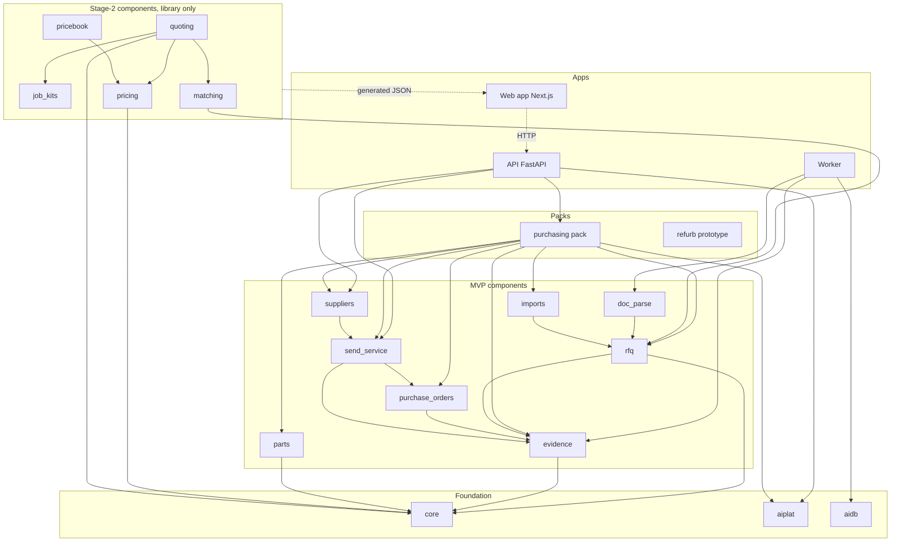
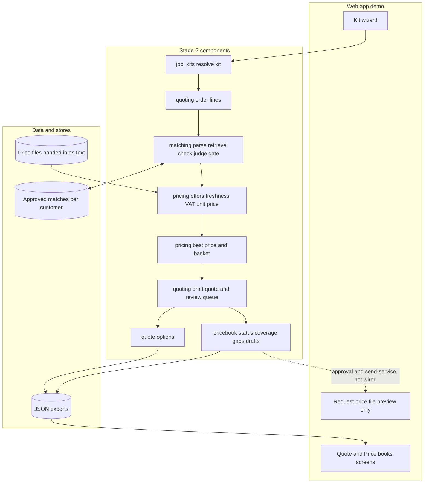

# Current modules and interactions

Status as of 2026-10-07. Python line counts measured from the repository. Everything in stage 2 runs offline on synthetic data.

## 1. Module map and imports

Every component also imports core (omitted from most edges above). `matching` imports only `rfq.quotes.inert` (inert text handling) from `rfq`. Components never import `aiplat`; callers build their configuration from the resolved profile. `employees/refurb` imports no component.

## 2. How a kit becomes a quote

Price files enter only as text handed in by the customer (hard rule R7); nothing is fetched. Approvals and private offers are per customer.

## 3. Module table

| Module | Layer | What it does | Python lines | Imports | Wired to API |
| --- | --- | --- | ---: | --- | --- |
| core | Foundation | Domain types, ports, fakes (frozen contracts) | 639 | none | yes (everything) |
| rfq | MVP | RFQ lifecycle, quote extraction, comparison, workflow state machine | 1,830 | core, evidence | yes, via purchasing pack |
| send_service | MVP | Only path to send mail; verifies hash-bound approvals | 1,780 | core, evidence, purchase_orders | yes |
| suppliers | MVP | Supplier profiles, verification, suppression | 387 | core, send_service | yes |
| purchase_orders | MVP | Purchase order drafts and CSV export | 822 | core, evidence | yes |
| evidence | MVP | Hash-chained audit events | 364 | core | yes |
| imports | MVP | Vendor CSV import | 459 | core, rfq | yes |
| doc_parse | MVP | Sandbox-style document parsing | 487 | rfq | worker |
| parts | MVP | Part families and equivalence tiers (bearings, belts) | 1,645 | core | yes |
| job_kits | Stage 2 | Kit templates, modules, questions, options, resolver, UI export | 1,670 | none | no: static JSON export to the web app |
| matching | Stage 2 | Order line to product: parser, ontology, retrieval, checks, judge, gate, approvals | 3,855 | core, rfq (inert text only) | no |
| pricing | Stage 2 | Offers, tenant-private repository, VAT and unit price, freshness, best price, basket optimiser, price-file adapters | 4,034 | core | no |
| quoting | Stage 2 | Kit to order lines, best-price search, draft quote, review queue, quote options, exports | 3,078 | core, job_kits, matching, pricing | no: static JSON export |
| pricebook | Stage 2 | Per-merchant status, ladder level, coverage, gaps, request-price-file drafts | 1,195 | core, pricing | no: static JSON export |

## 4. What this means

- The RFQ MVP path is wired end to end: web app, API, purchasing pack, and the RFQ, send, approval and audit components.
- Stage 2 is a tested library plus generated JSON. Persistence, API endpoints and event-log wiring for it are not built.
- The refurb prototype under `employees/refurb` predates the components and imports none of them.
