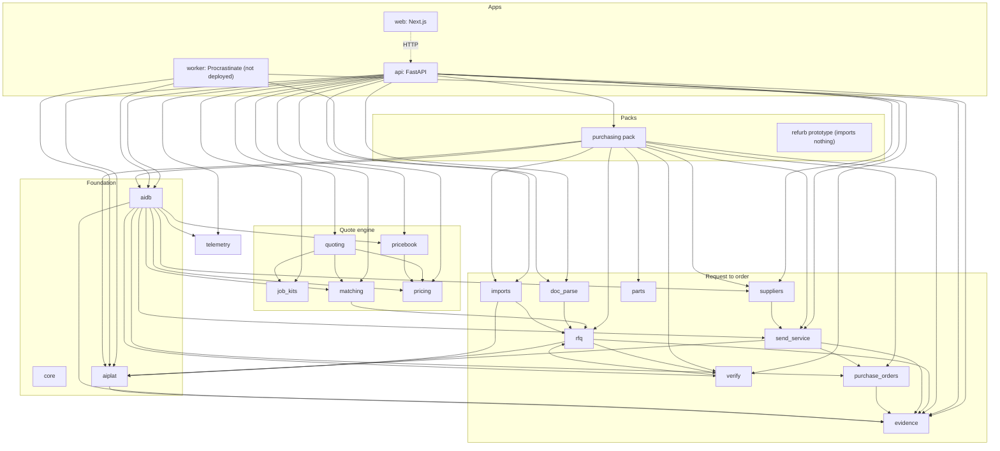
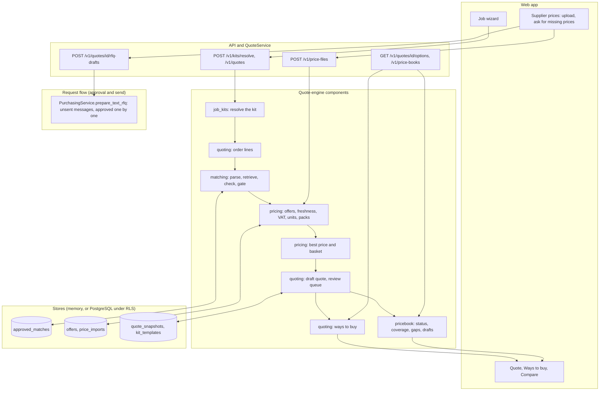

# Current modules and interactions

Status as of 2026-10-09, read from the code at commit `691aa58`. Python line counts are measured from the repository (non-test files only). The import graph is computed from the `import` statements, not drawn by hand. Everything runs on synthetic data. The longer description of the system is in [`docs/technical`](../technical/README.md), and one activity diagram per module is in [`activity-diagrams.md`](activity-diagrams.md).

## 1. Module map and imports

Every component also imports `core`, which is left out of the picture. Three edges are unusual: `rfq` and `verify` import each other (no module cycle); `aidb` imports `apps.api.middleware` once, lazily, for the idempotency store types; `aiplat` imports `evidence` so that a tool call can append an audit event. `matching` takes only `rfq.quotes.inert` (inert-text handling) from `rfq`. Components never import packs, and `employees/refurb` imports no component.

## 2. How a job becomes a quote

Price files enter only as files a person uploads (hard rule R7): nothing is fetched. Approvals and private offers are per customer. The messages for missing prices are text drafts that join the ordinary approve-and-send flow, so a person approves each one.

## 3. Module table

| Module | Layer | What it does | Python lines | Imports (besides core) | Used by |
| --- | --- | --- | ---: | --- | --- |
| core | Foundation | Domain types, ports, fakes (frozen contracts) | 639 | none | everything |
| rfq | Request to order | The request state machine, quote reading (extract, ground, normalise), comparison | 1,919 | aiplat, evidence, verify | purchasing, matching, doc_parse, imports, verify |
| parts | Request to order | Intake, required-attribute tables, equivalence tiers (bearings, V-belts) | 1,645 | none | purchasing |
| send_service | Request to order | The only path to the mail transport; verifies hash-bound approvals, footer, identity, limits | 1,920 | aiplat, evidence, purchase_orders | api, purchasing, suppliers, aidb |
| purchase_orders | Request to order | Approvals (per-message, substitution, standing), single-use tokens, spend caps | 901 | evidence | purchasing, send_service, aidb |
| suppliers | Request to order | Supplier CSV rules, profiles, verification, suppression, assumption rows | 387 | send_service | api, purchasing, aidb |
| evidence | Request to order | The hash-chained, HMAC-keyed audit log | 364 | none | almost everything |
| doc_parse | Request to order | Files and replies to inert text, sandbox check | 487 | rfq | api, worker |
| imports | Request to order | Part and PO-history CSV importers | 459 | aiplat, rfq | api, purchasing |
| verify | Request to order | Number checks, plausibility, second reading compared with the first | 861 | rfq | rfq, purchasing, api, aidb |
| job_kits | Quote engine | Kit templates, modules, questions, options, resolver, UI export | 1,670 | none | quoting, api |
| matching | Quote engine | Order line to product: parser, ontology, retrieval, checks, judge, gate, approvals | 3,855 | rfq (inert text only) | quoting, api, aidb |
| pricing | Quote engine | Offers, repository, VAT and unit price, freshness, best price, basket optimiser, price-file adapters | 4,228 | none | quoting, pricebook, api, aidb |
| quoting | Quote engine | Kit to order lines, best-price search, draft quote, review queue, quote options, exports | 3,128 | job_kits, matching, pricing | api |
| pricebook | Quote engine | Per-merchant status, ladder level, coverage, gaps, drafts of price requests and messages | 1,403 | pricing | api, aidb |
| telemetry | Cross-cutting | Content-free review events, seeded drills, pooled summaries | 490 | none | api, aidb |
| aiplat | Platform | Manifest, call context, `@tool`, the deployment profile | 832 | evidence | api, worker, purchasing, rfq, send_service, imports |
| aidb | Platform | SQLAlchemy models, migrations, RLS, tenant session, Postgres stores | 3,314 | many components, and apps.api once | api, worker |

Apps and packs: `apps/api` 3,177 lines (50 routes), `apps/worker` 362, `employees/purchasing` 3,238, `employees/refurb` 624, `apps/web` about 9,400 lines of TypeScript.

## 4. What this means

- The request-to-order flow is wired end to end: web app, API, purchasing pack, and the RFQ, send, approval and audit components, on in-memory or PostgreSQL stores. It stops at a purchase order draft: nothing sends a purchase order, no real mail transport exists, and approval links are not delivered.
- The quote engine is **served by the API** (`/v1/kits/resolve`, `/v1/quotes`, `/v1/quotes/{id}/options`, `/v1/price-books`, `/v1/price-files`, `/v1/kit-templates`, `/v1/quotes/{id}/rfq-drafts`), persists to PostgreSQL when `DATABASE_URL` is set, appends hash-chained events for quotes, match approvals and templates, and has web screens. Quote data exists only for the `uk` profile, and the API starts only with that profile.
- The worker has tasks for inbound parsing, follow-ups, audit-chain verification, retention and metering, but it is not deployed and two of its dependencies (an inbound source and a send-service factory) are not wired.
- The refurb prototype under `employees/refurb` predates the components, imports none of them, and keeps its own hash-chained audit log.
- The planner graph (`employees/purchasing/graph.py`) is run only by tests. The API calls `PurchasingService` directly.
