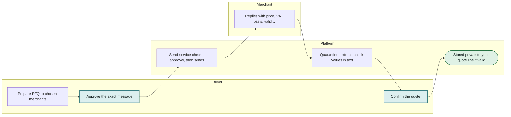
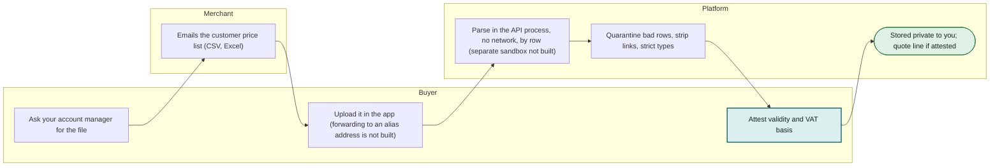
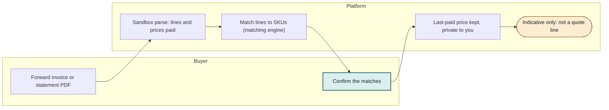
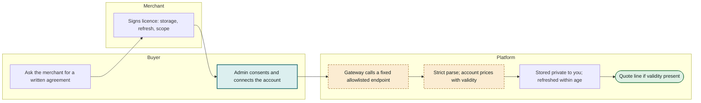
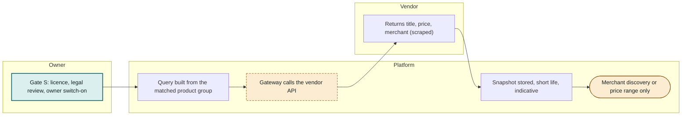
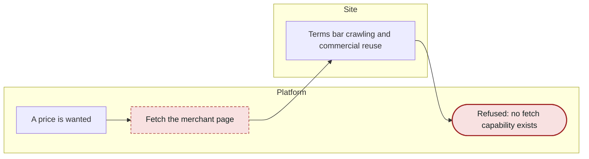
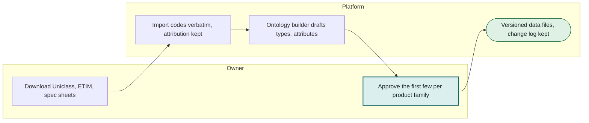

# Price data sources: final list and activity diagram per method

Status as of 2026-10-07. Research, not legal advice. Hard rule R7 (spec section 4): no fetching or scraping of third-party links or sites. ADR-013 (proposed, not accepted) describes the only amendment that would allow contracted sources. All merchants and prices in demo data are synthetic. Evidence: `reports/UK product sourcing and price data.md` and the seven notes in `research_notes/UK product sourcing and price data/`.

**As built (2026-10-09), added to this 2026-10-07 research note:** only two of the sources below are in the code. A **manual quote** goes through the existing request flow. A person's **price file** is uploaded in the app (`POST /v1/price-files`: `.csv` or `.xlsx`, up to 900,000 bytes, attested by the uploader) and parsed in the API process with no network access; a separate sandboxed parser (stack-map item S4) is not built, and forwarding a file to the alias address is not built. **Invoice and statement ingestion is not built**: nothing in the code parses invoices, and the price book reports that level as not produced. Every source marked as needing the R7 amendment is not built. See [`docs/technical/05-quote-engine.md`](../technical/05-quote-engine.md).

Diagram key: teal = a person must act; amber dashed = step needs the R7 amendment and is not built; green = quote line or reference data; amber solid = indicative only; red = refused.

## Final list

| Method | What it gives | Who supplies it | How it enters | Becomes | Status |
| --- | --- | --- | --- | --- | --- |
| [Manual quote](#manual) | A price a merchant has confirmed for this job, with VAT basis and validity | The merchant, by email reply or a logged phone call | Existing RFQ flow: you approve the exact message; the reply is quarantined and extracted | Quote line | Use now (inside R7) |
| [Merchant price file](#pricefile) | Your negotiated trade prices for many products at once | Your merchant's account manager, as CSV or Excel by email | You upload it in the app; parsed in the API process, no network (forwarding to the alias address and a separate sandbox are not built) | Quote line (if attested) | Built (upload); inside R7 |
| [Your invoices and statements](#invoices) | What you last paid, by product and merchant | You, forwarding supplier invoices or statements | Planned: per-merchant alias email, parsed in a sandbox (not built) | Indicative only | Not built (would be inside R7) |
| [Merchant trade-account integration](#tradeacct) | Your live account prices through the merchant's own channel | The merchant, after a written agreement: EDI, punch-out (cXML, OCI) or an account API | Allowlisted gateway with fixed endpoints; no URL input | Quote line (account-specific, with validity) | After R7 amendment (ADR-013, not decided) |
| [Retail feed: affiliate network or merchant feed](#retailfeed) | Public retail prices, usually VAT-inclusive, with barcodes and stock | Awin (Wickes, Travis Perkins, Homebase, Plumbworld), Impact (B&Q), Kelkoo; Screwfix says its programme is closed | Allowlisted gateway, only with written advertiser permission | Indicative only | After R7 amendment (ADR-013, not decided) |
| [Search or shopping API](#searchapi) | Google Shopping style prices across merchants, via a scraping vendor | SerpApi, Serper, DataForSEO and similar; Google's own APIs cannot read other sellers' prices | Allowlisted gateway, only after gate S and the owner switching it on | Indicative only, off by default | After R7 amendment (ADR-013, not decided) |
| [Scraping merchant websites](#scrape) | Nothing we may keep: it is out of scope under R7 | Nobody; no capability exists | Not possible | Never | Never (R7 and site terms) |
| [Reference data: structure, not prices](#reference) | Product types, attribute templates (size, grade, pack), synonyms and codes | Uniclass 2015 (CC BY-ND), ETIM via bSDD (ODC-By), manufacturer spec sheets, Data Yard (to approach) | A person imports it at build time; nothing is fetched while the product runs | Not prices | Use now (build time, not prices) |

## Activity diagram for each method

### Manual quote

**Status:** Use now (inside R7). **Becomes:** Quote line.

Any merchant, any product. Slowest, lowest risk, and the only route that needs no new capability.

- Counts as a quote line only if the merchant states validity in writing
- A reply with no VAT basis is flagged and goes to a person
- Stays private to your account

### Merchant price file

**Status:** Built for upload (inside R7); forwarding to an alias address is not built. **Becomes:** Quote line (if attested).

You hold a trade account. The fastest real source: City Plumbing already emails price lists to Tradify customers.

- Each row is validated strictly; bad rows are quarantined with a reason
- You attest the validity period and VAT basis before prices can feed a quote line
- Never pooled with other customers; ask a solicitor about merchant confidentiality terms

### Your invoices and statements

**Status:** Not built (it would be inside R7). **Becomes:** Indicative only.

No price file yet. Gives a realistic reference price and shows which products you buy most.

- Prices are history, not an offer: Travis Perkins' terms set the price at the delivery date
- Always indicative, never a quote line
- Matches to SKUs need your confirmation

### Merchant trade-account integration

**Status:** After R7 amendment (ADR-013, not decided). **Becomes:** Quote line (account-specific, with validity).

After the merchant signs. No UK merchant publishes a partner programme, so expect months. If the merchant just emails a file, use the price-file method instead.

- Needs the R7 amendment and a signed licence first (ADR-013, gate 2)
- The gateway never holds order-capable credentials
- Refresh only within the licence's stated age; per-source kill switch

### Retail feed: affiliate network or merchant feed

**Status:** After R7 amendment (ADR-013, not decided). **Becomes:** Indicative only.

Product discovery and sense-checks. These are consumer prices, not your trade prices.

```mermaid
flowchart LR
  subgraph L0["Owner"]
    direction LR
    retailfeed_a["Written permission for link-less internal use"]
  end
  subgraph L1["Platform"]
    direction LR
    retailfeed_c["Gateway fetches the feed (allowlisted)"]
    retailfeed_d["Strict parse; licence and age recorded"]
    retailfeed_e["Offer flagged indicative"]
    retailfeed_f(["Price range shown; never a quote line"])
  end
  subgraph L2["Source"]
    direction LR
    retailfeed_b["Publishes product feed (retail, VAT-inclusive)"]
  end
  retailfeed_a --> retailfeed_b
  retailfeed_b --> retailfeed_c
  retailfeed_c --> retailfeed_d
  retailfeed_d --> retailfeed_e
  retailfeed_e --> retailfeed_f
  class retailfeed_a gate
  class retailfeed_c amend
  class retailfeed_d amend
  class retailfeed_f ind
  classDef gate fill:#dcefef,stroke:#0b5f67,stroke-width:2px,color:#14201f
  classDef amend fill:#fbecd2,stroke:#8a4b00,stroke-dasharray:5 3,color:#14201f
  classDef ok fill:#dff1e5,stroke:#1b6b3a,color:#14201f
  classDef ind fill:#fbecd2,stroke:#8a4b00,color:#14201f
  classDef blocked fill:#f8e1e1,stroke:#a12626,stroke-dasharray:5 3,color:#14201f
  classDef stopn fill:#f8e1e1,stroke:#a12626,stroke-width:2px,color:#14201f
```

- Awin cl. 10.7 limits data to the purpose of the agreement; a link-less internal price needs the advertiser's written permission
- Needs the R7 amendment
- Always indicative: never feeds a quote line

### Search or shopping API

**Status:** After R7 amendment (ADR-013, not decided). **Becomes:** Indicative only, off by default.

Finding which merchants stock a product. Never a price someone could rely on.

- Vendors scrape Google contrary to its terms; Google v SerpApi is unresolved
- Snapshots live briefly and are marked indicative
- Gemini, Bing and Brave terms bar caching their results

### Scraping merchant websites

**Status:** Never (R7 and site terms). **Becomes:** Never.

Not an option, even for 'just a price check'.

- R7: no fetching or scraping of third-party sites; no link-fetch capability exists
- Screwfix cl. 4.2 bars crawling and commercial use; other merchants bar commercial reuse
- Database right, contract and Computer Misuse Act risk; allowed only with a merchant's written permission, which then makes it a feed

### Reference data: structure, not prices

**Status:** Use now (build time, not prices). **Becomes:** Not prices.

Always. It is the skeleton the matching engine checks against. Icecat is not usable here (its licence bars AI use).

- Codes stored verbatim with attribution; our own types in a separate namespace
- People approve the first few entries per product family
- DBT price indices may sanity-check relative changes, never absolute prices
