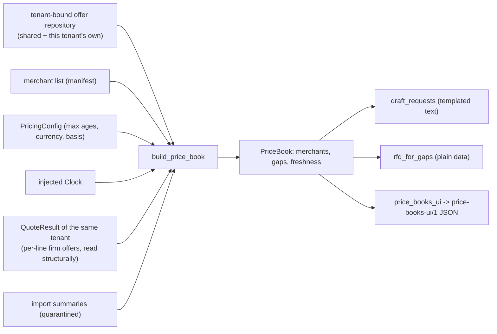

# Price book: which merchants a tenant can rely on, and what is missing

As of 2026-10-07. Status: built as a pure component with a demo export; **synthetic data only, no persistence, no API endpoint, no scheduler, no upload UI, no real price source**. Product-market fit is unproven; nothing here is a market claim and no number is evidence of accuracy. Code: `packages/components/pricebook/`; tests: `tests/pricebook/`; data: `profiles/data/pricebook/`; export script: `scripts/export_demo_data.py`; generated demo JSON: `apps/web/lib/quote-data/`. It implements steps 1.2 (price book), 1.4 (request your price file) and 1.6 (RFQ for gaps) of `docs/product/08-data-sourcing-and-integration-strategy.md` section 2.

Numbering. Rules are cited as in CLAUDE.md (rules 1-7), with the spec section 4 number in brackets where they differ.

## 1. What it does

For one tenant it answers, per merchant: which source the prices come from, how old they are, how long they are valid, what VAT basis they use, how many of the tenant's quoted lines they can price firmly, and when the next refresh is due. It lists the quoted lines nobody can price firmly, ranked by spend, and drafts the text of a "please send your price file" request. Nothing is fetched, sent or ordered; a draft is data for a person (rule 1 [R1]).

The package does not import the quoting package (a repository test lets nothing but quoting itself import it). It reads the caller's `QuoteResult` through structural types in `protocols.py`, comparing buckets and units by their string values; the export script and the tests are the callers that wire the two together.

## 2. Model (`models.py`)

`PriceBook(tenant_id, as_of, currency, comparison_basis, merchants, gaps, freshness, contains_synthetic_data, lines_total)`. One `MerchantBook` per merchant, in merchant id order:

| Field | Meaning |
| --- | --- |
| `merchant_id`, `name` | from the merchant list the caller hands in (the manifest). A merchant that has offers but is not in the list is still shown, named by its id |
| `status`, `status_reason_code`, `status_reason` | section 4; the reason is a fixed template over typed values (ages, dates, counts), never free text |
| `ladder_level` | 0-4, section 3 |
| `source_kinds` | every source kind among ALL offers the tenant can see, sorted |
| `visibility` | `tenant_private`, or `shared` when every offer the status rests on is shared. For a merchant with nothing, `tenant_private` (where a file the tenant supplies would go) |
| `attested` | every offer the status rests on is tenant-attested (false when there are none) |
| `offers_count` / `firm_offers_count` / `indicative_offers_count` | all visible offers / those that can be firm lines (`not Offer.is_indicative`, the pricing engine's own rule) / the rest |
| `quarantined_count` | rows quarantined by imports for this merchant, from the shared imports plus this tenant's own; 0 when no reports are handed in |
| `as_of` | the latest `observed_at` among the offers the status rests on |
| `valid_until_earliest`, `valid_until_latest` | the range of `valid_until` over those offers, **leaving out expired offers** when any are still valid, so "earliest" is the next price to lapse |
| `vat_basis`, `vat_counts` | `ex_tax`, `inc_tax`, `unknown` when all offers agree; `mixed` when more than one basis occurs (unknown counts as a basis). The counts are always given for all three |
| `offers_current` / `offers_stale` / `offers_expired` | the firm offers by state (section 4) |
| `dominant_source_kind`, `max_age_hours`, `next_refresh_due` | the source kind with most offers (ties: alphabetical), its configured maximum age, and `as_of` plus that age |
| `coverage` | section 5; absent when no quote was handed in |

"The offers the status rests on" (the primary offers) are the firm offers when there are any, else every visible offer. This keeps a fresh public list price from making a stale private trade file look newer.

## 3. The ladder (`ladder.py`)

Levels follow section 1 of the strategy document. The level describes the kind of relationship the offers come from, never their age: a level 2 file that went stale is still level 2 and its status says stale. The mapping reads only fields an offer already carries, so a price file cannot declare a higher level for itself.

| Level | Meaning | Mapping from the tenant's visible offers for the merchant | In the demo |
| --- | --- | --- | --- |
| 0 | Nothing: RFQ only | no offers; or only prices that cannot be firm: shared data, affiliate feeds, unattested files, files without validity, retail list prices | merchants with no file; public list prices (tenant B) |
| 1 | The customer's invoices and statements ("last paid", indicative) | **not produced**: no offer carries the information that identifies an invoice-derived price, and no invoice source exists | schema and docs only |
| 2 | A price file or quote the customer supplied and attested | at least one tenant-private offer that is not indicative with source kind `trade_feed` or `manual_quote` (attested, with validity, not a retail price) | tenant A's five trade lists; tenant B's Halden account file |
| 3 | A scheduled price file pushed by the merchant | **not produced**: no scheduled-file source exists | schema and docs only |
| 4 | A contracted feed, EDI, punch-out or account API | at least one tenant-private, non-indicative offer with source kind `merchant_api` (account-specific, attested, with validity). Needs ADR-013, which is only proposed | none |

The highest level any offer supports wins. A `manual_quote` (a reply to an RFQ that the tenant attested) is mapped to level 2; that is a judgement call to review with the product owner. Retail affiliate feeds and search snapshots can never reach level 2 or above because the pricing engine never lets them be firm. When levels 1 and 3 get sources, the offer model needs a way to say so (for example a source kind or a recorded method) and `ladder_level` gains a rule; the export already allows all five values.

## 4. Status rules (`status.py`)

Freshness uses the pricing engine's `assess_freshness` and the same configuration, so the book and the quote agree: **stale** is "observed longer ago than the maximum age for its source kind" (exactly at the limit is still fresh; trade files default to 168 hours, from the profile), **expired** is "past the offer's own `valid_until`", and an observation in the future (beyond the allowed skew) counts as stale. Per merchant, over its firm offers:

| Condition | Status |
| --- | --- |
| no offers visible at all | `missing` (reason `no_price_file`) |
| offers visible, none can be firm | `indicative_only` (`indicative_public_only`, `indicative_not_attested` or `indicative_no_validity`) |
| at least one firm offer is current | `current` (a count of stale or expired rows is added to the reason) |
| none current, at least one stale and not expired | `stale` |
| every firm offer is past its validity | `missing` (`all_expired`) |

So a firm file observed at T and valid for 30 days is current until T plus 7 days, stale until T plus 30 days, and missing after that (tested with an injected clock at those exact boundaries). Status `missing` for an expired file keeps its ladder level (the relationship exists; its data does not). The configured ages come from the profile's `pricing.max_offer_age_hours` and are placeholders, not a staleness model (pricing-engine.md section 5). `current` says the file is within its age and validity, not that the prices are right.

## 5. Coverage and gaps

**Coverage** (`MerchantBook.coverage`): of the lines the quote asked for (`len(quote.results)`: priced, review, unmatched, indicative and no-offer lines; skipped kit lines are not in a quote and are not counted), how many have a **firm** offer from this merchant, as `lines_priced`, `lines_total` and `pct` (one decimal, half-up). The numbers are read from each line's `firm_offers` in the quoting result (the offers the pricing engine ranked as eligible), so a stale, expired, out-of-stock, outlier or VAT-unknown offer does not count and an indicative price never counts. Nothing is re-priced. It is a count of lines, not spend, and a line that went to review or is unmatched has no merchant, so every merchant's coverage is capped by how many lines the matching step could resolve. A price book built without a quote has `coverage: null` and no gaps.

**Gaps** (`gaps.py`): a quoted line that ended in the review queue, unmatched, indicative only, or with no usable offer. Priced lines are not gaps; service lines (labour) are left out because no merchant sells them. Each gap carries `merchants_without_price` (every merchant of the book: by definition no merchant has a firm price) and `merchants_with_indicative` (merchants whose public list price the quote found). `estimated_spend` is quantity times the lowest indicative unit price in the line's own unit, rounded once half-up to the minor unit; `spend_basis` says which (`indicative_low_price` or `none`). Ranking: known spend first, largest first; then lines without a known spend by quantity, largest first; ties by line id. A quantity is not money, so the two groups are never mixed in one ordering. Most gaps in the demo have no known spend because review and unmatched lines have no price by design.

**RFQ for gaps** (`rfq_for_gaps(gaps, merchant_ids=None)`): returns the gap lines grouped per merchant (merchant id order, items in rank order) as plain `RfqGapGroup` / `RfqGapItem` data for the existing RFQ preparation flow. It builds no message, imports no transport and does not import `employees`; a person approves the exact RFQ text and the send-service sends it (R1).

## 6. Request-your-price-file drafts (`requests.py`)

Templated text only; no model writes any of it. The template is `profiles/data/pricebook/request_templates.yaml` (language `en-GB`, labelled an unreviewed first draft), parsed by the caller and handed in as a mapping. A `RequestTemplate` has a greeting, an intro and subject per status (`missing`, `stale`, `indicative_only`), an ask list, a closing and a sign-off.

* **Placeholders**: exactly `merchant_name`, `buyer_name`, `buyer_company` and `account_reference`. An unknown placeholder, a format spec, a conversion, an attribute or index access, or a stray brace is refused when the template loads. A missing account reference renders the visible marker `[account reference to be added]` for the person to fix before approving; it is never guessed.
* **Values** are accepted exactly as given (after trimming) or refused, never repaired: no URL, domain name, e-mail address, HTML or entity, brackets, braces, pipes, control characters or line breaks, at most 120 characters. The rendered subject and body are checked once more for links and markup.
* **What it asks for**: the price file as CSV or Excel; the validity period; whether prices include VAT; product code, MPN and GTIN; pack size and unit per price; delivery terms with charges and the free-delivery threshold; and whether the file may be loaded into a purchasing tool.
* **No URLs, no legal footer, no sending.** The footer is added, and the message is sent, only by the existing approval and send-service flow after a person approves the exact text (R1). A draft has `status: draft_not_sent`. Drafts are made only for merchants whose status is `missing`, `stale` or `indicative_only`.

## 6a. Quote-request (RFQ) messages: aggregated per supplier (`rfq_messages.py`)

Decision (owner, 2026-10-07): communications are aggregated, not per item. `draft_rfq_messages`
turns the per-supplier line groups (`rfq_for_gaps`) into templated drafts
(`profiles/data/pricebook/rfq_templates.yaml`, no model text):

* `RfqMode.PER_SUPPLIER` (default): ONE message per supplier listing all of that supplier's lines,
  with the asks (unit price and unit, VAT basis, validity date, stock and lead time, delivery terms).
* `RfqMode.PER_ITEM` (on request): one message per line, for a user who wants individual quotes.
* Both modes cover exactly the same lines, so switching never drops or adds a line.
* Line text is the buyer's own wording: a link, address, markup, braces or control characters
  in it is refused, never repaired. The rendered text is checked once more for links and markup.
* A draft is data (`status: draft_not_sent`). The approval and send-service flow approves the
  exact text and sends it (R1); there is no footer and no transport here. The same applies to the
  request-your-price-file drafts, which are already one message per merchant.
* Export: optional additive key `rfq_messages {default_mode, per_supplier[], per_item[]}` in
  `price-books-ui/1`; readers that do not know it ignore it. The web "Send RFQ for these gaps"
  dialog shows the exact subject and body and has a toggle "One quote per supplier (default)" /
  "Individual quotes, one per item".
* Not built: wiring to the real RFQ prepare/approve/send flow, and per-supplier aggregation for
  RFQs of lines that were priced (only gap lines are grouped today).

## 7. The export `price-books-ui/1` (`export.py`)

Schema: `profiles/data/pricebook/price-books-ui.schema.json` (JSON Schema 2020-12). Output is byte-identical for identical input (tested, including across processes and hash seeds): fixed key order, merchants in id order, gaps in rank order, drafts in merchant order, Decimals as strings, times as ISO 8601 strings, no float (a test parses it refusing floats).

Top level: `format`, `label` (synthetic/illustrative, fictional merchants, while the data is synthetic), `as_of`, `tenant_id`, `currency`, `comparison_basis`, `merchants[]`, `gaps[]`, `request_drafts[]` (`merchant_id`, `subject`, `body`, `status`), `freshness_summary` (counts per status, `merchants_total`, `oldest_as_of`, `next_refresh_due` = the earliest, `overdue`), `ladder` (the built levels and all five labels) and `schema_changes`. Merchant keys: `merchant_id`, `name`, `status`, `status_reason`, `status_reason_code`, `ladder_level`, `ladder_label`, `source_kinds`, `visibility`, `attested`, `offers`, `firm_offers`, `indicative_offers`, `quarantined`, `as_of`, `valid_until` (the earliest, see section 2), `valid_until_latest`, `vat_basis`, `vat_basis_counts`, `freshness`, `dominant_source_kind`, `max_age_hours`, `next_refresh_due`, `coverage` (`lines_priced`, `lines_total`, `pct`). Gap keys: `spend_rank`, `line_id`, `kit_line_id`, `text`, `quantity`, `unit`, `bucket`, `reason_code`, `estimated_spend`, `spend_basis`, `merchants_without_price`, `merchants_with_indicative`. The key names in common with the web client's reader (`offers`, `quarantined`, `coverage.lines_priced`, `merchants_without_price`, `spend_rank`) were taken from its fixture.

**Evolution (additive only, like `quote-draft-ui/1`)**: a later version only adds optional keys and documented enum values and changes `format` (`price-books-ui/2`); it never renames, removes or re-types a key or changes a value's meaning. A reader ignores unknown keys, shows an unknown enum value as text, treats a missing optional key as absent and never computes money from the export. The frozen v1 example `tests/pricebook/fixtures/price_books_ui_v1_frozen.json` must keep validating against the current schema, and a test fails if any v1 key path disappears or changes type. The test that today's output equals the frozen document exactly is the one to relax when a v2 adds keys.

## 8. The demo data export (`scripts/export_demo_data.py`)

For `demo-tenant-a` and `demo-tenant-b` and the scopes `full`, `wc_only`, `cloakroom` and `wet_room` (default kit answers, default finish level) it writes `apps/web/lib/quote-data/<tenant>/<scope>.json` = `{meta, price_book, quote_first, quote_after_review, reviewer_decisions}` and `index.json` (every combination, with headline counts for the first quote and the quote after review: priced, review, unmatched, indicative, no offer, skipped, firm total ex and inc VAT, plus the price book's status counts and gap count). The price book is built from the quote **after review**, the state a person would be looking at, and `meta.price_book_basis` says so. The reviewer decisions are the synthetic ones of the quoting demo (applied wherever their kit line is in the queue) plus two invented extras for lines only some scopes have (`sw_basin_pedestal` in the cloakroom, `sw_basin_wall_hung` in the wet room; `profiles/data/pricebook/reviewer_decisions_extra.json`); each applied decision is listed with its source and the label "synthetic, invented for the demo". When none applies, `reviewer_decisions` is empty and `quote_after_review` equals `quote_first` (tested). Fictional buyers and account references are invented for the drafts. A fixed clock (2026-10-07 09:00 UTC), no network and no model: byte-identical on every run; `--check` compares the files on disk with a fresh run and a test does the same, so regenerate after changing data or code.

### 8.1 Quote options in the demo data

Each `<tenant>/<scope>.json` also carries `quote_options` (`quote-options-ui/1`, built by the quoting component's public `quote_options` from the quote **after review**) and `options_inputs`, the demo buyer inputs behind it. The existing keys are unchanged; `meta.formats` still names the two original formats.

* **Inputs (all invented, labelled `SYNTHETIC`)**: a preferred-supplier list (the tenant's first two private price files in manifest order, the rule of `scripts/demo_quote.py`; tenant B has one) in every scope. For **one scope per tenant** (`REFERENCE_SCOPE`, the cloakroom for both) also a budget (A 490, B 240, ex VAT), a required-by date (2026-10-10) and a delivery cap (A 3, B 1), so the balanced option can be computed. The other scopes give no buyer reference, so the export says `balanced.status: not_computed` with the reason and every option's score is `null`. `options_inputs` records `preferred_merchants`, `budget_total`, `budget_vat_basis`, `required_by`, `max_deliveries` and `has_references`.
* **What the data shows**: tenant A has two to four distinct options per scope (the full bathroom: lowest total, fewest deliveries, fastest, preferred; the cloakroom adds balanced because of the references), tenant B has one merchant with private prices so every option is "same as Lowest total cost". The optimiser is exact only for the small wc_only quote; elsewhere the cheapest total is not proven and every option says so (quote-options.md section 9). Lines in no option (review, unmatched, indicative, no offer) are listed in `excluded_lines`; indicative prices sit in `indicative_block`, never in an option.
* **`index.json`**: each combination gains `options` (options shown and their ids, duplicates, lowest and highest total, whether balanced is shown and its status, `exact`, `search_incomplete`, excluded and indicative line counts, `has_buyer_references`).
* The options compare prices the customer holds, from synthetic files; they are not a market-wide best price and nothing is chosen, sent or ordered. Regenerate with `python scripts/export_demo_data.py` (about 17 s); `--check` and `tests/pricebook/test_demo_export.py` compare the files on disk with a fresh run.

## 9. Hard-rule mapping

| Rule | How it is met |
| --- | --- |
| 7 [R7] no fetching or scraping | The package imports no network, file, process or YAML module (`json` only to write the export text), opens no file, accepts no URL, path or client, and reads time only from the injected clock (static tests). Price data arrives as offers already in a store; templates arrive as a mapping; the script is the caller that reads files. Drafts contain no URL. ADR-013 stays proposed; this component does not need it |
| 7 [R10] tenant isolation | Offers are read only through `for_tenant(tenant_id)`, which holds shared offers and that tenant's own and nothing else; the book re-checks that no private offer of another tenant is present; a quote of another tenant is refused; import summaries of another tenant are ignored. Tests: tenant B never sees tenant A's private books, offers, source ids, buyer or account references in a book or an export, and the other way round |
| 1 [R1] nothing sent | Drafts and RFQ groups are plain data; the package imports no transport, send-service, approval, workflow or model module (static scan). A person approves the exact text and the send-service adds the footer and sends |
| 3 [R3] provenance | Every status, level and count comes from offers that carry source kind, attestation, validity and observation time; reasons are fixed templates over typed values; nothing is inferred by a model |
| 5 [R9] money | `Decimal` only; spend is rounded once, half-up, to the profile's minor unit; no float in the package (static scan) or the export (parse test) |
| 2 [R2] no substitution | Not touched: coverage and gaps read the quoting result; the gap list suggests no product |
| 6 events | Not applicable yet: nothing here changes request state. Recording a request as an approved message and a send event belongs to the existing workflow |

## 10. What is NOT built

* **Persistence**: the book is computed on demand from the in-memory offer store; no price book table, no history of statuses, no audit of who attested a file.
* **API and worker**: no endpoint, no job. A caller (the script, a test) builds the inputs.
* **Refresh scheduler and reminders**: `next_refresh_due` is data; nothing watches it or nudges the tenant.
* **Real upload UI**: files reach the store only through `components.quoting.loading` from text a caller reads. The attestation step (step 1.3) and the import report screen do not exist; `ImportSummary` is the seam for quarantine counts.
* **Invoice and scheduled-file sources** (levels 1 and 3): no source, no offer shape, no ladder rule. Level 4 needs ADR-013 and an R7 amendment.
* **Sending**: the approval and send-service flow for the request drafts and for the RFQ is not wired to this component; the footer is not here.
* Per-merchant spend coverage, product-level (rather than line-level) coverage, price history, month-on-month checks, FX, localisation of reason texts and of the request template.

## 11. Honest limits

* **The data is synthetic.** Fictional merchants, invented prices and invented reviewer decisions. Tenant A's books are all `current` and tenant B's are a mix only because of how the seed files were declared; no status says anything about real merchants.
* **Coverage is low by construction.** It counts quoted lines with a firm offer from one merchant. The matching gate is strict (quoting.md section 11), so most kit lines never reach pricing; the highest coverage in the demo is Northgate for tenant A on the full bathroom (22 of 77 lines, 28.6%) and Halden for tenant B (16 of 77).
* **Most gaps have no spend estimate**, because review and unmatched lines have no price by design; they are ranked by quantity, which mixes units (an `each` count and a length in metres are compared as bare numbers within that group). Ranking by spend needs a price per line, which needs a match.
* **`mixed` VAT basis is common**: the seed files carry ex-VAT, inc-VAT and bare prices, so most merchants show `mixed` with the counts beside it. Bare prices are excluded from firm lines by the pricing engine.
* **Level 2 for a `manual_quote`** and the choice to show the earliest non-expired `valid_until` are judgement calls.
* Template wording is an unreviewed first draft, not tested with real merchants, not legal advice.
