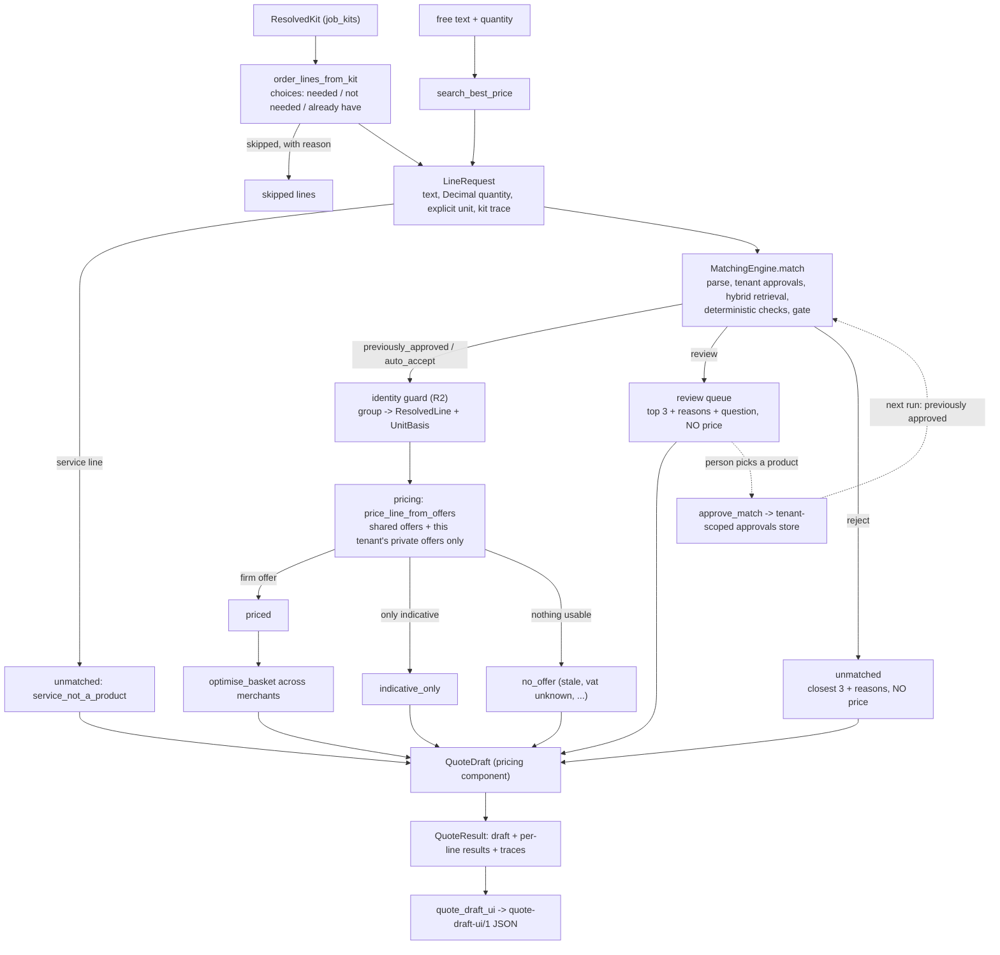

# Quote for products (stage 2): kits, matching, pricing, draft quote

As of 2026-10-07; status and counts updated 2026-10-09. Status: the pipeline is **served by the API** (`/v1/kits/resolve`, `/v1/quotes`, `/v1/quotes/{id}`, `/v1/quotes/{id}/options`, `/v1/price-books`, `/v1/quotes/{id}/decisions`; in memory, or PostgreSQL when `DATABASE_URL` is set), has web screens and appends hash-chained events, but runs on **synthetic data only with no real price source**, and no worker step exists. Sections 8 and 11 were recounted on 2026-10-09 from the files and `scripts/demo_quote.py` (the 2026-10-07 commit `ed81e95` raised the full-bathroom lines that resolve to a catalogue product from 2 to 50 of 77 on this data; 48 of those have a usable offer); the rest is as written on 2026-10-07. See also [`docs/technical/05-quote-engine.md`](../technical/05-quote-engine.md). Product-market fit is unproven; nothing here is a market claim and no number in this document is evidence of accuracy. Code: `packages/components/quoting/`; tests: `tests/quoting/`; data: `profiles/data/quoting/`; demo: `scripts/demo_quote.py`.

Numbering. Rules are cited as in CLAUDE.md (rules 1-7), with the spec section 4 number in brackets where they differ.

## 1. What it does

A person picks a job scope (for example a full bathroom). The job kit resolves it into generic spec lines. This component turns each kit line into an order line, matches it to the catalogue, prices the matched products from the offers the tenant may see, optimises the basket across merchants, and returns a draft quote plus everything a person must still decide. It also offers a fuzzy best-price search for one line of free text. Nothing is sent or ordered; a draft is data for a person (rule 1 [R1]).



Every request ends in exactly one bucket: `priced`, `review`, `unmatched`, `indicative_only`, `no_offer`, or (kit lines only) `skipped`. The partition is exact and tested for both default kits, for both demo tenants, before and after review.

## 2. Function contracts

All functions are pure Python, offline and deterministic. Time comes from an injected `Clock`; one reading is used for a whole quote. `QuotingContext(engine, offers, pricing, clock, config)` carries the dependencies; the caller builds `PricingConfig` and `GatePolicy` from the resolved profile (components never import `aiplat`) and `QuotingConfig` from a mapping.

| Function | Input | Output |
| --- | --- | --- |
| `order_lines_from_kit(kit, choices=None)` | a `ResolvedKit`; `choices` maps a kit line id to `needed`, `not_needed` or `already_have` | `KitOrderLines(requests, skipped)`: one `LineRequest` per needed line (kit line id = line id), `skipped` carries the reason (`not_needed`, `already_have`, `zero_quantity`). An id that is not in the kit, an unknown choice, an unsupported unit or a fractional count raises `QuotingError` |
| `search_best_price(ctx, tenant_id, text, quantity, *, unit=EACH, line_id, description)` | free text, a `Decimal` quantity, a pricing `Unit` | one `LineResult` (below) |
| `build_quote(ctx, tenant_id, lines, *, skipped=(), quote_id=None)` | `LineRequest`s, plain `OrderLine`s (they need a quantity) or the `KitOrderLines` above | `QuoteResult(tenant_id, draft, results, skipped, traces)` |
| `approve_match(ctx, tenant_id, line, sku_id, approver)` | a line, one SKU id or a group, a named approver | the matching component's `ApprovalRecord` |
| `quote_draft_ui(result)` / `dumps(doc)` | a `QuoteResult` | the `quote-draft-ui/1` dictionary / its stable JSON text |
| `load_price_files(store, specs, cfg)` / `specs_from_manifest(manifest, texts)` | price file TEXT plus a declaration of what each file is | `LoadReport` per file (offers stored, rows quarantined with reason codes) |

### 2.1 `order_lines_from_kit`

The line text is the chosen option's spec (the resolver already puts the option's spec on the line; the generic spec is kept in `KitRef.generic_spec`), made inert (control and bidi characters removed, links replaced) and capped at 300 characters. The kit line id, module, option, forced-by rule, `default_template` assumption source and sources travel with the request as `KitRef`, so every quote line traces back to its kit line and its sources (rule 3 [R3]). Services (kit `kind: service`, such as removal labour) are kept as requests flagged `is_service`; they are never matched and land in `unmatched` with `service_not_a_product`.

Quantity and unit conversion is a fixed table, not a guess (`units.py`):

| Kit unit | Pricing unit | Note |
| --- | --- | --- |
| `nr`, `pack`, `kit`, `roll`, `cartridge`, `item`, `pair` | `each` | a count; a fractional count is refused, never rounded |
| `m`, `m2`, `kg`, `l` | `m`, `m2`, `kg`, `litre` | the `Decimal` value is kept as it is |

What one catalogue SKU contains is the pricing engine's `UnitBasis`, built from the SKU's own attributes with exact `Decimal` arithmetic (`unit_basis_for_item`): a tile or board gives its area from length x width, a pipe its length in metres, an adhesive or grout its weight, a paint or sealant its volume, a boxed fixing its piece count. A unit the attributes cannot give is absent, and pricing then reports `unit_not_convertible` for that offer. Example from the tests: 11.22 m2 of 600 x 300 tiles (0.18 m2 each) is 63 tiles; a merchant box of 8 (1.44 m2) gives 8 boxes, 11.52 m2 bought, 0.30 m2 surplus, goods and unit price from exact rationals rounded once (pricing-engine.md section 4.1).

### 2.2 `search_best_price` and the line result

Free text goes through parse, tenant-scoped approvals lookup, hybrid retrieval, deterministic checks and the gate (matching-engine.md section 1). Then:

* **auto_accept or previously_approved**: the match group (for a generic line, every passing candidate within the group band; for a named line, the named product) becomes a `ResolvedLine`, and every offer of the group's SKUs that the tenant may see is priced by the pricing engine. The `LineResult` has `best`, `firm_offers` (every eligible offer, best first), `runner_ups`, `excluded` offers with codes, the `indicative` range kept apart from the firm offers, `flags` (of the chosen offer: `below_moq`, `low_stock`, `unit_converted`, ...), `excluded_codes` (why other offers were kept out: `stale`, `outlier`, `vat_unknown`, `out_of_stock`, `expired`, `unit_not_convertible`) and `reasons` as `{code, text}` pairs from fixed templates.
* **review**: bucket `review`, the review payload (top 3 candidates, each with templated check reasons, the templated question, the reason codes) and no price.
* **reject**: bucket `unmatched`, the same payload (the closest three, for context) and no price.

A review or reject result has `priced is None`; a test asserts this even when offers exist for the candidate SKUs.

### 2.3 `build_quote`

Runs every request through the same pipeline with one clock reading, passes the priced lines to the pricing engine's `optimise_basket` (exact below 12 free lines per independent group, otherwise greedy with local search, and the draft says which), and builds the pricing component's `QuoteDraft` (`build_quote_draft`) with review lines as its `ambiguous` list and unmatched lines as its `unmatched` list. `QuoteResult` adds the per-line results and one `LineTrace` per line: kit line id, parsed line (stable key/value pairs), match outcome, `previously_approved`, match group, the chosen SKU, offer and merchant (after basket optimisation, so the offer that is in the total), the price breakdown (packs, pack content, surplus, pack and unit price, goods, delivery if ordered alone) and the offer's provenance. The default quote id is a hash of tenant, time and lines, so the same input gives the same id.

### 2.4 `approve_match`

Stores the person's choice through `MatchingEngine.learn`, which writes the matching component's tenant-scoped `ApprovedMatchStore` (timestamp from the injected clock). On the next run of the same normalised line for the same tenant the matching engine returns `previously_approved` immediately and the trace says "previously approved". Properties, all tested: another tenant's store is never read or written; the approval keys on the normalised line, not on the id, the spelling or the quantity; the matching engine still re-runs its deterministic checks on the approved SKUs, so an approval cannot override a failed check (the line goes back to review, and the demo shows this with `dc_emulsion`); a group of SKUs can be approved. For a line that names a brand, MPN or GTIN, approving a product without that identity is refused: that is a substitution and needs a recorded `SubstitutionApproval`, not a match approval (rule 2 [R2]).

## 3. Firm and indicative prices

The pricing engine decides which offers can feed a quote line (pricing-engine.md section 3, ADR-013 draft): a trade price file or manual quote with validity, the tenant's attestation and a non-retail price type is firm; affiliate feeds, search snapshots and anything without validity or attestation are indicative. Quoting does not weigh sources itself. In the synthetic data this gives the following, which the tests rely on:

* five trade price lists (five fictional merchants) are loaded **private to tenant A and attested**: firm;
* two public list-price files (two of the same merchants, retail uplift, about 60% of their lines) are loaded **shared**: indicative for every tenant, never selected, shown as a range labelled "indicative, not a quote";
* one account price list (Halden, a discount) is loaded **private to tenant B**: firm for tenant B only.

So tenant A sees firm prices from five merchants; tenant B sees firm prices from one and indicative ranges for lines only the public lists cover. A price file cannot declare itself firm: visibility, attestation, licence and validity come from the declaration the loader passes, not from the file's content.

## 4. The export `quote-draft-ui/1`

`quote_draft_ui(result)` returns a dictionary and `dumps` returns text; the schema is `profiles/data/quoting/quote-draft-ui.schema.json` (JSON Schema 2020-12). Output is byte-identical for identical input (tested, including two separately built contexts): fixed key order, lists in request order (deliveries and runner-ups in their engine order), Decimals as strings, times as ISO 8601 strings, no float anywhere (a test parses the output refusing floats).

Top level: `format`, `quote_id`, `tenant_id`, `generated_at`, `currency`, `notice` (code `not_a_supplier_quote`, the text, the label "not a supplier quote"), `data_labels.contains_synthetic_data`, `partition` (lines per bucket, adding up to every line asked for), `totals`, `firm_lines`, `deliveries`, `review_queue`, `indicative_lines`, `unmatched_lines`, `no_offer_lines`, `skipped_lines`, `freshness`, `optimisation`, `schema_changes`.

* `totals` are the firm lines only (`scope: "firm_lines_only"`): `basis` is the configured comparison basis (`ex_tax` or `inc_tax`), `goods`, `delivery`, `subtotal` on that basis, `tax_rate`, `tax`, `total_ex_tax`, `total_inc_tax` (VAT shown once, net + VAT = gross by construction), `delivery_incomplete`.
* `firm_lines[]`: position, line id, kit line id, text, quantity, unit, `kit` (the kit trace with sources), `sku_id`, `product`, `merchant_id`, `offer_id`, packs, pack content, surplus, unit price, goods total, lead time, `flags`, `excluded_codes`, `assumptions` and `reasons` (`{code, text}`), `match` (outcome, `previously_approved`, kind, group, parsed line), `price` breakdown, `runner_ups`, `excluded_offers`, the `indicative` range (kept apart), `alternatives` and `provenance` (offer id, source id and kind, method, `synthetic`, licence, inert `source_ref`, observed and valid times, confidence, visibility, match tier and basis).
* `review_queue[]`: the line, `outcome`, `reason_codes`, `reasons`, `question`, up to three `candidates` (SKU, title, brand, score, check reasons), `alternatives`, and `price: null`.
* `indicative_lines[]`: the line, the label "indicative, not a quote", the `range` (low, high, unit, currency, basis, count, oldest and newest observation, the offers) and `price: null`.
* `unmatched_lines[]`: the line, reasons (`service_not_a_product`, `no_catalogue_match`, matching reason codes), `closest` candidates and `price: null`. `no_offer_lines[]`: matched, but no offer can be selected, with the exclusion codes. `skipped_lines[]`: kit lines the tenant does not need, with why.
* `alternatives[]` everywhere: `{sku_id, title, brand, label: "suggested alternative, needs approval", price: null}`.

### Evolution rules (additive only, like `job-kit-ui/2`)

1. A later version only **adds** optional keys, optional list items and new documented enum values. It never renames, removes or re-types a key, and never changes the meaning of a value. The `format` string changes (`quote-draft-ui/2`) when anything is added; one schema file accepts every published version (as `export.schema.json` does for the kit export), and that schema's `additionalProperties: false` is how a *writer* is kept to the documented keys.
2. A **reader** (the web UI) is tolerant: it ignores keys it does not know, shows an enum value it does not know as plain text instead of failing, treats a missing optional key as absent, and never computes money from the export (every amount is a string for display; totals come from the engine).
3. Every published version keeps a frozen example (`tests/quoting/fixtures/quote_draft_ui_v1_frozen.json`) that must keep validating against the current schema; a test also checks that no v1 key disappears or changes type.
4. Decimals stay strings with a dot and no exponent; times stay ISO 8601 with an offset; lists keep request order.

## 5. Hard-rule mapping

| Rule | How it is met here |
| --- | --- |
| 2 [R2] no auto-substitution | A line that names a brand, MPN or GTIN is matched to that product only (the matching gate's identity guard), and the quoting step **re-verifies** every product it is about to price against the parsed line (`identity.py`); a failure prices nothing and sends the line to review with `identity_guard`. Alternatives to a named line are produced by re-matching the line with the brand, MPN and GTIN removed; they are returned as "suggested alternative, needs approval" with `price: null`, never enter `resolved` and never enter a total. A match approval cannot approve a product without the named identity. Group members are marked tier A (see 7.1) |
| 3 [R3] no claim without provenance | Every quote line carries its offer provenance (source, method, synthetic flag, licence, observation and validity times, confidence), its match basis and its kit sources and assumption source (`default_template`). All explanations are fixed templates over codes and typed values (matching, pricing and `reasons.py` here); vendor and catalogue text is made inert before it is shown (`clean_text`); the judge's note is never used as a reason |
| 5 [R9] money | `Decimal` everywhere, explicit unit and currency, no float in the package (static scan) or in the export (parse test); rounding is the pricing engine's single documented rounding; the kit quantity keeps its `Decimal` value and counts must be whole |
| 7 [R7] no fetching or scraping | Price data enters only as text handed in by the caller: `loading.py` takes the text of a file and parses it with the pricing engine's `CsvPriceFileSource`; the package opens no file, imports no network, file or process module, accepts no URL, path or client, and a static test scans for all of that. The demo script is the caller that reads the files. Links in text are replaced by `[link removed]`; source references are inert text like `prices.csv#row=3`. ADR-013 (proposed) would be needed before any network source |
| 4 [R6] untrusted content | Order-line text and catalogue titles are only matched (the matching component fences and sanitises them for any model); a test sends text that tries to instruct the system and gets an unmatched line with no price |
| 7 [R10] tenant isolation | Offers are read only through `store.for_tenant(tenant_id)`, a repository that holds shared offers and that tenant's own and nothing else; approvals are the matching store's per-tenant records. Tests: two tenants get different quotes from different private offers; neither tenant's quote, export or review payload contains the other's offer ids, source ids or file names; an approval by one tenant leaves the other's line in review |
| 1 [R1] | Not applicable: the package imports no transport, approval, workflow or send-service module (static scan) and produces data only |
| 6 events | The component records nothing; the caller does. `QuoteService` (`apps/api/quote_service.py`) appends `quote_created`, `match_approved`, `kit_template_saved` and `kit_template_deleted` to the hash-chained event log (the Postgres event store when `DATABASE_URL` is set). The approval record itself is the matching store's per-tenant record (Postgres `approved_matches` when configured; see matching-engine.md section 3) |

## 6. How the quote screens use it

Built in part. The sequence below was the plan of 2026-10-07; steps 2 and 3 now exist as `POST /v1/quotes` and `POST /v1/quotes/{id}/decisions` with web screens, and step 4 is built for unpriced (gap) lines only, as unsent text drafts per supplier through `POST /v1/quotes/{id}/rfq-drafts` ([quote-to-rfq.md](quote-to-rfq.md)); priced (firm) lines are not grouped into messages.

1. The wizard resolves the scope with the user's answers (`library.resolve`) and keeps the user's "not needed" / "already have" taps.
2. The API calls `order_lines_from_kit(kit, choices)` then `build_quote(ctx, tenant_id, lines)` and returns `quote_draft_ui(result)`; the screen is built against the schema, with the review queue as a to-do list (top three candidates, the question, an "approve this one" button).
3. "Approve this one" calls `approve_match`; the screen re-runs `build_quote` (or just that line through `search_best_price`) and the line moves to the firm list, labelled "previously approved" on later quotes.
4. "Create RFQ draft" takes the firm lines (SKU, quantity, unit, chosen merchant, offer id) and, separately, the review and unmatched lines as items for a person; it creates the RFQ through the existing workflow and approval path. Quoting sends nothing and writes no state: persisting the quote and its events, and sending anything, remain with the send-service and workflow (rules 1 and 6).

## 7. Decisions and judgement calls

1. **Tier of a match-group member.** The pricing engine needs every priced SKU to be tier A or to carry a substitution approval. A member of an accepted match group passed every deterministic check for the specification or identity the line states, so for a spec line it is not a substitution; the quoting step marks members tier A and keeps the match basis (`rule_match` or `same_mpn`) for provenance. The alternative (tier B or C plus approvals) would price nothing without a person for every generic line. This is a judgement call to review with the product owner; it never applies to a product outside the group.
2. **Line text.** The kit's spec text is used as written. A cleaning step (dropping parentheses and "to suit..." clauses) was tried and gave no extra auto-accepts, so it was not kept: it only hides requirements.
3. **Reject versus review.** A reject outcome is bucketed as unmatched (nothing plausible) and a review outcome as the review queue; both carry the top-three payload.
4. **Flags.** `flags` describe the chosen offer; `excluded_codes` describe why other offers of the group were kept out, so a stale or VAT-unknown offer never looks like a property of the chosen one.
5. **Alternatives are not priced.** The task allows showing them without a price in the firm total; showing no price at all is the more conservative reading. Showing an informational price later needs a product decision.

## 8. Synthetic data (`profiles/data/quoting/`)

Everything is labelled SYNTHETIC/ILLUSTRATIVE: fictional merchants (Brindlecote, Northgate, Halden, Pennywell, Corvane) and invented prices; not real prices, not licensed data. `generate_prices.py` derives every value by hashing (sha256) from the catalogue seed; `python profiles/data/quoting/generate_prices.py --check` fails if a file is out of date, and a test compares the files on disk with a fresh generation.

* `prices/*_trade.csv` (5): one per merchant (900 rows in all, per `manifest.json`: 176, 190, 194, 142 and 198), each carrying between 40% and 56% of the 352-item catalogue seed depending on its trade; 324 of the 352 SKUs (92%) are listed by at least one trade list and 28 by none (so "no offer" is exercised). Ex-VAT, inc-VAT, both or a bare price with no VAT basis (61 rows, excluded by the engine); prices per pack, per multi-pack, per m, m2, kg or litre, and per 100 or 1000 pieces; delivery fee with a free-over threshold per merchant (some rows with none); stale rows (50, observed 19 days before the demo clock), expired rows (17), out-of-stock (39) and low-stock (73) rows, minimum order quantities (88) and order multiples (33), and a few deliberate 4x price outliers. These counts were taken from the CSV files on 2026-10-09 (stale = observed at the stale marker date, expired = valid until the expiry marker; the generator `generate_prices.py` is the authority).
* `prices/*_public_retail.csv` (2): shared list prices, indicative only.
* `prices/halden_account_tenant_b.csv`: tenant B's private account prices.
* `manifest.json`: what each file is (merchant, visibility, tenant, source kind, price type, attestation, licence, validity); `demo_reviewer_decisions.json`: invented reviewer decisions used only by the demo, with the lines left for a person on purpose.
* Every CSV row ends with an unmapped `synthetic_label` column so an opened file says what it is.

Coverage against the kits (recounted 2026-10-09 with `scripts/demo_quote.py` and the generated demo data): of the 77 lines of the default full bathroom for tenant A, the first quote prices 48, leaves 7 in review, finds no usable offer for 2, and cannot match 20 (a catalogue product does not exist for them, or they are services such as labour and waste disposal). The demo reviewer's decisions move 2 more lines to priced (50 priced, 5 still in review). For the wc-only kit (24 lines) the first quote prices 11, leaves 4 in review, finds no offer for 1 and cannot match 8; after the demo decisions 12 are priced and 3 stay in review. Tenant B, who has one private list, prices 18 of 77 lines in the first full-bathroom quote and 20 after review.

## 9. Running it

```
python scripts/demo_quote.py                              # tenant A, full bathroom, first quote then after review
python scripts/demo_quote.py --tenant demo-tenant-b --scope wc_only --finish-level budget
python scripts/demo_quote.py --no-review --export /tmp/quote.json
pytest tests/quoting
```

The demo prints the same bytes on every run (fixed clock, no network, no LLM).

## 10. What is NOT built

* A worker step. (The API endpoints, persistence and web screens that this list named on 2026-10-07 now exist: the quote pipeline is served under `/v1`, offers and approvals are stored in PostgreSQL when `DATABASE_URL` is set and in memory otherwise, and `apps/web` has the Job, Supplier prices and Quote screens built against `quote-draft-ui/1`.)
* Recording a choice of quote option: events for quotes, match approvals and templates are appended (rule 6), but quote options are computed on request and not stored, and no event records a choice of option.
* Real price sources: no provider adapter, no HTTP client, no scraping (R7). A person-supplied upload is wired through `price_file_service.load_price_file` behind `POST /v1/price-files` (`load_price_files` serves the demo seed only). ADR-013 is proposed, not accepted.
* Price history, month-on-month checks, FX (other currencies are excluded, not converted), price breaks, stock quantities, a MILP basket solver (see pricing-engine.md section 8).
* An editable review decision beyond one product or a group per line, quantity overrides per line, a "mixed pack" optimiser (buying a dearer pack to cross a delivery threshold), and any judge-model A/B (the engine runs without a model by default; a scripted fake is used in one test).
* Localisation of reason texts (codes are stable; the English text is the default).

## 11. Honest limits

* **The data is synthetic.** Prices, merchants, coverage, pack styles and delivery terms are invented to exercise the gates. No result says anything about real prices, savings or merchants, and the "saves X vs line-by-line" figures are artefacts of invented data.
* **The matching gate is strict and the kit text is prose.** When this note was written only 2 of 77 default full-bathroom lines were auto-accepted; after the 2026-10-07 change to the kit text and the matching vocabulary, 48 are priced on the first quote, 7 wait for a choice and 20 are unmatched (section 8). The remaining reviews are a required attribute the kit does not state (fitting form, pipe diameter, coverage). That is the gate working as designed. The improvement was measured on a synthetic gold set written for the same catalogue (`evals/matching`), so it says nothing about real order lines or real catalogues. The numbers are for the seed and the default answers only.
* **Approvals key on the normalised line, so two kit lines with the same normalised text share one approval** (the wall and floor adhesive lines are an example): a second approval for the other line replaces the first. The demo decisions give both lines the same SKU for that reason.
* **The seed catalogue has no multi-brand generic group**, so the "cheapest brand in a spec group" behaviour is tested with a small hand-built catalogue and with same-brand groups from the seed.
* **Ontology, required attributes, thresholds and weights are unreviewed** by a tradesperson (matching-engine.md section 6); staleness limits, the outlier ratio and the basket limits are placeholders (pricing-engine.md section 5).
* **The basket is heuristic above 12 lines with a real choice per independent group**, which a full kit exceeds after review; the draft says so and reports the optimality gap.
* **Tier A for group members** (section 7.1) is a judgement call.
* **Kit quantities are the kit's, not measured**: waste factors, allowances and the sample room dimensions are the kit library's unreviewed values.
* Kit provenance carries source links as data; they are displayed, never fetched.
