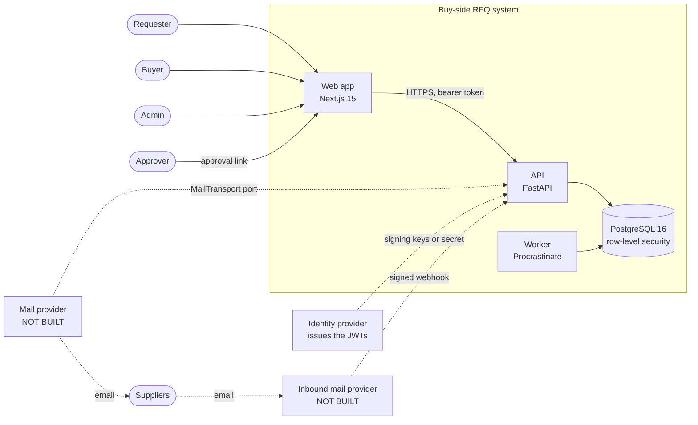
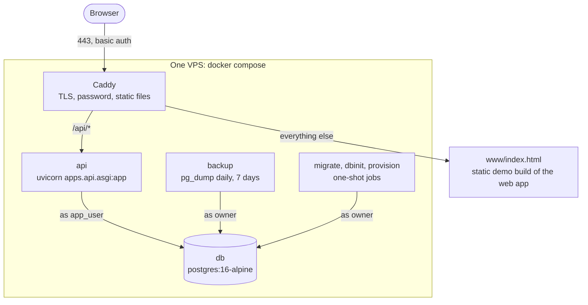
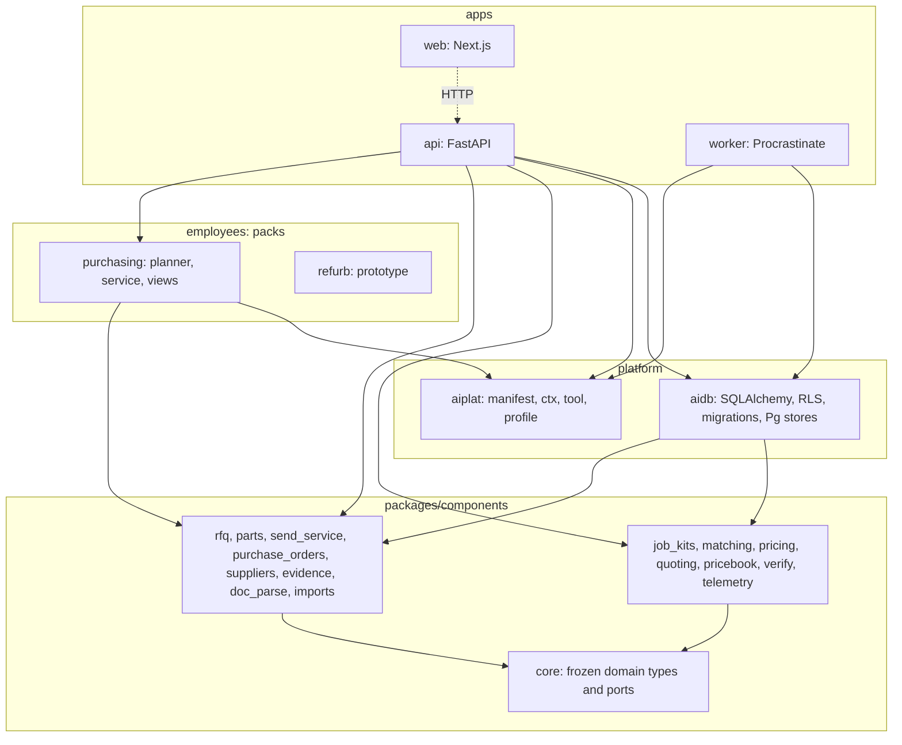
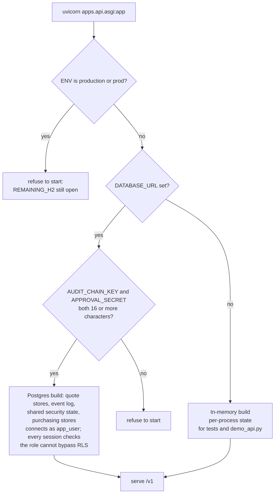

# System overview

Status: describes the code at commit `691aa58` (2026-10-08). Product-market fit is unproven. Seed data is synthetic.

## What the system is

A buy-side agent that turns a purchase need into approved supplier messages, reads and compares the replies, and prepares a purchase order draft. It also builds a materials-list quote from a job template and the supplier price files. A **person approves every outbound message and every order** (hard rule R1). The system is a FastAPI service over PostgreSQL with a Next.js web app. There is no production mail transport and no production language-model client.

The source of truth for behaviour is the product spec ([`docs/product/04-product-spec.md`](../product/04-product-spec.md), v0.2; v0.3 is a draft). This guide describes how the code realises it.

## Context

Solid arrows exist in the code. Dashed arrows are ports or contracts only: no mail provider and no inbound provider are implemented, and the web app has no sign-in screen (the deployment gives it a token). The only transport in the code is `RecordingTransport`, an in-memory fake that records what would have been sent.

## Containers as deployed today

The repository ships a Docker Compose file for a single VPS and a set of scripts for one Google Cloud VM. Both run the API and PostgreSQL as a **staging demo** with synthetic data. The compose file was validated with `docker compose config` only: the sandbox where it was written has no Docker daemon, so the images were never built there (see [deployment](08-deployment-and-operations.md)).

Points that matter:

- Only Caddy publishes ports. The API and database are on an internal network.
- The API connects as `app_user` (no superuser, no `BYPASSRLS`). Row-level security does not protect against the table owner, so the owner role is used only by migrations, provisioning and backup.
- The page Caddy serves is the **demo build** of the web app, which runs on mock data in the browser. The Next.js app in real-API mode is run separately (`next dev` or `next start`) with `NEXT_PUBLIC_API_URL`.
- The worker (`apps/worker`) is not in the compose file. Its README says nothing in it is deployed.

## Layers and dependency rules

The rules (from `CLAUDE.md`, enforced by review and tests rather than a linter):

- **Packs never import each other, and components never import packs.** The two packs, `purchasing` and `refurb`, share no code. `refurb` is an older prototype that imports no component and keeps its own hash-chained audit log.
- `packages/components/core/domain.py` and `ports.py` are **frozen contracts**. A change goes to [`CONTRACT_CHANGES.md`](../architecture/CONTRACT_CHANGES.md) first.
- Deployment behaviour (currency, tax, language, legal wording, retention, limits) comes from a **deployment profile**, never from a constant in code. See [configuration](07-configuration.md).
- All data access goes through tenant-scoped repositories.

### The computed import graph

Every component also imports `core`, which is left out of the picture. The edges below are computed from the `import` statements in the code (not drawn by hand).

Three edges are worth knowing about when you change code:

- `rfq` and `verify` import each other at package level. The chain is `rfq.quotes.verify_quote` to `verify.*` and `verify.shadow` to `rfq.quotes.normalise`. No module imports itself through the cycle.
- `aidb` imports `apps.api.middleware` once, lazily inside a method (`aidb/state.py`), for the idempotency store types. That is a package reaching up into an app.
- `aiplat` imports `components.evidence` (the `@tool` decorator appends audit events). The platform depends on one component.

## Runtime modes

The API entrypoint, `apps/api/asgi.py`, builds one of two things depending on the environment.

`ENV=production` is refused on purpose. `REMAINING_H2` in `asgi.py` lists what still blocks it:

1. The all-tenant kill switch is process-local.
2. The approval-threshold aggregate (`committed_today` then `set_committed`) is not atomic.
3. Idempotency replay is get-then-put, not atomic.
4. The prepared-message cache and the approval-link notifier are per process.
5. Multi-step operations are separate transactions, and the `prepare_rfqs` lock is in-process.
6. No real mail transport or inbound provider is built (recording transport only).

`python scripts/check_production_readiness.py` reports each item.

## Technology

| Area | What | Where it is declared |
|---|---|---|
| Language | Python 3.11 or later (the container image uses 3.12) | `pyproject.toml`, `deploy/docker/Dockerfile` |
| API | FastAPI 0.110 or later, Pydantic 2, uvicorn, python-multipart | `pyproject.toml` |
| Auth | PyJWT; Supabase-style JWTs (RS256 or ES256 by JWKS, or HS256 by secret); HMAC test tokens in dev | `apps/api/auth.py` |
| Data | PostgreSQL 16, SQLAlchemy 2, Alembic (migrations 0001 to 0007), psycopg 3 | `packages/aidb` |
| Background jobs | Procrastinate 3 (Postgres-backed queue) | `apps/worker` |
| Planner graph | LangGraph 1 (not wired into the runtime; run by tests) | `employees/purchasing/graph.py` |
| Web | Next.js 15.5, React 19, Tailwind 3, TypeScript 6, Vitest 5 | `apps/web/package.json` |
| Spreadsheets and PDFs | openpyxl, pypdf, defusedxml (optional `docs` extra) | `pyproject.toml` |
| Language model client | `anthropic` is an optional `llm` extra. **No production `LLMProvider` exists** in the repository. | `pyproject.toml` |
| Tests | pytest, hypothesis, httpx; ruff; mypy | `pyproject.toml`, `Makefile` |

`jinja2` is declared but nothing imports it. `itsdangerous` signs the approval-link tokens in the approvals service. There is no HTMX anywhere: the original plan (ADR-001) was superseded by the Next.js app (ADR-010).

## Repository layout

| Path | Contents |
|---|---|
| `packages/aiplat` | The platform: employee manifest, the per-call context, the `@tool` decorator, and the deployment-profile loader (`profile.py`). |
| `packages/aidb` | SQLAlchemy models, Alembic migrations, the RLS helpers, the tenant session, and the Postgres stores. |
| `packages/components/*` | Sixteen components. See the table below. |
| `apps/api` | The FastAPI service: `main.py` (the purchasing routes), `quote_routes.py`, `quote_rfq_routes.py`, `price_file_routes.py`, `telemetry_routes.py`, auth, middleware, and the entrypoint. |
| `apps/worker` | Procrastinate tasks (inbound parsing, follow-ups, audit-chain checks, retention, metering). |
| `apps/web` | The Next.js app, its tests, e2e scripts, and the demo build (`demo/`). |
| `employees/purchasing` | The purchasing pack: manifest, planner graph, tools, and `PurchasingService`. |
| `employees/refurb` | An older prototype, kept separate. |
| `profiles/` | Deployment profiles (`uk`, `uk-scotland`, `uk-ni`, `us`, `_template`) and data (`profiles/data`: bank holidays, job kits, matching ontology, price-book and quoting templates). |
| `evals/` | Evaluation harnesses and their reports. See [testing](09-testing-and-evals.md). |
| `deploy/` | The Docker and Google Cloud deployment files. |
| `scripts/` | Demo, export, provisioning, audit verification and production-readiness scripts. |
| `tests/` | The Python tests. |
| `docs/` | Product, architecture, UK research, MVP notes, and this guide. |

### The components

| Component | What it does | Python lines |
|---|---|---:|
| `core` | Frozen domain types, ports (`MailTransport`, `LLMProvider`, `Clock`, ...) and in-memory fakes. | 639 |
| `rfq` | The request state machine, quote reading (extractors, normalisation, grounding), and quote comparison. | 1,919 |
| `parts` | Request-text intake, the required-attribute table, part families, and the equivalence engine (tiers A to D). | 1,645 |
| `send_service` | The only way mail leaves: approvals, nonce, footer, identity lines, caps, kill switch, follow-ups. | 1,920 |
| `purchase_orders` | Approvals (per-message, substitution, standing), single-use approval tokens, spend caps, the PO draft rules. | 901 |
| `suppliers` | Supplier CSV import rules, profiles, verification, suppression, assumption rows. | 387 |
| `evidence` | The hash-chained audit log and its verification. | 364 |
| `doc_parse` | Turning files and replies into inert text, with a sandbox check. | 487 |
| `imports` | Part and PO-history CSV importers. | 459 |
| `verify` | Checks on a read quote: number checks, plausibility, a second reading compared with the first. | 861 |
| `job_kits` | Job templates (modules, questions, rules) and the resolver that produces a materials list. | 1,670 |
| `matching` | Matching an order line to a product: parse, retrieve, check, judge, gate. Approved matches. | 3,855 |
| `pricing` | Offers, freshness, VAT and unit normalisation, best price, and the basket optimiser. | 4,228 |
| `quoting` | A kit becomes a draft quote, and the quote options search. | 3,128 |
| `pricebook` | Who has prices, coverage, gaps, and the text of requests for missing prices. | 1,403 |
| `telemetry` | Content-free review events, seeded drills and pooled summaries. | 490 |

Line counts are for the Python files in each directory, excluding tests. Totals: about 37,000 lines of Python, 9,400 lines of web TypeScript, and about 39,800 lines of Python tests.
