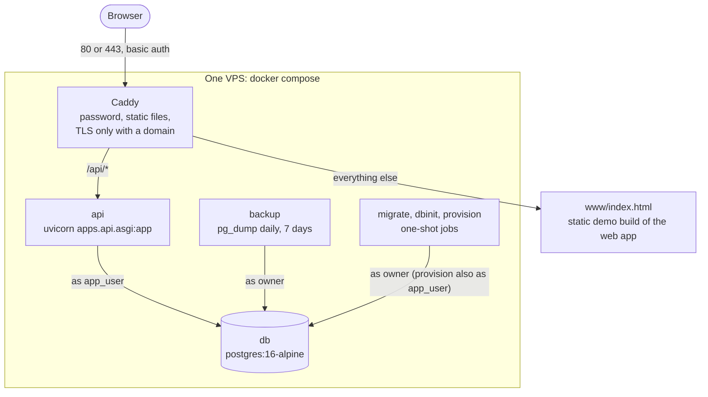
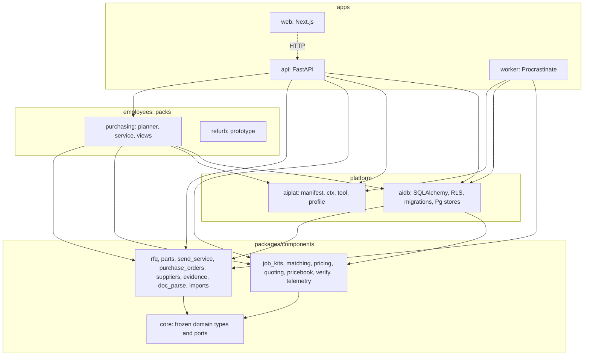
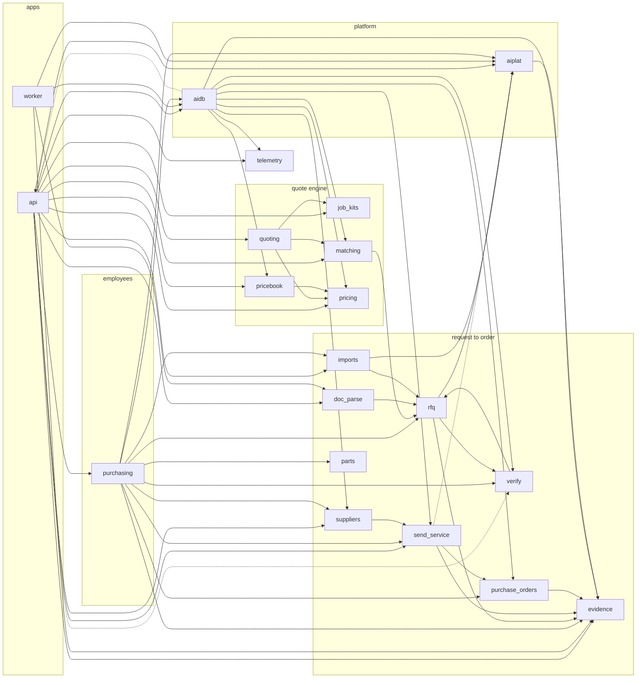
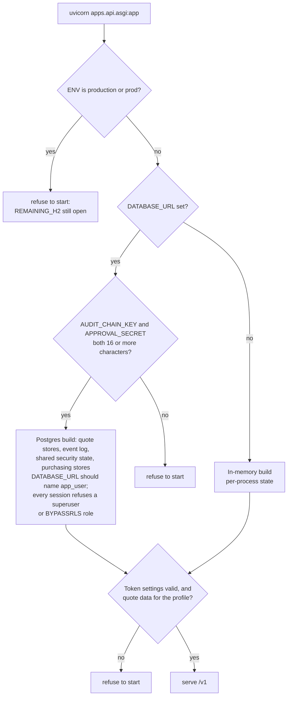

# System overview

Status: describes the code at commit `691aa58` (2026-10-08). Product-market fit is unproven. Seed data is synthetic.

## What the system is

A buy-side agent that turns a purchase need into approved supplier messages, reads and compares the replies, and prepares a purchase order draft. It also builds a materials-list quote from a job template and the supplier price files. Nothing is sent, and no purchase order is issued, without a recorded human authorisation (hard rule R1, numbered as in the product spec, section 4; `CLAUDE.md` numbers the same rules 1 to 7). In the shipped service that is a person's per-message approval of each outbound message (`PurchasingService.approve_send`). The system never places an order: it prepares a draft that a person exports. R1 also allows a standing pre-authorisation set by a person. The send-service and the approvals component support it, but nothing in the API or the purchasing service creates one. The system is a FastAPI service over PostgreSQL with a Next.js web app. There is no production mail transport and no production language-model client.

The source of truth for behaviour is the product spec ([`docs/product/04-product-spec.md`](../product/04-product-spec.md), v0.2; v0.3 is a draft). This guide describes how the code realises it.

## Context

Solid arrows exist in the code. Dashed arrows are ports or contracts only: no mail provider and no inbound provider are implemented. The web app has no sign-in screen. It sends a bearer token only in a development run (`next dev`) with `NEXT_PUBLIC_DEV_TOKEN` set: `apps/web/lib/api.ts` reads that variable only when `NODE_ENV` is not `production`, and nothing in the app calls `setTokenProvider`. Under `next start` the app sends no token, so the API answers 401 to every call except reading an approval link. Nothing delivers the approval link to the approver: the only notifier, `InMemoryNotifier`, collects the notices in memory. The only transport in the code is `RecordingTransport`, an in-memory fake that records what would have been sent.

## Containers in the shipped deployment files

The repository ships a Docker Compose file for a single VPS and a set of scripts for one Google Cloud VM. Both are for a **staging demo** with synthetic data, and nothing in the repository records that either has run on a real server.

The compose file starts the API on PostgreSQL (`apps.api.asgi:app`, the Postgres build in [runtime modes](#runtime-modes)). The Google Cloud scripts install Caddy and a static copy of the demo page. An API and PostgreSQL are optional add-ons there, and they are not connected: the optional API unit runs `scripts/demo_api.py`, the in-memory demo, which never opens a database connection. The compose file was validated with `docker compose config` only: the sandbox where it was written has no Docker daemon, so the images were never built there. The Google Cloud scripts were checked with `bash -n` only (see [deployment](08-deployment-and-operations.md)).

Points that matter:

- Only Caddy publishes ports. The API and database are on an internal network.
- Caddy listens on `SITE_ADDRESS`, which defaults to `:80`: plain HTTP behind basic auth, meant to be reached through an SSH tunnel. It gets a certificate and serves HTTPS on 443 only when `SITE_ADDRESS` is a domain name that points at the server.
- The API connects as `app_user` (no superuser, no `BYPASSRLS`). A superuser or a role with `BYPASSRLS` ignores row-level security, and the compose owner `rfq_owner` is a superuser (the official PostgreSQL image makes `POSTGRES_USER` one), so the API must never use it: `tenant_session` raises `PrivilegedRoleError` on such a connection. Every tenant table also has `FORCE ROW LEVEL SECURITY`, so the policies apply to an ordinary table owner too, such as the free-tier VM's `rfq_owner`. The owner role is used only by migrations, provisioning and backup.
- The page Caddy serves is the **demo build** of the web app, which runs on mock data in the browser. The Next.js app in real-API mode is run separately, as `scripts/run_local.sh` does it: `next dev` with `NEXT_PUBLIC_API_URL` and `NEXT_PUBLIC_DEV_TOKEN`. Under `next start` the app sends no bearer token, so the API answers 401 to every call except reading an approval link.
- The worker (`apps/worker`) is not in the compose file. Its README says nothing in it is deployed.

## Layers and dependency rules

An arrow means that at least one module in the box it leaves imports a module in the box it points to. The picture shows the imports that run down the layers and leaves out the others, so it is a simplification, not a rule. Also real: `api`, `purchasing`, `aidb` and `worker` import `core`; `rfq` and `verify` import each other; `rfq` and `imports` import `aiplat`; `aiplat` imports `evidence`; and `aidb` imports `apps.api.middleware` lazily. The computed graph below lists every edge between single units except those to `core`, and the bullets under it explain the unusual ones.

The rules (from `CLAUDE.md`, enforced by review and tests rather than a linter):

- **Packs never import each other, and components never import packs.** The two packs, `purchasing` and `refurb`, share no code. `refurb` is a prototype that imports nothing from the platform or the components (only the standard library and its own modules) and keeps its own hash-chained audit log. It first appears in git on 2026-10-03 (`89bb23f`), after the monorepo layout of 2026-10-02 (`cb3535f`), which put the first eight components under `packages/components`.
- `packages/components/core/domain.py` and `ports.py` are **frozen contracts**. A change goes to [`CONTRACT_CHANGES.md`](../architecture/CONTRACT_CHANGES.md) first.
- Deployment behaviour (currency, tax, language, legal wording, retention, limits) comes from a **deployment profile**, never from a constant in code. See [configuration](07-configuration.md).
- All data access goes through tenant-scoped repositories.

### The computed import graph

Edges to `core` are left out of the picture. Twelve of the fifteen other components import it. `doc_parse`, `job_kits` and `telemetry` do not, nor does `aiplat`; `api`, `purchasing`, `aidb` and `worker` do. The other edges were derived from the `import` statements in the code at commit `691aa58`, including imports inside functions and under `TYPE_CHECKING`, and checked again with an `ast` walk of the same files. No script in the repository produces them, so re-check them by hand when imports change.

A dotted arrow is an import that does not run when the module loads. `send_service` to `aiplat` is under `if TYPE_CHECKING:` (`send_service/service.py`). `aidb` to `api` is inside a method (`aidb/state.py`), and `api` to `verify` is inside `build_app` (`apps/api/asgi.py`).

Four edges are worth knowing about when you change code:

- `rfq` and `verify` import each other at package level. The chain is `rfq.quotes.verify_quote` to `verify.*` and `verify.shadow` to `rfq.quotes.normalise`. No module imports itself through the cycle.
- `aidb` imports `apps.api.middleware` once, lazily inside a method (`aidb/state.py`), for the idempotency store types. That is a package reaching up into an app.
- `aiplat` imports `components.evidence` (the `@tool` decorator appends audit events), and `aidb` imports nine components (`evidence`, `matching`, `pricebook`, `pricing`, `purchase_orders`, `send_service`, `suppliers`, `telemetry`, `verify`) and `core`, because it holds their Postgres stores. The platform layer therefore depends on the components, not on one of them.
- `rfq` and `imports` import `aiplat.profile` (the `ResolvedProfile` type), and `send_service` does so only under `TYPE_CHECKING`. Comments in the code (for example in `packages/aiplat/profile.py`) say that components never import `aiplat`. That holds at run time for the other components, not for these two.

## Runtime modes

The API entrypoint, `apps/api/asgi.py`, builds one of two things depending on the environment.

Both builds also stop at start-up in two cases:

- **Token settings are missing or invalid.** `AUTH_MODE` defaults to `supabase`, which needs `SUPABASE_JWKS_URL` or a `SUPABASE_JWT_SECRET` of 32 or more characters. `AUTH_MODE=test` (HMAC tokens) is accepted only when `ENV` is `dev`, `local` or `test`, with a `TEST_AUTH_SECRET` of 32 or more characters.
- **The profile has no quote data.** `DEPLOYMENT_PROFILE` defaults to `us`, and only `uk` has quote data (`profiles/data/matching/uk`, `profiles/data/job_kits/uk`). For `us`, `uk-scotland` or `uk-ni`, `build_quote_service` raises `ClassificationError`. This is row 1 of [known gaps](../architecture/known-gaps.md#found-while-writing-the-documentation-2026-10-09). The compose file and `scripts/run_local.sh` set `DEPLOYMENT_PROFILE=uk`.

`scripts/demo_api.py` (`make demo-api`) does not use this entrypoint. It builds its own in-memory app with `create_app` and `build_in_memory_service`, `AUTH_MODE=test` and the `uk` profile, starts uvicorn itself, and never touches PostgreSQL. What each way of running it offers is in [deployment](08-deployment-and-operations.md#ways-to-run-it).

`ENV=production` is refused on purpose. `REMAINING_H2` in `asgi.py` lists what still blocks it:

1. The all-tenant kill switch is process-local.
2. The approval-threshold aggregate (`committed_today` then `set_committed`) is not atomic.
3. Idempotency replay is get-then-put, not atomic.
4. The prepared-message cache and the approval-link notifier are per process.
5. Multi-step operations are separate transactions, and the `prepare_rfqs` lock is in-process.
6. No real mail transport or inbound provider is built (recording transport only).

`python scripts/check_production_readiness.py` reports each item.

## Technology

| Area | What | Where to look |
|---|---|---|
| Language | Python 3.11 or later (the container image uses 3.12) | `pyproject.toml`, `deploy/docker/Dockerfile` |
| API | FastAPI 0.110 or later, Pydantic 2, uvicorn, python-multipart | `pyproject.toml` |
| Auth | PyJWT; Supabase-style JWTs (RS256 or ES256 by JWKS, or HS256 by secret); HMAC test tokens in dev | `apps/api/auth.py` |
| Data | PostgreSQL 16 (the version the compose file and the development scripts run; the Google Cloud script installs the distribution's default `postgresql` package), SQLAlchemy 2, Alembic (migrations 0001 to 0007), psycopg 3 | `deploy/docker/compose.yaml`, `scripts/run_local.sh`, `scripts/pg_dev.sh`, `pyproject.toml`, `packages/aidb/migrations` |
| Background jobs | Procrastinate 3 (Postgres-backed queue) | `apps/worker` |
| Planner graph | LangGraph 1 (not wired into the runtime; run by tests) | `employees/purchasing/graph.py` |
| Web | Next.js 15.5, React 19, Tailwind 3, TypeScript 6, Vitest 5 | `apps/web/package.json` |
| Spreadsheets and PDFs | openpyxl and pypdf, imported lazily by `doc_parse` (optional `docs` extra). The extra also lists `defusedxml`, which no code imports. | `pyproject.toml`, `packages/components/doc_parse/parser.py` |
| Language model client | `anthropic` is an optional `llm` extra. **No production `LLMProvider` exists** in the repository. | `pyproject.toml` |
| Tests | pytest, hypothesis, httpx; ruff; mypy | `pyproject.toml`, `Makefile` |

`jinja2` is declared but nothing imports it. `itsdangerous` signs the approval-link tokens in the approvals service. There is no HTMX anywhere: the server-rendered HTMX interface planned in [ADR-001](../architecture/adr/001-python-fastapi-htmx.md) was never built, and the web app is Next.js. [ADR-010](../architecture/adr/010-adopt-ai-employees-stack.md), which says it supersedes ADR-001 for the interface, is still marked *proposed*.

## Repository layout

| Path | Contents |
|---|---|
| `packages/aiplat` | The platform: employee manifest, the per-call context, the `@tool` decorator, and the deployment-profile loader (`profile.py`). |
| `packages/aidb` | SQLAlchemy models, Alembic migrations, the RLS helpers, the tenant session, and the Postgres stores. |
| `packages/components/*` | Sixteen components. See the table below. |
| `apps/api` | The FastAPI service: `main.py` (the purchasing routes), `quote_routes.py`, `quote_rfq_routes.py`, `price_file_routes.py`, `telemetry_routes.py`, auth, middleware, and the entrypoint. |
| `apps/worker` | Procrastinate tasks (inbound parsing, follow-ups, audit-chain checks, retention, and a metering stub). |
| `apps/web` | The Next.js app, its tests, e2e scripts, and the demo build (`demo/`). |
| `employees/purchasing` | The purchasing pack: manifest, planner graph, tools, and `PurchasingService`. |
| `employees/refurb` | A prototype of an approval-gated refurbishment RFQ agent, kept separate: it imports nothing from the platform or the components. See [refurb](../refurb/README.md). |
| `profiles/` | Deployment profiles (`uk`, `uk-scotland`, `uk-ni` and `us`; `base` holds the defaults they extend, and `_template` is the starting point for a new one) and data (`profiles/data`: UK bank holidays, job kits, the matching ontology, classification and a synthetic catalogue seed, price-book request templates, pricing test fixtures, and the synthetic demo price files for the quote engine with their manifest and generator script). |
| `evals/` | Evaluation harnesses and their reports. See [testing](09-testing-and-evals.md). |
| `deploy/` | The Docker and Google Cloud deployment files. |
| `scripts/` | Demo, export, provisioning, audit verification and production-readiness scripts. |
| `tests/` | The Python tests. |
| `docs/` | Product, architecture, UK research, MVP notes, the user guide, and this guide. See the [documentation hub](../README.md). |
| `research/` | Dated research notes: agentic commerce and B2B procurement, MRO purchasing, the UK market and law, channels, intent and job templates, product-market-fit analysis, and verification reports. Not checked against the code. |
| `research_notes/`, `reports/` | The working notes, and the four written reports built on them: UK product sourcing and price data, refurbishment job templates, top picks by option, and supplier accounts and quote comparison. Not checked against the code. |
| `src/` | Empty: git tracks no file under it. A checkout can still hold an empty `src/purchasing_agent/` from the first scaffold, and `deploy/docker/Dockerfile` copies `src/`. |
| Root files | `README.md`; `CLAUDE.md` (the seven hard rules and the working rules for agents); `Makefile` (`setup`, `test`, `lint`, `typecheck`, `eval`, `check`, `demo-api`); `pyproject.toml` (dependencies, extras, and the pytest, ruff and mypy settings). |
| `.claude/agents/` | Role definitions for the agent team: product owner, architect, backend engineer, AI eval engineer, frontend engineer, QA and security reviewer, red team. |

### The components

| Component | What it does | Python lines |
|---|---|---:|
| `core` | Frozen domain types, ports (`MailTransport`, `LLMProvider`, `Clock`, ...) and in-memory fakes. | 639 |
| `rfq` | The request state machine, quote reading (extractors, normalisation, grounding), and quote comparison. | 1,919 |
| `parts` | Request-text intake, the required-attribute table, part families, and the equivalence engine (tiers A to D). | 1,645 |
| `send_service` | The only way mail leaves: approvals, nonce, footer, identity lines, caps, kill switch, follow-ups. | 1,920 |
| `purchase_orders` | The approvals service only: approvals (per-message, substitution, purchase-order and standing rules), signed single-use approval tokens, and spend caps. It has no draft code: `create_po_draft` and the R2 check (`check_r2`) are in `employees/purchasing/service.py`. | 901 |
| `suppliers` | Supplier CSV import rules, profiles, verification, suppression, assumption rows. | 387 |
| `evidence` | The hash-chained audit log and its verification. | 364 |
| `doc_parse` | Turning files and replies into inert text, with a sandbox check. | 487 |
| `imports` | CSV importers for parts, assets and PO history, exact vendor-name matching, and formula-injection safety for cell values. | 459 |
| `verify` | Checks on a read quote: number checks, plausibility, a second reading compared with the first. | 861 |
| `job_kits` | Job templates (modules, questions, rules) and the resolver that produces a materials list. | 1,670 |
| `matching` | Matching an order line to a product: parse, retrieve, check, judge, gate. Approved matches. | 3,855 |
| `pricing` | Offers, freshness, VAT and unit normalisation, best price, and the basket optimiser. | 4,228 |
| `quoting` | A kit becomes a draft quote, and the quote options search. | 3,128 |
| `pricebook` | Who has prices, coverage, gaps, and the text of requests for missing prices. | 1,403 |
| `telemetry` | Content-free review events, seeded drills and pooled summaries. | 490 |

Line counts are physical lines (`wc -l`) of the Python files in each directory, excluding tests. Totals: about 37,000 lines of Python (`packages`, `apps`, `employees` and `scripts`: 37,148), about 9,400 lines of web TypeScript (`.ts` and `.tsx` under `apps/web/app`, `components` and `lib`: 9,440), and about 39,800 lines of Python tests and evaluation code (`tests/`: 38,163 lines in 232 files; `evals/`: 1,685 lines in 10 files).
