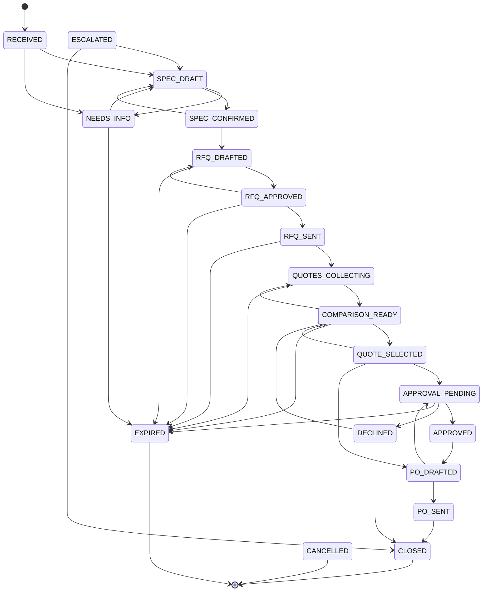
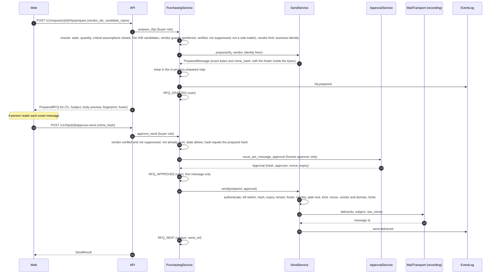
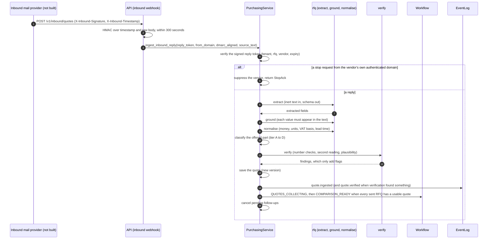
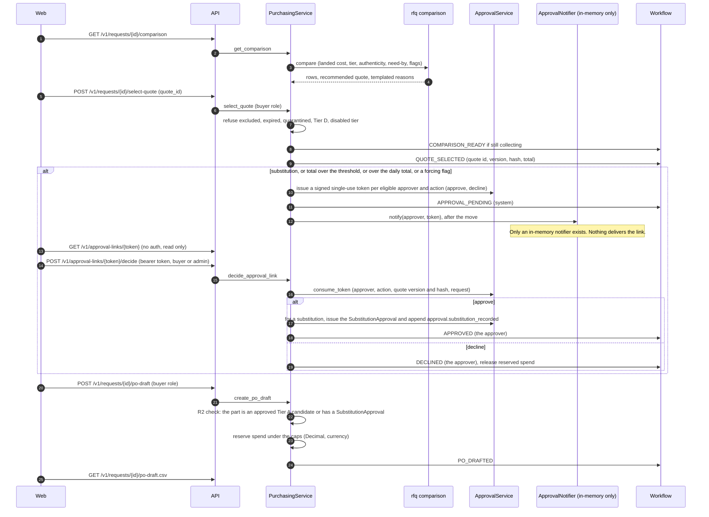

# Request lifecycle

This page follows one request from the first sentence to a purchase order draft: the state machine, what moves it, and the sequence of calls behind each stage. Rule numbers (R1 to R12) are the product spec's hard rules (section 4 of `docs/product/04-product-spec.md`). The per-module activity diagrams are in [`activity-diagrams.md`](../architecture/activity-diagrams.md).

## The state machine

`Workflow.transition` (`packages/components/rfq/workflow/machine.py`) is the **only** code that writes `Request.state` (CLAUDE.md rule 6, spec feature F8). It appends a hash-chained event first, then flips the state, under a lock, so inside the process an event and a state change cannot diverge. The service stores the request in a separate step after `transition` returns, outside that lock and not in one database transaction ("multi-step operations are separate transactions" is one of the open production gaps), so a failure between the two would leave the event ahead of the stored state, and the next move would then raise `StateDrift`.

The diagram was written by hand from `_BASE`, the machine's transition table in `packages/components/rfq/workflow/machine.py`. No script produces it, so it has to be checked against that table when the table changes. Edges to `CANCELLED` and `ESCALATED` are left out of the picture and listed below it.

- **`CANCELLED`** is reachable from every state except `PO_SENT`, `CLOSED`, `EXPIRED` and itself.
- **`ESCALATED`** is reachable from every state except `CLOSED`, `CANCELLED`, `EXPIRED` and `ESCALATED` itself. It needs a non-empty `reason` (R4: after two unanswered questions the outcome is a defined state, never a guess).
- **`EXPIRED`** is reachable only from the states drawn.
- **Terminal states:** `CLOSED`, `CANCELLED`, `EXPIRED`.

### What the machine refuses

| Check | Refusal |
|---|---|
| The transition is not in the table. | `IllegalTransition` |
| The request's state differs from the `to` of its last logged transition (it was written around the workflow). | `StateDrift` |
| The actor is empty. | `IllegalTransition` |
| `RFQ_APPROVED`, `APPROVED` or `DECLINED` and the actor does not start with `user:`. The one exception is `RFQ_APPROVED` with actor `system` and a `rule_id` (a standing pre-authorisation, R1). | `NotAuthorisedActor` |
| `RFQ_SENT` or `PO_SENT` without a `send_ref`, or with a `send_ref` that is not a delivery the send-service itself recorded for this request and purpose. | `MissingSendRef`, `UnverifiedSendRef` |
| `ESCALATED` without a reason. | `IllegalTransition` |

### What actually moves a request

The table allows more than the service uses today. This is every call site in `employees/purchasing` that moves a state.

| Transition | Triggered by | Actor |
|---|---|---|
| `RECEIVED` to `SPEC_DRAFT` | `POST /v1/requests` (intake) | `agent` |
| `SPEC_DRAFT` to `NEEDS_INFO`, `SPEC_CONFIRMED` or `ESCALATED` | The spec normaliser's result (questions, complete, or incomplete after two questions or an unhandled family) | `agent` |
| `NEEDS_INFO` to `SPEC_DRAFT` | `POST .../answers` | the user |
| `SPEC_CONFIRMED` or `NEEDS_INFO` to `SPEC_DRAFT`, and at once on to `NEEDS_INFO` or `ESCALATED` | `POST .../assumptions/{id}/invalidate` when the family has a question for that attribute: the value is dropped and asked again (the move to `SPEC_DRAFT` is the user's, the next move is the agent's, and a third question escalates). For any other attribute the value is just dropped and nothing moves. | the user, then `agent` |
| `SPEC_CONFIRMED` to `ESCALATED` | A safety-critical request whose candidates are all Tier D | `agent` |
| `SPEC_CONFIRMED` to `RFQ_DRAFTED` | `POST .../rfqs/prepare` (buyer) | the user |
| `RFQ_DRAFTED` to `RFQ_APPROVED` | The first `POST /v1/rfqs/{id}/approve-send` | the user |
| `RFQ_APPROVED` to `RFQ_SENT` | The same call, after the send-service delivered | `system`, with `send_ref` |
| `RFQ_SENT` to `QUOTES_COLLECTING` | The first quote is ingested | `agent` |
| `QUOTES_COLLECTING` to `COMPARISON_READY` | Every sent RFQ has a usable quote (`agent`), or the buyer selects a quote early (`buyer_proceeds`, the user) | `agent` or the user |
| `COMPARISON_READY` to `QUOTE_SELECTED` | `POST .../select-quote` | the user |
| `QUOTE_SELECTED` to `APPROVAL_PENDING` | Selection needed an approval and an eligible approver exists | `system` |
| `APPROVAL_PENDING` to `APPROVED` or `DECLINED` | `POST /v1/approval-links/{token}/decide` | the approver |
| `QUOTE_SELECTED` or `APPROVED` to `PO_DRAFTED` | `POST .../po-draft` | the user |
| `PO_DRAFTED` to `CANCELLED` | `PurchasingService.cancel_po_draft` (**no API route**) | the user |
| `RECEIVED` to `SPEC_DRAFT` to `SPEC_CONFIRMED` to `RFQ_DRAFTED` | `PurchasingService.prepare_text_rfq` (quote to RFQ): a new container request per message | `agent`, `agent`, then the user |

**Defined but not used by any code path:** `RECEIVED` to `NEEDS_INFO` (intake always goes to `SPEC_DRAFT` first), a move to `ESCALATED` from any state other than `SPEC_DRAFT` and `SPEC_CONFIRMED`, every move to `EXPIRED` and to `CLOSED`, `PO_DRAFTED` to `PO_SENT`, `PO_DRAFTED` to `APPROVAL_PENDING`, `RFQ_APPROVED` to `RFQ_DRAFTED`, `COMPARISON_READY` to `QUOTES_COLLECTING`, `QUOTE_SELECTED` to `COMPARISON_READY`, `DECLINED` to `COMPARISON_READY` or `CLOSED`, `ESCALATED` to anything, and `CANCELLED` from any state but `PO_DRAFTED`. There is no timer, no close endpoint and no route that sends a purchase order. So `EXPIRED`, `CLOSED` and `PO_SENT` are never reached, and a declined or escalated request stays where it is.

## 1. Create, clarify, confirm

```mermaid
sequenceDiagram
  autonumber
  participant W as Web
  participant A as API (main.py)
  participant S as PurchasingService
  participant P as parts (intake, normaliser, equivalence)
  participant WF as Workflow
  participant L as EventLog
  W->>A: POST /v1/requests (text, quantity, need_by, ...)
  A->>S: create_request (requester role)
  S->>P: parse_request_text (quantity, need-by, urgency words)
  S->>L: request.created
  S->>WF: SPEC_DRAFT (agent)
  WF->>L: request.transition (first)
  S->>P: normalise (family, attributes, questions)
  P-->>S: family, attributes, open questions
  alt family not enabled
    S->>WF: ESCALATED (agent, reason)
  else family handled
    S->>S: record assumptions (rule defaults and inferences)
    alt open questions, at most two
      S->>WF: NEEDS_INFO (agent)
    else incomplete after two questions
      S->>WF: ESCALATED (agent, reason)
    else complete
      S->>WF: SPEC_CONFIRMED (agent)
      S->>P: find_candidates (tiers A and B offered, C hidden, D reported)
      S->>L: candidates.found
    end
  end
  A-->>W: RequestDetail
  W->>A: POST /v1/requests/{id}/answers
  A->>S: answer_questions
  S->>WF: SPEC_DRAFT, then back through the same branch
```

Notes:

- The web form sends the quantity and the need-by date and says *The agent does not read this from the text*, but the service does read them when they are left out: `create_request` takes the quantity and the need-by date parsed from the text (`qty 4`, `4 pcs`, `x4`, a date) when the caller sends none, and `prepare` only checks that the quantity is not zero. The hint on the form is wrong for a blank box.
- Intake can only **raise** caution: text that looks like "safety critical" sets the criticality hint, but no text can lower it (`criticality or parsed.criticality_hint`).
- Every attribute has a source (`user_input`, `nameplate_ocr`, `manufacturer_table`, `standard`, `rule`, `po_history` or `model_inference`) and a confidence. An attribute whose source is `rule` (ledger source `default_template`) or `model_inference` becomes an `Assumption` row (a value looked up from a standard does not), and a **critical** one blocks preparing messages until a person confirms it (R3). `model_inference` can never satisfy a critical attribute, and no code in the shipped path sets that source today: it is only read.
- `MAX_QUESTIONS` is 2 (`packages/components/parts/spec/normaliser.py`).

## 2. Prepare, approve, send

Where the rules bite:

- **R1.** Only the send-service holds the transport. It accepts only an `Approval` that is exactly the record the approval service registered, covers the exact bytes (SHA-256 of the whole message), has not expired, and has not been used (the nonce is single-use, kept in `spent_approvals` where the primary key is the guarantee). The planner has no mail credentials.
- **R8.** A footer naming the sender and the AI disclosure is mandatory, and the profile's company-identity lines must be present. Both are re-checked at send time.
- **R12 and the vendor rules.** The recipient must be the vendor on record, at its registered domain (R12 also covers the call-back before a contact change takes effect). A vendor that has opted out is refused as well, under the contact etiquette of spec section 4a.
- **Limits.** One exact message is sent once (`duplicate_send`). Recipients per request are capped twice: the service applies `comms.max_vendors` (and `comms.down_now_max_vendors` for a *Machine down* request) when preparing, and the send-service re-checks at send time with its own limit (a fixed two for a *Machine down* request).
- **The prepared-message map is per process.** After a restart, `approve_send` answers *message changed or was never prepared*, and the list of prepared messages omits the entry. Prepare again. This is one of the open production gaps.
- A refusal inside the send-service is a `409 conflict` with the message `send refused: <code>`. The codes are `kill_switch`, `hash_mismatch`, `unknown_approval`, `wrong_approval_kind`, `approval_expired`, `nonce_replayed`, `tenant_mismatch`, `recipient_not_vendor`, `vendor_opted_out`, `domain_mismatch`, `footer_missing`, `identity_missing`, `malformed_message`, `unsafe_text`, `standing_rule_violation`, `cap_exceeded`, `duplicate_send` and `recipient_limit`. (`vendor_missing` and `follow_up_cancelled` are audit-only codes for follow-up plans.) `transport_failure` is a separate error in the send-service (delivery is unknown and the approval stays used), but `approve_send` catches the base error, so it too reaches the client as `409 conflict` with `send refused: transport_failure`; the request keeps the state it had (`RFQ_APPROVED` for the first message, `RFQ_SENT` or later for the next ones) and a `send.failed` event is written. Other `409`s from `approve_send` carry no `send refused` prefix: `message changed or was never prepared: review the new hash`, `RFQ was already sent`, `cannot send in state ...`.

## 3. A reply comes in

Notes:

- **Untrusted content (R6, R7).** The extractor is given inert text and returns a fixed schema. Every extracted value must appear in the source text (`ground`), or it is blanked and flagged (`ungrounded:*`). Instructions in the text are never followed, and a link is never fetched. The shipped reader is a pattern reader (`rfq/quotes/extractors.py`); the language-model reader exists behind a switch that is off.
- **Identity (R12).** A reply whose sender domain differs from the vendor's registered domain, or whose DMARC did not align (a boolean reported by the inbound provider), is quarantined: it gets `dmarc_fail` and is excluded from the comparison.
- A quote a buyer **pastes in** (`POST /v1/requests/{id}/quotes/inbound`) takes the same path, flagged `buyer_entered`, which always needs an approver other than the requester.
- Webhook details: the signature is the hex HMAC-SHA256 of `"<timestamp>." + raw body` (an optional `sha256=` prefix is accepted), the secret is `INBOUND_WEBHOOK_SECRET` (32 or more characters), and a missing or bad header is `401`. The route answers with a `QuoteView` or a `StopAck`.

## 4. Compare, select, approve, draft the purchase order

Rules visible here:

- **What forces an approval.** A part that is not Tier A (a substitution), a total above `approvals.threshold`, a total that takes the day's committed spend over `approvals.daily_aggregate_threshold`, or any of these flags: `condition_not_new`, `condition_unrecognised`, `currency_assumed_usd`, `freight_unknown`, `buyer_entered`, `tax_basis_unknown`, `currency_ambiguous`, or a verification finding that needs a person. `tax_basis_assumed`, `lead_time_working_days_assumed` and the attention flag are shown on the link but do not force one.
- **What refuses a selection.** A request that is not in `QUOTES_COLLECTING` or `COMPARISON_READY`; a quote that does not belong to the request (`404`); a quote excluded from the comparison; an expired validity (`validity_expired`); a quarantined, injection-flagged or `vendor_pending_callback` quote; an offered part of Tier D; a tier that the profile does not enable; or a quote with no price, currency or offered part number.
- **A selection that needs an approval but has no eligible approver** is refused with `409 no eligible approver`, **after** the request has already moved to `QUOTE_SELECTED` and its spend has been committed. Nothing rolls that back: the request stays in `QUOTE_SELECTED` with approval required and no link, `select-quote` is refused from that state, and the purchase order draft is refused (known-gaps row 24).
- **R11.** The link is a signed token (`itsdangerous`) bound to the approver, the quote version, the quote hash and the action. It is single-use and short-lived. `GET` only renders; the decision needs an authenticated session. The route accepts any bearer token, but the service requires the **buyer** role and that the caller **is** the approver the token was issued to. Above the threshold, or when a forcing flag or the daily total applied, the requester cannot be an eligible approver (`no eligible approver`).
- **R2.** `create_po_draft` (through `check_r2` in `employees/purchasing/service.py`) re-checks that the offered part number is an approved Tier A candidate, or that a substitution approval exists for that candidate and quote version. The draft keeps the request's own candidate spelling when the offered part matches a candidate; otherwise it keeps the vendor's offered part number with its whitespace collapsed.
- **R9.** Totals are `Decimal`. A purchase order draft books the amount against the per-order and daily caps (`spend_holds`, `cap_spend`) and declining or cancelling releases it.
- **Nobody sends the order.** `po-draft.csv` is a file for a person to use. The send-service can send a PO-purpose message, but no route or workflow step triggers `PO_SENT`.
- **Approval-link delivery.** The only notifier is `InMemoryNotifier`. The link is created and recorded, and in a real deployment nothing yet delivers it to the approver.

## Events

Every state change and every notable action appends a hash-chained event, per tenant. The chain hash is `HMAC-SHA256(AUDIT_CHAIN_KEY, prev_hash + "|" + canonical_json(envelope))`, where the envelope holds the id, tenant, request, timestamp, actor, type, payload and keyed digests of any personal data. Raw personal data sits under `payload._pii` and can later be redacted without breaking the chain (migration 0001).

| Type | Written by |
|---|---|
| `request.created`, `candidates.found` | create and candidate search |
| `request.transition` | `Workflow.transition`, with `from` and `to` |
| `assumption.created`, `.confirmed`, `.invalidated` | the assumption ledger |
| `rfq.prepared`, `quote_rfq.linked` | prepare and quote-to-RFQ |
| `approval.issued`, `approval.token_issued`, `approval.token_consumed`, `approval.rule_created`, `approval.rule_revoked` | the approval service |
| `approval.substitution_recorded` | `PurchasingService.decide_approval_link`, next to the approval service's own `approval.issued` |
| `send.delivered`, `send.followup_delivered`, `send.refused`, `send.failed`, `send.kill_switch` | the send-service and the kill switch |
| `quote.ingested`, `quote.verified` (only when verification produced findings) | quote ingestion |
| `price_history.record_failed` | `create_po_draft`, when the price of the drafted order could not be kept |
| `vendor.upserted`, `vendor.contact_changed`, `vendor.contact_confirmed`, `supplier.attested`, `supplier.verification_reset`, `supplier.profile_set`, `supplier.suppressed`, `supplier.unsuppressed`, `import.vendors` | suppliers |
| `import.csv` | `POST /v1/imports/csv` (the parts and PO-history validator) |
| `setup.go_live` | the go-live record |
| `quote_created`, `match_approved`, `kit_template_saved`, `kit_template_deleted` | the quote service |
| `audit.pii_redacted` | personal-data redaction |
| `price_file_loaded` | the price-file upload |
| `inbound.parsed`, `audit.chain_verified`, `audit.chain_invalid`, `usage.rollup`, `retention.raw_email_purged` | the worker (not deployed) |
| `tool.call`, `tool.refused` | `@tool` calls by the planner |

`GET /v1/audit` returns the events (the `_pii` key removed) and whether the chain verifies. `GET /v1/audit/export` returns a file that `scripts/verify_audit_export.py` can verify offline with the chain key. A request-scoped export holds a subset of the chain, so only the hashes and the links between adjacent events are checked.
