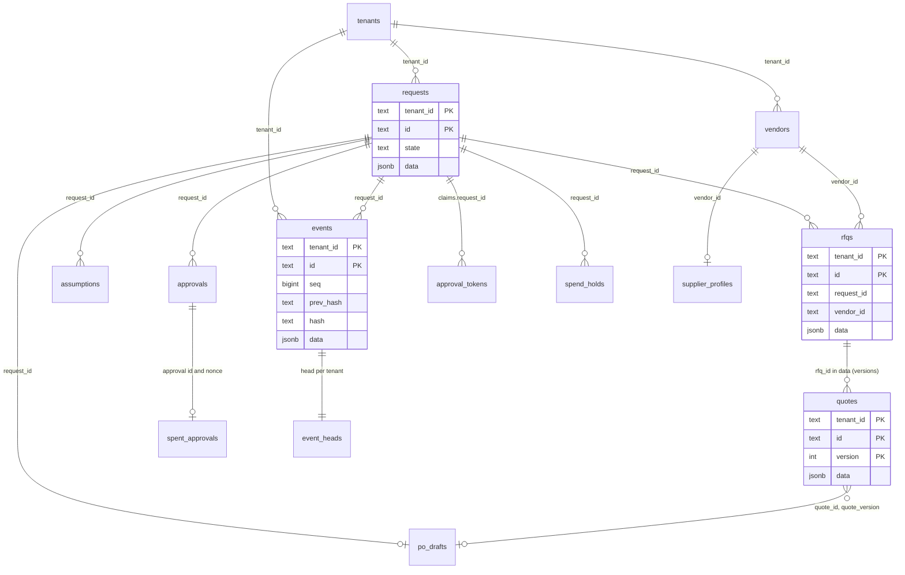
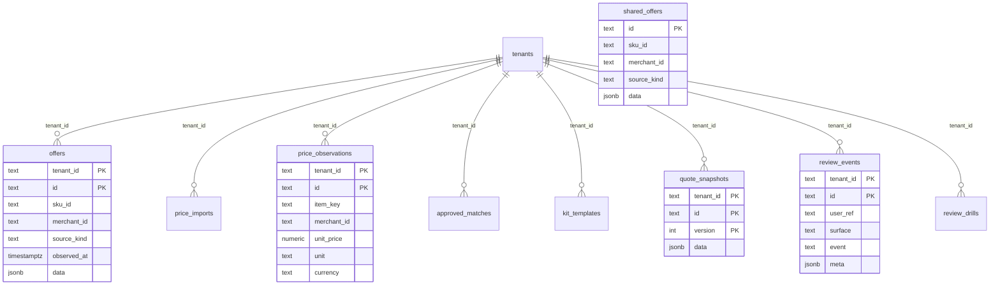

# Data model

Status: the schema after migrations 0001 to 0007, read from a live PostgreSQL 16 database that the migrations were applied to (32 relations). Everything the app stores for a tenant lives behind row-level security.

## Design

- **One generic shape for the purchasing entities.** `requests`, `vendors`, `rfqs`, `quotes`, `approvals`, `standing_rules`, `po_drafts`, `corrections`, `consent_records`, `supplier_profiles` and `assumptions` share the columns `id`, `tenant_id`, `request_id`, `vendor_id`, `state`, `version`, `created_at` and `data jsonb`. The Pydantic model lives in `data`. The other columns are copies kept for indexing and queries.
- **The only foreign key is to `tenants`.** Relationships between entities (a request has RFQs, an RFQ has quotes) are by id inside the rows. The database does not enforce them, the repositories do.
- **Composite primary keys start with `tenant_id`.** Two tenants can use the same id without clashing, and one tenant can never address another's row by id.
- **Row-level security on 30 tables, forced.** Every tenant table has `ENABLE` and `FORCE ROW LEVEL SECURITY` and one policy, `tenant_isolation`, `tenant_id = current_setting('app.tenant_id', true)` for both `USING` and `WITH CHECK`. With no tenant set the setting is `NULL`, so no row is visible and no insert is accepted. `shared_offers` and `alembic_version` have no policy.
- **The app never connects as the owner.** It uses the `app_user` role (`NOSUPERUSER`, `NOBYPASSRLS`, least-privilege grants). `tenant_session` refuses to run if the connected role is a superuser or has `BYPASSRLS` (`PrivilegedRoleError`), so a mistake in the connection string fails loudly.
- **Append-only where history matters.** Grants are narrowed so that rows that are history can be read and inserted but not changed (see the last column of each table below). The audit log is also protected by triggers.
- **Money and quantities in `data` are strings** parsed to `Decimal` in code (hard rule 5). The newer typed tables (`price_observations`, `review_events`, `review_drills`) use `numeric` and CHECK constraints for value sets, id shapes and size limits.
- **Retention deletes are an owner-role job** and are not built.

## Relationships

The first diagram is the purchasing side. The lines are logical (by id), not database foreign keys.



The second diagram is the quote engine and the review telemetry. None of these tables has a link to a purchasing request.



## Tables

### Platform

| Table | Holds | Primary key | The app role may |
|---|---|---|---|
| `alembic_version` | The migration head. | `version_num` | nothing |
| `tenants` | The tenant directory (id, name). Read-only for the app. | `id` | SELECT |

### Purchasing

| Table | Holds | Primary key | The app role may |
|---|---|---|---|
| `approval_tokens` | Issued approval links: signed claims, `consumed`, `po_issued`. Consuming one is a single conditional UPDATE, so exactly one caller wins. | `tenant_id, jti` | SELECT, INSERT, UPDATE |
| `approvals` | Per-message, substitution and standing approvals. Append-only. | `tenant_id, id` | SELECT, INSERT |
| `assumptions` | The assumption ledger: one row per entry of a request. Rows are history, never deleted. | `tenant_id, id` | SELECT, INSERT, UPDATE |
| `consent_records` | Defined, with a repository. No application code writes it yet. | `tenant_id, id` | SELECT, INSERT |
| `corrections` | Defined, with a repository. No application code writes it yet. | `tenant_id, id` | SELECT, INSERT |
| `po_drafts` | Purchase order drafts. Append-only. | `tenant_id, id` | SELECT, INSERT |
| `quotes` | One row per version of a quote read from a reply. Append-only, so a re-read is a new version. | `tenant_id, id, version` | SELECT, INSERT |
| `requests` | One row per purchase request. The `Request` model is in `data`; `state` is a copy of the workflow state for queries. | `tenant_id, id` | SELECT, INSERT, UPDATE, DELETE |
| `rfqs` | One row per message to a supplier: subject, body, reply token and `sent_message_id`. | `tenant_id, id` | SELECT, INSERT, UPDATE, DELETE |
| `rule_uses` | How many times each standing rule has been used. | `tenant_id, rule_id` | SELECT, INSERT, UPDATE |
| `standing_rules` | Standing pre-authorisation rules (R1). Rows can be created and revoked, not edited. | `tenant_id, id` | SELECT, INSERT, DELETE |
| `supplier_profiles` | One row per supplier: the buyer's profile, the admin's verification (who, when, note) and the suppression flag. | `tenant_id, id` | SELECT, INSERT, UPDATE |
| `vendors` | Suppliers: name, domain, contact email, preferred, opted out. | `tenant_id, id` | SELECT, INSERT, UPDATE, DELETE |

### Audit

| Table | Holds | Primary key | The app role may |
|---|---|---|---|
| `event_heads` | Per-tenant chain head: event count and last hash. Written by the append, never by the app role directly. | `tenant_id` | SELECT |
| `events` | The hash-chained audit log. Append-only, enforced by triggers as well as by grants. | `tenant_id, id` | SELECT, INSERT |

### Shared security state

| Table | Holds | Primary key | The app role may |
|---|---|---|---|
| `cap_spend` | Daily aggregate spend per tenant and UTC day. A reservation is one conditional UPDATE (`spent + amount <= cap`). | `tenant_id, day` | SELECT, INSERT, UPDATE |
| `follow_up_plans` | Pre-approved follow-up schedules. Follow-ups are off unless a human schedules them. | `tenant_id, id` | SELECT, INSERT, UPDATE |
| `idempotency_keys` | Stored responses to idempotent writes (2xx only), keyed by tenant and key, with a hash of the request body. | `tenant_id, key` | SELECT, INSERT, DELETE |
| `kill_switches` | The per-tenant kill-switch state. | `tenant_id` | SELECT, INSERT, UPDATE |
| `spend_holds` | Approved-but-undrafted spend (`committed`) and reserved cap spend (`reserved`) per request. Deleted when the spend is released. | `tenant_id, request_id, kind` | SELECT, INSERT, UPDATE, DELETE |
| `spent_approvals` | One row per approval id and per nonce handed to the transport. The primary key is the single-use guarantee. | `tenant_id, key` | SELECT, INSERT |

### Quote engine

| Table | Holds | Primary key | The app role may |
|---|---|---|---|
| `approved_matches` | A customer's approved line-to-product matches, keyed by a signature. Upserted. | `tenant_id, signature` | SELECT, INSERT, UPDATE |
| `kit_templates` | Saved job templates: answers, sizes, option picks. No prices. | `tenant_id, id` | SELECT, INSERT, UPDATE, DELETE |
| `offers` | A tenant's price offers, loaded from price files. | `tenant_id, id` | SELECT, INSERT, DELETE |
| `price_imports` | One append-only report per price-file load. | `tenant_id, seq` | SELECT, INSERT |
| `price_observations` | The customer's own price points over time. Typed columns with CHECK constraints. | `tenant_id, id` | SELECT, INSERT |
| `quote_snapshots` | Saved quote documents, one row per version. Append-only. | `tenant_id, id, version` | SELECT, INSERT |
| `shared_offers` | Public platform price data. No tenant column and no row-level security: the app role can only read it. | `id` | SELECT |

### Telemetry

| Table | Holds | Primary key | The app role may |
|---|---|---|---|
| `review_drills` | Seeded drill cases and the decision a reviewer should make. Append-only. | `tenant_id, id` | SELECT, INSERT |
| `review_events` | Content-free review events. Typed columns with CHECK constraints. Append-only. | `tenant_id, id` | SELECT, INSERT |

Every table that has `tenant_id` also has the `tenant_isolation` policy. `corrections` and `consent_records` have repositories (`PgTenantStore.corrections`, `.consents`) but nothing in the application writes or reads them yet.

## The audit log in the database

`events` is the hash-chained audit log, one chain per tenant.

- `seq` is unique per tenant, and so is `prev_hash`, so a chain cannot fork.
- `events_no_update` (guard), `events_no_delete` and `events_no_truncate` reject changes. The one allowed change is personal-data redaction: `aidb_redact_event(event_id, fields[])` is a `SECURITY DEFINER` function that replaces named values under `data.payload._pii` with `"[REDACTED]"`, takes the tenant from the session setting, and sets a transaction-local flag that the guard trigger checks. The chain hash covers keyed digests of the personal data, not the raw values, so the chain still verifies after a redaction.
- `events_head` is an `AFTER INSERT` trigger (also `SECURITY DEFINER`) that keeps `event_heads` (count and last hash) up to date, so the app role needs only `SELECT` on it.
- The hash is an HMAC under `AUDIT_CHAIN_KEY`, so rewriting a row and its successors requires the key. The export tail can still be truncated with a rewritten head (see [known gaps](../architecture/known-gaps.md)).

## Migrations

| Revision | What it adds |
|---|---|
| `0001_initial` | The `app_user` role, `tenants`, the generic entity tables, `rule_uses`, `events`, `event_heads`, the append-only triggers, the redaction function, RLS and grants. |
| `0002_tenant_directory` | `aidb_list_tenant_ids()`, a `SECURITY DEFINER` function that returns tenant ids only, for the worker's per-tenant fan-out (the app role cannot read `tenants` without a tenant context). |
| `0003_suppliers_assumptions` | `supplier_profiles` and `assumptions`. |
| `0004_stage2_tables` | `offers`, `shared_offers`, `approved_matches`, `price_imports`, `kit_templates`, `quote_snapshots`. |
| `0005_shared_state` | `spent_approvals`, `approval_tokens`, `cap_spend`, `spend_holds`, `kill_switches`, `idempotency_keys`, `follow_up_plans`: what the API and worker processes must agree on. |
| `0006_review_events` | `review_events` and `review_drills`. |
| `0007_price_observations` | `price_observations`. |

Run them with `python -c "from aidb.migrate import upgrade; upgrade('<owner url>')"` (what the compose `migrate` service does). Migrations run as the owner role. A chain written before the keyed hash was introduced fails verification, and no data migration was provided (the project is pre-release).

## How the code reaches the tables

`aidb.session.tenant_session(engine, tenant_id)` is the only way application code gets a connection. It opens a transaction, sets `app.tenant_id` with `set_config(..., true)` (a bound parameter, transaction-local, so nothing leaks into the next use of a pooled connection), and checks in the same round trip that the role cannot bypass RLS.

| In memory (tests, `demo_api.py`) | PostgreSQL |
|---|---|
| `components.core.store` tenant stores | `aidb.repositories.PgStore`, `PgTenantStore`, `PgRepo` (generic `data jsonb` rows) |
| `EventLog` | `PgEventStore` |
| In-memory approval, cap, kill-switch, follow-up and idempotency stores | `aidb.state.PgSharedState`: `PgSpentApprovals`, `PgTokenStore`, `PgCapLedger`, `PgSpendBook`, `PgFollowUpPlans`, `PgKillSwitch`, `PgIdempotencyStore` |
| Quote-engine stores | `aidb.stage2`: `PgOfferStore`, `PgSharedOfferWriter`, `PgApprovedMatchStore`, `PgImportStore`, `PgTemplateStore`, `PgQuoteSnapshotStore` (wired by `apps/api/quote_pg.py`) |
| `InMemoryPriceHistory` | `PgPriceHistory` |
| `InMemoryTelemetryStore` | `PgReviewEvents` |
| The purchasing service's stores | `employees/purchasing/pg_wiring.py`: `PgServiceStore` and `PgTenantFacade`, used by `build_pg_service` |

The Postgres stores satisfy the same `Protocol`s as the in-memory ones, so the services do not know which they have.

## Inspecting a database

`scripts/pg_dev.sh start` starts a throwaway local PostgreSQL 16 for tests and development (trust authentication, no Docker). By default it uses the binaries in `/usr/lib/postgresql/16/bin`, the data directory `/tmp/pg_dev_data` and port 54329; override them with `PG_BIN`, `PG_DATA` and `PG_PORT`, and `scripts/pg_dev.sh url` prints the URL. After migrations:

```sql
-- rows are invisible without a tenant
SELECT count(*) FROM requests;                                 -- 0 as app_user
SELECT set_config('app.tenant_id', 'demo-tenant-a', false);
SELECT id, state FROM requests ORDER BY created_at;

-- is the chain intact? (what GET /v1/audit reports, in SQL form)
SELECT seq, type, left(hash, 12) FROM events WHERE tenant_id = 'demo-tenant-a' ORDER BY seq;

-- which tables force RLS?
SELECT relname, relrowsecurity, relforcerowsecurity FROM pg_class
WHERE relkind = 'r' AND relnamespace = 'public'::regnamespace ORDER BY 1;
```

Connect as `app_user` to see what the application sees, and as the owner to administer. Recomputing a chain hash needs `AUDIT_CHAIN_KEY`, so use `scripts/verify_audit_export.py` on an export rather than SQL.
