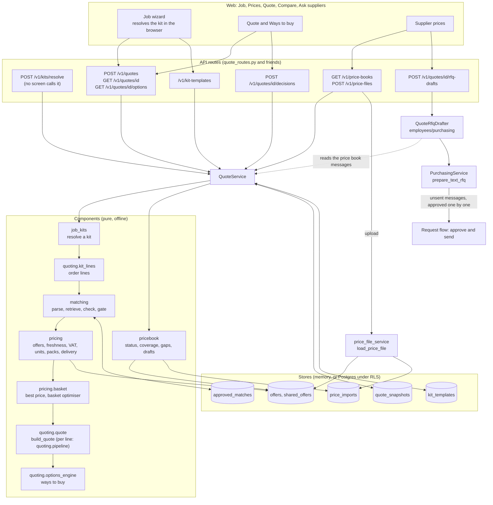

# The quote engine

The quote engine turns a job template and the supplier price files into a priced materials list, ways to buy it, a map of who has prices, and unsent messages asking for the prices that are missing. It is a set of pure, offline components wired together by one service, `apps/api/quote_service.py` (`QuoteService`), behind the `/v1/kits`, `/v1/quotes`, `/v1/price-books`, `/v1/kit-templates` and `/v1/price-files` routes.

It is separate from the request-to-order flow: nothing here uses the request state machine. The one bridge is the unsent text messages, which become requests that go through the normal approval and send path.

Everything in the demo is **synthetic**: fictional merchants, invented prices and a job-kit library that no tradesperson has reviewed. The shipped data exists only for the `uk` profile, and the API starts only with that profile (see Configuration).

## Data flow

## The stages

| Stage | Module | What it does | Key rules |
|---|---|---|---|
| 1. Resolve the kit | `components/job_kits` | Reads a template (modules, lines, questions, rules) and resolves it with the person's answers, measurements and choices into a materials list. | A few upfront questions at most (`max_upfront_questions`, three in the shipped data). Every default and every "don't know" mapping is logged as an assumption with source `default_template`. A line can carry the rule that forced it (`forced_by`); in the shipped data 19 of the 139 module lines do. Formulas are parsed with `ast` against a whitelist and never reach `eval`. Quantities are `Decimal` with an explicit unit, and count units must be whole. |
| 2. Make order lines | `components/quoting/kit_lines.py` (`order_lines_from_kit`) | Turns each kept line into a `LineRequest` (which carries the `OrderLine` the matcher reads), passing the spec text on word for word. Lines the person marked *not needed* or *already have*, and lines with a zero quantity, go to `skipped` with the reason, so the quote can say why a line is absent. | Lines are generic specs, never part numbers (R2). |
| 3. Match | `components/matching` | Parses the line, retrieves candidates from the catalogue index, runs the attribute checks, and lets the decision gate **accept**, send to **review**, or **reject** it. | A line that names an MPN or GTIN and finds a SKU is decided by the identifier branch first. The attribute checks have no off switch. A line that names a brand but no MPN or GTIN must also lead the runner-up by the lead; a generic line (specification only) is accepted as a group of every passing candidate within `group_band` (0.10) of the best, so the pricing step can choose inside it. A marginal accept needs the match judge to confirm, and without a judge it goes to review. Defaults from `profiles/base.yaml`: auto-accept at a score of 0.75 with a lead of 0.05, reject below 0.35, retrieve 50, show 3 in review. A person's approval of one product is stored per customer (`approved_matches`, keyed by a signature) and there is no "none" choice. |
| 4. Price | `components/pricing` | Prices every eligible offer for each matched line: freshness, VAT basis, unit conversion, whole packs, delivery fees and thresholds. | Only a merchant-confirmed quote, a trade-account feed or an attested, dated customer file may feed a firm line. Stale offers are excluded from the best price. An outlier (about three times the median) is held. A price with no stated VAT basis is not compared. |
| 5. Best price and basket | `components/pricing` | Picks one offer per line, then the cheapest complete basket across suppliers with their delivery thresholds. | The basket search is **exact** while a connected group has at most 12 lines with a real choice (`basket_exact_max_lines`) and its work estimate fits `basket_work_budget` (6,000,000 steps). Otherwise it is a heuristic, and the basket says so (`exact: false`, method `heuristic`, note `basket_heuristic`). A way-to-buy built on such a basket carries the flag `not_proven_optimal`. |
| 6. Build the quote | `components/quoting/quote.py` (`build_quote`), with the per-line pricing in `pipeline.py` (`price_request`) and the totals from `components/pricing/quote.py` | Sorts every line into **firm** (priced, in the total), **review** (waiting for a person's choice), **unmatched**, **indicative only** (rough, never in a total), **no offer** or **skipped**, and totals the firm lines. | The totals use `split_total`: net plus VAT equals gross by construction, shown on one stated basis. The partition counts are `priced`, `review`, `unmatched`, `indicative_only`, `no_offer` and `skipped`. |
| 7. Ways to buy | `components/quoting/options_engine.py` | Searches for up to five complete alternative baskets. The API asks for the default kinds: lowest total (`cheapest`), fewest deliveries, fastest, preferred suppliers and a balanced option. A sixth kind, one supplier, exists in the engine and the API does not request it. | It chooses nothing for the buyer. Tolerance, search caps (`max_solver_calls` 64, `max_search_merchants` 8) and weights are `OptionsConfig` defaults, all unsourced placeholders. The preferred option exists only when the request names preferred suppliers (`preferred`, comma separated), and the balanced option only when the buyer supplies a budget, a required-by date or a delivery limit. |
| 8. Price book | `components/pricebook` | Works out who has prices (status ladder from *On request* to *Contract feed*), coverage per supplier, and the gap list. Drafts the text of a request for a missing price. | Computed on each call from the offer store and the tenant's import list. Nothing is stored. |
| 9. Ask suppliers | `employees/purchasing/rfq_from_quote.py` (`QuoteRfqDrafter`) and `PurchasingService.prepare_text_rfq` | Reads the templated messages of the quote's price book (per supplier or per item) and turns them into unsent RFQs, one container request per message. The price book's merchant id must be the id of the tenant's own verified supplier. | R1: a person approves each exact message in the ordinary flow. Only *preferred*, verified, unsuppressed suppliers with no unconfirmed contact change can be asked, by a buyer. No link or markup is allowed in the text. |

Judgement calls are deterministic code. The only model step in the engine is the **match judge**, which can re-order candidates that already passed every check. It is off in the shipped API, and the engine is built without a model. Without one, a marginal accept goes to review.

## What the documents look like

`POST /v1/quotes` stores a snapshot (`quote_snapshots`) and answers `{"id": <snapshot id>, "quote": <document>}`, where the document is `quote-draft-ui/1`. Its keys are snake_case: `partition` (the count in each bucket), `totals`, `firm_lines`, `review_queue`, `indicative_lines`, `unmatched_lines`, `no_offer_lines`, `skipped_lines`, `deliveries` per supplier, `freshness`, `optimisation`, `data_labels` and a `notice` that says it is not a supplier quote. Snapshots are never updated: every save, a new quote or a reviewer's decision, inserts a new id at version 1, and a decision's snapshot names the one it follows in `parent_id`. `GET .../options` re-runs the quote for the saved kit, searches the ways to buy with the query parameters, and answers `quote-options-ui/1`. `GET /v1/price-books` answers `price-books-ui/1`. The schemas are in `profiles/data/{quoting,pricebook,job_kits}/*.schema.json`, and the web app validates each document on read.

## Persistence

| Store | In memory | PostgreSQL |
|---|---|---|
| Offers (per tenant) | `InMemoryOfferStore` | `PgOfferStore` (`offers`) |
| Shared platform prices | seeded in memory in the demo | `PgSharedOfferWriter` (`shared_offers`, written by the owner role only, from `scripts/provision_demo_tenant.py` through `apps/api/quote_provision.py`) |
| Approved matches | `InMemoryApprovedMatchStore` | `PgApprovedMatchStore` (`approved_matches`) |
| Imports | `InMemoryImportStore` | `PgImportStore` (`price_imports`, tenant rows only: the shared price files' summaries are not persisted) |
| Templates | `InMemoryTemplateStore` | `PgTemplateStore` (`kit_templates`, at most 30 per tenant) |
| Quote snapshots | `InMemoryQuoteSnapshotStore` | `PgQuoteSnapshotStore` (`quote_snapshots`) |

With `DATABASE_URL` set, `apps/api/quote_pg.py` builds the Postgres stores, and the quote service records `quote_created`, `match_approved`, `price_file_loaded` and kit-template events in the same hash-chained log as the rest of the system. The synthetic demo prices are loaded by `scripts/provision_demo_tenant.py` (owner role), or into memory when `QUOTE_DEMO_DATA=1` and there is no database.

## Price files

`POST /v1/price-files` (buyer) accepts a `.csv` or `.xlsx`. `apps/api/price_file_service.py` parses it in the API process, with no network, row by row:

- The upload must declare its VAT basis (`inc` or `ex`); without one the request is refused with `422 vat_basis_required`. A row is **quarantined**, never repaired, with a reason: `invalid_price`, `invalid_sku`, `currency_missing`, `invalid_pack_size`, `duplicate_record`, `invalid_offer`, or `vat_basis_unknown` when its own VAT text cannot be read. Outliers (about three times the median), offers whose unit cannot be converted and expired offers are not quarantined at load: they load and are excluded when the line is priced.
- A file only becomes **firm** when the uploader attests that they may use it and gives a valid-until date. Otherwise its offers load as indicative and never reach a total.
- The date check and the replacement of the supplier's earlier offers run only if the file yields at least one offer. A file whose rows are all quarantined is summarised and logged, and replaces nothing.
- The response says how many rows were read, accepted, firm, indicative and quarantined, and why (`reason_counts` and up to a capped list of quarantined rows). The `price_imports` row keeps only the supplier, the tenant, the visibility and the counts of offers and quarantined rows. The file itself is not kept.

Price files enter only as files a person uploads (R7: nothing is fetched). Invoice and statement ingestion, a forwarded-to-alias path, and a separate sandboxed parser service are described in the design documents but **not built**.

## Configuration

`QuoteService` reads the resolved deployment profile (`PricingConfig.from_mapping` and `GatePolicy.from_mapping`), so currency, VAT basis, delivery policy, offer ages and the matching gate come from `profiles/<id>.yaml`, never from constants. It selects data by the profile id:

- matching data from `profiles/data/matching/<id>/` (classification, ontology, catalogue seed),
- the kit library from `profiles/data/job_kits/<id>/`,
- the message templates from `profiles/data/pricebook/` (`request_templates.yaml`, `rfq_templates.yaml`), which is one folder for every profile, not selected by profile id.

Only `uk` has matching and kit data. **With any other profile, the API entrypoint does not start.** `build_quote_service` raises `QuoteUnavailableError` only when the data directory is missing as a `FileNotFoundError`, but `load_classification` wraps that in a `ClassificationError`, so the process stops at start-up with `ClassificationError: cannot read profiles/data/matching/<id>/classification.yaml`. That covers `us` (the default when `DEPLOYMENT_PROFILE` is unset), `uk-scotland` and `uk-ni`. The `503` that the quote routes are meant to answer for a profile without data is therefore never reached. Run the API with `DEPLOYMENT_PROFILE=uk`. Even then the quote routes answer `503` unless there is a catalogue: `QUOTE_DEMO_DATA=1` loads the synthetic seed, and `QUOTE_CATALOGUE_FILE` points at a catalogue file (validated strictly) that wins over the demo seed. `load_catalogue` refuses a file whose `label` does not say the data is synthetic, so the process stops at start-up: **a real catalogue cannot be loaded today** (a gap, listed in the known gaps).

## Known gaps

- `QuoteService.price_books` does not catch `RequestTemplateError`. The buyer name in the drafts is the token's `sub` (and the company is the tenant id) for any tenant that is not a demo one, so a `sub` that looks like an email address or holds markup fails the template's plain-text rule (`buyer_name: links, markup or addresses are not allowed`), and `GET /v1/price-books` answers a generic `500`.
- The web's *After my reviews* view shows the same quote as *First quote* when the app is connected to the API, because no reviewer decisions are replayed into it.
- When the web app is connected to the API, the Quote and Supplier prices pages build their own quote from the job template's sample sizes and defaults each time they open. The sizes and answers entered in the Job wizard do not reach them, and the quote that **Build the quote** saves is not the one they open.
- A real catalogue cannot be loaded: `load_catalogue` refuses any file whose label does not say the data is synthetic. With the `uk` profile and neither `QUOTE_DEMO_DATA` nor a catalogue file, every quote route answers `503`.
- The *Best overall* option cannot be reached from the web app when it is connected to the API: the page sends no budget, date or delivery limit.
- The kit library and its option tags are an unreviewed synthetic seed (`needs_tradesperson_review`). Option compatibility is not rule-checked, and regulated-work gates are only proposed.
- There is no intent step ("quote me a bathroom"), no RFQ packets and no catalogue management screen.

Design detail for each stage: [`job-kits.md`](../architecture/job-kits.md), [`matching-engine.md`](../architecture/matching-engine.md), [`pricing-engine.md`](../architecture/pricing-engine.md), [`quoting.md`](../architecture/quoting.md), [`quote-options.md`](../architecture/quote-options.md), [`pricebook.md`](../architecture/pricebook.md). Activity diagrams for each: [`activity-diagrams.md`](../architecture/activity-diagrams.md) section 4 and 6. The passages of those design documents that described the engine as library-only were corrected on 2026-10-09; each document has a status line.
