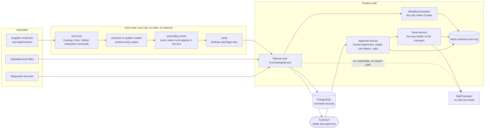

# Security and trust

Rule numbers (R1 to R12) are the hard rules of the product spec, section 4. `CLAUDE.md` numbers the same rules 1 to 7 in shorter form; this page uses the spec's numbering. None of the rules has a configuration key. A deployment profile can tighten behaviour or localise wording, never loosen a rule (`profiles/base.yaml` says so, and the profile validator has no field that could).

## Trust boundaries

Three properties do the heavy lifting:

1. **Nothing leaves without a person.** The planner and service have no way to reach the transport. Only the send-service does, and it accepts only an `Approval` that a human approver was issued for the exact bytes.
2. **Untrusted text never becomes an instruction or a value without a check.** It is made inert, read into a fixed schema, and every value must appear in the source text. A check can add a flag or blank a value. No check fills one in.
3. **State, money and identity are written by one place each.** `Workflow.transition` is the only writer of state. The approval service issues every approval. Tenant and role come only from the verified token.

## The rules and where each is enforced

| Rule | Where in the code | How it is tested |
|---|---|---|
| **R1** no send or order without a recorded human authorisation | `send_service/service.py` (`SendService.send`: the approval must be exactly the registered record, cover the SHA-256 of the exact bytes, be unexpired and unused); `purchase_orders/approvals/service.py` (`NotHumanApprover`: an approver must be a human `user:` actor); `rfq/workflow/machine.py` (`RFQ_APPROVED`, `APPROVED`, `DECLINED` need a human actor, or a standing rule for `RFQ_APPROVED`); follow-ups default off (`comms.followups_default_enabled` is the literal `False`). The planner graph (`employees/purchasing/graph.py`) and the tools (`tools.py`) import neither the send-service, the approval service nor the transport, and `PurchasingService` reaches mail only through `SendService`. | `tests/sendservice`, `tests/approvals`, `tests/workflow` |
| **R2** no auto-substitution across tiers | `purchase_orders/approvals` `check_r2`, called by `PurchasingService.create_po_draft`: the part must be an approved Tier A candidate, or have a substitution approval for that candidate and quote version. `select_quote` refuses Tier D. | `tests/approvals`, `tests/pack` |
| **R3** no claim without provenance | `core/domain.py`: every `Attribute` has a source and a confidence; `AttrSource.MODEL_INFERENCE` can never satisfy a critical attribute (`parts/spec/normaliser.py`, `parts/equivalence/engine.py`, `matching/checks.py`). Explanations are templates over ids (`rfq/comparison/compare.py` reasons, `quoting/options_reasons.py`). Every default is an `Assumption` row. | `tests/spec`, `tests/equivalence`, `tests/comparison` |
| **R4** ask rather than guess, at most two questions | `parts/spec/normaliser.py` (`MAX_QUESTIONS = 2`), `PurchasingService._apply_spec` moves to `ESCALATED` with a reason. | `tests/spec`, `tests/pack` |
| **R5** authenticity is tri-state | `core/domain.py` `Authenticity` on every `Quote` and `ComparisonRow`. The current screens do not display it. | `tests/comparison` |
| **R6** vendor content is untrusted | `rfq/quotes/inert.py` (inert text), `extractors.py` (schema-only reader, no tools), `grounding.py` (`ground`: a value not found in the text is blanked and flagged), `doc_parse/sandbox.py`, `verify/` (findings only). | `tests/quotes`, `tests/doc_parse`, `tests/security`, `tests/verify` |
| **R7** no link fetching or scraping | No module under `packages`, `apps` or `employees` imports an HTTP client or opens a socket. Replies are shown as plain text. CSV and PO output escapes `=`, `+`, `-` and `@` (`csv_cell`). The one outbound call at run time is PyJWT fetching signing keys from `SUPABASE_JWKS_URL`, when that is configured. | `tests/security`, `apps/web/tests` (no `innerHTML`, no ``) |
| **R8** AI disclosure and authority limits | `send_service/message.py` and `service.py`: the footer is mandatory (`footer_missing`) and the profile's identity lines too (`identity_missing`), checked at prepare and again at send. | `tests/sendservice`, `tests/profiles` |
| **R9** money handled safely | `Decimal` everywhere; money in `data jsonb` is a string. Per-order and daily caps: `purchase_orders/approvals` `CapPolicy`, booked in `cap_spend` and `spend_holds` by one conditional `UPDATE` each. `normalise_quote` keeps the currency and VAT basis explicit. | `tests/approvals`, `tests/quotes`, `tests/pricing` |
| **R10** tenant isolation | Row-level security on 30 tables with `FORCE`, the `app_user` role, `tenant_session` (refuses a privileged role). Tenant-scoped repositories raise `TenantIsolationError`. The tenant comes from the token. | `tests/aidb/test_rls.py`, `tests/security` |
| **R11** approval links are non-forgeable | `purchase_orders/approvals/service.py`: an `itsdangerous` signed token bound to approver, quote version, quote hash and action; single use; short expiry; separation of duties above the threshold. `GET` renders only. | `tests/approvals` |
| **R12** vendor identity | `PurchasingService.ingest_inbound_reply`: domain match and DMARC alignment, else quarantine (`dmarc_fail`). Per-RFQ signed reply token. Domain or contact changes are admin-only and set a pending call-back (`vendor_pending_callback` quarantines the supplier). | `tests/pack`, `tests/suppliers` |

Not everything in the spec's enforcement column is built as written. The differences are in [known gaps](../architecture/known-gaps.md): the call-back confirmation has no endpoint, authenticity is not shown, DMARC is a boolean reported by a provider that does not exist yet, and there are no per-tenant encryption keys.

## Authentication and authorisation

- **Authentication** is a JWT (`apps/api/auth.py`, see the [API reference](04-api-reference.md#authentication)). Algorithms are pinned, `exp`, `sub` and `aud` are required, and test-mode tokens are accepted only when `ENV` is `test`, `dev` or `local`.
- **Authorisation** is a role (`requester` < `buyer` < `admin`) from the token, checked in the route dependency **and again in the service** (`require(ctx, Role.X)`), so a service call that skips the route still refuses. A requester sees only their own requests (`_load_request`).
- **Actors** in the audit log are `user:`, `agent` (the planner and extractors) and `system` (the machine's own moves). Only `user:` actors can approve.
- The approval link page needs no token to read, and a bearer token (buyer or above, and the issued approver) to decide.
- **The web app has no sign-in screen.** It sends a token it is given (`NEXT_PUBLIC_DEV_TOKEN` in development builds, which is removed from production bundles). The role shown on screen is decoded from that token for display only; the server decides.

## Where a model can be used

Four places can call a language model, all through one port, `LLMProvider.complete_json(system, user, schema)`. **None is switched on** in the shipped API or demo, and the repository has no production client (only `FakeLLM`, and a stand-in in the matching eval).

| Place | Code | It is asked to | It can never | What re-checks it |
|---|---|---|---|---|
| Quote reader | `rfq/quotes/extractors.py` `LLMQuoteExtractor` | Copy up to 12 named fields word for word, or null. | Calculate, convert, infer, follow instructions, call tools. | Inert text in, schema out, defensive parse, word-for-word grounding, a second reading compared field by field, verification flags. A person selects and approves. |
| Match judge | `matching/judge.py` `MatchJudge` | Order up to five candidates that already pass every check, twice, the second time reversed. | Accept a line alone, introduce an id, supply a confidence. | Unknown ids discarded, the two orderings must agree, the checks re-run on the top pick, the gate decides. |
| Ontology builder | `matching/ontology_builder.py` | Propose product types and synonyms from catalogue titles. | Change the ontology, set a status. | The same validator as seed data; a person applies proposals. No call site outside tests. |
| RFQ intro sentence | `employees/purchasing/graph.py` `_intro` | Write one polite sentence. | Add links, prices or other content. | Letters, digits and a few marks only, 200 characters at most, else a default; a person reads the exact text. Only the planner graph calls it, and only tests run the graph. |

A hosted embedding model behind the `Embedder` protocol is possible and not built. The embedder in the code is deterministic feature hashing. Accuracy, latency and cost of live calls are **not measured**, because there is no client. Section 7 of [`activity-diagrams.md`](../architecture/activity-diagrams.md) lists the decisions that deliberately use no model.

## Keys and secrets

| Name | Used for | Rule |
|---|---|---|
| `AUDIT_CHAIN_KEY` | HMAC key of the audit chain | 16 or more characters, **required** with `DATABASE_URL`, identical in every process. Without a database an ephemeral random key is used and chains do not verify across restarts. |
| `AUDIT_PII_KEY` | Keyed digests of personal data in events | Optional. Derived from the chain key when unset. |
| `APPROVAL_SECRET` | Signs approval-link tokens. Reply tokens use a key derived from it, so rotating it invalidates outstanding reply tokens. | 16 or more characters, **required** with `DATABASE_URL`. |
| `INBOUND_WEBHOOK_SECRET` | HMAC of the inbound webhook | 32 or more characters, else the endpoint is off. |
| `SUPABASE_JWT_SECRET` or `SUPABASE_JWKS_URL` | Verifying user tokens | A secret needs 32 or more characters. |
| `TEST_AUTH_SECRET` | Test-mode tokens | 32 or more characters, and only in `test`, `dev` or `local`. |
| Database passwords | `rfq_owner` (migrations, provisioning, backup) and `app_user` (the app) | Generated by `deploy/docker/gen-secrets.sh` into an uncommitted `.env`. |

The telemetry reviewer key is derived from the chain key, so stored reviewer references stay comparable across restarts. There are **no mail credentials** anywhere, because no real transport exists.

## The audit log

The hash of each event is `HMAC-SHA256(AUDIT_CHAIN_KEY, prev_hash + "|" + canonical_json(envelope))`, one chain per tenant. In the database, triggers reject updates, deletes and truncation (apart from personal-data redaction), `seq` and `prev_hash` are unique so the chain cannot fork, and a trigger keeps the head. See [data model](03-data-model.md#the-audit-log-in-the-database).

- `GET /v1/audit` verifies the chain and returns `chain_valid`.
- `GET /v1/audit/export` returns a file. The key is not in it. `AUDIT_CHAIN_KEY=<key> python scripts/verify_audit_export.py export.json` recomputes every hash and link offline (exit 0 verified, 1 mismatch, 2 unreadable, 3 no key). With `--linkage-only` it checks structure only and says so.
- The worker task `worker.verify_audit_chain` re-verifies per tenant on a schedule.
- Known limit: the export's tail can be truncated and its head rewritten and still verify, so sign the export manifest or compare the head out of band.

## What is still open

The security-relevant items, with their identifiers in [known gaps](../architecture/known-gaps.md):

- **H2** (blocks production): the global kill switch is process-local; the threshold aggregate and idempotency replay are not atomic; the prepared-message cache and the approval-link notifier are per process; multi-step operations are separate transactions; there is no real transport or inbound provider.
- A single admin confirms a supplier, a call-back, a go-live and a kill-switch change. There is no second-person confirmation yet.
- No per-tenant encryption keys. Operator access is a role, not a just-in-time, logged grant.
- Company details on messages come from deployment settings. There is no table, no screen, no audit event for a change, and no check against a register.
- `/openapi.json` is served without authentication.
