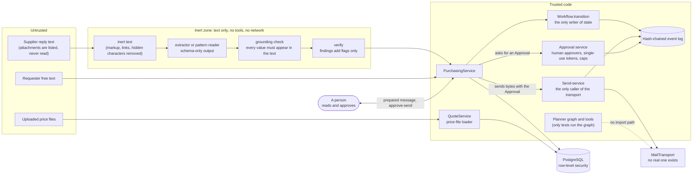

# Security and trust

Rule numbers (R1 to R12) are the hard rules of the product spec, section 4. `CLAUDE.md` has seven compressed rules numbered 1 to 7: its rules 1 to 3 are R1 to R3, rule 4 covers R6 and R7, rule 5 is R9, rule 7 is R10, and rule 6 (only the workflow module writes state) has no R number. R4, R5, R8, R11 and R12 have no rule of their own there. This page uses the spec's numbering.

No rule has an on/off key, and `profiles/base.yaml` says a profile may localise and tighten but never loosen. The profile validator enforces that only in part. It fixes some values (follow-ups cannot default on, marketing mail cannot be allowed). It does not stop a tenant override from raising the approval thresholds and spend caps, and its footer check looks for three phrases only. Both are described under [What is still open](#what-is-still-open). On this page, *latent* means that nothing in the repository can trigger the problem today, but the guard that would stop it is missing.

## Trust boundaries

Solid arrows show where content or a call goes. The dashed arrow is a path that does not exist. A supplier reply reaches `PurchasingService` as text only, either pasted by a buyer (`POST /v1/requests/{request_id}/quotes/inbound`) or delivered by the signed inbound webhook (`POST /v1/inbound/quotes`), and it passes the inert zone first. Its attachments never enter: `LocalTextParser` only lists them (flag `attachments:listed_not_parsed`), and the worker task that would call it, `worker.parse_inbound_message`, has no inbound source wired in `apps/worker/worker_main.py`. A price file goes to `QuoteService` (`POST /v1/price-files`, `load_price_file` in `apps/api/price_file_service.py`). It does not pass the quote reader or `PurchasingService`. On a send, `PurchasingService.approve_send` asks the approval service for an `Approval` (`issue_per_message_approval`) and then hands it, with the prepared bytes, to `SendService.send`. The approval service does not call the send-service.

Three properties do the heavy lifting:

1. **Nothing leaves without a person.** Only the send-service calls the transport (`tests/security/test_static_scan.py` checks that no other module in `packages`, `apps`, `employees` or `evals` names `MailTransport` or calls `.deliver`, apart from the port definition and the test double). The planner graph and the tools have no import path to the send-service, the approval service or the transport. `PurchasingService` does hold the send-service: it asks the approval service for an `Approval` and passes that and the prepared bytes to `SendService.send`, and it never calls the transport itself. `SendService.send` accepts only an `Approval` that the approval service registered, that covers the SHA-256 of the exact bytes, and that is unexpired and unused. The approval is a per-message approval from a person or a standing approval under a rule a person created. One latent exception: follow-ups are built and sent at run time by `SendService._send_follow_up` without an `Approval` for those bytes (see [What is still open](#what-is-still-open)).
2. **Untrusted text never becomes an instruction or a value without a check.** It is made inert, read into a fixed schema, and every value must appear in the source text. A check can add a flag or blank a value. No check fills one in. Of a supplier's email, only the text of a reply is read: attachments are listed, not read.
3. **State, money and identity are written by one place each.** `Workflow.transition` is the only writer of state. The approval service issues every approval. Tenant and role come only from the verified token.

## The rules and where each is enforced

| Rule | Where in the code | How it is tested |
|---|---|---|
| **R1** no send or order without a recorded human authorisation | `send_service/service.py` (`SendService.send`: the approval must be exactly the registered record, cover the SHA-256 of the exact bytes, be unexpired and unused); `purchase_orders/approvals/service.py` (`NotHumanApprover`, raised through `is_human_actor`, a deny-list: see [What is still open](#what-is-still-open)); `rfq/workflow/machine.py` (`RFQ_APPROVED`, `APPROVED` and `DECLINED` need an actor that starts with `user:`; `RFQ_APPROVED` also accepts the actor `system` with a `rule_id`; the machine does not look the rule up, and `SendService._check_standing` checks it at send time). Follow-ups are off because `SendService.prepare` defaults to `NO_FOLLOW_UPS` and `PurchasingService` passes no schedule. The profile key `comms.followups_default_enabled` can only be `False`, and no runtime code reads it. The planner graph (`employees/purchasing/graph.py`) and the tools (`tools.py`) import neither the send-service, the approval service nor the transport. `PurchasingService` holds the send-service and reaches mail only through it. | `tests/security`, `tests/sendservice`, `tests/approvals`, `tests/workflow`, `tests/pack/test_platform.py` (the graph) |
| **R2** no auto-substitution across tiers | `check_r2` in `employees/purchasing/service.py`, called by `PurchasingService.create_po_draft`: the part must be an approved Tier A candidate, or have an unexpired substitution approval for that candidate, quote version, request and quote (minted by `ApprovalService.issue_substitution_approval` in `purchase_orders/approvals`). `select_quote` refuses Tier D. | `tests/approvals`, `tests/pack` |
| **R3** no claim without provenance | `core/domain.py`: every `Attribute` has a source and a confidence; `AttrSource.MODEL_INFERENCE` can never satisfy a critical attribute (`parts/spec/normaliser.py`, `parts/equivalence/engine.py`, `matching/checks.py`). Explanations are templates over ids (`rfq/comparison/compare.py` reasons, `quoting/options_reasons.py`). Rule defaults and model inferences in a part's specification, and the profile's quote-basis default, are `Assumption` rows (`employees/purchasing/mvp.py`: `assumption_rows_for`, `_record_quote_basis_assumption`). Defaults made while reading a supplier quote are flags on the `Quote` instead (`uom_assumed_each`, `currency_assumed_*`, `tax_basis_assumed`, `lead_time_working_days_assumed`). | `tests/spec`, `tests/equivalence`, `tests/comparison` |
| **R4** ask rather than guess, at most two questions | `parts/spec/normaliser.py` (`MAX_QUESTIONS = 2`), `PurchasingService._apply_spec` moves to `ESCALATED` with a reason. | `tests/spec`, `tests/pack` |
| **R5** authenticity is tri-state | `core/domain.py` `Authenticity` on every `Quote` and `ComparisonRow`. `normalise_quote` sets `vendor_claimed` or `unknown`. No caller passes `authenticity_claim_verified`, so the app never sets `verified`. The current screens do not display it. | `tests/quotes` (`test_normalise.py`, `test_extractors.py`) |
| **R6** vendor content is untrusted | `rfq/quotes/inert.py` (inert text), `extractors.py` (schema-only reader, no tools), `grounding.py` (`ground`: a value not found in the text is blanked and flagged), `verify/` (findings only). `doc_parse/sandbox.py` only validates a result that a sandboxed parser would return (`sandbox_result_to_document`). No sandbox exists: `LocalTextParser` runs in the API or worker process, and an email's attachments are listed, never parsed. | `tests/quotes`, `tests/doc_parse`, `tests/verify` |
| **R7** no link fetching or scraping | No Python module under `packages`, `apps` or `employees` imports an HTTP client, `socket`, `ssl` or an SMTP module (checked with a scan of every import; no single test covers all three directories). The web app's `fetch` calls go only to the configured API (`NEXT_PUBLIC_API_URL`), and its content security policy (`apps/web/security-policy.mjs`) allows connections to the page origin and the API origin and images from the page origin and `data:`. Replies are shown as plain text. CSV and PO output escapes `=`, `+`, `-` and `@` (`csv_cell`). The one outbound call at run time is PyJWT fetching signing keys from `SUPABASE_JWKS_URL`, when that is configured. | Import scans per package (`tests/pricing`, `tests/pricebook`, `tests/quoting`, `tests/matching`, `tests/job_kits`); `tests/pack/test_rules.py` (CSV escaping); `apps/web/tests/api.test.ts` (no `innerHTML`, no ``) |
| **R8** AI disclosure and authority limits | `send_service/message.py` and `service.py`: the footer is mandatory (`footer_missing`) and the profile's identity lines too (`identity_missing`), checked at prepare and again at send. The footer wording is the profile key `legal.disclosure_footer`, and the validator checks three phrases only (see [What is still open](#what-is-still-open)). | `tests/sendservice`, `tests/profiles` |
| **R9** money handled safely | `Decimal` everywhere; money in `data jsonb` is a string. Per-order and daily caps: `CapPolicy` in `purchase_orders/approvals`. The daily total is booked in `cap_spend` by one conditional `UPDATE` (`PgCapLedger.reserve` in `packages/aidb/state.py`; an in-memory ledger without a database). The approval-threshold totals in `spend_holds` are written by `INSERT ... ON CONFLICT DO UPDATE` and `DELETE`, and `select_quote` reads then writes them, so they are not atomic across processes (H2). `normalise_quote` keeps the currency and VAT basis explicit. | `tests/approvals`, `tests/quotes`, `tests/pricing` |
| **R10** tenant isolation | Row-level security on 30 tables with `FORCE`, the `app_user` role, and `tenant_session` (`packages/aidb/session.py`), which raises `PrivilegedRoleError` when the role is a superuser or has `BYPASSRLS`. Such a role bypasses RLS (the compose stack's `rfq_owner` is a superuser), so the app connects as `app_user`. `FORCE` applies the policies to a table owner that has neither attribute. Tenant-scoped repositories raise `TenantIsolationError`. The tenant comes from the token. | `tests/aidb/test_rls.py`, `tests/security` |
| **R11** approval links are non-forgeable | `purchase_orders/approvals/service.py`: an `itsdangerous` signed token bound to approver, quote version, quote hash and action; single use; short expiry; separation of duties above the threshold. `GET` renders only. | `tests/approvals` |
| **R12** vendor identity | `PurchasingService.ingest_inbound_reply`: domain match and DMARC alignment, else quarantine (`dmarc_fail`). Per-RFQ signed reply token. Domain or contact changes are admin-only and set a pending call-back (`vendor_pending_callback` quarantines the supplier). | `tests/pack` (`test_rules.py`, `test_review_fixes.py`, `test_mvp_suppliers.py`) |

Not everything in the spec's enforcement column is built as written. The differences are under [What is still open](#what-is-still-open): the call-back confirmation has no route, authenticity is not shown, DMARC is a boolean reported by a provider that does not exist yet, and there are no per-tenant encryption keys.

## Authentication and authorisation

- **Authentication** is a JWT (`apps/api/auth.py`, see the [API reference](04-api-reference.md#authentication)). Algorithms are pinned, `exp`, `sub` and `aud` are required, and test-mode tokens are accepted only when `ENV` is `test`, `dev` or `local`.
- **Authorisation** is a role (`requester` < `buyer` < `admin`) from the token. It is checked in the route dependency. `PurchasingService` and its `MvpOps` mixin check it again with `require(ctx, Role.X)`, so a call that skips the route still refuses. `QuoteService`, the price-file loader (`load_price_file`) and the telemetry routes have no check in the service layer: the route dependency alone enforces their roles. A requester sees only their own requests (`_load_request`).
- **Actors** in the audit log are `user:`, `agent` (the purchasing service's automated steps, such as reading a request or a quote) and `system` (the move to `RFQ_SENT` after a delivery, the move to `APPROVAL_PENDING`, a suppression after a stop reply, and the send-service's own events). The state machine lets only an actor that starts with `user:` move a request to `RFQ_APPROVED`, `APPROVED` or `DECLINED`, with one exception: `RFQ_APPROVED` also accepts `system` with a `rule_id` (a standing rule; nothing in the app creates one). The approval service is looser: `is_human_actor` refuses an actor only when its first word is `agent`, `system`, `operator`, `planner`, `bot` or `service`. The service passes `ctx.actor`, which is `user:` from the verified token.
- The approval link page needs no token to read, and a bearer token (buyer or above, and the issued approver) to decide.
- **The web app has no sign-in screen.** It sends a token it is given (`NEXT_PUBLIC_DEV_TOKEN` in development builds, which is removed from production bundles). The role shown on screen is decoded from that token for display only; the server decides.

## Where a model can be used

Four places can call a language model, all through one port, `LLMProvider.complete_json(system, user, schema)`. **None is switched on** in the shipped API or demo, and the repository has no production client (only `FakeLLM`, and a stand-in in the matching eval).

| Place | Code | It is asked to | It can never | What re-checks it |
|---|---|---|---|---|
| Quote reader | `rfq/quotes/extractors.py` `LLMQuoteExtractor` | Copy up to 12 named fields word for word, or null. | Calculate, convert, infer, follow instructions, call tools. | Inert text in, schema out, defensive parse, word-for-word grounding, a second reading compared field by field, verification flags. A person selects and approves. |
| Match judge | `matching/judge.py` `MatchJudge` | Order up to five candidates that already pass every check, twice, the second time reversed. | Accept a line alone, introduce an id, supply a confidence. | Unknown ids discarded, the two orderings must agree, the checks re-run on the top pick, the gate decides. |
| Ontology builder | `matching/ontology_builder.py` | Propose product types and synonyms from catalogue titles. | Change the ontology, set a status. | The same validator as seed data; a person applies proposals. No call site outside tests. |
| RFQ intro sentence | `employees/purchasing/graph.py` `_intro` | Write one polite sentence. | Add links, prices or other content. | Letters, digits and a few marks only, 200 characters at most, else a default; a person reads the exact text. Only the planner graph calls it, and only tests run the graph. |

A hosted embedding model behind the `Embedder` protocol is possible and not built. The embedder in the code is deterministic feature hashing. Accuracy, latency and cost of live calls are **not measured**, because there is no client. Section 7 of [`activity-diagrams.md`](../architecture/activity-diagrams.md) lists the decisions that deliberately use no model.

## Keys and secrets

| Name | Used for | Rule |
|---|---|---|
| `AUDIT_CHAIN_KEY` | HMAC key of the audit chain | 16 or more characters. The API **requires** it with `DATABASE_URL`, and it must be identical in every process. Without a database it is optional: an unset key becomes a random key for that process, and chains do not verify across restarts. The worker builds its event store from the environment alone: an unset key is random per process outside production and an error under `ENV=production`, so set it to the API's value. |
| `AUDIT_PII_KEY` | Keyed digests of personal data in events | Optional in the API: derived from the chain key when unset. The worker does not derive it: unset, its key is random per process outside production. Set `AUDIT_PII_KEY` to the same value in the API and the worker (`apps/worker/README.md`). |
| `APPROVAL_SECRET` | Signs approval-link tokens. Reply tokens use a key derived from it, so rotating it invalidates outstanding reply tokens. | 16 or more characters, **required** with `DATABASE_URL`. |
| `INBOUND_WEBHOOK_SECRET` | HMAC of the inbound webhook | 32 or more characters, else the endpoint is off. |
| `SUPABASE_JWT_SECRET` or `SUPABASE_JWKS_URL` | Verifying user tokens | A secret needs 32 or more characters. |
| `TEST_AUTH_SECRET` | Test-mode tokens | 32 or more characters, and only in `test`, `dev` or `local`. |
| Database passwords | `rfq_owner` (migrations, provisioning, backup) and `app_user` (the app) | Generated by `deploy/docker/gen-secrets.sh` into an uncommitted `.env`. |

With `DATABASE_URL`, the telemetry reviewer key is derived from the chain key, so stored reviewer references stay comparable across restarts. There are **no mail credentials** anywhere, because no real transport exists.

## The audit log

The hash of each event is `HMAC-SHA256(AUDIT_CHAIN_KEY, prev_hash + "|" + canonical_json(envelope))`, one chain per tenant. In the database, triggers reject updates, deletes and truncation (apart from personal-data redaction), `seq` and `prev_hash` are unique so the chain cannot fork, and a trigger keeps the head. See [data model](03-data-model.md#the-audit-log-in-the-database).

- `GET /v1/audit` verifies the chain and returns `chain_valid`.
- `GET /v1/audit/export` returns a file. The key is not in it. `AUDIT_CHAIN_KEY=<key> python scripts/verify_audit_export.py export.json` recomputes every hash and link offline (exit 0 verified, 1 mismatch, 2 unreadable, 3 no key). With `--linkage-only` it checks structure only and says so.
- The worker task `worker.verify_audit_chain` re-verifies per tenant on a schedule. No deployment in the repository runs the worker ([deployment](08-deployment-and-operations.md)).
- Known limit: the export's tail can be truncated and its head rewritten and still verify, so sign the export manifest or compare the head out of band.

## What is still open

The security-relevant items, with their identifiers where [known gaps](../architecture/known-gaps.md) has one:

- **H2** (blocks production; `REMAINING_H2` in `apps/api/asgi.py` lists six items): the global kill switch is process-local; the threshold aggregate and idempotency replay are not atomic; the prepared-message cache and the approval-link notifier are per process; multi-step operations are separate transactions; there is no real transport or inbound provider.
- **L5**: transport isolation is by convention. The send-service and the rest of the service run in one Python process, so any code in it can import the transport (`PurchasingService` already imports `RecordingTransport`). A separate process that holds the mail credentials is needed.
- DMARC is a boolean (`dmarc_aligned`) in the signed inbound webhook. This repository evaluates no SPF, DKIM or DMARC, and no inbound provider exists.
- A single admin confirms a supplier, a call-back and a go-live, and can engage or release the kill switch alone. There is no second-person confirmation yet. The call-back confirmation (`PurchasingService.confirm_vendor_contact`) has no route.
- Company details on messages come from deployment settings. There is no table, no screen, no audit event for a change, and no check against a register.
- `/openapi.json` is served without authentication (row 14 of the [defects table](../architecture/known-gaps.md#found-while-writing-the-documentation-2026-10-09)).
- **The footer check is shallow** (row 31 of the defects table). `legal.disclosure_footer` (R8) must contain "AI assistant", "cannot accept terms" and "{buyer}", ignoring case (`REQUIRED_FOOTER_CLAUSES` and `_footer_keeps_invariants`). A footer that has those phrases but drops the sentence that only a purchase order binds the buyer still loads. The shipped profiles carry the whole sentence, and a tenant cannot override the footer.

Limits of the build against the design. Rows 36 to 38 of the [defects table](../architecture/known-gaps.md#found-while-writing-the-documentation-2026-10-09) record them as design limits, not defects. The [architecture README](../architecture/README.md#where-the-code-differs-from-this-design) states the first of the three, and [MASTER, section 4.8](../MASTER.md#48-security-logging-and-onboarding-platform-services) lists the first two as gaps:

- There are no per-tenant encryption keys.
- There is no just-in-time, logged operator access. The code has no operator role (the roles are `requester`, `buyer` and `admin`), and `operator` appears only as an actor prefix that the approval service refuses.
- Authenticity (R5) is stored on each quote and returned by the API, but no screen shows it, and the app never sets it to `verified`.

Latent gaps. Nothing in the repository can trigger these today, but the guard that would stop each one is missing:

- **Tenant overrides can raise the numbers that rules use** (row 28). `approvals.threshold` and `approvals.daily_aggregate_threshold` (R11), and `caps.per_order_max` and `caps.daily_aggregate_max` (R9), are in `TENANT_OVERRIDABLE` (`packages/aiplat/profile.py`) and are bounded only by "greater than zero". An override of `approvals.threshold` to 1000000 loads. Only tests pass tenant overrides. A tenant cannot override `comms.followups_default_enabled` or `legal.disclosure_footer`.
- **`is_human_actor` is a deny-list** (row 32; `purchase_orders/approvals/service.py`). It splits the actor at `:`, `@`, `/`, `-` or a space and refuses the first word only if it is `agent`, `system`, `operator`, `planner`, `bot` or `service`. Any other string passes, for example `alice`, `buyer@acme.example` (a test asserts this one), `extractor` or `llm`. The state machine is stricter (it needs the `user:` prefix). The service passes `ctx.actor` (always `user:`) and the configured approvers (default `user:approver-1`), so no current path reaches the gap.
- **Follow-up bytes have no `Approval` of their own** (row 33). `SendService._send_follow_up` builds each follow-up at run time from the stored original and a fixed text (`FOLLOW_UP_BODY`) and sends it through the transport. The original approval covers the schedule (count and interval, in a header of the approved message), not those bytes. Before each send the method re-checks the vendor, the opt-out flag and the identity lines. The footer is added when the message is built. `run_due_follow_ups` skips a tenant whose kill switch is engaged. `PurchasingService` passes no schedule and `SendService.prepare` defaults to `NO_FOLLOW_UPS`, so no follow-up plan is ever created.
- **Standing pre-authorisations are not wired.** `StandingRuleEngine` in `purchase_orders/approvals` creates rules and mints `standing` approvals, and `SendService._check_standing` checks them at send time. No route, service method or script calls the engine, and only tests do. The state machine accepts `RFQ_APPROVED` from the actor `system` with any non-empty `rule_id` and does not look the rule up. Nothing writes that transition today.
