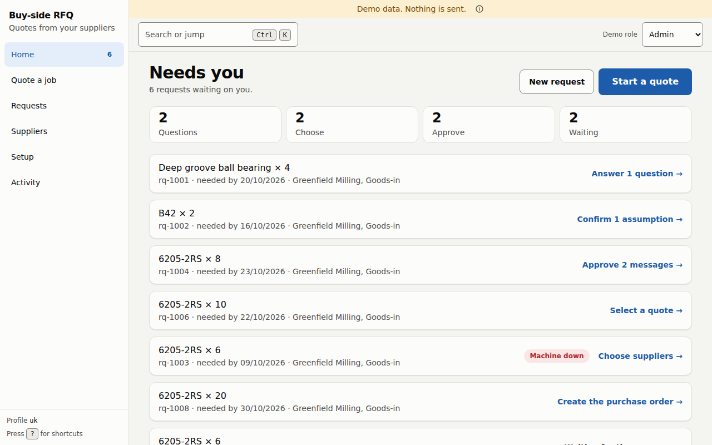
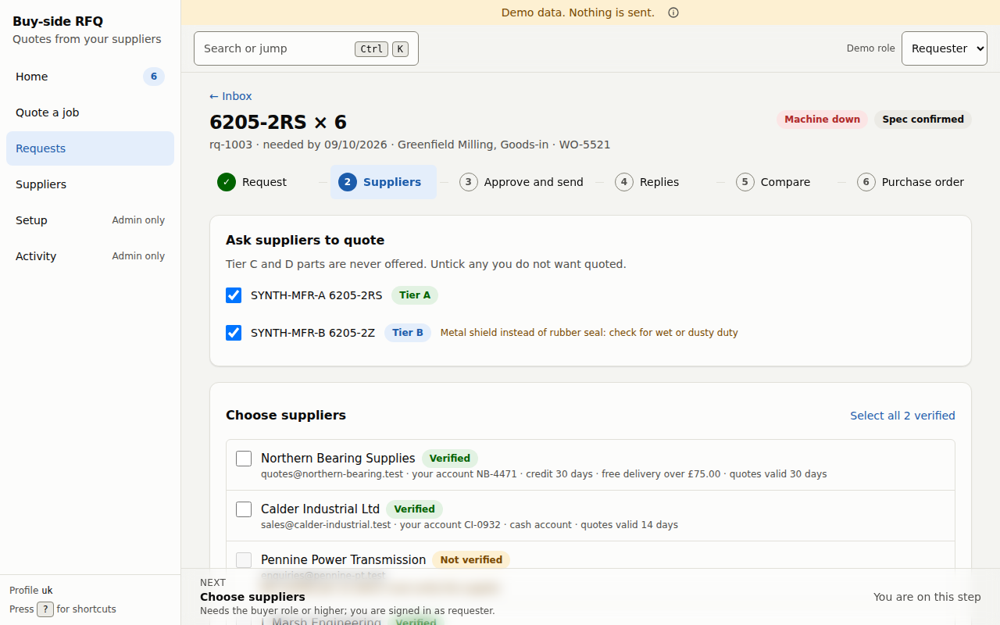
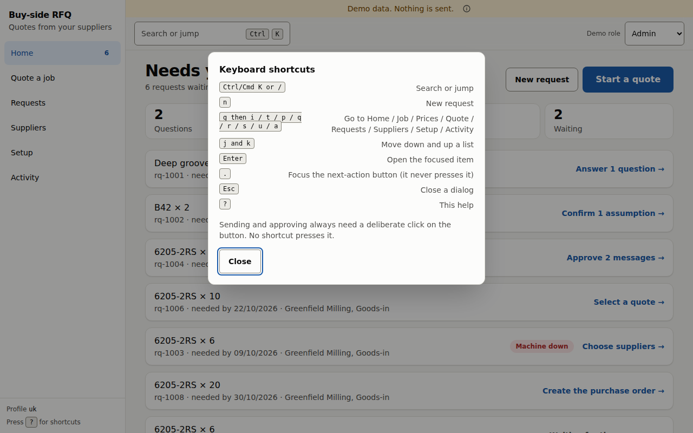
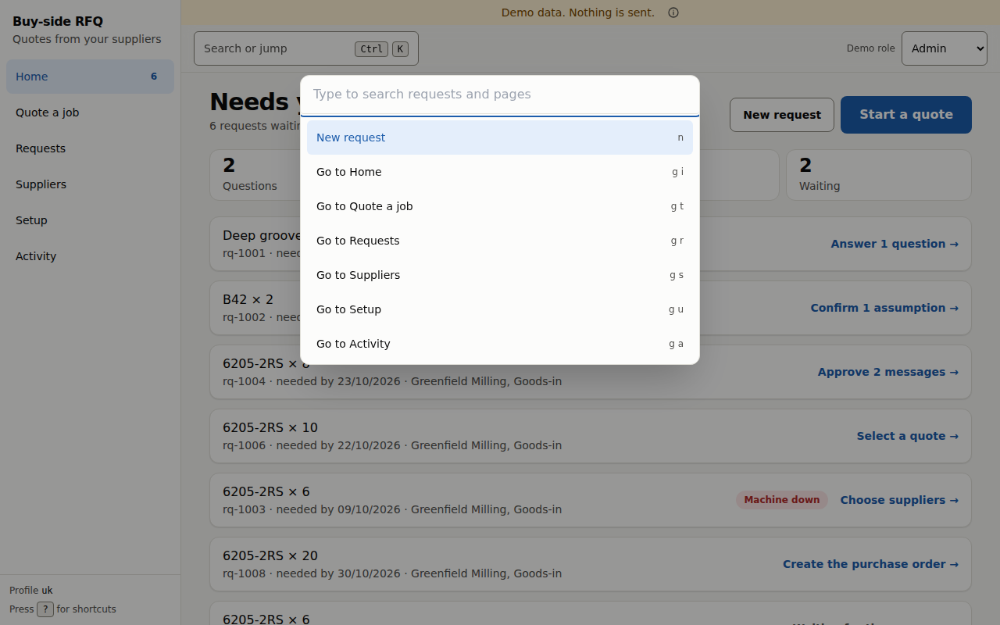
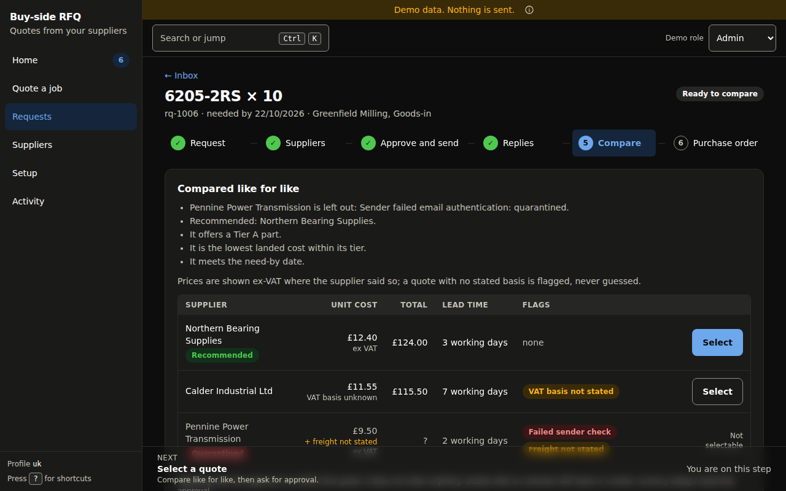
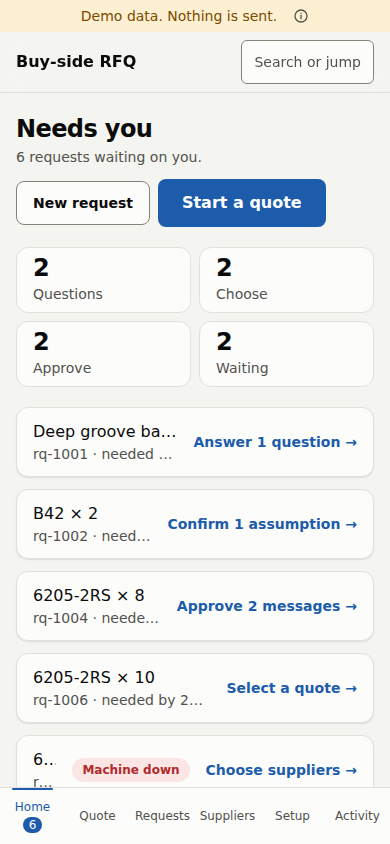
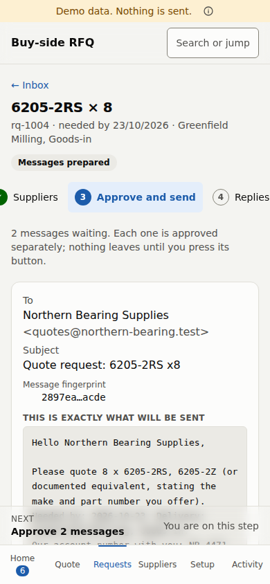

# Getting started

## The screen

- **Left rail:** *Home*, *Quote a job*, *Requests*, *Suppliers*, *Setup*, *Activity*. The number beside *Home* is how many requests are waiting on you. On a phone the rail becomes a tab bar.
- **Top bar:** *Search or jump* (press `Ctrl K`, or `Cmd K` on a Mac) opens a command palette. In the demo build there is also a **Demo role** switcher so you can see the app as each role.
- **Ribbon:** in the demo build a banner reads *Demo data. Nothing is sent.* The *(i)* beside it explains what demo data is.
- **Home** lists your open requests, each with the one thing to do next. The list is ordered by what is waiting: questions to answer, assumptions to confirm, messages to approve, a quote to select, suppliers to choose, a purchase order to create, and last the requests that are waiting on someone else. Within each group a request marked **Machine down** comes first, then the earliest *needed by* date. The four tiles (*Questions*, *Choose*, *Approve*, *Waiting*) count where requests are; selecting a tile filters the list, and selecting it again clears the filter.

The app uses light or dark mode to match your device, and works on a phone.

## Roles

Your role comes from the sign-in token your deployment gives the app (the `role` in the token's `app_metadata`). The web app has no sign-in screen of its own yet: the deployment supplies the token, and in a development build it is a development token. The server, not the screen, decides what you may do. There are three roles, and each includes everything below it.

A requester sees only the requests they raised. Buyers and admins see every request in the company.

| Role | What you can do |
|---|---|
| **Requester** | Start a request, answer its questions, confirm or reject the assumptions the app made, see the comparison of replies, work through a materials list (*Quote a job*), and read quotes, ways to buy, price books and the list of price files. |
| **Buyer** (includes requester) | Choose suppliers and prepare messages, **approve and send each message**, paste in a reply received another way, select a quote, create the purchase order draft, edit a supplier's commercial details, import suppliers from a CSV file, suppress a supplier, upload price files, build a quote, record match decisions, draft quote requests for missing prices, and save job templates. Also open an approval link and decide on it, if you are one of the named approvers. |
| **Admin** (includes buyer) | **Add** a supplier, **verify** a supplier, allow contact again after a suppression, see *Setup* and *Activity*, record that the account is live, use the **kill switch**, and read the review-measurement summary. |

If a control is switched off for your role, the screen says why next to it, for example *Needs the buyer role or higher; you are signed in as requester.* In the rail, *Setup* and *Activity* show **Admin only** when you are not an admin.

> **Note.** The **Add supplier** button is enabled for buyers in the current web app, but the server only lets an admin add a supplier. If a buyer presses it, the request is refused.

### Who may approve a quote

A quote needs an approval before an order when any of these is true: the part offered is not an identical part (a substitute), the total is above the approval threshold in your deployment profile, the day's committed total is over the daily limit, or the quote carries a flag such as *VAT basis not stated*, *Currency unclear*, *Freight not stated*, *Not stated as new* or *Entered by hand*. The approval goes to a named approver. In the cases that involve money or those flags, **the approver must be someone other than the person who asked**.

## Keyboard shortcuts

Press `?` anywhere to see the list.

| Keys | Does |
|---|---|
| `Ctrl/Cmd K` or `/` | Search or jump |
| `n` | New request |
| `g` then `i`, `t`, `p`, `q`, `r`, `s`, `u` or `a` | Go to Home, Job, Prices, Quote, Requests, Suppliers, Setup, Activity |
| `j` and `k` | Move down and up a list |
| `Enter` | Open the focused item |
| `.` | Move focus to the next-action button. It never presses the button for you. |

## Dark mode and phones

The app follows your device's light or dark setting and works at phone width. On a phone the left rail becomes a bar along the bottom, and tables scroll sideways inside their own box rather than moving the whole page.

| Home on a phone | Approving a message on a phone |
|---|---|
|  |  |

## Your first request, in one minute

1. On **Home**, press **New request** (or `n`).
2. Type what you need, for example `4 x 6205-2RS bearings for the packing line`. Add a quantity and a date if you know them.
3. Press **Start request** (or `Ctrl+Enter`). You land on the request, which asks at most a few questions.
4. Follow the **NEXT** bar at the bottom of the screen. It always says what to do now.

The full walk-through is in [Requests](02-requests.md).
