# Requests

A request is one thing you need to buy, from the first sentence to a purchase order draft. Every request shows the same six steps along the top:

**Request → Suppliers → Approve and send → Replies → Compare → Purchase order**

A tick means the step is done and the highlighted step is where you are. The **NEXT** bar at the bottom of the screen always says what to do now, who has to do it, and (if it is not you) who you are waiting for. If your role cannot do it, the bar says which role can.

Open requests are on **Home**. All of them, including closed ones, are under **Requests**, which has *All*, *Open* and *Closed* filters and a search box.

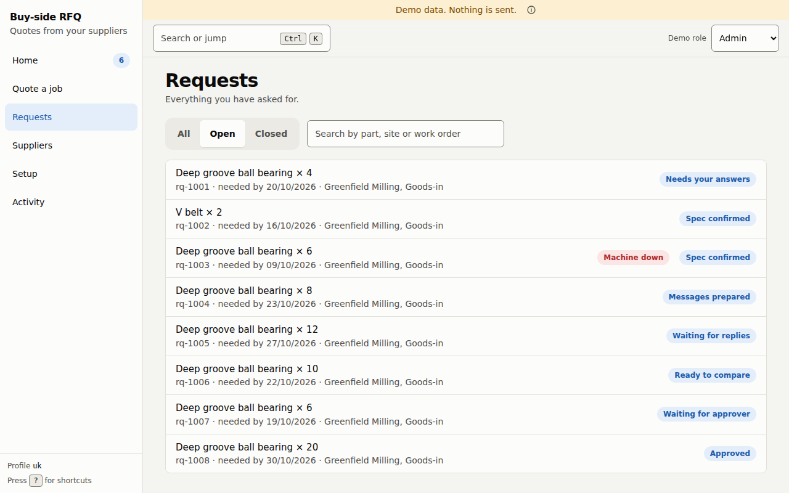

## 1. Start a request

Press **New request** on Home (or `n`).

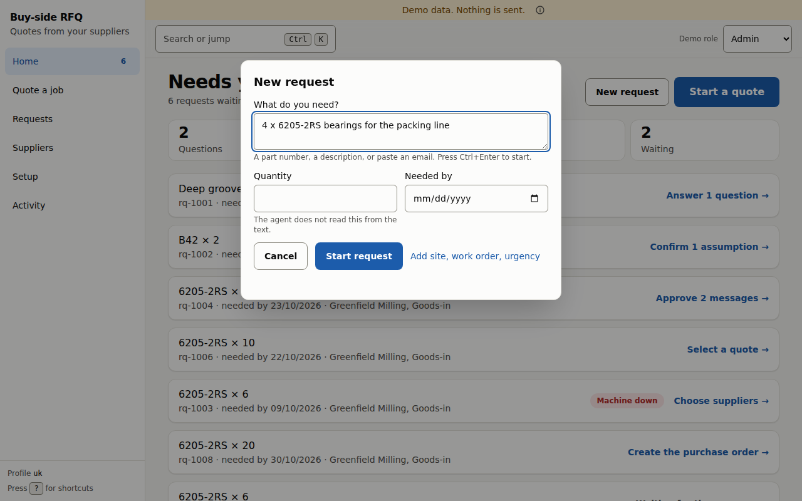

| Field | Notes |
|---|---|
| **What do you need?** | A part number, a description, or a pasted email. Up to 4,000 characters. `Ctrl+Enter` starts the request. |
| **Quantity** | Type it in. The app does not read the quantity out of your text. |
| **Needed by** | A date. |
| **Add site, work order, urgency** | Opens four more fields: *Deliver to* (up to 200 characters), *Work order* (up to 60), *Machine is down now* and *Safety critical*. |

Two of those boxes change what the app does:

- **Machine is down now** marks the request **Machine down**, puts it first on Home, and **limits it to fewer suppliers** (by default two instead of four; the limits come from your deployment profile).
- **Safety critical** makes every candidate part Tier D (*needs engineering review*), even an identical one. Tier D parts are never offered to suppliers, so a safety-critical request moves straight to **Needs engineering review** and no message can be prepared until a person outside the app decides.

## 2. Step 1: Request (what we understood)

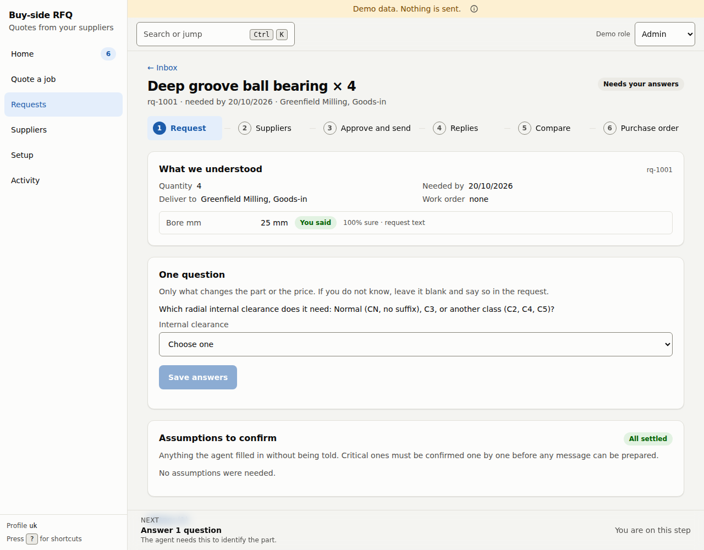

**What we understood** lists the quantity, the date, where it goes and the work order, then each fact the app worked out about the part. Each fact shows where it came from and how sure the app is:

- **You said**: it is in your own words, for example *100% sure · request text*.
- **Inferred: confirm**: the app guessed, for example *60% sure · inferred from 'B42'*. You must confirm it (below).

**One question.** If the app cannot identify the part, it asks, in plain words and with a drop-down of allowed answers. It asks only what changes the part or the price, and **never more than two questions in total**. If you do not know, leave it blank and say so in the request. If the part is still not clear after two questions, the request moves to **Needs engineering review** rather than guessing.

**Assumptions to confirm.** Anything the app filled in without being told is listed with a label:

| Label | Meaning |
|---|---|
| **Critical** | It could change which part is right. Critical assumptions **must be confirmed one by one** before any message can be prepared. |
| **Inferred** | A guess from your text, shown with its confidence (*low*, *medium*). A guess never counts as confirmed until you confirm it. |
| **Default** | A standing default, for example *Prices are ex-VAT unless the supplier says otherwise*. |

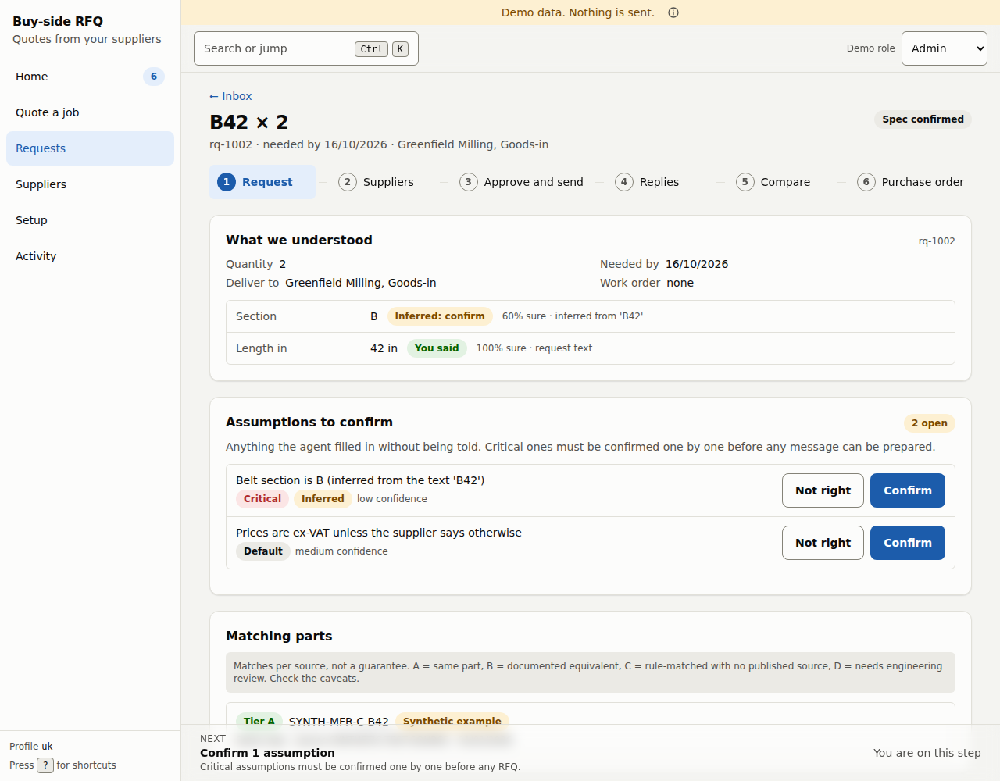

Press **Confirm** if it is right. Press **Not right** if it is wrong. For a value the app inferred, *Not right* drops the value and the request goes back to *Needs your answers* for that fact (this counts towards the two-question limit). The row stays in the history either way.

## 3. Step 2: Suppliers

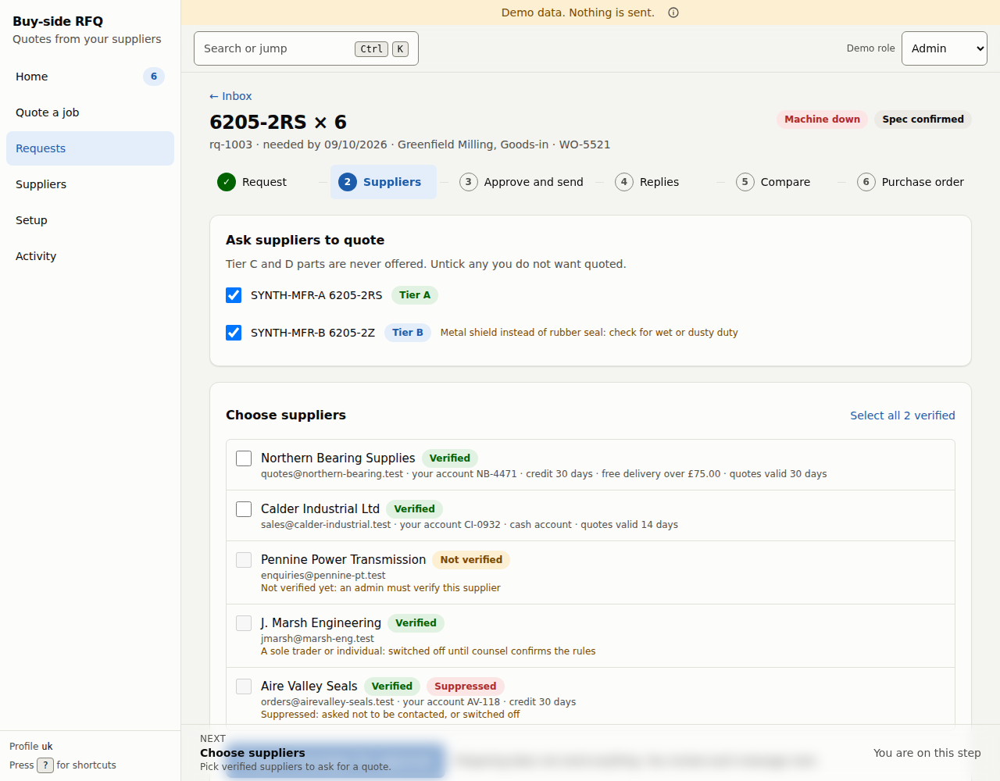

**Ask suppliers to quote** lists the parts the app will ask for, each with a tier:

| Tier | Meaning |
|---|---|
| **Tier A**, *Same part* | The identical part. |
| **Tier B**, *Equivalent* | A documented equivalent. The screen says what is different, for example *Metal shield instead of rubber seal: check for wet or dusty duty*. |
| **Tier C** and **Tier D** | Never offered. Tier C is *Possible* (a rule match with no published source) and Tier D is *Needs an expert*. |

Untick any candidate you do not want quoted.

**Choose suppliers** lists your suppliers. Only some can be picked, and the screen says why for each one that cannot:

| Shown as | Why you cannot pick it |
|---|---|
| **Not verified** | *Not verified yet: an admin must verify this supplier.* See [Suppliers](04-suppliers-setup-activity.md). |
| **Sole trader** | *A sole trader or individual: switched off until counsel confirms the rules.* |
| **Suppressed** | *Asked not to be contacted, or switched off.* |

**Select all N verified** picks every supplier you can pick. Press **Prepare messages for approval**. Preparing writes the messages but **sends nothing**. A request can ask at most four suppliers (two if it is marked *Machine down*); more is refused with *at most N vendors per request*.

Only a buyer or admin can prepare messages.

## 4. Step 3: Approve and send

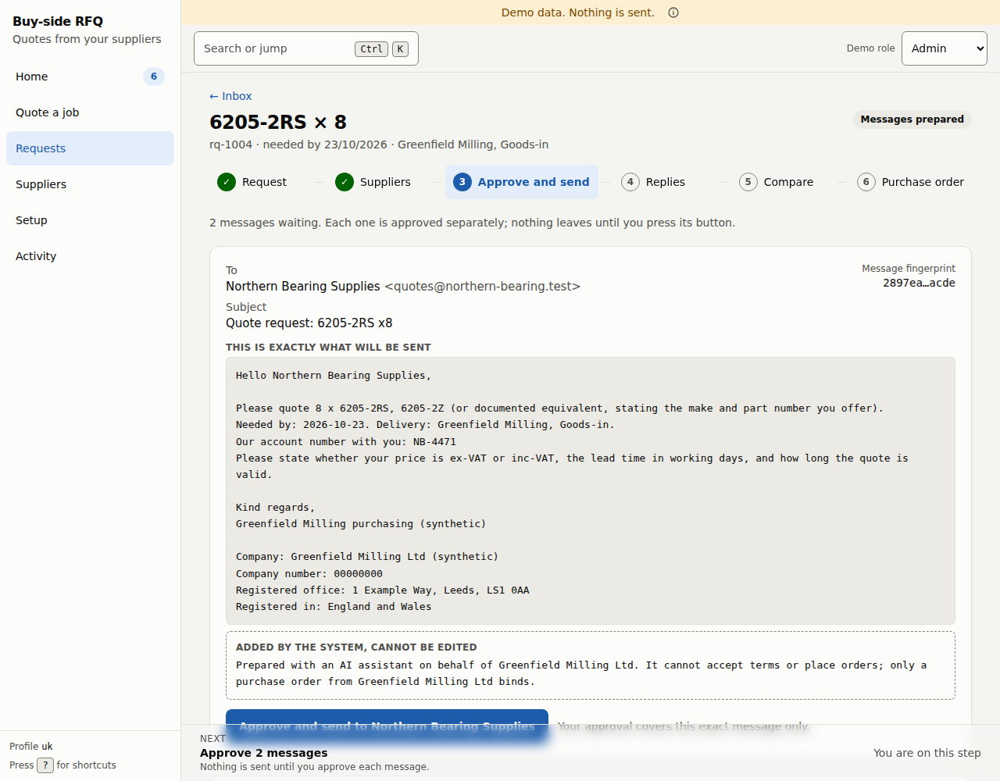

Each prepared message is shown in full, labelled **This is exactly what will be sent**, with:

- the **To** address and **Subject**,
- a **Message fingerprint** (a short code for the exact text),
- the body, which includes your account number with that supplier when one is on file, and asks the supplier to say whether the price is ex-VAT or inc-VAT, the lead time and how long the quote is valid,
- your company's details as your deployment profile requires them (for the UK profile: company name, company number, registered office and where it is registered). They come from your deployment's settings, not from a screen. If they are missing, preparing is refused with *business identity incomplete* and the screen says an admin must complete the company details,
- a closing notice labelled **Added by the system, cannot be edited**, which says the message was prepared with an AI assistant on behalf of your company, that it cannot accept terms or place orders, and that only a purchase order from your company binds. The exact wording comes from your deployment profile.

**Each message is approved separately.** Press **Approve and send to *supplier***. Your approval covers that exact message and no other. If the text changes after you looked at it, the send is refused and you prepare it again and read the new text.

> **In this build** an approved message goes to a recording transport: the app records exactly what would have been sent. No real email provider is connected yet.

Only a buyer or admin can approve and send. An admin can stop all sending at once with the [kill switch](04-suppliers-setup-activity.md#setup).

## 5. Step 4: Replies

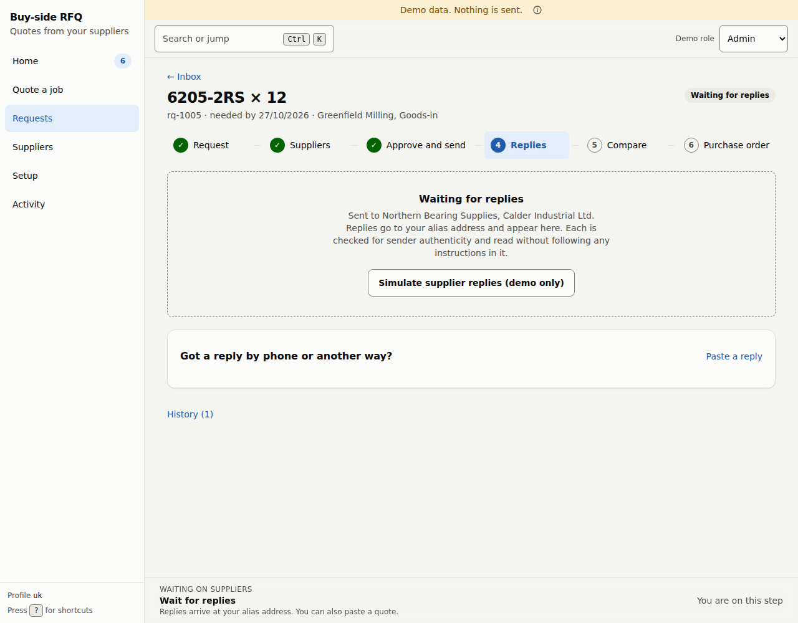

Replies go to your alias address and appear here. Each reply is:

- checked that it really came from the supplier's own domain (the **Sender check**),
- read as plain text, never as instructions,
- turned into a quote with a price, currency, lead time, validity and minimum order, and **each value is checked against the reply text**. A value that cannot be found in the reply is dropped and flagged, never filled in.

Each quote card has a **Where each value came from** section that quotes the exact words used.

A reply can be **Quarantined: not used until a person reviews it**. That happens when it fails the sender check, when it contains instructions aimed at the agent, when bank details have changed, or when the supplier's domain or contact address was changed and the change has not yet been confirmed by a call. A quarantined reply is shown but cannot be selected.

You do not have to wait for every supplier: as soon as one reply has been read, the **Compare** step opens. The request moves to *Ready to compare* by itself once every message that was sent has a usable reply.

If a supplier replied by phone or another way, open **Got a reply by phone or another way?** and press **Paste a reply**. Choose the supplier, paste what they said (include the currency symbol and name the part) and press **Add quote**. A quote you enter by hand is flagged **Entered by hand**, which means it always needs an approver other than you.

If a supplier's reply is nothing but *stop*, *unsubscribe* or *remove me*, sent from its own authenticated domain, the supplier is suppressed and nothing else happens: that text is not read as a quote or as an instruction.

## 6. Step 5: Compare

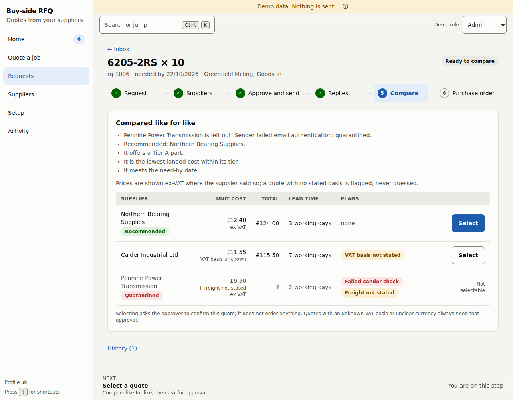

**Compared like for like** shows one row per quote with the landed unit cost, the total for your quantity, the lead time and any flags. It explains its own recommendation in plain sentences, for example *It offers a Tier A part*, *It is the lowest landed cost within its tier*, *It meets the need-by date*. It also says what it left out and why.

- **Recommended** marks the best quote it found. It is a suggestion, not a decision.
- A price is only compared when the supplier stated the price and the currency. A quote with no stated VAT basis is **flagged, never guessed**.
- A quote that is quarantined, has no stated price or currency, has a price that could not be found in the reply, or has expired shows **Not selectable**.
- A quote for a **Tier D** part shows *needs engineering review*.

Press **Select** on the quote you want. This asks for an approval where one is needed. It **does not order anything**.

A quote needs an approval when any one of these is true: the part offered is a substitute (not Tier A), the total is above your approval threshold, the day's committed total is over the daily limit, or it carries a flag such as *VAT basis not stated*, *Currency unclear*, *Freight not stated*, *Not stated as new* or *Entered by hand*. When none is true, selecting the quote takes you straight to the purchase order step.

### Waiting for the approver

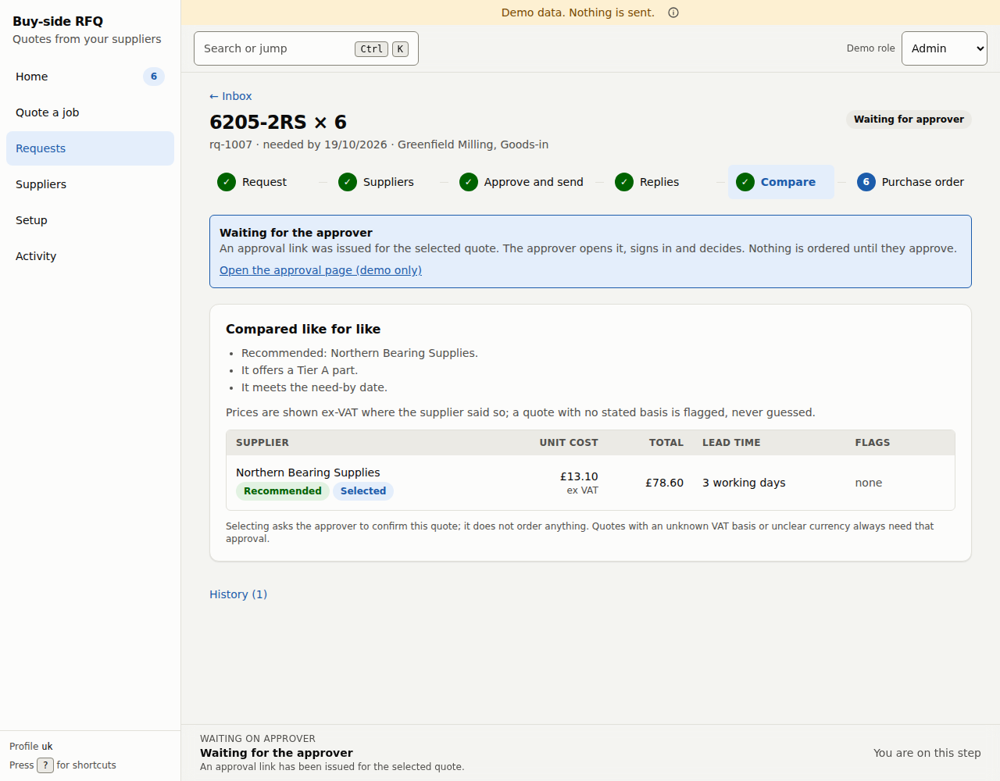

An approval link is issued for the selected quote. The approver opens it, signs in and decides. Nothing is ordered until they approve. Where money or those flags are involved, **the approver must be someone other than the person who asked**; if there is no other eligible approver the selection is refused with *no eligible approver*.

> **In this build** the link is created but not delivered by email: a notifier still has to be connected (see [known gaps](../architecture/known-gaps.md)). In the demo build the link **Open the approval page (demo only)** stands in for it.

### The approval page

The approver sees a bare page with no navigation:

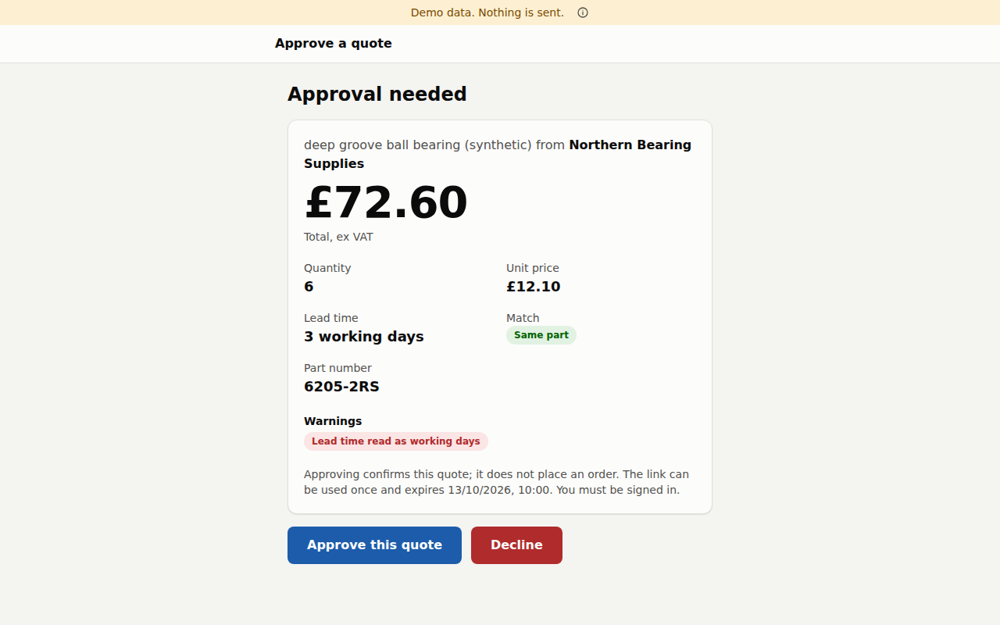

It shows the total, quantity, unit price, lead time, how well the part matches, the part number and any warnings. **Approving confirms this quote; it does not place an order.** The link can be used **once** and **expires** (the page shows when). The approver must be authenticated with at least the buyer role and must be the approver the link was issued to. Press **Approve this quote** or **Decline**. A decline ends the request as **Declined** and releases the money that was set aside for it. In this build no screen takes a declined request back to the comparison, so start a new request if you still need the part.

## 7. Step 6: Purchase order

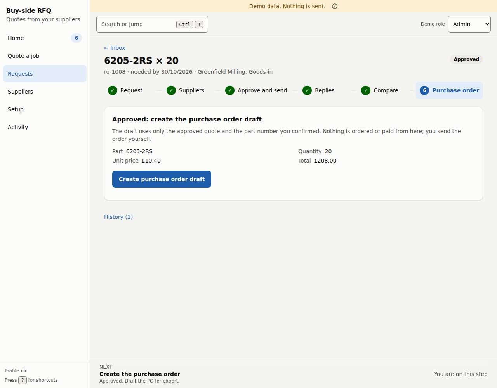

After approval (or straight after selection when no approval was needed), press **Create purchase order draft**. The draft uses **only the approved quote and the part number you confirmed**. It cannot use a part that was never approved. Once it exists, **Download CSV** gives you the file.

> **Nothing is ordered or paid from here; you send the order yourself.** A PDF export is not available yet.

## What each status means

The label on a request in lists and at the top of its page.

| Status | Meaning | Who acts next |
|---|---|---|
| **Received**, **Reading the request** | The app is reading your text. | The app |
| **Needs your answers** | There is a question to answer. | Requester |
| **Spec confirmed** | The part is identified and the assumptions are settled. | Buyer: choose suppliers |
| **Messages prepared** | Messages are written and waiting for approval. | Buyer: approve each |
| **Messages approved**, **Messages sent** | Approved, and sent (in this build, recorded). | The suppliers |
| **Waiting for replies** | Sent; not every supplier has given a usable reply yet. As soon as one reply has been read, the **Compare** step opens and you can select a quote without waiting for the rest. | The suppliers (or paste a reply) |
| **Ready to compare** | Every message that was sent has a usable reply. | Buyer: select a quote |
| **Quote selected** | A quote is selected. A purchase order can be drafted now if no approval was needed. | Buyer |
| **Waiting for approver** | An approval link was issued. | The approver |
| **Approved** | The approver approved. | Buyer: create the purchase order draft |
| **Declined** | The approver declined. The request ends here. | Nobody: start a new request |
| **PO drafted** | The draft exists. | Buyer: export it and send it yourself |
| **PO sent** | A purchase order was sent through the app. No screen does this yet. | |
| **Needs engineering review** | The part is unclear, safety critical, or not a kind of part this deployment handles. The app will not guess. In this build the NEXT bar wrongly says *Done* for such a request, and Home does not list it (a known defect). It is still under **Requests**. | A person outside the app |
| **Closed**, **Cancelled**, **Expired** | Finished states. In this build nothing moves a request into *Closed* or *Expired* (there is no close button and no timer), and *Cancelled* is only reached by cancelling a purchase order draft, which has no button yet. | |

Every change of status is recorded in the [activity trail](04-suppliers-setup-activity.md#activity), including who made it. **History** at the bottom of a request shows the entries for that request.
