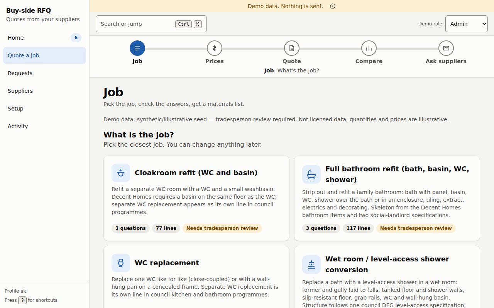
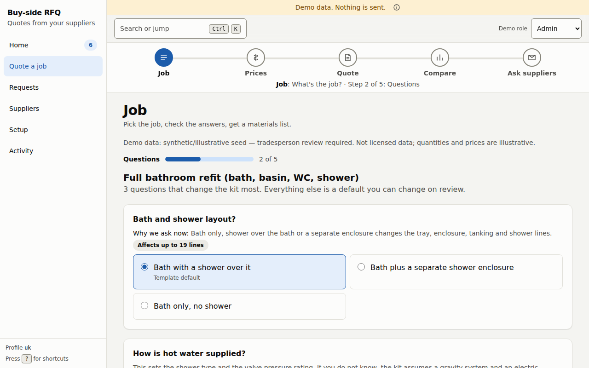
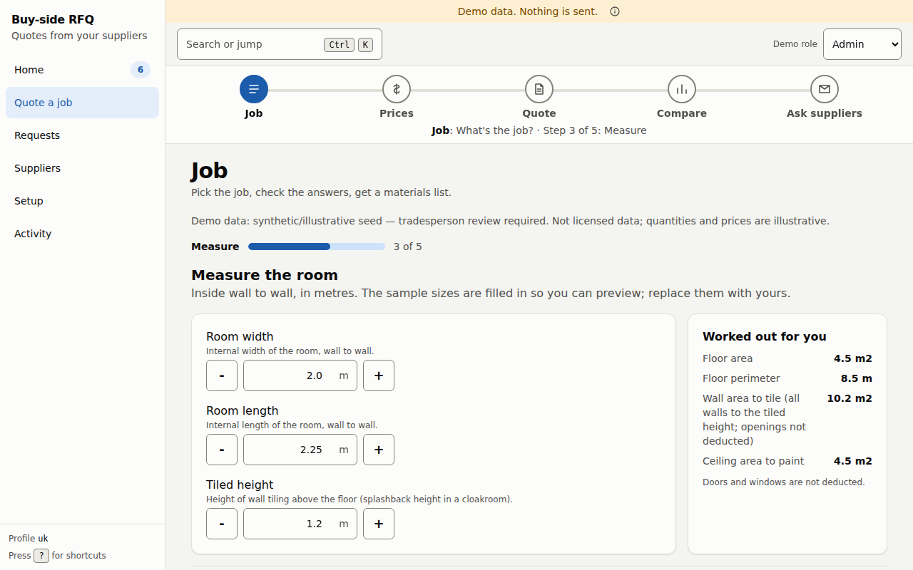
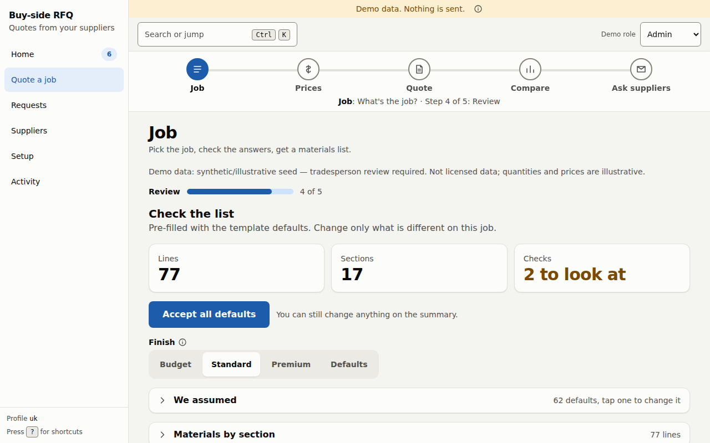
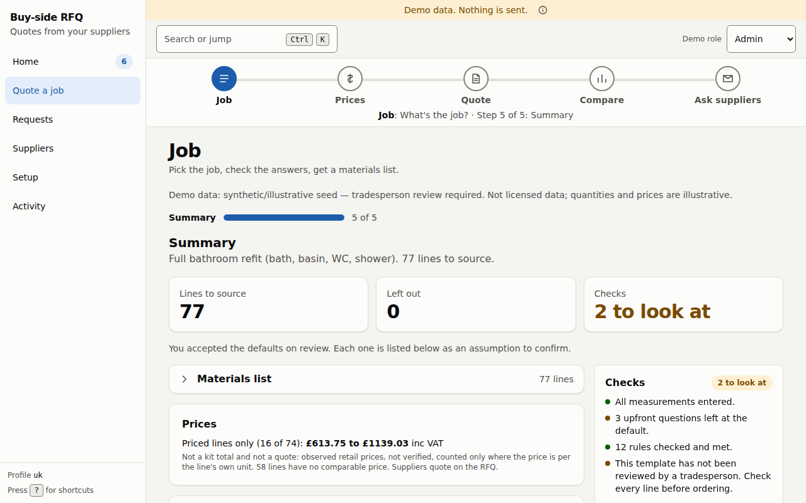
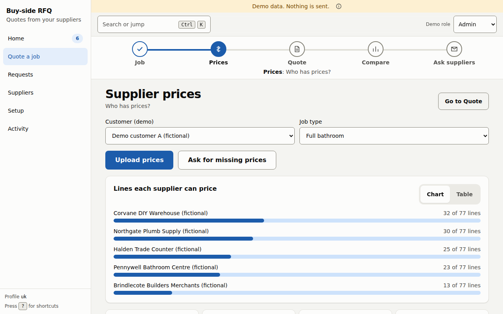
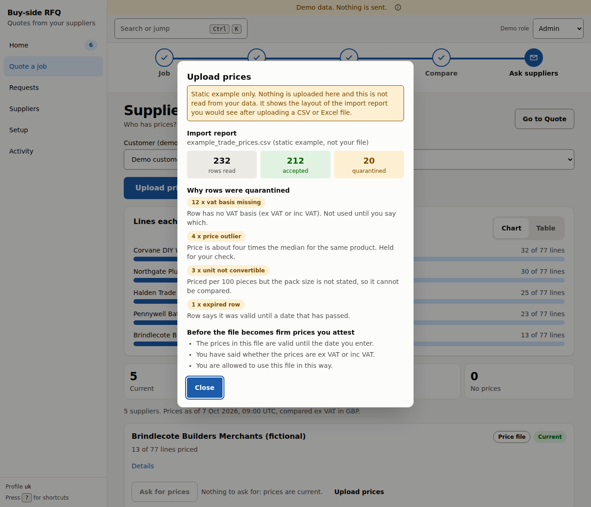
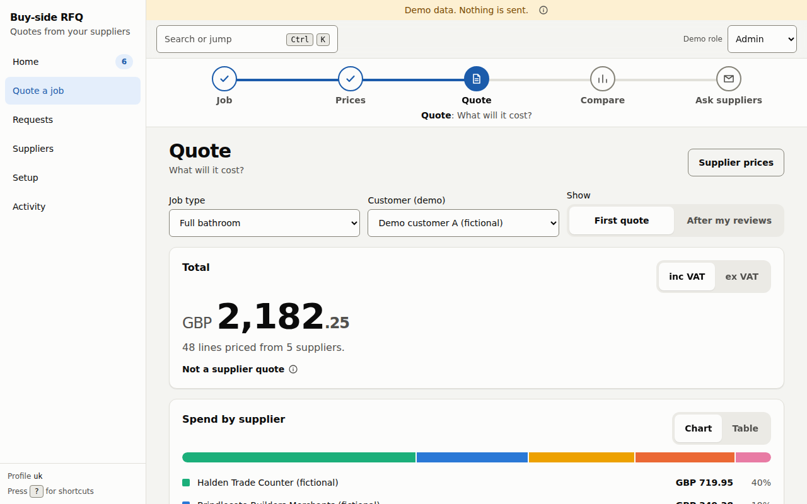
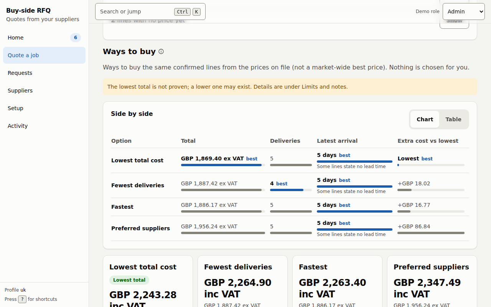
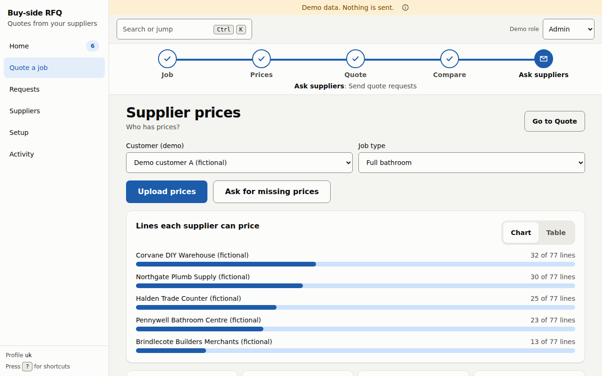

# Quote a job

Use **Quote a job** when you need a whole materials list for a piece of work, not one part. You pick the job, answer a few questions, check the list, and see what it would cost from the price files you have. Then you can ask suppliers for the prices you are missing.

The five stages run along the top of every screen in this area. Select a stage to jump to it, or use the **Back** and **Next** buttons at the bottom.

**Job → Prices → Quote → Compare → Ask suppliers**

| Stage | The question it answers |
|---|---|
| **Job** | What's the job? |
| **Prices** | Who has prices? |
| **Quote** | What will it cost? |
| **Compare** | Best way to buy |
| **Ask suppliers** | Send quote requests |

> **What you see is an estimate, not a supplier quote.** It adds up prices that were *observed* in your price files, at the times shown. It is not an offer that a supplier can be held to, and it does not reserve stock. Nothing is sent or ordered. Under the total, the screen says **Not a supplier quote**.
>
> The job lists in the demo build are a **synthetic, illustrative seed that a tradesperson has not reviewed**, and the screen says so at the top of every Job step. Check every line before ordering.

## Stage 1: Job

Pick the closest job. In the demo data these are *Cloakroom refit (WC and basin)*, *Full bathroom refit (bath, basin, WC, shower)*, *WC replacement* and *Wet room / level-access shower conversion*. Each card says how many questions it will ask and how many lines the template has. **Reuse an earlier quote** lists templates you saved before.

The wizard has five steps, shown as *Step N of 5* under the stage tracker: **Job → Questions → Measure → Review → Summary**.

### Questions

The wizard asks the few questions that change the list the most (three for each job in the demo data). For each it tells you **why it asks now** and **how many lines the answer can affect**. One answer is marked *Template default*. If you do not know, choose *Don't know*: the screen says what it will assume instead (for example *Tank in the loft (gravity). Confirm on site.*), and that assumption appears again on the summary.

The **Finish** question sets the budget, standard or premium option on every line at once. You can still change any line later. A premium option is never pre-selected, and paid extras stay off at every level.

### Measure

Enter the room sizes (inside wall to wall, in metres). Sample sizes are filled in so you can preview, and you should replace them with yours. Under **Worked out for you** the app shows the floor area, floor perimeter, wall area to tile and ceiling area to paint. Doors and windows are not deducted.

### Review

The list is pre-filled from the template. You see three numbers: **Lines**, **Sections** and **Checks**. Two controls save time:

- **Accept all defaults** takes the template as it is. Every default you accepted is then listed on the summary as an assumption to confirm.
- **Finish: Budget / Standard / Premium / Defaults** sets every line at once.

**We assumed** lists the defaults the app chose, and you can change any of them. **Materials by section** lists every line, grouped.

### Summary

The summary shows the lines to source, how many you left out, and the checks, each marked OK or Note, for example *All measurements entered*, *12 rules checked and met* and *This template has not been reviewed by a tradesperson. Check every line before ordering.* The **Prices** block here is only a rough guide (*Not a kit total and not a quote*).

Press **Build the quote** to continue. The other buttons are **Change something**, **Start a different job** and **Reuse this job**, which saves your answers, sizes, option picks and left-out lines as a template for similar work (no prices are saved).

Two links appear at the foot of the wizard: **Advanced: edit job templates (Config)** and, on the summary, **Advanced: request data**. In the demo build, templates are kept in your browser. When the app is connected to its server, they are saved to your account.

## Stage 2: Prices

**Supplier prices** shows which suppliers have a current price for this job and what is missing.

- **Lines each supplier can price** is a bar per supplier (*32 of 77 lines*). Switch to *Table* for the same data as a table.
- The four counters say how many suppliers are **Current**, **Out of date**, **Rough only** or have **No prices**. *Out of date* means older than the allowed age, so the price is shown but not used.
- Each supplier shows how its prices were obtained: *On request*, *Past invoices*, *Price file*, *Regular price file* or *Contract feed*. Today the prices come from **price files** that you upload.
- **Upload prices** loads a price file. **Ask for missing prices** prepares requests for the lines nobody has priced (stage 5).

### Uploading a price file

When the app is connected to its server, **Upload prices** opens a form. In the demo build it shows a static example report instead, labelled *static example, not your file*.

| Field | Notes |
|---|---|
| **Merchant** | Which supplier the file is from. |
| **File** | A `.csv` or `.xlsx` file, up to 900,000 bytes. |
| **Currency** | Used for rows that have no currency column. |
| **Do these prices include VAT?** | You must choose. It is never guessed from the file. |
| **Valid from / Valid until** | Optional dates. |
| **I confirm I may use this file for my own company's purchases.** | The attestation. |

Without the attestation **and** a valid-until date, the prices load as **indicative only**: they are shown for reference and never used as firm prices.

After the check you get an **Import report**: how many rows were read, **accepted** and **quarantined**, and why each held-back row was quarantined. The reasons you may see are: *VAT basis missing* (the row says neither ex VAT nor inc VAT), *Price outlier* (about four times the median for the same product), *Unit not convertible* (for example priced per 100 pieces with no pack size) and *Expired row* (valid-until date already passed). A quarantined row is **not used until you say which VAT basis applies or fix it**.

## Stage 3: Quote

At the top: the **Job type**, and a **Show** switch between **First quote** and **After my reviews**. In the demo build there is also a *Customer (demo)* picker. When the app is connected to its server the page reads *Live data from your account*.

- **Total** is the sum of the lines that have a confirmed price, as **inc VAT** or **ex VAT** (switch at the top right). The line below says how many lines were priced and from how many suppliers.
- **Spend by supplier** shows each supplier's share, as a chart or a table.
- The four tiles say how many lines were **priced** out of the total, how many **suppliers** and **deliveries** that means, and how many lines **need you**.
- **Needs you** breaks that last number down: **Waiting for your choice** (the system could not decide which product fits; choose one, or none), **No match** (it could not match the line to a product, so there is no price) and **No price yet** (no supplier has a usable price). Press **Review** or **Show** to open each list.

Lines are shown under these headings, each with a count:

| Heading | Meaning |
|---|---|
| **Lines by supplier** | Lines with a confirmed price, grouped by supplier. **Why this price** shows how it was chosen. |
| **Waiting for your choice** | Lines you must decide on. They are **not in the total**. |
| **Rough prices** | A rough guide from past invoices or shop listings. Never added to a total and not a quote. |
| **No match** | Lines with no product match. Not priced. |
| **No price yet** | Lines no supplier has priced. |
| **Totals breakdown**, **About this quote** | How the total was reached, and the full notice about what this is. |

A *confirmed price* is one from a price file you confirmed or from a real supplier reply. A match between a line and a product is always shown as *Same part*, *Equivalent*, *Possible* or *Needs an expert*, and the system never swaps a part for a worse match on its own.

## Stage 4: Compare (ways to buy)

**Ways to buy** shows different ways of buying the **same confirmed lines** from a mix of suppliers. It says up front that this is *from the prices on file, not a market-wide best price*, and that *nothing is chosen for you*.

| Way to buy | What it is |
|---|---|
| **Lowest total** | The cheapest complete basket the optimiser found. |
| **Fewest deliveries** | The fewest suppliers (so the fewest deliveries) whose total stays within a tolerance of the lowest total (5% in the demo data). |
| **Fastest** | The earliest latest-arrival date whose total stays within that tolerance. A line with no stated lead time counts as slower than any stated one. |
| **Preferred suppliers** | As many lines as possible from the suppliers on your preferred list, within the tolerance. Shown only when a preferred list exists. |
| **One supplier** | The supplier that can supply the most lines buys everything it can, and the rest come from others. Not shown by default. |
| **Best overall** | Scored against a budget, a required-by date and a delivery limit that you supply. It is shown only when you have supplied at least one of them. It is **not a recommendation**, and the weights it uses are placeholders the screen lists (*unsourced*). |

Every option is complete: each line is bought once, from one supplier, and the totals add delivery fees to the goods. Options that come out identical are shown once and the others are listed as *Same as ...*.

**Side by side** compares the options on total, deliveries, latest arrival and extra cost against the lowest, with *best* marked on the winner in each column. Each card shows the total as inc VAT and ex VAT, how many suppliers and deliveries it needs, and the days to arrive, then flags such as *Below a minimum order quantity*, *A delivery fee is not on file*, *Some lines have no stated lead time*, *Low stock on some lines* or *Stock not stated on some lines*, and a few plain sentences about what changes against the lowest total. **Why this mix, and what each supplier sends** opens the goods and delivery cost per supplier.

Lines that have only a rough price are listed apart and are in **no** option. When the app cannot prove that the lowest total is the lowest possible, it says so: *The lowest total is not proven; a lower one may exist.* Details are under **Limits and notes** (budget, dates, lines left out).

Press **Use this mix** to mark the option you prefer. It is a marker: it **does not order or send anything**, and in the demo build it reads *Selected (demo only)*.

## Stage 5: Ask suppliers

This stage is on the **Supplier prices** page. **Ask for missing prices** previews the exact subject and message to each supplier for the lines that have no confirmed price. You choose **One quote per supplier (default)** or **Individual quotes, one per item**.

When the app is connected to its server, press **Prepare for approval**. This creates the messages as *unsent drafts*. They then wait on **Requests**, where a buyer reads and approves each exact message, as in [Approve and send](02-requests.md#4-step-3-approve-and-send). **Nothing is sent by the preparing step.** In the demo build the dialog only shows the preview.

You can leave the job at any time. The **Back** and **Next** buttons at the foot of each screen (for example *← Prices* and *Next: Compare →*) walk you through the stages in order.
