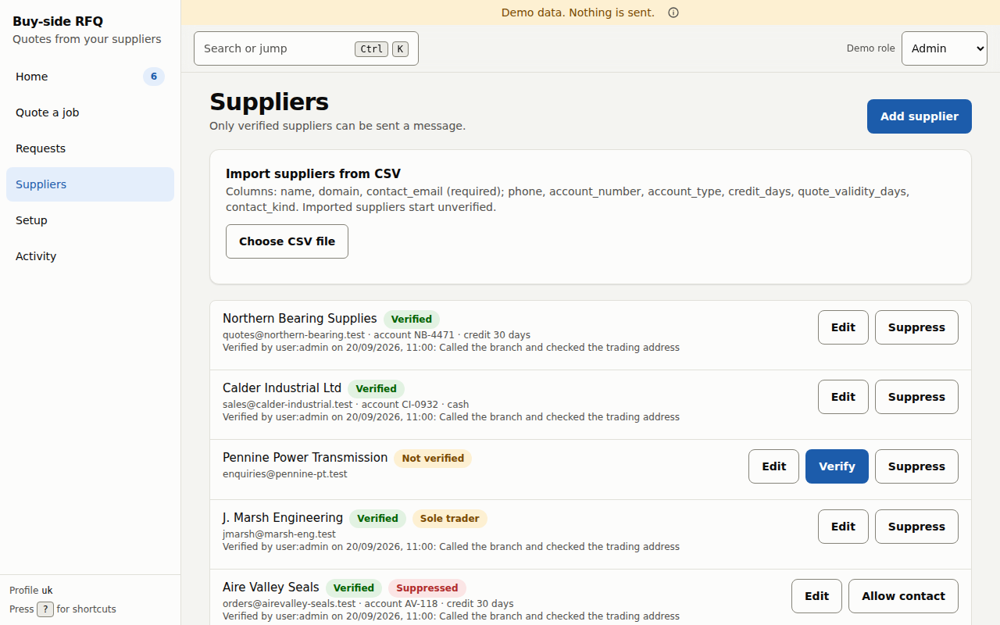
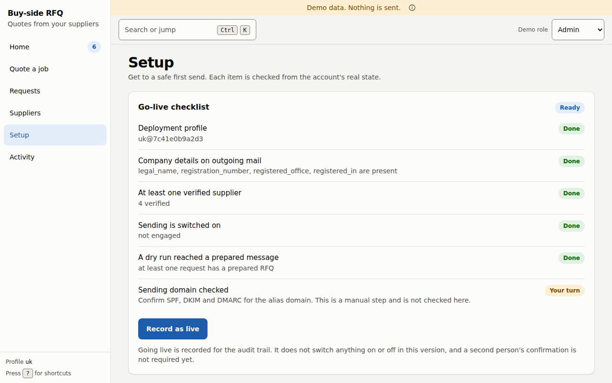
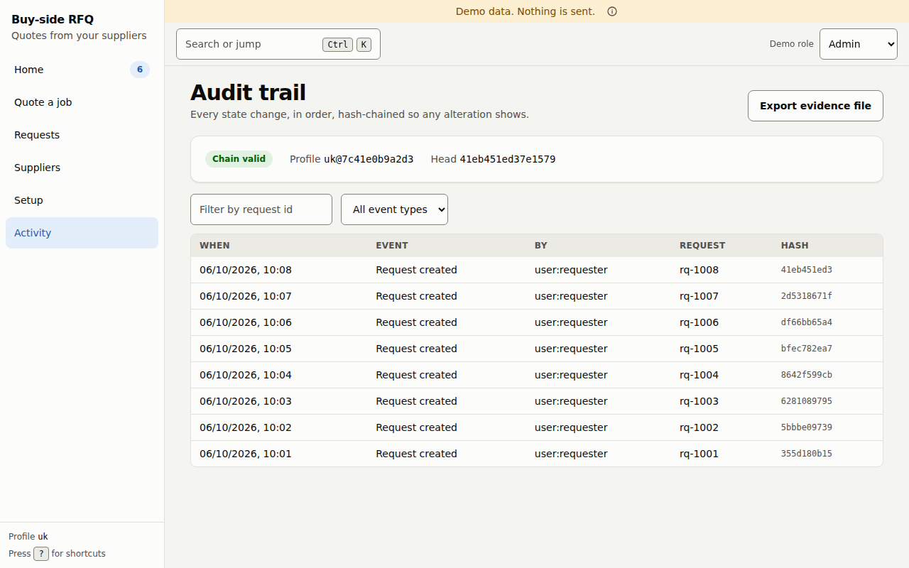

# Suppliers, Setup and Activity

## Suppliers

**Only verified suppliers can be sent a message.** This page is where you add suppliers, check them and decide who may be contacted.

Each supplier shows:

- its name and a badge: **Verified** or **Not verified**; **Sole trader** if it is an individual; **Suppressed** if it must not be contacted,
- its contact email, your account number with it, the account type (*cash* or *credit*), credit days, the order value above which delivery is free, and how many days its quotes are valid,
- for a verified supplier, who verified it, when, and the note they left, for example *Called the branch and checked the trading address*.

### Add a supplier (admin)

Press **Add supplier** and fill in:

| Field | Notes |
|---|---|
| **Name** | Up to 200 characters. |
| **Domain** | For example `example.co.uk`. **Replies must come from this domain.** A reply from any other domain fails the sender check. |
| **Contact email** | Where messages go. |

A new supplier is **Not verified**, and nobody can send it a message until an admin verifies it. Only an admin can add a supplier. (The button is also shown to buyers in the current web app, but the server refuses a buyer's request.)

### Import suppliers from a CSV file (buyer or admin)

Press **Choose CSV file**. The columns are `name`, `domain` and `contact_email` (required), and `phone`, `account_number`, `account_type`, `credit_days`, `quote_validity_days` and `contact_kind` (optional). **Imported suppliers start unverified.**

You get a result line, for example *3 added, 1 updated, 2 rejected*, and a table of the rejected rows with the reason for each. If the file itself is wrong (an unknown, duplicate or missing required column, an empty file, or a file over the size limit) the whole file is refused and nothing is imported.

### Edit (buyer or admin)

**Edit** changes the commercial details: your account number, the account type, credit days, the order value above which delivery is free, quote validity in days, and whether the contact is *a company*, *a sole trader or individual* or *not known*.

The form does not change a supplier's **domain** or **contact email**. Those can only be changed by an admin through the API. Doing so resets the supplier to *Not verified* and records that a call to confirm the change is still pending, and until the call is confirmed, replies from that supplier are quarantined. In this build there is no screen or endpoint that records that confirmation (see [known gaps](../architecture/known-gaps.md)), so such a supplier stays quarantined. The way forward today is to add it again as a new supplier and verify it.

### Verify (admin)

Press **Verify** and answer *How did you check this supplier?* (for example: called the branch, checked Companies House, confirmed the trading address; up to 200 characters). Press **Mark as verified**. **The note and your name are recorded.** Do the check **before** you press the button: the button records that you did it, and the app cannot check it for you.

### Suppress and Allow contact

**Suppress** (buyer or admin) stops the app contacting a supplier at once. **Allow contact** (admin only) reverses it. A supplier is also suppressed automatically when its reply is nothing but *stop*, *unsubscribe* or *remove me* (with an optional *please*), sent from its own authenticated domain. A quote that merely contains one of those words is not a stop request.

### Why a supplier cannot be picked

On a request, a supplier you cannot pick is shown with its reason:

| Reason shown | What to do |
|---|---|
| *Not verified yet: an admin must verify this supplier* | Ask an admin to verify it here. |
| *A sole trader or individual: switched off until counsel confirms the rules* | Nothing yet. Sending to individuals is switched off in this build. |
| *Suppressed: asked not to be contacted, or switched off* | An admin can lift it with **Allow contact**, if that is right. |

## Setup

*Setup* is for admins. Others see **Admin only** next to it in the rail.

**Go-live checklist** says *Get to a safe first send. Each item is checked from the account's real state.* It shows **Ready** when every item is done.

| Item | Done when |
|---|---|
| **Deployment profile** | A profile such as `uk@7c41e0b9a2d3` is active. The code after the `@` identifies the exact profile contents. |
| **Company details on outgoing mail** | All the fields that the profile requires are present (for the UK profile: legal name, registration number, registered office, where registered). |
| **At least one verified supplier** | Shows how many are verified. |
| **Sending is switched on** | The kill switch is not engaged. |
| **A dry run reached a prepared message** | At least one request has a prepared message. |
| **Sending domain checked** | **Your turn.** Confirm SPF, DKIM and DMARC for the alias domain yourself. The app cannot check this. |

**Record as live** writes that you went live into the audit trail. In this version it does not switch anything on or off, and a second person's confirmation is not required yet.

**Kill switch.** *Sending is on.* Press **Switch sending off** to stop every send from this account at once. Messages already queued are refused. You can turn it back on at any time. Switching sending off or on is recorded in the audit trail.

**Active profile** shows the jurisdiction, currency, tax rule (for example *VAT 20%, quotes read as ex-tax unless stated*) and which company lines outgoing messages carry.

## Activity

*Activity* is for admins.

The **Audit trail** lists every state change on every request, in order, each linked to the one before it by a code (the **hash**), so that any later change to an entry shows up. Next to the title:

- **Chain valid** says the links still check out. If an entry had been altered or removed, this would not say valid.
- **Profile** and **Head** show the active profile and the code of the latest entry.

Filter by **Request id** or by **Event type**. Each row shows **When**, **Event**, **By** (the person or `system`), **Request** and a short **Hash**.

**Export evidence file** downloads the trail as a file. It does not contain the key that protects the chain, so only someone who holds the key can fully verify it. Technical staff can check it offline with `scripts/verify_audit_export.py`; see the [technical guide](../technical/06-security-and-trust.md).
